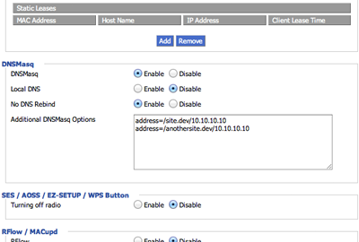

Setting up a single-user web development environment is easy.
One-click (OS)AMP installers do all the work and store internal domains in an easily accessible host file.
However, expanding this to a multi-user development team, all of whom need access to the same resources, is a completely different challenge.
Moreover, they may require access from multiple devices, some of which do not have a host file, such as mobile phones.

<!--more-->

A common solution to this problem is to share host files, which include all the development domains used, in the hope that everyone remains in sync.
In the case of devices that do not have a readily accessible host file, uploading externally accessible builds or providing an alternative gateway into the development ecosystem is one way to address the issue.
These methods do not seem right to me; they involve far too many variables and extra work.
An even better solution, which eliminates all the overhead, is to set up your own local DNS and start enjoying the simplicity of a single-user environment.

## Ladies and gentleman, DNSMasq

To set up your own local DNS you can spend hours configuring BIND, but nothing beats the ease and maintainability of DNSMasq.
DNSMasq is a lightweight DNS, DHCP, and TFTP server and is ideal for this case study.
In just a few keystrokes using your package manager of choice, you can set up a local DNS server for the entire development team, keeping all those pesky local domains consolidated in one host file as they should be.

## Installation

I will be installing and configuring a DNSMasq setup on an Ubuntu Server distribution, but installation on other platforms should be fairly similar.

```bash
$ sudo apt-get install dnsmasq
```

Upon successful installation, you may be greeted with an unfriendly "port 53 already in use" message.
To resolve this issue, use the following commands: first, check which process is using port 53, and then kill that process by its ID.

```bash
$ sudo netstat -anlp | grep -w LISTEN
$ sudo kill [process-id]
```

The final step is to add all your local development domains to the host file found at `/etc/hosts`.
Once all domains have been added, the final command that needs to be executed is to restart DNSMasq.

```bash
$ sudo /etc/init.d/dnsmasq restart
```

To access your newly created DNS server, you can either individually add the server's IP address to each computer's DNS network configuration, or alternatively, point your router's DNS record to the IP address.

## An alternative option...

If you're feeling extra hardcore and do not wish to install another software dependency on your system, you may wish to consider flashing your router with [DD-WRT](http://www.dd-wrt.com/) (if your router supports it) and letting the hardware do the work.
Setting up DNSMasq on a compatible DD-WRT installation is as simple as adding the local domain entries into the "Additional DNSMasq Options" textarea in the administration panel.

Below is a screenshot of an example DD-WRT DNSMasq configuration



## An even more awesome idea

Instead of having to add an extra entry for each development site, which can be a chore, we have an opportunity to make it even easier.
My regular naming convention for local development sites is to use the descriptive ".dev" TLD.
This naming scheme allows me to easily distinguish between development and live builds.
Fortunately, we have the opportunity to exploit the fact that ".dev" is an unused TLD.
With DNSMasq, we are able to easily set up a TLD wildcard which will check and match any domain we pass through the DNS and forward it to our defined location.
As a consequence, any URL request using a ".dev" TLD can be directed to my local development server for Apache to respond to.
For a software installation, you are required to add the following line to your `dnsmasq.conf` file.

```bash
$ sudo echo "address=/dev/[dev-server-ip]" >> /etc/dnsmasq.conf
```

Alternatively, in the case of DD-WRT, add the above configuration setting to the "Additional DNSMasq Options" textarea in the administration panel.

## Resources

- [DNSMasq - Official Site](http://www.thekelleys.org.uk/dnsmasq/doc.html)
- [Simple local web development with Apache and DNSMasq](http://davidwinter.me/articles/2011/06/18/simple-local-web-development-with-apache-and-dnsmasq/)
- [DD-WRT - Official Site](http://www.dd-wrt.com/site/index)
- [DNSMasq as DD-WRT DHCP Server](http://www.dd-wrt.com/wiki/index.php/DNSMasq_as_DHCP_server)
