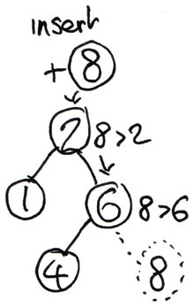
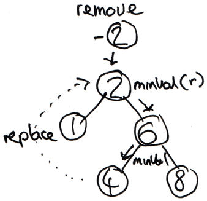

Recently Max Howell (creator of [Homebrew](http://brew.sh/)) posted an interesting [tweet](https://twitter.com/mxcl/status/608682016205344768) in regard to Google's interview process.
In this tweet he mentioned how one of the proposed questions was to white-board a solution to invert a binary tree.
Over the past couple of years I have been interested in exploring fundamental computer science data structures and algorithms.
As a result, I thought it would be interesting to explore this structure and its associated operations in more depth - using immutable and mutable PHP implementations to clearly highlight the benefits garnered from each approach.

<!--more-->

Binary trees are a form of tree data structure, comprised of nodes with assigned values and at most two child nodes (left and right).
To expand on this problem I will be documenting the creation of a [binary search tree](https://en.wikipedia.org/wiki/Binary_search_tree), which has the additional invariant that any left child is less than, and any right child is greater than, the current node's value.
This allows us to perform unambiguous node deletion from the structure.

## Node Representation

Throughout all these examples I have leaned towards a simple function, as opposed to a class-based approach, relying on namespaces to infer relation.
The following function can be used to create a simple object representation of a tree node.
Providing a value and optional left and right nodes, it simply returns the aggregate.

```php
function Node($value, $left = null, $right = null)
{
    return (object) compact('value', 'left', 'right');
}
```

## Insertion

Now that we are able to represent tree nodes, the next logical step is to provide insertion capabilities.
Accessible from the root tree node (initially NULL), we are able to recursively traverse the structure until we either find a leaf or the node is already present.
To decide which child to traverse down we use the discussed comparator invariant.
Below is a small diagram depicting the insertion of a value within an existing tree.



### Mutable

The first implementation provides a mutable means of insertion.
Notice the explicit reassignment of the right and left child node references.

```php
function insert($value, $root)
{
    if ($root === null) {
        return Node($value);
    }

    if ($value === $root->value) {
        return $root;
    }

    if ($value > $root->value) {
        $root->right = insert($value, $root->right);
    } else {
        $root->left = insert($value, $root->left);
    }

    return $root;
}
```

### Immutable

Below is an immutable implementation of the insertion process starting from a rooted tree node.
As opposed to modifying pre-existing state, we instead build up a modified representation, creating new nodes when required.
This allows us to use both the new and old tree representations simultaneously.

```php
function insert($value, $root)
{
    if ($root === null) {
        return Node($value);
    }

    if ($value === $root->value) {
        return $root;
    }

    if ($value > $root->value) {
        return Node($root->value, $root->left, insert($value, $root->right));
    }

    return Node($root->value, insert($value, $root->left), $root->right);
}
```

## Removal

With the ability to now insert nodes into the tree, we can expand on this by performing the inverse operation, that being removal.
When removing a node from the tree, there are three different use cases that need to be addressed.
The first two are relatively simple cases, met when the node in question has zero or one child.
When no children are present we are able to just remove the reference to the node.
However, in the case of a single child node we can replace the node's parent reference with its child node.
The third case is a little more tricky, requiring us to rearrange the structure to find a new node to replace this one, maintaining the desired invariant.

There are two common techniques to achieve this, either finding the in-order successor or in-order predecessor and replacing the current node with this result.
In these examples I have opted for the in-order successor, which requires us to find the minimal value of the current node's right tree.
This operation can be succinctly codified recursively as shown below.

```php
function minValue($root)
{
    if ($root->left === null) {
        return $root->value;
    }

    return minValue($root->left);
}
```

Below is a small diagram depicting the removal of a node which meets the third use case.



### Mutable

In a similar fashion to how mutable insertion can be carried out, we reassign both the node's right and left references when required.
We also replace the current node's value, if the operation falls into the described third use case.

```php
function remove($value, $root)
{
    if ($root === null) {
        return $root;
    }

    if ($value > $root->value) {
        $root->right = remove($value, $root->right);

        return $root;
    }

    if ($value < $root->value) {
        $root->left = remove($value, $root->left);

        return $root;
    }

    if ($root->right === null) {
        return $root->left;
    }

    if ($root->left === null) {
        return $root->right;
    }

    $value = minValue($root->right);

    $root->right = remove($value, $root->right);

    $root->value = $value;

    return $root;
}
```

### Immutable

In the immutable instance we instead return new nodes in place of the reassignment that would have occurred in the mutable version.
This allows us to maintain and access the entire original tree structure whilst reusing unmodified references in the new tree.

```php
function remove($value, $root)
{
    if ($root === null) {
        return $root;
    }

    if ($value > $root->value) {
        return Node($root->value, $root->left, remove($value, $root->right));
    }

    if ($value < $root->value) {
        return Node($root->value, remove($value, $root->left), $root->right);
    }

    if ($root->left === null) {
        return $root->right;
    }

    if ($root->right === null) {
        return $root->left;
    }

    $value = minValue($root->right);

    return Node($value, $root->left, remove($value, $root->right));
}
```

## Inversion

Now that we have the ability to insert and remove nodes from a binary tree, another operation which can be performed is inversion (as mentioned in the tweet).
I should note that this operation does not typically occur on binary search trees as it violates the additional invariant.

### Mutable

From a mutable perspective we are able to invert the tree in a memory-efficient manner, with only references being altered.

```php
function invert($root)
{
    if ($root === null) {
        return $root;
    }

    $tmp = $root->left;
    $root->left = invert($root->right);
    $root->right = invert($tmp);

    return $root;
}
```

### Immutable

In the case of immutability, an entirely new tree is required to be built.
In order to maintain the ability to reuse the current tree we are not able to manipulate any of the existing node references.

```php
function invert($root)
{
    if ($root === null) {
        return $root;
    }

    return Node($root->value, invert($root->right), invert($root->left));
}
```

## Example

Now that we have these operations in place we can use the following function to generate a tree from an array representation.
Notice the use of the mutable insert operation to save on memory costs.

```php
function fromArray(array $values)
{
    $tree = null;

    foreach ($values as $value) {
        $tree = BinaryTree\Mutable\insert($value, $tree);
    }

    return $tree;
}
```

We can then visualise the generated tree by using the following render function.
This function displays the tree from left to right, as opposed to the typical top-down approach.

```php
function render($root, $depth = 0)
{
    if ($root === null) {
        return str_repeat("\t", $depth) . "~\n";
    }

    return
        render($root->right, $depth + 1) .
        str_repeat("\t", $depth) . $root->value . "\n" .
        render($root->left, $depth + 1);
}
```

Finally, we are able to use all these operations and helper functions in conjunction, for a contrived example.

```php
$a = BinaryTree\fromArray([ 2, 1, 3, 4 ]);

$b = BinaryTree\Immutable\remove(2, $a);

echo BinaryTree\render($a);

/*
                        ~
                4
                        ~
        3
                ~
2
                ~
        1
                ~
*/

BinaryTree\Mutable\invert($b);

echo BinaryTree\render($b);

/*
                ~
        1
                ~
3
                ~
        4
                ~
*/
```
