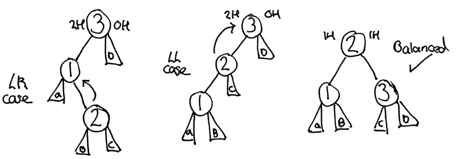
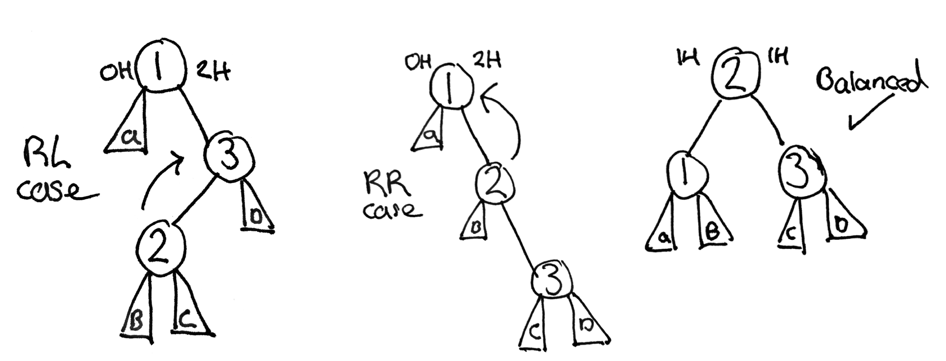

An AVL tree is a self-balancing binary search tree, whereby the height of a node's children differs by at most one.
In the event that this property is violated, a rebalancing process takes place.
In the past, I have discussed how to implement a [Binary Search Tree in Clojure](../2016-01-20-binary-search-trees-in-clojure/index.md), providing an average time complexity of O(log n).
However, if the order of insertion is sequential (where each value is either greater than or less than the last), time complexity increases to be linear, the same as a linked list.
Self-balancing trees, such as the AVL variant, provide us with a worst-case complexity of O(log n), thanks to their rebalancing phase.

## Balance Factor

Using the previous Binary Search Tree implementation as a base, we can expand upon this to include the AVL property.
For the sake of performance, you would typically store the height of each node's children within the structure.
However, as I wish to reuse the existing implementation, I will instead calculate their height upon `factor` invocation.
The balance factor of a node is calculated as the difference between the heights of its two child nodes, as shown below.

```clojure
(defn height
  ([tree] (height tree 0))
  ([tree count]
    (if tree
      (max (height (:left tree) (inc count))
           (height (:right tree) (inc count)))
      count)))

(defn factor [{:keys [left right]}]
  (- (height left) (height right)))
```

The above two functions provide the described behaviour, allowing us to supply a root node and return its balance factor.

## Rotations

To complete the final rebalancing step, we must also be able to rotate a given node both left and right within the tree structure.

```clojure
(defn rotate-left [{:keys [el left right] :as tree}]
  (if right
    (->Node (:el right) (->Node el left (:left right)) (:right right))
    tree))

(defn rotate-right [{:keys [el left right] :as tree}]
  (if left
    (->Node (:el left) (:left left) (->Node el (:right left) right))
    tree))
```

This can be achieved as shown above, taking advantage of an immutable approach.

## Rebalancing Phase

With the balance factor and rotation actions now available, we can begin working on the four different situations where a node's placement requires a tree rotation.



```clojure
(defn is-left-case? [tree]
  (< (factor tree) -1))

(defn is-left-right-case? [tree]
  (and (is-left-case? tree) (> (factor (:right tree)) 0)))
```



```clojure
(defn is-right-case? [tree]
  (> (factor tree) 1))

(defn is-right-left-case? [tree]
  (and (is-right-case? tree) (< (factor (:left tree)) 0)))
```

With these conditions now identifiable, we can apply the desired tree rotations, as visualised in the diagrams above.

```clojure
(defn balance [{:keys [el left right] :as tree}]
  (cond
    (is-right-left-case? tree) (rotate-right (->Node el (rotate-left left) right))
    (is-left-right-case? tree) (rotate-left (->Node el left (rotate-right right)))
    (is-right-case? tree) (rotate-right tree)
    (is-left-case? tree) (rotate-left tree)
    :else tree))
```

## Example Usage

Finally, we can create new AVL insertion and deletion variants by composing the Binary Search Tree functions with the newly created `balance` function.

```clojure
(def avl-insert (comp balance insert))
(def avl-remove (comp balance remove))
(def seq->avl (partial reduce avl-insert nil))
```

These data structures can then be visualised using the following function.

```clojure
(defn tabs [n]
  (clojure.string/join (repeat n "\t")))

(defn visualise
  ([tree] (visualise tree 0))
  ([{:keys [el left right] :as tree} depth]
    (if tree
      (str (visualise right (inc depth)) (tabs depth) el "\n" (visualise left (inc depth)))
      (str (tabs depth) "~\n"))))

(visualise (seq->avl [1 2 3]))
;              ~
;       3
;              ~
; 2
;              ~
;       1
;              ~
```
