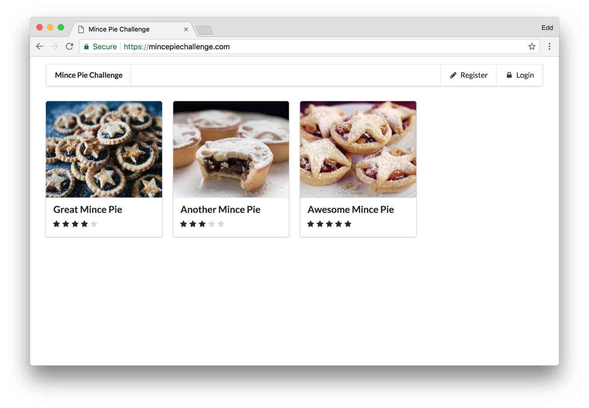

Since moving our infrastructure over to the AWS stack, I have been keen to explore how we can take advantage of the numerous services at our disposal, alongside the serverless methodology.
In this blog [series](), I wish to document my experience of building a complete serverless application which harnesses as many of the AWS offerings as possible.
We will explore building both a RESTful API and a React client, all hosted without any servers to maintain!

<!--more-->

## Mince Pie Challenge

The application itself will revolve around the responsibility of managing the 'extremely important' challenge of rating mince pies.
We will provide the user with the ability to register, log in, add new mince pies to the challenge (with a photo) and rate these pies.
Although this may seem like a trivial CRUD system, it will allow us to explore many different technologies and services in the process.

📝 The API will demonstrate the use of:

- [RAML](https://raml.org/) to design and document the API endpoints.
- [HAL](http://stateless.co/hal_specification.html) to represent the API.
- [Serverless Framework](https://serverless.com/) to manage the [AWS Lambda](https://aws.amazon.com/lambda/) functions and accompanying resources.
- Managing the Serverless Framework dependency using [Docker](https://www.docker.com/community-edition) and [Docker Compose](https://docs.docker.com/compose/).
- The latest ES6 JavaScript features will be used to implement the service, with [Webpack](https://webpack.js.org/), [Babel](https://babeljs.io/) and [Flow](https://flow.org/).
- Testing will be achieved using [Jest](https://facebook.github.io/jest/).
- Authentication will be handled by [Amazon Cognito](https://aws.amazon.com/cognito/) using [JSON Web Tokens](https://jwt.io/).
- Persistent state will be stored within [Amazon DynamoDB](https://aws.amazon.com/dynamodb/).
- Signed [Amazon S3](https://aws.amazon.com/s3/) URLs will be used to upload and store photos.
- Thumbnails will be created using an asynchronous S3 upload trigger and AWS Lambda (inc. ImageMagick).
- The custom [Amazon API Gateway](https://aws.amazon.com/api-gateway/) domain will be managed using [serverless-domain-manager](https://github.com/amplify-education/serverless-domain-manager).

🖥️ The Client will demonstrate the use of:

- [React](https://reactjs.org/) for presentational logic.
- [Redux](https://redux.js.org/) and [redux-thunk](https://github.com/gaearon/redux-thunk) for state management.
- [React Router](https://reacttraining.com/react-router/) will be used to manage URL-based navigation transitions.
- The application will be managed using [create-react-app](https://github.com/facebook/create-react-app).
- Managing the create-react-app dependency using [Docker](https://www.docker.com/community-edition) and [Docker Compose](https://docs.docker.com/compose/).
- Authentication will be supplied by the [Amazon Cognito Identity SDK](https://github.com/aws/aws-amplify/tree/master/packages/amazon-cognito-identity-js).
- Testing will be achieved using [Jest](https://facebook.github.io/jest/) and [Enzyme](http://airbnb.io/enzyme/).
- [Semantic UI](https://react.semantic-ui.com/) for component styling.
- [Terraform](https://www.terraform.io/) to provision the static endpoint to which we will publish the resulting client.

With so much to do, we had better get started!
Join me in the [next post](../2018-06-11-mince-pie-challenge-designing-the-restful-api-with-raml/index.md) of the [series](), where we will go about designing and documenting our RESTful API using RAML and HAL.
