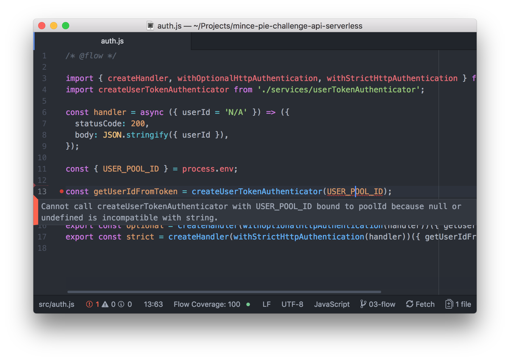

We have now settled on how our application will perform [user authentication](../2018-06-26-mince-pie-challenge-authentication-with-amazon-cognito-and-json-web-tokens/index.md).
I now wish to take a step back and help improve our code confidence by adding the static type checker [Flow](https://flow.org/).
In this article, I will document the process of configuring Flow with Babel and Webpack, expanding upon our previous example by adding sufficient typing.

<!--more-->

If you are keen to see how the finished example looks, you can access it within the [API repository](https://github.com/eddmann/mince-pie-challenge-api-serverless/tree/03-flow).

Developed by Facebook, Flow adds the ability to provide an incremental [type system](https://en.wikipedia.org/wiki/Type_system) to your JavaScript application.
In doing so, we garner the benefits of a type system – it helps catch errors early, improves code readability, and enables better tooling.
Facebook provides a well-written [article](https://flow.org/en/docs/lang/) on the rationale for developing such a tool, which I highly recommend you read.

## Setting up Flow with Babel and Webpack

The first step to configuring Flow within the project is to add the following development dependencies to the `package.json`.
You should also add the new `scripts` definition, which will allow us to validate types within the project by simply running `npm run flow`.

```json
{
  "devDependencies": {
    "babel-preset-flow": "^6.23.0",
    "flow-babel-webpack-plugin": "^1.1.1",
    "flow-bin": "^0.73.0"
  },
  "scripts": {
    "flow": "flow"
  }
}
```

The JavaScript runtime is unaware of Flow type definitions and would assume them to be simply syntax errors (which is not very helpful).
As a result, once validated by Flow, we are required to strip them within Babel's [transpilation](https://en.wikipedia.org/wiki/Source-to-source_compiler) process.

With these installed we can now add the [Flow preset](https://babeljs.io/docs/en/babel-preset-flow.html) to our `.babelrc`, and configure the [Webpack plugin](https://www.npmjs.com/package/flow-webpack-plugin) within `webpack.config.js`.

```json
{
  "presets": [["env", { "targets": { "node": "8.10" } }], "flow"]
}
```

```js
const FlowBabelWebpackPlugin = require('flow-babel-webpack-plugin');

module.exports = {
  // ..
  plugins: [new FlowBabelWebpackPlugin()],
  // ..
};
```

Adding this Webpack plugin allows Flow to be run before a build is started.
If any issues are highlighted by Flow, you will be alerted and the build will not succeed.

Finally, we need to ensure that we have initialised our Flow configuration (an empty `.flowconfig` will be generated) and define a new `Makefile` target which will run Flow for us.

```bash
$ docker-compose run --rm serverless npm run flow init
```

```make
flow:
  docker-compose run --rm serverless npm run flow
```

With this setup now complete, we can go about slowly incorporating types into our project.

## Adding Types to the Project

In the [last article](../2018-06-26-mince-pie-challenge-authentication-with-amazon-cognito-and-json-web-tokens/index.md#constructing-handlers-with-user-authentication) we documented a handler abstraction that provided assurances on user authentication and authorisation.
We will now go about adding suitable typing to this abstraction to help improve code clarity and aid in preventing any future bugs.

The first step is to add the following development dependency to the `package.json`.
This [package](https://www.npmjs.com/package/flow-aws-lambda) will allow us to type against the Lambda environment abstractions that are present.

```json
{
  "devDependencies": {
    "flow-aws-lambda": "^1.0.3"
  }
}
```

With this now installed we will start off by creating a single file within `src/types/index.js`, where we will define all our custom types.
Here we will make Flow aware that we wish to process this file using the `// @flow` annotation, and import some of the types that the dependency provides to us.

```js
// @flow

import type { APIGatewayEvent, Context, ProxyResult } from 'flow-aws-lambda';

export type Response = ProxyResult;
```

We have decided to use a [type alias](https://flow.org/en/docs/types/aliases/) and export the `ProxyResult` as simply `Response`.
We can then use this new type within our `unauthorised` function located in `src/helpers/http.js`.

```js
// @flow

import type { Response } from '../types';

export const unauthorised = (detail: string): Response => ({
  // ..
});
```

This now ensures that upon invocation of the function only a `string` can be supplied, and a `Response` object will be returned.
We will now move on to document (within `src/types/index.js`) the structure of how a user token authenticator service should look.

```js
type Token = string;

type UserId = string;

export type UserTokenAuthenticator = Token => Promise<?UserId>;
```

Again, we are using type aliases to help document the code's intent – along with defining how the authenticator service function should work (returning an optional `UserId` encapsulated in a `Promise`).
We can then employ this type definition within `src/services/userTokenAuthenticator.js`.

```js
// @flow

import type { UserTokenAuthenticator } from '../types';

export default (poolId: string): UserTokenAuthenticator =>
  async token => {
    // ..
  };
```

With these types in place we will move on to adding type definitions (within `src/types/index.js`) for the handler abstraction.

```js
type Services = {
  [name: string]: Function,
};

type OptionalUserParameters = {
  event: APIGatewayEvent,
  context: Context,
  services: Services,
  userId?: ?UserId,
};

type AuthenticatedUserParameters = {
  event: APIGatewayEvent,
  context: Context,
  services: Services,
  userId: UserId,
};

type Parameters = OptionalUserParameters | AuthenticatedUserParameters;

type Handler = Parameters => Promise<Response>;

export type HandlerWithServices = Handler => Services => (
  APIGatewayEvent,
  Context
) => Promise<Response>;

type UserHandlerMiddleware<T: Parameters> = ((T) => Promise<Response>) => Handler;

export type OptionalUserHandlerMiddleware = UserHandlerMiddleware<OptionalUserParameters>;

export type AuthenticatedUserHandlerMiddlware = UserHandlerMiddleware<AuthenticatedUserParameters>;
```

There are several interesting aspects to this above example.
The first is that we lay out the expected structure of the `Services` [object as a map](https://flow.org/en/docs/types/objects/#toc-objects-as-maps), with `string` keys and `Function` values.
Secondly, we define two different `Parameters` types; ensuring by means of a [union](https://flow.org/en/docs/types/unions/) that the supplied value matches one of these structures.
From here, we define how a typical handler is constructed using the `createHandler` paradigm we have devised.

We then go one step further and define how user middleware should work using a [Generic](https://flow.org/en/docs/types/generics/) `UserHandlerMiddleware` type.
Explicitly specifying the desired `Parameters` structure, we can be certain that any underlying handler that is supplied to the middleware has the necessary `userId` requirements.
For example, any handler that is supplied to the `OptionalUserHandlerMiddleware` must be equipped to handle a `userId` value that is not present.

We can then use these type definitions within the `src/helpers/handlers.js` implementation.

```js
// @flow

import type {
  HandlerWithServices,
  OptionalUserHandlerMiddleware,
  AuthenticatedUserHandlerMiddlware,
} from '../types';

import { unauthorised } from './http';

export const createHandler: HandlerWithServices = handler => services => (event, context) =>
  handler({ event, context, services });

export const withOptionalHttpAuthentication: OptionalUserHandlerMiddleware =
  handler =>
  async ({ event, context, services }) => {
    const userId = await services.getUserIdFromToken(event.headers.Authorization);
    return handler({ event, context, services, userId });
  };

export const withStrictHttpAuthentication: AuthenticatedUserHandlerMiddlware =
  handler =>
  async ({ event, context, services }) => {
    const userId = await services.getUserIdFromToken(event.headers.Authorization);
    return userId
      ? handler({ event, context, services, userId })
      : unauthorised('Service requires an authenticated user');
  };
```

Finally, to ensure that we pass the Flow checks, we must make certain that our `src/auth.js` handler file caters for the event that the environment variable [is not present](https://github.com/facebook/flow/issues/1192#issuecomment-165326717).

```js
// @flow

const { USER_POOL_ID } = process.env;

if (!USER_POOL_ID) {
  throw new Error('USER_POOL_ID is not present');
}

const getUserIdFromToken = createUserTokenAuthenticator(USER_POOL_ID);
```

Now if we invoke `make flow` or attempt a `make deploy`, we will see that our types get validated by Flow and successfully pass! 🎉

## Better Feedback from Flow

Although we are able to run Flow when desired using `make flow`, I have found it beneficial to gain instant feedback within my editor using a project such as [Flow-IDE](https://atom.io/packages/flow-ide) for Atom.
In doing so, we are able to get real-time Flow analysis, which makes it easier to manage the project and introduce typing to the code-base.



With Flow now configured, I wish to increase our code confidence even more by adding the unit testing framework [Jest](https://jestjs.io/) into the project.
Join me in the [next post](../2018-07-18-mince-pie-challenge-adding-test-coverage-using-jest-and-travis-ci/index.md) of the [series](), where we will look into testing the application using Jest, and add continuous integration via [Travis CI](https://travis-ci.org/).
