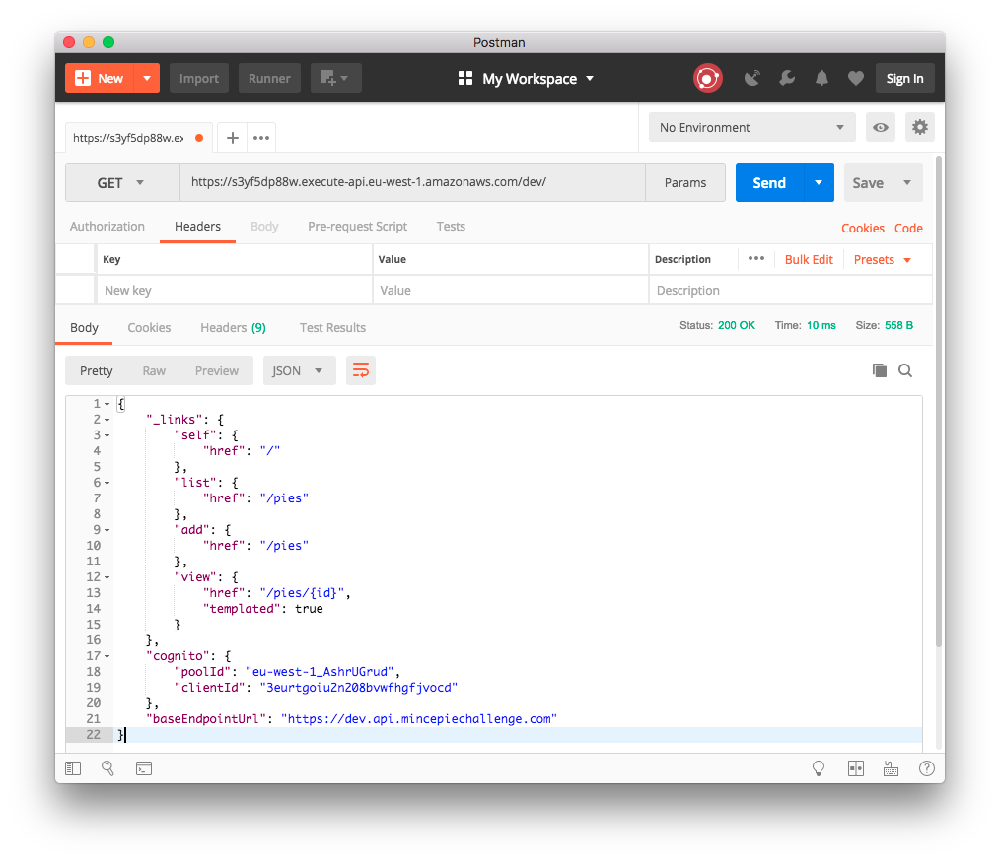
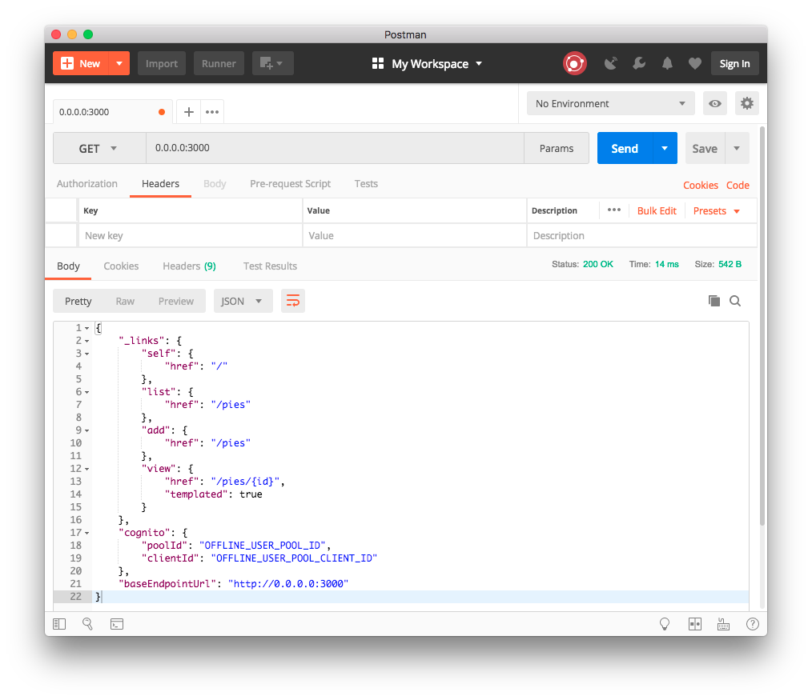

Up until now, we have spent our time setting up the API project to provide a confident testing pipeline (with types) and Amazon Cognito authentication.
We will now move on to implementing the first **real** API endpoint, that being the Bootstrap response.
Along the way, we will configure [Serverless Offline](https://github.com/dherault/serverless-offline), allowing us to locally interact with the API without having to provision any online resources.

<!--more-->

If you are keen to see how the finished example looks, you can access it within the [API repository](https://github.com/eddmann/mince-pie-challenge-api-serverless/tree/05-bootstrap-offline).

## Adding the Bootstrap Endpoint

If we [look back](../2018-06-11-mince-pie-challenge-designing-the-restful-api-with-raml/index.md#bootstrap) at the RAML API definition, we can see that this endpoint is used to help aid the client in discovering all the different endpoints/actions that are available to them.
We also provide the base endpoint and some Amazon Cognito User Pool specific information.
To start with, we will replace the user authentication handler examples present within `functions.yml` with our Bootstrap handler.

```yaml
bootstrap:
  handler: src/bootstrap.handler
  environment:
    USER_POOL_CLIENT_ID: ${file(./config.${self:provider.stage}.yml):userPoolClientId}
    BASE_ENDPOINT_URL: ${file(./config.${self:provider.stage}.yml):baseEndpointUrl}
  events:
    - http:
        path: /
        method: get
        cors: true
```

In this case, we are explicitly supplying several additional environment variables to this particular handler.
As these are only required for this endpoint, the [principle of least privilege](https://en.wikipedia.org/wiki/Principle_of_least_privilege) dictates that they should only be provided here.
We are fetching these values from the stage-specific configuration file (`config.dev.yml`), referencing the User Pool Client resource in a similar manner to how we referenced the User Pool in the previous post.
We also [enable CORS](https://serverless.com/framework/docs/providers/aws/events/apigateway/#enabling-cors) support within the API Gateway endpoint, as the API will be hosted on a different sub-domain to the client.

```yaml
# ..
baseEndpointUrl: 'https://dev.api.mincepiechallenge.com'
userPoolClientId:
  Ref: PieUserPoolClient
```

With this endpoint now defined, we can move on to implementing the behaviour.
We will first add a [new dependency](https://github.com/byteclubfr/js-hal) to the `package.json`, which provides a nice abstraction around managing HAL resources.

```json
{
  "dependencies": {
    "hal": "^1.2.0"
  }
}
```

From here, we can implement the delivery-specific handler within `src/bootstrap.js`.

```js
// @flow

import bootstrap from './handlers/bootstrap';

const { USER_POOL_ID, USER_POOL_CLIENT_ID, BASE_ENDPOINT_URL } = process.env;

if (!USER_POOL_ID) {
  throw new Error('USER_POOL_ID is not present');
}

if (!USER_POOL_CLIENT_ID) {
  throw new Error('USER_POOL_CLIENT_ID is not present');
}

if (!BASE_ENDPOINT_URL) {
  throw new Error('BASE_ENDPOINT_URL is not present');
}

export const handler = bootstrap({
  getPoolId: () => USER_POOL_ID,
  getClientId: () => USER_POOL_CLIENT_ID,
  getBaseEndpointUrl: () => BASE_ENDPOINT_URL,
});
```

This file exports the concrete handler that is called when the API Gateway endpoint is triggered.
We pull together all the externally required dependencies, in this case environment variables.
We ensure these environment variables are present and then encapsulate them into small services that the underlying handler will use.

This allows us to now create the underlying handler implementation within `src/handlers/bootstrap.js`.

```js
// @flow

import { createHandler } from '../helpers/handlers';
import { ok } from '../helpers/http';
import { Resource } from 'hal';

const bootstrap = async ({ services: { getPoolId, getClientId, getBaseEndpointUrl } }) => {
  const resource = new Resource(
    {
      cognito: {
        poolId: getPoolId(),
        clientId: getClientId(),
      },
      baseEndpointUrl: getBaseEndpointUrl(),
    },
    '/'
  );

  resource.link('list', '/pies');
  resource.link('add', '/pies');
  resource.link('view', { href: '/pies/{id}', templated: true });

  return ok(resource);
};

export default createHandler(bootstrap);
```

The handler uses the newly added dependency to build up a HAL-compliant resource which is returned to the client.
The supplied services are then used to correctly set the resource values based on the current setup.
We finally return a newly created `ok` response, which needs to be added to `src/helpers/http.js`.

```js
// @flow

import type { HALResource, Response } from '../types';

export const ok = (resource: HALResource): Response => ({
  statusCode: 200,
  headers: {
    'Access-Control-Allow-Origin': '*',
    'Access-Control-Allow-Credentials': '*',
    'Content-Type': 'application/hal+json',
  },
  body: JSON.stringify(resource.toJSON()),
});
```

The helper function requires that a `HALResource` be supplied, along with a `Response` returned.
We shall define the structure of what a `HALResource` looks like within `src/types/index.js`.

```js
export type HALResource = {
  _links: { [string]: any },
  toJSON: () => {},
};
```

Within our domain, a `HALResource` must provide a set of `_links` and a `toJSON` method, which converts the internal representation into JSON that can be consumed by the client.
We can now move on to covering this new handler with sufficient test coverage.
We will create a new test within `src/__tests__/bootstrap.js`, and ensure that the handler responds with the expected output, based on the supplied service definitions.

```js
import handler from '../handlers/bootstrap';

it('displays the bootstrap details', async () => {
  const services = {
    getPoolId: () => 'POOL_ID',
    getClientId: () => 'CLIENT_ID',
    getBaseEndpointUrl: () => 'BASE_ENDPOINT_URL',
  };

  const response = parseResponse(await handler(services)({}, {}));

  expect(response.statusCode).toBe(200);
  expect(response.body.cognito.poolId).toBe('POOL_ID');
  expect(response.body.cognito.clientId).toBe('CLIENT_ID');
  expect(response.body.baseEndpointUrl).toBe('BASE_ENDPOINT_URL');
});
```

With this addition, we can run `make test` locally to ensure the handler honours the agreement.
Committing these changes to the GitHub repository will in turn invoke a new Travis CI build.
Finally, we can run `make deploy` to see this endpoint in action within our `dev` AWS stage.



## Adding Serverless Offline

We can now access this Bootstrap endpoint online within our `dev` AWS stage.
This is great, but wouldn't it be even better if we could interact with this project locally?
In doing so, we would be able to quickly inspect the API's behaviour without having to deploy the resources to AWS.
Once we are satisfied with the implementation, we could then deploy the changes to our online `dev` stage, and subsequently to `prod` when we wish to release it to the world.

To do this, we will add Serverless Offline to our project, which locally emulates AWS Lambda and API Gateway.
Internally, it starts up a small HTTP server which handles request lifecycles like API Gateway does, invoking the desired handlers.
To start with, we shall add a new development dependency to the `package.json` file.

```json
{
  "devDependencies": {
    "serverless-offline": "^3.25.6"
  }
}
```

We can then update the `serverless.yml` configuration, amending the default stage (if one is not provided via command-line invocation) to be `offline`.
For the sake of clarity, we will also specify the default `host` and `port` to which the Serverless Offline HTTP server should bind.

```yaml
provider:
  stage: ${opt:stage, 'offline'}

custom:
  serverless-offline:
    host: 0.0.0.0
    port: 3000
```

As we now wish to make container requests to port 3000, we will create an additional service exposing this port within the `docker-compose.yml` file.

```yaml
services:
  serverless-offline:
    build: .
    env_file: .env
    ports:
      - 3000:3000
    volumes:
      - .:/opt/app
      - app-modules:/opt/app/node_modules
```

Subsequently, as we are now defaulting to a new `offline` stage, we must define the required configuration within a `config.offline.yml` file.

```yaml
baseEndpointUrl: 'http://0.0.0.0:3000'
userPoolId: 'OFFLINE_USER_POOL_ID'
userPoolClientId: 'OFFLINE_USER_POOL_CLIENT_ID'
```

As we do not wish to use the online Amazon Cognito instance whilst in the `offline` stage, we will provide static dummy pool identifiers instead.
We can then add a new target to the `Makefile` to correctly open the service ports and run the offline HTTP server.

```make
offline:
  docker-compose run --service-ports --rm serverless-offline sls offline --stage=offline
```

With this in place, we can run `make offline`.
You should now be able to access the offline endpoint by visiting `http://0.0.0.0:3000`.
Any changes that you make to the handler implementation will be automatically reflected within the offline instance, providing you with a much quicker development REPL cycle.



We have now created our first Mince Pie Challenge API endpoint, which not only works within the online `dev` stage, but is also equipped to handle offline access.
Join me in the [next post](../2018-08-16-mince-pie-challenge-adding-and-listing-mince-pies-with-amazon-dynamodb/index.md) of the [series](), where we will be adding the ability to add and list Mince Pies to the API, using both an online and local [Amazon DynamoDB](https://aws.amazon.com/dynamodb/) instance.
