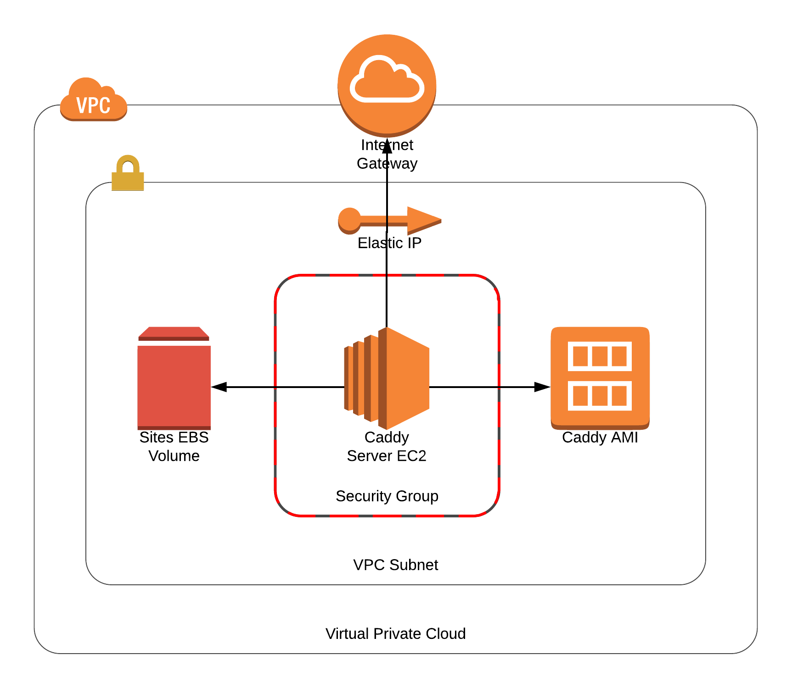

With the [recent update](https://security.googleblog.com/2018/02/a-secure-web-is-here-to-stay.html) to Google Chrome helping shape a more secure Web by marking all HTTP sites as "not secure".
I thought it was time that I make the necessary changes to how we host audio files for the [Three Devs and a Maybe](https://threedevsandamaybe.com/) podcast.
In this post I would like to discuss setting up [Caddy Server](https://caddyserver.com/) (which provides HTTPS out of the box!) as a static-hosting platform on AWS.
I will detail how to provision the instance with Packer and the surrounding infrastructure using Terraform.

<!--more-->

The goal of this guide is to document a process in which we can deploy the resulting service using an Infrastructure-as-Code philosophy.

## Architecting the Service

We will be storing all statically hosted files and Let's Encrypt generated SSL certificates within a dedicated EBS volume which has already been created.
This will allow us to bring up and tear down the service as desired whilst keeping the required persistent state.
It is good practise to retain the certificates that are generated within Caddy Server, as Let's Encrypt has particular [rate-limits](https://letsencrypt.org/docs/rate-limits/) that could cause issues.
Following this, we will be using an Elastic IP which has also already been allocated.
As the `threedevsandamaybe.com` domain is not currently managed by Amazon Route 53, it is easier to use an expected IP address that we can manually update the DNS records to beforehand.

With these two prerequisite resources in place, we can look at how the service will be constructed, as shown in the following diagram.



## Provisioning the Machine with Packer

Built by HashiCorp, [Packer](https://www.packer.io/) provides a clean abstraction around creating identical machine images for multiple platforms, using a single source configuration.
Packer clearly defines the meaning of a 'machine image' within their documentation.

> A machine image is a single static unit that contains a pre-configured operating system and installed software which is used to quickly create new running machines.

This allows us to define how we wish the image to look within code (using Provisioners) and then build the associated artifacts (AMIs, VirtualBox OVF exports) based on our environment needs.

Now that we are familiar with what Packer provides us with, we must first [download](https://www.packer.io/downloads.html) the relevant package based on your host system.
Alternatively, you can do away with installing packages on your host system and containerise the dependency using Docker 💪.
This can be simply achieved by adding the following alias into your terminal session.

```bash
alias packer='docker run -it --rm -v $(pwd):/app/ -w /app/ eddmann/packer-cli'
```

With this set up we can define our Caddy Server image within a file called `caddy.json`, which will be used to shape the resulting AWS artifact.

```json
{
  "builders": [
    {
      "type": "amazon-ebs",
      "access_key": "{{ \"{{user `aws_access_key`}}\" }}",
      "secret_key": "{{ \"{{user `aws_secret_key`}}\" }}",
      "region": "{{ \"{{user `aws_region`}}\" }}",
      "source_ami_filter": {
        "filters": {
          "virtualization-type": "hvm",
          "name": "ubuntu/images/*ubuntu-xenial-16.04-amd64-server-*",
          "root-device-type": "ebs"
        },
        "owners": ["099720109477"],
        "most_recent": true
      },
      "instance_type": "m3.medium",
      "ssh_username": "ubuntu",
      "ami_name": "Caddy-Server-{{ \"{{timestamp}}\" }}"
    }
  ],
  "provisioners": [
    {
      "type": "shell",
      "expect_disconnect": true,
      "inline": [
        "sudo apt-get -y update",
        "sudo apt-get -y dist-upgrade",
        "sudo apt-get -y autoremove",
        "sudo reboot"
      ]
    },
    {
      "pause_before": "30s",
      "type": "shell",
      "inline": [
        "curl https://getcaddy.com | bash -s personal",
        "sudo chown root:root /usr/local/bin/caddy",
        "sudo chmod 755 /usr/local/bin/caddy",
        "sudo setcap 'cap_net_bind_service=+ep' /usr/local/bin/caddy",
        "sudo mkdir /etc/caddy",
        "sudo chown root:root /etc/caddy",
        "ulimit -n 8192",
        "wget https://raw.githubusercontent.com/mholt/caddy/master/dist/init/linux-systemd/caddy.service",
        "sudo mv caddy.service /etc/systemd/system/",
        "sudo chown root:root /etc/systemd/system/caddy.service",
        "sudo chmod 644 /etc/systemd/system/caddy.service",
        "sudo systemctl daemon-reload"
      ]
    }
  ]
}
```

You can see that we first define the builder that we wish to use for this machine image.
We have opted for a single [`amazon-ebs`](https://www.packer.io/docs/builders/amazon-ebs.html), which will boot up a temporary `m3.medium` EC2 instance with a base AMI (the latest Ubuntu 16.04), and create a new AMI using the supplied name template once the instance has been provisioned.
We require that the user externally supply the relevant AWS credentials and desired region in which the AMI is to be created.
These variables will be stored in an accompanying file called `variables.json`.

```json
{
  "variables": {
    "aws_access_key": "",
    "aws_secret_key": "",
    "aws_region": ""
  }
}
```

With the base AWS EC2 instance running we will provision the machine using simple shell commands.
Packer has support for many different provisioners (such as Puppet and Chef), but the easiest and best suited for our use-case is [`shell`](https://www.packer.io/docs/provisioners/shell.html).
At this stage we ensure that the instance is fully up-to-date (with a reboot to ensure any required changes take effect), and then download and configure the latest Caddy Server package.

With this configuration now defined, we can run `packer build -var-file=variables.json caddy.json`.
Once the AMI has been successfully created, you will be shown its unique identifier.
Keep hold of this identifier as it will be required in the next step!

## Provisioning the Infrastructure with Terraform

Now that we have the bespoke Caddy Server AMI in place, we can move on to creating the associated AWS infrastructure that is required to get this EC2-backed service running.
Like Packer, [Terraform](https://www.terraform.io/) is built by HashiCorp, providing you with the ability to define your desired infrastructure through code.
Once you have specified your intended goal state, Terraform will compute a plan of imperative steps to reach the desired state.
Terraform is able to interact with many different third-party providers, as stated in their documentation.

> Terraform is used to create, manage, and update infrastructure resources such as physical machines, VMs, network switches, containers, and more.
> Almost any infrastructure type can be represented as a resource in Terraform.

We must first [download](https://www.terraform.io/downloads.html) the relevant package based on your host system.
Similar to how we can containerise Packer using Docker, we can also alternatively access this dependency by using a terminal alias.

```bash
alias terraform='docker run -it --rm -v ${HOME}:/root -v $(pwd):/app/ -w /app/ eddmann/terraform-cli'
```

Next, we shall start off by defining the [AWS provider](https://www.terraform.io/docs/providers/aws/index.html) within `provider.tf` like so.

```
provider "aws" {
  access_key = "${var.aws_access_key}"
  secret_key = "${var.aws_secret_key}"
  region     = "${var.aws_region}"
}
```

This configures the AWS provider using the desired credentials which are declared in a file called `variables.tf`, and defined in a file called `terraform.tfvars`.

```
variable "aws_access_key" {}
variable "aws_secret_key" {}
variable "aws_region" {}
```

```
aws_access_key = ""
aws_secret_key = ""
aws_region = ""
```

With the provider now configured we can move on to setting up the surrounding network infrastructure required to host the service, specified in a file called `network.tf`.

```
data "http" "ip" {
  url = "http://icanhazip.com"
}

resource "aws_vpc" "caddy" {
  cidr_block = "10.0.0.0/16"

  tags {
    Name      = "Caddy-VPC"
    Terraform = "Yes"
  }
}

resource "aws_subnet" "caddy" {
  vpc_id                  = "${aws_vpc.caddy.id}"
  cidr_block              = "10.0.0.0/24"
  availability_zone       = "${var.caddy_availability_zone}"
  map_public_ip_on_launch = false

  tags {
    Name      = "Caddy-Subnet"
    Terraform = "Yes"
  }
}

resource "aws_security_group" "caddy" {
  name        = "Caddy-Security-Group"
  description = "Security Group for Caddy"
  vpc_id      = "${aws_vpc.caddy.id}"

  tags {
    Name      = "Caddy-Security-Group"
    Terraform = "Yes"
  }

  ingress {
    from_port   = 22
    to_port     = 22
    protocol    = "tcp"
    cidr_blocks = ["${chomp(data.http.ip.body)}/32"]
  }

  ingress {
    from_port   = 80
    to_port     = 80
    protocol    = "tcp"
    cidr_blocks = ["0.0.0.0/0"]
  }

  ingress {
    from_port   = 443
    to_port     = 443
    protocol    = "tcp"
    cidr_blocks = ["0.0.0.0/0"]
  }

  egress {
    from_port   = 0
    to_port     = 0
    protocol    = "-1"
    cidr_blocks = ["0.0.0.0/0"]
  }
}

resource "aws_internet_gateway" "caddy" {
  vpc_id = "${aws_vpc.caddy.id}"

  tags {
    Name      = "Caddy-Internet-Gateway"
    Terraform = "Yes"
  }
}

resource "aws_route" "caddy" {
  route_table_id         = "${aws_vpc.caddy.main_route_table_id}"
  destination_cidr_block = "0.0.0.0/0"
  gateway_id             = "${aws_internet_gateway.caddy.id}"
}
```

This file defines the desired AWS VPC, Subnet and Internet Gateway.
It also creates the Security Group which allows HTTP(S) access to and from the instance, along with restricted SSH access to the IP address found when accessing `http://icanhazip.com`.
The subnet specifies which Availability Zone we wish to place our service in, and as such is defined using another variable which needs to be added to `variables.tf` and `terraform.tfvars`.

```
variable "caddy_availability_zone" {}
```

```
caddy_availability_zone = ""
```

With the base infrastructure configured we can specify how we wish the instance itself to look.
This definition is supplied within a file called `instance.tf`.

```
data "template_file" "caddy" {
  template = "${file("./provision.tpl")}"

  vars {
    domain = "${var.caddy_domain}"
    email  = "${var.caddy_email}"
  }
}

resource "aws_key_pair" "caddy" {
  key_name   = "caddy"
  public_key = "${var.caddy_ssh_key}"
}

resource "aws_instance" "caddy" {
  ami                    = "${var.caddy_ami_id}"
  instance_type          = "t2.nano"
  availability_zone      = "${var.caddy_availability_zone}"
  key_name               = "${aws_key_pair.caddy.key_name}"
  vpc_security_group_ids = ["${aws_security_group.caddy.id}"]
  subnet_id              = "${aws_subnet.caddy.id}"
  user_data              = "${data.template_file.caddy.rendered}"

  tags {
    Name      = "Caddy-Server"
    Terraform = "Yes"
  }
}

resource "aws_eip_association" "caddy" {
  instance_id   = "${aws_instance.caddy.id}"
  allocation_id = "${var.caddy_eip_id}"
}

resource "aws_volume_attachment" "caddy" {
  device_name = "/dev/xvdg"
  volume_id   = "${var.caddy_volume_id}"
  instance_id = "${aws_instance.caddy.id}"
}
```

We define the instance running the supplied AMI (created with Packer) using the newly created Subnet and Security Group.
To access the instance via SSH (and upload web assets) we supply a public key.
We then associate the instance with the supplied Elastic IP and attach the externally persistent EBS volume.
As before, these values are provided externally by the user, and as such need to be declared within `variables.tf` and `terraform.tfvars`.

```
variable "caddy_ami_id" {}
variable "caddy_eip_id" {}
variable "caddy_volume_id" {}
variable "caddy_ssh_key" {}
variable "caddy_domain" {}
variable "caddy_email" {}
```

```
caddy_ami_id = ""
caddy_eip_id = ""
caddy_volume_id = ""
caddy_ssh_key = ""
caddy_domain = ""
caddy_email = ""
```

When the instance is first booted up we ensure that the external volume is mounted and the required Caddyfile (based on the supplied domain) is defined before finally starting up Caddy Server.
This is achieved within EC2 using supplied [User Data](https://docs.aws.amazon.com/AWSEC2/latest/UserGuide/user-data.html).
This script is generated using a template (stored in `provision.tpl`), which allows us to supply dynamic content that is written out before invocation.

```bash
#!/bin/bash

cat > Caddyfile <<EOF
${domain} {
  root /var/www/${domain}
  tls ${email}
}
EOF
sudo mv Caddyfile /etc/caddy/Caddyfile
sudo chown root:root /etc/caddy/Caddyfile
sudo chmod 644 /etc/caddy/Caddyfile

while [ ! -e "/dev/xvdg" ]; do sleep 1; done
if [ "$(sudo file -b -s /dev/xvdg)" == "data" ]; then
  sudo mkfs -t ext4 /dev/xvdg
fi
echo '/dev/xvdg /data ext4 defaults,nofail 0 2' >> /etc/fstab
sudo mkdir /data
sudo mount /dev/xvdg /data
sudo mkdir /data/www /data/ssl

sudo ln -s /data/ssl /etc/ssl/caddy
sudo chown -R root:www-data /etc/ssl/caddy /data/ssl
sudo chmod 770 /etc/ssl/caddy /data/ssl

sudo ln -s /data/www /var/www
sudo chown -R www-data:www-data /var/www /data/www
sudo chmod 555 /var/www /data/www

sudo mkdir -p /var/www/${domain}
sudo chown -R www-data:www-data /var/www/${domain}
sudo chmod 555 /var/www/${domain}

sudo systemctl enable caddy.service
sudo systemctl start caddy.service
```

Supplying the desired domain and associated email address for automatic Let's Encrypt certificate generation allows us to be sure that the service is self-reliant upon boot.

Finally, we can run `terraform apply` to create the underlying infrastructure and Caddy Server instance which is accessible from the supplied Elastic IP.
If for any reason we wish to make changes to this service, we can do so safe in the knowledge that the statically hosted content (and SSL certificates) are persisted, and the service will remain running as stated within the code.

If you are interested in experimenting with this service, you can find all the source code within the [associated GitHub repository](https://github.com/eddmann/aws-caddy-server).
