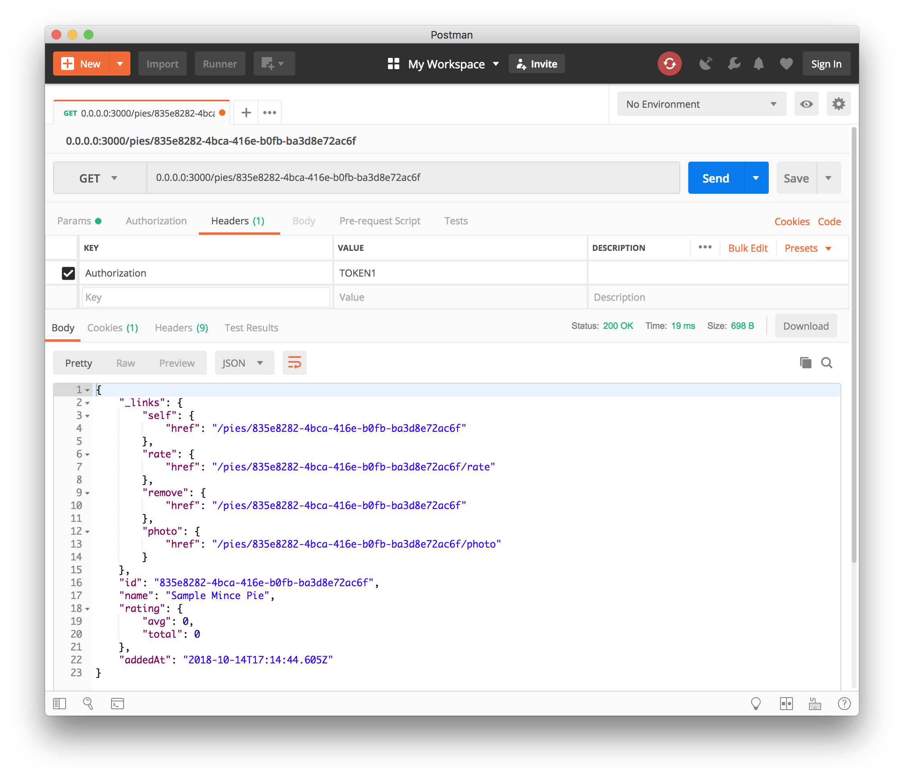
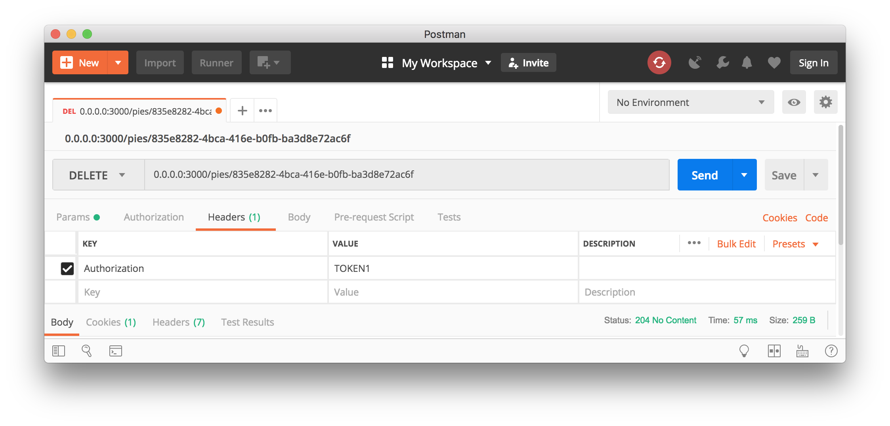

In this post we will progress in implementing the proposed endpoint behaviour documented in our [RAML design](../2018-06-11-mince-pie-challenge-designing-the-restful-api-with-raml/index.md#viewing-the-pies).
Using the online/offline DynamoDB abstractions that we constructed in the [previous post](../2018-08-16-mince-pie-challenge-adding-and-listing-mince-pies-with-amazon-dynamodb/index.md), we will incorporate the ability to view and remove specified mince pies from the challenge.

<!--more-->

If you are keen to see how the finished example looks, you can access it within the [API repository](https://github.com/eddmann/mince-pie-challenge-api-serverless/tree/07-view-remove-pies).

## Viewing a Pie

We will begin by adding the ability to view a specified mince pie's full details, along with any associated actions available based on the client's request.
To start we will add the following new handler definition to `functions.yml`.

```yaml
view-pie:
  handler: src/view.handler
  events:
    - http:
        path: /pies/{id}
        method: get
        cors: true
```

From here, we will create the concrete handler (`src/view.js`) which will be called upon each request.

```js
// @flow

import view from './handlers/view';
import { getPie } from 'db';
import createUserTokenAuthenticator from 'userTokenAuthenticator';

const { TABLE_NAME, USER_POOL_ID } = process.env;

if (!TABLE_NAME) {
  throw new Error('TABLE_NAME is not present');
}

if (!USER_POOL_ID) {
  throw new Error('USER_POOL_ID is not present');
}

export const handler = view({
  getUserIdFromToken: createUserTokenAuthenticator(USER_POOL_ID),
  getPie: getPie(TABLE_NAME),
});
```

This concrete handler passes the `getPie` service to the internal handler so as to correctly fetch the desired mince pie.
We will add this ability to both the `src/services/dynamoDBPieStore.js` and `src/services/localDynamoDBPieStore.js` implementations.

```js
import type { Pie, UUID, UserId } from '../types';

export const getPie =
  (tableName: string) =>
  (id: UUID): Promise<Pie> =>
    new AWS.DynamoDB.DocumentClient()
      .get({ TableName: tableName, Key: { Id: id } })
      .promise()
      .then(r => r.Item);
```

You will notice that we use the `UUID` type which was previously internal to the `src/types/index.js` definition.
This will need to be exposed for external consumption like so, `export type UUID = string;`.

The next step is to implement the internal handler (`src/handlers/view.js`) which will be called to fetch the pie and generate the API response.

```js
// @flow

import type { UserId, Pie } from '../types';

import { notFound, ok } from '../helpers/http';
import { createHandler, withOptionalHttpAuthentication } from '../helpers/handlers';
import { Resource } from 'hal';

const hasNotRated = (userId: ?UserId, pie: Pie) => userId && !pie.Ratings[userId];
const isOwner = (userId: ?UserId, pie: Pie) => userId && userId === pie.UserId;
const isAbleToUploadPhoto = (userId: ?UserId, pie: Pie) => isOwner(userId, pie) && !pie.PhotoUrl;

const view = async ({ event, userId, services: { getPie } }) => {
  const { id } = event.pathParameters || {};

  const pie = await getPie(id);

  if (!pie) {
    return notFound('Unable to find the specified mince pie.');
  }

  const resource = new Resource(
    {
      id: pie.Id,
      name: pie.Name,
      rating: { avg: pie.AvgRating, total: pie.TotalRatings },
      photo: pie.PhotoUrl,
      thumbnail: pie.ThumbnailUrl,
      addedAt: new Date(pie.AddedAt).toISOString(),
    },
    `/pies/${pie.Id}`
  );

  if (hasNotRated(userId, pie)) resource.link('rate', `/pies/${pie.Id}/rate`);
  if (isOwner(userId, pie)) resource.link('remove', `/pies/${pie.Id}`);
  if (isAbleToUploadPhoto(userId, pie)) resource.link('photo', `/pies/${pie.Id}/photo`);

  return ok(resource);
};

export default createHandler(withOptionalHttpAuthentication(view));
```

This endpoint will return different actions based on the context in which the client makes the request.
For example, if the client is deemed to be the owner of this resource we will provide the action to remove the pie, and attach a photo (if one is not already present).
If the authenticated client has not yet rated this pie, we will return the action to fulfil this request as well.
Finally, if the request comes from an unauthenticated client we will omit any user specific actions, and simply return the pie details.

Now we are able to specify a particular pie within the request, we have to cater for the event that the supplied identifier may not correspond to a pie within the challenge.
For this, we need to add an additional response to the helpers within `src/helpers/http.js`.

```js
export const notFound = (detail: string): Response => ({
  statusCode: 404,
  headers: {
    'Access-Control-Allow-Origin': '*',
    'Access-Control-Allow-Credentials': '*',
    'Content-Type': 'application/problem+json',
  },
  body: JSON.stringify({ title: 'Not Found', detail }),
});
```

Now that we have built up the functionality, it is time to exercise that the behaviour works as intended.
To do this we will produce test cases (`src/__tests__/view.js`) for each type of behaviour that we expect to observe from the resource.

```js
import handler from '../handlers/view';

const createPie = custom => ({
  Id: '1',
  UserId: 'USER_ID',
  Name: 'Sample Mince Pie',
  AvgRating: 0,
  TotalRatings: 0,
  Ratings: {},
  PhotoUrl: 'http://photo.url',
  ThumbnailUrl: 'http://thumbnail.url',
  AddedAt: 1528217691,
  ...custom,
});

it('displays a users pie', async () => {
  const pie = createPie({ UserId: 'ANOTHER_USER_ID' });

  const services = {
    getUserIdFromToken: () => Promise.resolve(),
    getPie: () => Promise.resolve(pie),
  };

  const response = parseResponse(await handler(services)({ headers: {} }, {}));

  expect(response.statusCode).toBe(200);
  expect(response.body.name).toBe('Sample Mince Pie');
  expect(response.body._links).not.toHaveProperty('remove');
  expect(response.body._links).not.toHaveProperty('rate');
  expect(response.body._links).not.toHaveProperty('photo');
});

it('displays the photo action when no photo is present for your pie', async () => {
  const pie = createPie({ PhotoUrl: undefined, ThumbnailUrl: undefined });

  const services = {
    getUserIdFromToken: () => Promise.resolve('USER_ID'),
    getPie: () => Promise.resolve(pie),
  };

  const response = parseResponse(
    await handler(services)({ headers: { Authorization: 'TOKEN' } }, {})
  );

  expect(response.statusCode).toBe(200);
  expect(response.body._links).toHaveProperty('photo');
});

it('displays the remove action when viewing your own pie', async () => {
  const pie = createPie({});

  const services = {
    getUserIdFromToken: () => Promise.resolve('USER_ID'),
    getPie: () => Promise.resolve(pie),
  };

  const response = parseResponse(
    await handler(services)({ headers: { Authorization: 'TOKEN' } }, {})
  );

  expect(response.statusCode).toBe(200);
  expect(response.body._links).toHaveProperty('remove');
});

it('displays the rate action when we have not yet rated the pie', async () => {
  const pie = createPie({});

  const services = {
    getUserIdFromToken: () => Promise.resolve('USER_ID'),
    getPie: () => Promise.resolve(pie),
  };

  const response = parseResponse(
    await handler(services)({ headers: { Authorization: 'TOKEN' } }, {})
  );

  expect(response.statusCode).toBe(200);
  expect(response.body._links).toHaveProperty('rate');
});

it('does not display the rate action when we have rated the pie', async () => {
  const pie = createPie({ Ratings: { USER_ID: 3 }, AvgRating: 3, TotalRatings: 1 });

  const services = {
    getUserIdFromToken: () => Promise.resolve('USER_ID'),
    getPie: () => Promise.resolve(pie),
  };

  const response = parseResponse(
    await handler(services)({ headers: { Authorization: 'TOKEN' } }, {})
  );

  expect(response.statusCode).toBe(200);
  expect(response.body._links).not.toHaveProperty('rate');
});
```

These test cases highlight how the actions returned back to the client can be different based on the given context.
We have decided to extract out creating a pie [stub](https://blog.pragmatists.com/test-doubles-fakes-mocks-and-stubs-1a7491dfa3da#5334) into a smaller helper function.
This function provides us with the ability to supply custom attributes that we wish to override the default properties with, per use-case.

With the ability to access a specified pie now available, we will follow this with work on one of the supplied owner actions - removing a pie from the challenge.

## Removing a Pie

In a similar manner to how we constructed the viewing capabilities, we will start off by defining a new handler within `functions.yml` which is called upon a `DELETE` request.

```yaml
remove-pie:
  handler: src/remove.handler
  events:
    - http:
        path: /pies/{id}
        method: delete
```

We will now implement the concrete handler within `src/remove.js`, which will be called by each client request.

```js
// @flow

import remove from './handlers/remove';
import { getPie, removePie } from 'db';
import createUserTokenAuthenticator from 'userTokenAuthenticator';

const { TABLE_NAME, USER_POOL_ID } = process.env;

if (!TABLE_NAME) {
  throw new Error('TABLE_NAME is not present');
}

if (!USER_POOL_ID) {
  throw new Error('USER_POOL_ID is not present');
}

export const handler = remove({
  getUserIdFromToken: createUserTokenAuthenticator(USER_POOL_ID),
  getPie: getPie(TABLE_NAME),
  removePie: removePie(TABLE_NAME),
});
```

The internal handler that is used within this request uses the previously created `getPie` service, along with a new `removePie` service.
We will add this capability to both the `src/services/dynamoDBPieStore.js` and `src/services/localDynamoDBPieStore.js` implementations.

```js
export const removePie =
  (tableName: string) =>
  (id: UUID): Promise<void> =>
    new AWS.DynamoDB.DocumentClient().delete({ TableName: tableName, Key: { Id: id } }).promise();
```

With this now in place we can create the internal handler (`src/handlers/remove.js`) that will be called to remove the specified pie resource.

```js
// @flow

import type { UserId, Pie } from '../types';

import { notFound, forbidden, noContent } from '../helpers/http';
import { createHandler, withStrictHttpAuthentication } from '../helpers/handlers';
import { Resource } from 'hal';

const isOwner = (userId: UserId, pie: Pie) => userId === pie.UserId;

const remove = async ({ event, userId, services: { getPie, removePie } }) => {
  const { id } = event.pathParameters || {};

  const pie = await getPie(id);

  if (!pie) {
    return notFound('Unable to find the specified mince pie.');
  }

  if (!isOwner(userId, pie)) {
    return forbidden('This mince pie does not belong to you.');
  }

  await removePie(pie.Id);

  return noContent();
};

export default createHandler(withStrictHttpAuthentication(remove));
```

We first ensure that the desired pie exists and is owned by the requesting client.
If this is the case, we will remove the pie and return a successful `204 No Content` response.
However, if the requesting client is not deemed to be the owner of the pie we will reject this action and return a `403 Forbidden` response.
Both of these responses will now need to be added to `src/helpers/http.js`.

```js
export const noContent = (): Response => ({
  statusCode: 204,
  headers: { 'Access-Control-Allow-Origin': '*', 'Access-Control-Allow-Credentials': '*' },
  body: '',
});

export const forbidden = (detail: string): Response => ({
  statusCode: 403,
  headers: {
    'Access-Control-Allow-Origin': '*',
    'Access-Control-Allow-Credentials': '*',
    'Content-Type': 'application/problem+json',
  },
  body: JSON.stringify({ title: 'Forbidden', detail }),
});
```

Finally, we will test that the implemented behaviour works as desired within `src/__tests__/remove.js`.

```js
import handler from '../handlers/remove';

it('requires an authenticated user', async () => {
  const services = { getUserIdFromToken: () => Promise.resolve() };

  const response = parseResponse(
    await handler(services)({ headers: {}, pathParameters: { id: '1' } }, {})
  );

  expect(response.statusCode).toBe(401);
});

it('requires a pie to be present', async () => {
  const services = {
    getUserIdFromToken: () => Promise.resolve('USER_ID'),
    getPie: () => Promise.resolve(),
  };

  const response = parseResponse(
    await handler(services)(
      { headers: { Authorization: 'TOKEN' }, pathParameters: { id: '1' } },
      {}
    )
  );

  expect(response.statusCode).toBe(404);
});

it('requires the user to own the pie', async () => {
  const services = {
    getUserIdFromToken: () => Promise.resolve('USER_ID'),
    getPie: () => Promise.resolve({ Id: '1', UserId: 'ANOTHER_USER_ID' }),
  };

  const response = parseResponse(
    await handler(services)(
      { headers: { Authorization: 'TOKEN' }, pathParameters: { id: '1' } },
      {}
    )
  );

  expect(response.statusCode).toBe(403);
});

it('removes the users pie', async () => {
  const services = {
    getUserIdFromToken: () => Promise.resolve('USER_ID'),
    getPie: () => Promise.resolve({ Id: '1', UserId: 'USER_ID' }),
    removePie: jest.fn(),
  };

  const response = parseResponse(
    await handler(services)(
      { headers: { Authorization: 'TOKEN' }, pathParameters: { id: '1' } },
      {}
    )
  );

  expect(response.statusCode).toBe(204);
  expect(services.removePie).toHaveBeenCalledWith('1');
});
```

With this behaviour now exercised by automated tests we are equipped to test performing these actions within both an offline and online development environment.
We will run `make offline` and test viewing a newly created mince pie as the resource owner, using [Postman](https://www.getpostman.com/).



You will see that as the pie owner we have the ability to remove it from the challenge.
We will now call this action and ensure that the pie has been successfully removed.



Finally, we can `make deploy` and perform the same assertions in the online development environment.

In this post we have made good progress in building up the underlying functionality that comprises to be the API.
In the next post of the [series](), we shall delve into adding a key part of the challenge itself, the ability to rate a specified mince pie 💯.
