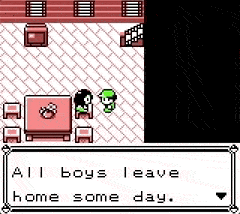
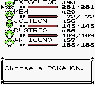

Continuing on from the modifications made to [pokered](https://github.com/pret/pokered) in the [previous post](../2019-01-29-compiling-pokered-using-docker-and-adding-super-b-button-behaviour/index.md), I noticed an interesting unused behaviour in the assembly code.
It appeared to be an unused [debug function](https://github.com/eddmann/pokered/blob/master/engine/debug1.asm) which gives the player [Tsunekazu Ishihara's](https://bulbapedia.bulbagarden.net/wiki/Tsunekazu_Ishihara) favourite Pokémon.
In this post I will document making this function accessible by [talking to Mom](https://github.com/eddmann/pokered/commit/3450a335207c79018c4c157139ad5a6ac2755081) in Pallet Town.

<!--more-->

As most of the assembly code was already present to add this behaviour, all that was required was to update [`scripts/RedsHouse1F.asm`](https://github.com/eddmann/pokered/commit/3450a335207c79018c4c157139ad5a6ac2755081#diff-0e46c8f2965b519c43baed3692896c7b) like so.

```diff
RedsHouse1FText1: ; Mom
  TX_ASM
  ld a, [wd72e]
  bit 3, a
- jr nz, .heal ; if player has received a Pokémon from Oak, heal team
  ld hl, MomWakeUpText
  call PrintText
+ callba SetIshiharaTeam
  jr .done
```

So now, instead of healing any present Pokémon, Mom will instead provide us with Ishihara's team.
To document this change to the player, I updated the text that was presented when talking to Mom within [`text/maps/RedsHouse1F.asm`](https://github.com/eddmann/pokered/commit/3450a335207c79018c4c157139ad5a6ac2755081#diff-b1750b171a232f88acb32643546f5ed3).

```diff
_MomWakeUpText::
  text "MOM: Right."
  line "All boys leave"
  cont "home some day."
  cont "It said so on TV."

- para "PROF.OAK, next"
- line "door, is looking"
- cont "for you."
+ para "Have Ishihara's"
+ line "favourite #MON"
+ cont ""
  done
```

After compiling and booting up the ROM, we can now see the new behaviour in action. 🎉

 
