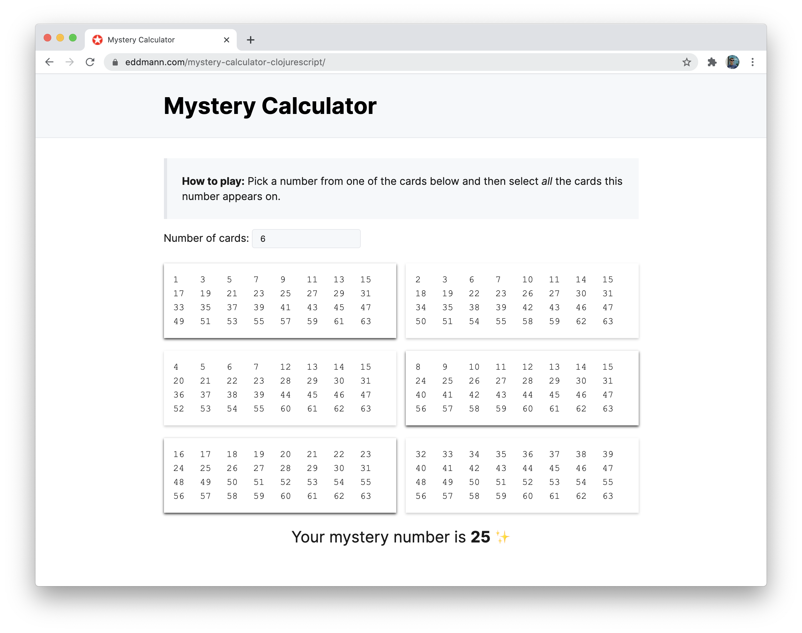

The Mystery Calculator is a commonly found Christmas cracker gift that uses a neat powers-of-two (binary) addition trick to fool the spectator.
I thought it would be interesting to create a small web application in [ClojureScript](https://clojurescript.org/) and [Reagent](http://reagent-project.github.io/) that provides the ability to generate a selection of these cards and perform the trick.

<!--more-->

You can generate a selection of these mystery cards and perform the trick yourself by visiting [here](https://eddmann.com/mystery-calculator-clojurescript/).
The source code is also available on [GitHub](https://github.com/eddmann/mystery-calculator-clojurescript/).

[](https://eddmann.com/mystery-calculator-clojurescript/)

The magic trick is performed as follows:

> The complete set consists of `N` cards, printed with a series of numbers, show all the cards to a friend and ask him or her to select-one number from any one card.
> Show the other `N-1` cards to your friend asking him or her to say whether the number appears on these cards.
> Take all the cards on which your friend says the number appears, add together the top left hand corner number of each card and the total is the number your friend selected.

## How it works

You may notice that all the card numbers can be written in terms of powers of two.
Upon closer inspection, you may also observe that each number can be expressed as a subset (or all) of the numbers present in the top-left-hand corner of each card.

I found it easier to visualise this by replacing the decimal number representation with binary.
If we number all the available cards (from `1` to `N`), you will see that each number on a given card has the corresponding position's bit set to `1`.
This means that we can calculate the mystery number by performing a binary `AND` operation on the top-left-hand corner numbers of all cards which include the chosen number.

For example, say I have picked the mystery number 28 (`11100` in binary).
That number appears on cards 3, 4 and 5 in a conventional 6-card setup.
The top-left-hand corner numbers for these cards are 4 (`00100`), 8 (`01000`) and 16 (`10000`).
If we perform the binary `AND` operation on these numbers, we produce the chosen mystery number 28 (`11100`).
This works for any number chosen from the given cards.

## Building the Mystery Calculator

Now that we are familiar with how it works, we can start by building the functionality that produces these crafted cards based on a desired card count.

```clojure
(defn- generate-cards [num-of-cards]
  (reduce
    (fn [cards number]
      (map-indexed
        #(if (bit-test number %1) (conj %2 number) %2)
        cards))
    (repeat num-of-cards (vector))
    (range 1 (Math/pow 2 num-of-cards))))
```

Using a Lisp, we are able to succinctly express how a card is formed.
First, we produce an exclusive range of all sequential numbers up to two raised to the power of the card count.
For each number and card, we check to see if the given number's bit is set to `1` at that card's position.
For example, for the first card, we would check the first bit; for the second card, the second bit; etc.
In doing this reduction, we eventually construct all the desired cards with the numbers specifically placed.

Now that we can generate these cards, we next want to present them to the user.
To achieve this, I decided to explore using Reagent, which provides an efficient way to create React components using ClojureScript.

```clojure
(defn- display-cards [chosen-cards cards]
  (let [toggle-choice #((if (contains? %1 %2) disj conj) %1 %2)]
    [:div.cards
      (doall
        (for [card cards]
          ^{:key card}
          [:div {:class ["card" (when (contains? @chosen-cards (first card)) "chosen")]
                 :on-click #(swap! chosen-cards toggle-choice (first card))}
            (map (fn [num] ^{:key num} [:span num]) card)]))]))
```

Passing in the generated cards from the previous function and a [state atom](http://reagent-project.github.io/docs/master/reagent.core.html#var-atom) which includes the user's selection, we can present these for React to render using [Hiccup](https://github.com/weavejester/hiccup).
If the user clicks on a card, we will toggle the presence of the card's top-left-hand corner number within the `chosen-cards` state atom.

Finally, we can wire up the application, declaring the two state atoms with default values and displaying the mystery number if a card has been selected.

```clojure
(defn- clamp [x min max]
  (if (< x min) min (if (> x max) max x)))

(defn- app []
  (let [num-of-cards (r/atom 6)
        chosen-cards (r/atom #{})]
    (fn []
      [:div
        [:p
          "Number of cards: "
          [:input {:type "number"
                   :value @num-of-cards
                   :on-change #(reset! num-of-cards (-> % .-target .-value (clamp 4 7)))}]]
        (display-cards chosen-cards (generate-cards @num-of-cards))
        (let [mystery-number (reduce + @chosen-cards)]
          (when (pos? mystery-number)
            [:p.number "Your mystery number is " [:strong mystery-number] " ✨"]))])))

(defn ^:export init []
  (reagent.dom/render [app] (.getElementById js/document "app")))
```

We include a `clamp` function, which is not present in the ClojureScript core.
This provides us with the ability to restrict how many cards can be generated, as this can be an expensive browser operation.

## Deployment

To ease deployment and hosting, I decided to leverage GitHub Actions and GitHub Pages.
Upon a successful Git push, using the provided `Makefile` and Docker-setup, we first compile the application and subsequently release the artifact to the `gh-pages` branch.
This branch is then used to host the web application made available [here](https://eddmann.com/mystery-calculator-clojurescript/).

```yaml
name: Release

on:
  push:
    branches:
      - master

jobs:
  release:
    runs-on: ubuntu-latest
    steps:
      - uses: actions/checkout@v2
      - run: make release
      - uses: JamesIves/github-pages-deploy-action@releases/v3
        with:
          ACCESS_TOKEN: ${{ secrets.ACCESS_TOKEN }}
          BRANCH: gh-pages
          FOLDER: public
```
