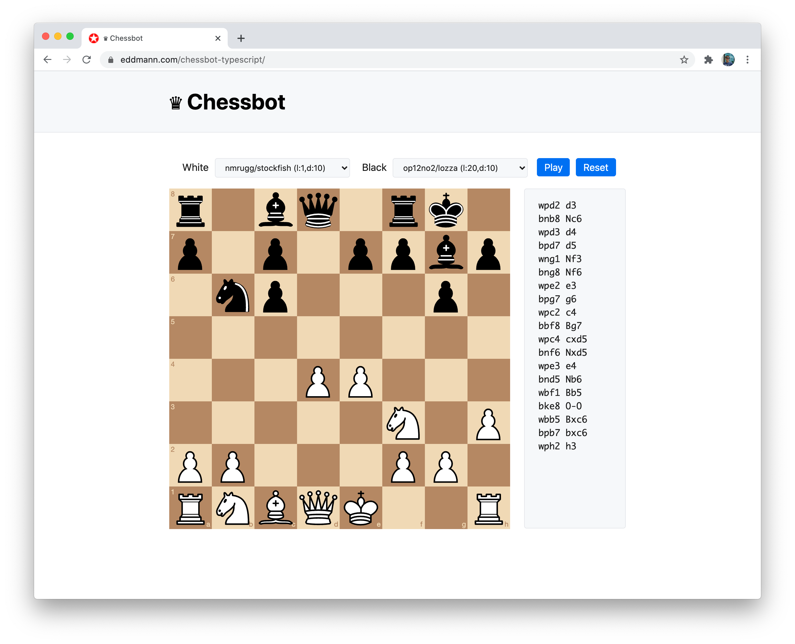
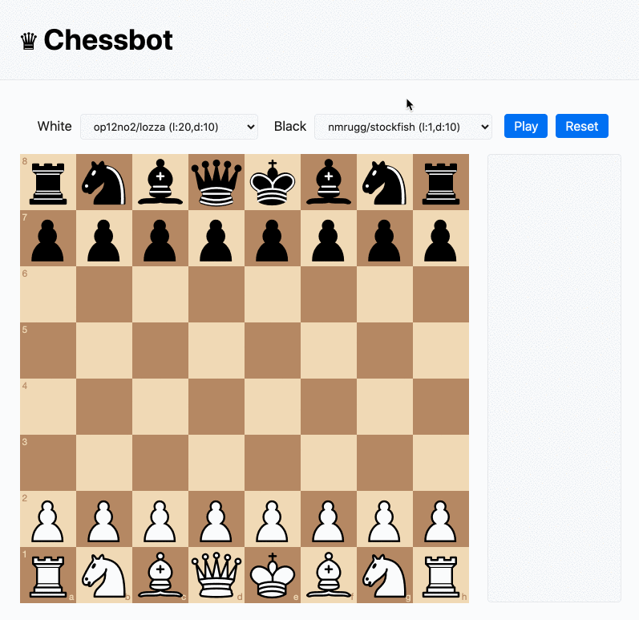

A couple of years ago I explored using a [WebAssembly port](https://github.com/niklasf/stockfish.wasm) of [Stockfish](https://stockfishchess.org/) (the popular Chess engine) as a 'Bot' for a small React-based Chess implementation.
I decided over the past week to revisit it and rewrite the implementation in TypeScript, along with providing more Bot types to choose from.

<!--more-->

You can experiment with the final implementation [here](https://eddmann.com/chessbot-typescript/).
The source code is available on [GitHub](https://github.com/eddmann/chessbot-typescript) to review.

[](https://eddmann.com/chessbot-typescript/)

## The Game Engine

To provide the Chess ruleset I decided to expose a simple wrapper around the popular [jhlywa/chess.js](https://github.com/jhlywa/chess.js) library.
Abstracting away any state present (as the library is class-based) and providing referentially transparent functions meant that I could simplify the client code.
All functions based their decisions on a supplied [Forsyth–Edwards Notation](https://en.wikipedia.org/wiki/Forsyth%E2%80%93Edwards_Notation) (FEN) state of the current game.

I used a TypeScript type-definition that was provided by DefinitelyTyped for the library but noticed an issue in how it was defining the constructor.
Thanks to [Yarn 2 patches](https://yarnpkg.com/cli/patch) I was able to include a [diff](https://github.com/eddmann/chessbot-typescript/blob/master/%40types-chessjs.diff) within my repository that resolved this issue, until it is fixed upstream.

```typescript
import Chess from 'chess.js';
import type { Square, Move, ShortMove } from 'chess.js';

export type Fen = string;
export type GameWinner = 'b' | 'w' | null;
export type { Square, Move, ShortMove };

export const newGame = (): Fen => 'rnbqkbnr/pppppppp/8/8/8/8/PPPPPPPP/RNBQKBNR w KQkq - 0 1';

export const isNewGame = (fen: Fen): boolean => fen === newGame();

export const isBlackTurn = (fen: Fen): boolean => Chess(fen).turn() === 'b';

export const isWhiteTurn = (fen: Fen): boolean => Chess(fen).turn() === 'w';

export const isCheck = (fen: Fen): boolean => Chess(fen).in_check();

export const getGameWinner = (fen: Fen): GameWinner => {
  const game = Chess(fen);
  return game.in_checkmate() ? (game.turn() === 'w' ? 'b' : 'w') : null;
};

export const isGameOver = (fen: Fen): boolean => Chess(fen).game_over();

export const isMoveable = (fen: Fen, from: Square): boolean =>
  new Chess(fen).moves({ square: from }).length > 0;

export const move = (fen: Fen, from: Square, to: Square): [Fen, Move] | null => {
  const game = Chess(fen);
  const action = game.move({ from, to, promotion: 'q' });
  return action ? [game.fen(), action] : null;
};
```

Looking at the engine implementation above you can see that, along with some custom-made types, I also leveraged and exposed several types which were provided by the `chess.js` type-definition.

## The Bots

With the ability to now determine how a game of Chess is played I could then move on to explore how to model the concept of a Bot.
I opted to define a couple of types up-front which expressed the behavioural intent of how a Bot should be initialised and used.

```typescript
import type { Fen, ShortMove } from './engine';

export type UninitialisedBot = () => InitialisedBot;
export type InitialisedBot = (fen: Fen) => Promise<ShortMove>;
export type AvailableBots = Record<string, UninitialisedBot>;
```

Using these types I was able to implement the first example Bot – that being the trivial Random Bot.
Given a supplied FEN it determines all the available legal moves and then randomly picks one to enact.

```typescript
const randomMove: UninitialisedBot = () => fen =>
  new Promise(resolve => {
    const moves = Chess(fen).moves({ verbose: true });
    const { from, to } = moves[Math.floor(Math.random() * moves.length)];
    setTimeout(() => resolve({ from, to }), 500);
  });
```

For client-based visual considerations I set a small delay before resolving the Promise.
This gives the impression of the Bot 'doing work' to make the decision.
With this bot now available, I moved on to expressing externally provided Bots.
Using [Web Workers](https://developer.mozilla.org/en-US/docs/Web/API/Web_Workers_API/Using_web_workers) and the [Universal Chess Interface](https://en.wikipedia.org/wiki/Universal_Chess_Interface) (UCI) I found it possible to interface with several different JavaScript/WASM-based Chess Bots.
The code executed in the Web Worker was either JavaScript-based in the case of [op12no2/lozza](https://github.com/op12no2/lozza) or WASM-based in the case of the Stockfish-port [nmrugg/stockfish.js](https://github.com/nmrugg/stockfish.js/).

```typescript
const uciWorker = (file: string, actions: Array<string>): UninitialisedBot => () => {
  const worker = new Worker(file);

  let resolver: ((move: ShortMove) => void) | null = null;

  worker.addEventListener('message', e => {
    const move = e.data.match(/^bestmove\s([a-h][1-8])([a-h][1-8])/);
    if (move && resolver) {
      resolver({ from: move[1], to: move[2] });
      resolver = null;
    }
  });

  return fen =>
    new Promise((resolve, reject) => {
      if (resolver) {
        reject('Pending move is present');
        return;
      }

      resolver = resolve;
      worker.postMessage(`position fen ${fen}`);
      actions.forEach(action => worker.postMessage(action));
    });
};
```

Providing the above abstraction allowed me to define many different external Bots and configurations (levels and depths).
It also paves the way for extension to any other Bot that supports the UCI protocol in the future.
Converting the Web Worker message-based system into a Promise was an interesting exercise.
Harnessing the power of closures, I needed to keep a reference to the current `resolve` function.
Upon the `bestmove` Bot response I could then resolve the given Promise.

Finally, these Bots could be exposed for use within the React Chess implementation like so.

```typescript
const Bots: AvailableBots = {
  Random: randomMove,
  'nmrugg/stockfish (l:1,d:10)': uciWorker('bots/stockfish.js-10.0.2/stockfish.js', [
    'setoption name Skill Level value 1',
    'go depth 10',
  ]),
  'nmrugg/stockfish (l:20,d:10)': uciWorker('bots/stockfish.js-10.0.2/stockfish.js', [
    'setoption name Skill Level value 20',
    'go depth 10',
  ]),
  'nmrugg/stockfish (l:20,t:1s)': uciWorker('bots/stockfish.js-10.0.2/stockfish.js', [
    'setoption name Skill Level value 20',
    'go movetime 1000',
  ]),
  'op12no2/lozza (l:1,d:10)': uciWorker('bots/lozza-1.18/lozza.js', [
    'setoption name Skill Level value 1',
    'go depth 10',
  ]),
  'op12no2/lozza (l:20,d:10)': uciWorker('bots/lozza-1.18/lozza.js', [
    'setoption name Skill Level value 20',
    'go depth 10',
  ]),
  'op12no2/lozza (l:20,t:1s)': uciWorker('bots/lozza-1.18/lozza.js', [
    'setoption name Skill Level value 20',
    'go movetime 1000',
  ]),
};
```

## The React Interface

The game interface itself leverages the [willb335/chessboardjsx](https://github.com/willb335/chessboardjsx) React component to provide the Chessboard implementation.
I also use a typed [CSS Modules Stylesheet](https://create-react-app.dev/docs/adding-a-css-modules-stylesheet/) to cleanly separate out the desired client-side styling concerns.
The user is able to specify whether each player is user-based or Bot-based, and if Bot-based which configuration they would like to use.

The `BotSelector` below provides a simple component which achieves this goal.
Upon selection an initialised Bot is passed back to the parent component via a `setSelectedBot` function invocation.

```typescript
const BotSelector: React.FC<{
  playerName: string;
  availableBots: AvailableBots;
  selectedBot: SelectedBot;
  setSelectedBot: (bot: SelectedBot) => void;
  disabled: boolean;
}> = ({ playerName, availableBots, selectedBot, setSelectedBot, disabled }) => {
  const handleChange = (e: ChangeEvent<HTMLSelectElement>): void => {
    const name = e.target.value;
    setSelectedBot(name ? { name, move: availableBots[name]() } : null);
  };

  return (
    <div className={styles.BotSelector}>
      <label>{playerName}</label>
      <select value={selectedBot?.name} onChange={handleChange} disabled={disabled}>
        <option value="" key="User">
          User
        </option>
        {Object.keys(availableBots).map(name => (
          <option key={name}>{name}</option>
        ))}
      </select>
    </div>
  );
};
```

So as to recount the game's previous moves, I also provided the concept of a `History` listing.
This includes all the previous moves in [Portable Game Notation](https://en.wikipedia.org/wiki/Portable_Game_Notation) (PGN) form.

```typescript
const History: React.FC<{ history: Array<engine.Move> }> = ({ history }) => {
  const endRef = useRef<HTMLDivElement>(null);

  useEffect(() => {
    endRef.current?.scrollIntoView();
  }, [history]);

  return (
    <pre className={styles.History}>
      {history.map(({ color, piece, from, san }) => `${color}${piece}${from} ${san}`).join('\n')}
      <div ref={endRef} />
    </pre>
  );
};
```

Using an empty `div` HTML reference I was able to ensure that the listing was pinned to the bottom at all times.
The provided effect ensured that we only attempted to interact with the DOM and scroll the HTML element when the supplied history had changed.

Finally, we could incorporate these two components into the React interface itself.
Storing the game state and Bot selection choices in this manner allowed me to harness a single effect to invoke any Bot moves and to determine if the game had completed.

```typescript
const App: React.FC<{
  bots: AvailableBots;
  onGameCompleted: (winner: engine.GameWinner) => void;
}> = ({ bots, onGameCompleted }) => {
  const [isPlaying, setPlaying] = useState<boolean>(false);
  const [fen, setFen] = useState<engine.Fen>(engine.newGame);
  const [history, setHistory] = useState<Array<engine.Move>>([]);
  const [whiteBot, setWhiteBot] = useState<SelectedBot>(null);
  const [blackBot, setBlackBot] = useState<SelectedBot>(null);

  const newGame = () => {
    setPlaying(false);
    setFen(engine.newGame);
    setHistory([]);
  };

  const doMove = useCallback(
    (fen: engine.Fen, from: engine.Square, to: engine.Square) => {
      const move = engine.move(fen, from, to);

      if (!move) {
        return;
      }

      const [newFen, action] = move;

      if (engine.isGameOver(newFen)) {
        onGameCompleted(engine.getGameWinner(newFen));
        newGame();
        return;
      }

      setFen(newFen);
      setHistory(history => [...history, action]);
    },
    [onGameCompleted]
  );

  const onDragStart = ({ sourceSquare: from }: Pick<BoardMove, 'sourceSquare'>) => {
    const isWhiteBotTurn = whiteBot && engine.isWhiteTurn(fen);
    const isBlackBotTurn = blackBot && engine.isBlackTurn(fen);

    return isPlaying && engine.isMoveable(fen, from) && !(isWhiteBotTurn || isBlackBotTurn);
  };

  const onMovePiece = ({ sourceSquare: from, targetSquare: to }: BoardMove) => {
    doMove(fen, from, to);
  };

  useEffect(() => {
    if (!isPlaying) {
      return;
    }

    let isBotMovePlayable = true;

    if (whiteBot && engine.isWhiteTurn(fen)) {
      whiteBot.move(fen).then(({ from, to }: engine.ShortMove) => {
        if (isBotMovePlayable) doMove(fen, from, to);
      });
    }

    if (blackBot && engine.isBlackTurn(fen)) {
      blackBot.move(fen).then(({ from, to }: engine.ShortMove) => {
        if (isBotMovePlayable) doMove(fen, from, to);
      });
    }

    return () => {
      isBotMovePlayable = false;
    };
  }, [isPlaying, fen, whiteBot, blackBot, doMove]);

  return (
    <div className={styles.App}>
      <header>
        <h1>♛ Chessbot</h1>
      </header>
      <div className={styles.TopNav}>
        <BotSelector
          playerName="White"
          availableBots={bots}
          selectedBot={whiteBot}
          setSelectedBot={setWhiteBot}
          disabled={isPlaying}
        />
        <BotSelector
          playerName="Black"
          availableBots={bots}
          selectedBot={blackBot}
          setSelectedBot={setBlackBot}
          disabled={isPlaying}
        />
        <button className={styles.Button} onClick={() => setPlaying(playing => !playing)}>
          {isPlaying ? 'Pause' : 'Play'}
        </button>
        <button className={styles.Button} onClick={newGame}>
          Reset
        </button>
      </div>
      <div className={styles.Chessboard}>
        <Chessboard position={fen} allowDrag={onDragStart} onDrop={onMovePiece} />
      </div>
      <History history={history} />
    </div>
  );
};
```

Wrapping the `doMove` in a Callback hook ensured that the game effect was not needlessly invoked upon render unless the game state or `onGameCompleted` callback had changed.
I also provided some clean-up in the way that if the game had changed in-between requesting a Bot move, we would discard the previous move, thus ensuring that the game maintained a valid state.

## Conclusion

I found this small project to be a very valuable exercise in exploring what is possible using TypeScript and React Hooks.
It also provided me with a good opportunity to explore Yarn 2 and [Zero-installs](https://yarnpkg.com/features/zero-installs).
I enjoyed creating the abstraction around the concept of a UCI-based Bot, paving the way for additional Bots to be added in the future.

Going forward it would be interesting to explore providing more than just the current FEN chess state to the given Bot.
At this time I am treating all Bots as stateless.
It would be good to explore making them aware of historical moves, as this would help aid in their decision making and prevent them from attempting repeated moves over a certain threshold.

Happy Chess Playing!

[](https://eddmann.com/chessbot-typescript/)
