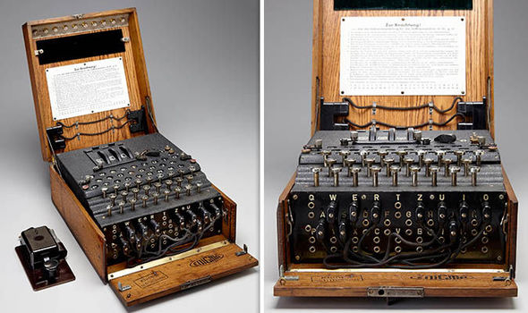

The Enigma Machine is a typewriter-sized substitution encryption device used by Germany in World War 2.
It was so important to the war-time efforts that work carried out by Alan Turing at Bletchley Park to decode the resulting ciphers helped end the war.
For years I have been fascinated by this device, and I thought it would be interesting to explore implementing a web-based Enigma Machine using ClojureScript.
I also thought it would be a great opportunity to explore how I can use property-based testing to help garner confidence from the resulting implementation.

<!--more-->

You can experiment with the final implementation [here](https://eddmann.com/enigma-machine-clojurescript/).
The source code is available in its entirety on [GitHub](https://github.com/eddmann/enigma-machine-clojurescript) to review.

[](https://eddmann.com/enigma-machine-clojurescript/)

## How it works

At its most basic (as many variations appeared over the years) the machine is composed of a Keyboard, Lamp Board, three Rotors, a Reflector and a Plugboard (as pictured below).
Using a pre-shared machine configuration (Wheel order, Ring settings and Plug connections), when an operator presses a key on the Keyboard, a seemingly random letter illuminates on the Lamp Board.
With these key presses forming a desired message, the resulting cipher is then sent via an agreed (often insecure) channel to interested parties.
Using a similarly configured Enigma Machine, the recipient is able to follow the same process as the sender, except upon each key press the original message letter will illuminate on the Lamp Board.
With the combination of the Rotors, Reflector and Plugboard, there are a staggering _158,962,555,217,826,360,000_ paths a letter can take to be substituted!



I will defer to [these](https://hackaday.com/2017/08/22/the-enigma-enigma-how-the-enigma-machine-worked/) [great](https://www.youtube.com/watch?v=G2_Q9FoD-oQ) [resources](https://www.youtube.com/watch?v=ASfAPOiq_eQ) which I found very useful in helping to elaborate on the inner workings of the Enigma Machine.
With a basic understanding of how the machine works in place, we can now move on to modelling this behaviour in code.

## The Machine

We will begin with what I feel is the heart of the Enigma Machine: the stepped Rotors.
Comprised of three connected Rotors, the wiring corresponding to the pressed key forms a circuit based on the current positioning of the Rotors.
Within code, we are able to represent this as _hash-map_ like data structures, where we rotate the given Rotor based on a specified _step_ letter and position within the Rotor collection.

```clojure
(def ^:private alphabet (seq "ABCDEFGHIJKLMNOPQRSTUVWXYZ"))

(def rotors
  {:I   {:out  (seq "EKMFLGDQVZNTOWYHXUSPAIBRCJ")
         :in   alphabet
         :step \Q},
   :II  {:out  (seq "AJDKSIRUXBLHWTMCQGZNPYFVOE")
         :in   alphabet
         :step \E}
   :III {:out  (seq "BDFHJLCPRTXVZNYEIWGAKMUSQO")
         :in   alphabet
         :step \V}})

(defn- step? [rotor]
  (= (:step rotor) (first (:in rotor))))

(defn- rotate-rotor [rotor]
  (let [rotate #(concat (rest %) [(first %)])]
    (-> rotor
        (update :in rotate)
        (update :out rotate))))

(defn- rotate-rotors [[one two three]]
  (let [step-one? (step? one)
        step-two? (step? two)]
    [(rotate-rotor one)
     (if (or step-one? step-two?) (rotate-rotor two) two)
     (if step-two? (rotate-rotor three) three)]))

(defn- passthrough-rotors [rotors letter]
  (reduce
   (fn [letter rotor]
     (->> letter
          (get (zipmap alphabet (:out rotor)))
          (get (zipmap (:in rotor) alphabet))))
   letter
   rotors))
```

Using the above code, we define three of the original Rotors (with the scrambled wiring represented as `in` and `out`), providing the behaviour necessary to rotate and pass a letter through the given Rotor collection.
With the use of _hash-maps_, we are able to clearly see how the machine used substitution to form the resulting cipher.

To complete the circuit and send the current back through the (inverted) Rotors, we use a supplied Reflector.
These use simple static substitutions which can be represented as _hash-maps_ like so.

```clojure
(def reflectors
  {:A (zipmap alphabet (seq "EJMZALYXVBWFCRQUONTSPIKHGD"))
   :B (zipmap alphabet (seq "YRUHQSLDPXNGOKMIEBFZCWVJAT"))
   :C (zipmap alphabet (seq "FVPJIAOYEDRZXWGCTKUQSBNMHL"))})
```

From here, we can now succinctly declare how a chosen letter (key press) traverses through the machine and is returned as a cipher to the operator.

```clojure
(defn- invert-rotor [rotor]
  {:in   (:out rotor),
   :out  (:in rotor),
   :step (:step rotor)})

(defn- encode-letter [{:keys [rotors reflector plugboard]} letter]
  (let [plug            #(get plugboard % %),
        reflect         #(get reflector %)
        inverted-rotors (reverse (map invert-rotor rotors))]
    (->> letter
         plug
         (passthrough-rotors rotors)
         reflect
         (passthrough-rotors inverted-rotors)
         plug)))
```

You can see how we thread the letter through the Plugboard, passing up and down the currently configured Rotors (by way of the Reflector) and then through the Plugboard to attain the resulting cipher letter.
We will soon be able to use this function to iteratively produce a cipher of an entire message.
Before we do this, however, as explained at the beginning of this post, we need a means of configuring the machine based on an agreed‐upon setup.
This is achieved using the code below.

```clojure
(defn- setup-plugboard [plugboard]
  (merge plugboard (map-invert plugboard)))

(defn- setup-rotors [rotors positions]
  (letfn
   [(setup-rotor [rotor position]
      (if (= (first (:in rotor)) position)
        rotor
        (recur (rotate-rotor rotor) position)))]
    (map setup-rotor rotors (seq positions))))

(defn- setup-machine [machine]
  (-> machine
      (update :plugboard setup-plugboard)
      (update :rotors setup-rotors (:positions machine "AAA"))
      (assoc :cipher [])))
```

With the assumption of the client code supplying us a desired machine setup, we are able to internally configure the starting positions of the chosen Rotors and the Plugboard mapping for use with encoding and decoding a message.
Finally, based on a supplied machine configuration (which has been set up using the code above), we are able to _reduce_ the message into its cipher counterpart.

```clojure
(defn encode-message [machine message]
  (->> (seq message)
       (reduce
        (fn [machine letter]
          (let [machine (update machine :rotors rotate-rotors)]
            (update machine :cipher #(conj % (encode-letter machine letter)))))
        (setup-machine machine))
       :cipher
       (apply str)))
```

## Testing

Now that we have modelled the behaviour of the machine, we can assert its correctness by testing the _public API_, the `encode-message` function.
We will first do this by performing a couple of basic assertions which centre around the inclusion and exclusion of a Plugboard mapping.

```clojure
(deftest encode-message-with-empty-plugboard
  (is
   (= "ILBDAAMTAZ"
      (encode-message
       {:rotors    [(:III rotors) (:II rotors) (:I rotors)]
        :positions "AAA"
        :reflector (:B reflectors)
        :plugboard {}}
       "HELLOWORLD"))))

(deftest encode-message-with-plugboard
  (is
   (= "ILADBBMTBZ"
      (encode-message
       {:rotors    [(:III rotors) (:II rotors) (:I rotors)]
        :positions "AAA"
        :reflector (:B reflectors)
        :plugboard {\A \B}}
       "HELLOWORLD"))))
```

We could expand upon this test-suite greatly, but fundamentally, with each test being static (example-based), there could be no end to the possible tests we could write.
Based on this reasoning, I thought it would be a very interesting exercise to employ _property-based testing_ to help garner ever-increasing confidence in our implementation.
This form of testing methodology can be described as:

> Property-based tests are designed to test the aspects of a property that should always be true.
> They allow for a range of inputs to be programmed and tested within a single test, rather than having to write a different test for every value that you want to test.

With this in mind, there are a couple of distinct properties that, regardless of what machine setup or message we provide, should always hold true.
Using the [spec](https://clojure.org/guides/spec) library (which was inspired by [QuickCheck](https://hackage.haskell.org/package/QuickCheck)), we are able to model two of these properties like so.

```clojure
(def gen-char-upper-alpha
  (gen/fmap char (gen/choose 65 90)))

(def gen-string-upper-alpa
  (gen/fmap clojure.string/join (gen/vector gen-char-upper-alpha)))

(def gen-machine
  (gen/hash-map :rotors (-> (vals rotors) gen/elements (gen/vector 3))
                :positions (gen/fmap clojure.string/join (gen/vector gen-char-upper-alpha 3))
                :reflector (-> (vals reflectors) gen/elements)
                :plugboard (->> (gen/vector-distinct gen-char-upper-alpha {:min-elements 0 :max-elements 26})
                                (gen/fmap #(if (odd? (count %)) (rest %) %))
                                (gen/fmap #(apply hash-map %)))))

(defspec cipher-is-same-length-as-message
  (prop/for-all [machine gen-machine
                 message gen-string-upper-alpa]
    (let [cipher (encode-message machine message)]
      (= (count message) (count cipher)))))

(defspec encoded-cipher-matches-message
  (prop/for-all [machine gen-machine
                 message gen-string-upper-alpa]
    (let [cipher (encode-message machine message)]
      (= message (encode-message machine cipher)))))
```

Providing a means of producing a valid, randomly generated machine configuration, we can assert that for any given instance, the cipher message should be the same length as the plain-text message, and we should be able to encode and decode the cipher message to the original plain-text message.
We can now leave it up to the _spec_ library to produce a large random selection of valid machine configurations and ensure the correctness of our propositions, garnering ever more confidence in the code upon each test run.
One of the true powers of this testing approach is that if a property does not hold true for a given test assertion, the library is able to shrink the input down as best it can to the problem input.

## The User Interface

Having modelled and verified the correctness of the machine behaviour, we can move on to providing the client with a user interface.
For this, we will be using [Reagent](https://reagent-project.github.io/), which provides ClojureScript bindings for the React library.
So as not to overload this post with code, I have decided to intentionally omit going through the client implementation in the step-by-step fashion as done above.
Instead, I invite you to head over to the [`app.cljs`](https://github.com/eddmann/enigma-machine-clojurescript/blob/master/src/enigma_machine/app.cljs) implementation, which describes how we use Reagent to interact with our machine implementation.
Below, you will see how we combine all the child input components declared in `app.cljs` into the stateful parent component which is rendered to the DOM.

```clojure
(defn- app []
  (let [rotors    [(r/atom "III") (r/atom "II") (r/atom "I")]
        reflector (r/atom "B")
        plugboard (r/atom "")
        positions (r/atom "AAA")
        message   (r/atom "HELLOWORLD")
        cipher    (r/atom "ILBDAAMTAZ")
        encode    (fn []
                    (machine/encode-message
                     {:rotors    (map #((keyword @%) machine/rotors) rotors)
                      :positions @positions
                      :reflector ((keyword @reflector) machine/reflectors)
                      :plugboard (apply hash-map (seq (clojure.string/replace @plugboard " " "")))}
                     @message))]
    (fn []
      [:div
       [:div
        {:class "columns"}
        (doall (map-indexed select-rotor rotors))]
       [:div
        {:class "columns"}
        (select-reflector reflector)
        (positions-input positions)
        (plugboard-input plugboard)]
       (message-textarea message)
       [:button {:on-click #(reset! cipher (encode))} "Encode"]
       [:pre @cipher]])))
```

Making use of [Reagent Atoms](http://reagent-project.github.io/docs/master/reagent.ratom.html), we are able to statefully store the user's intended configuration and invoke the `encode-message` function when required.

## Conclusion

I found modelling this solution in a Lisp using ClojureScript to be very enjoyable.
Looking back over the code, I find it amazing how a Lisp is able to so succinctly and elegantly document the behaviour of the machine.
The more I developed the solution to this problem space, the more I felt the functional approach mapped so well.
Being able to explore property-based testing in this fashion was a great experience, and it demonstrated how well it can fit into various aspects of the everyday programming challenges we solve.
