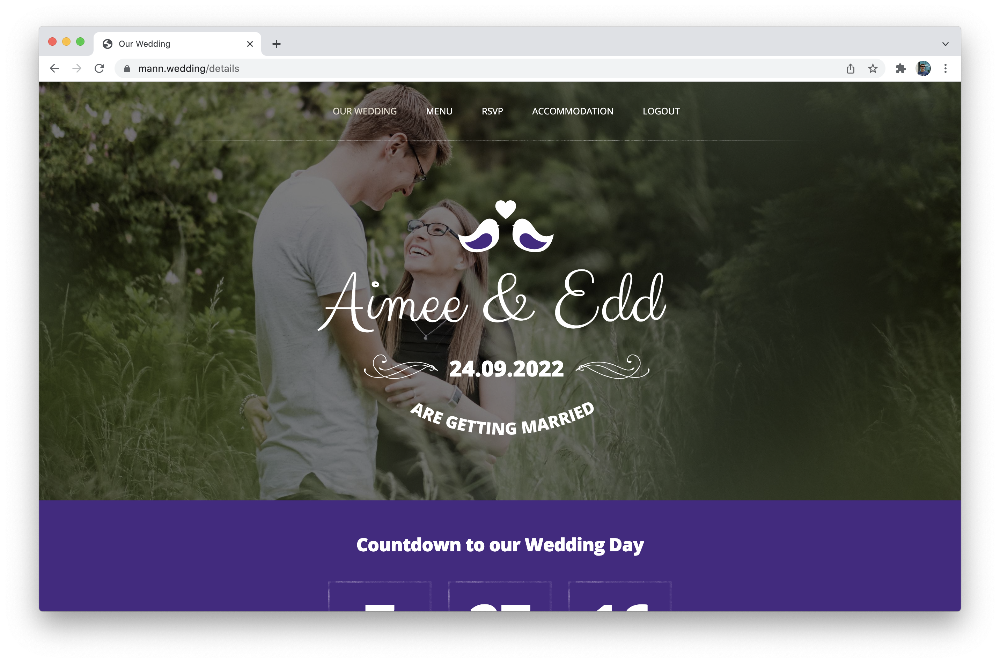
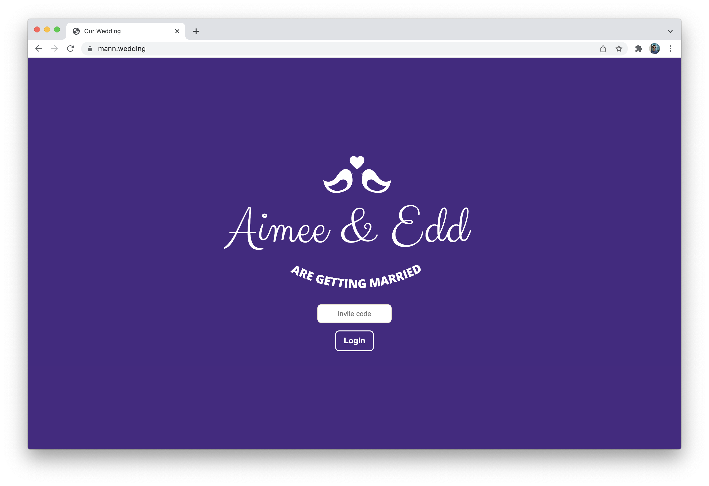
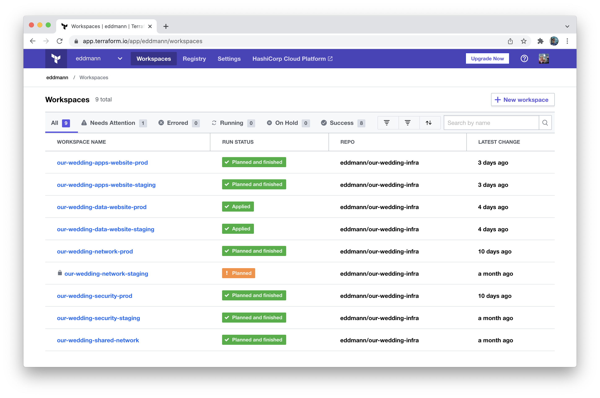

Like many developers, over-engineering personal projects in the spirit of learning is something I am well aware of doing.
So, when it came time to decide how we were going to collect RSVPs for our upcoming wedding, I already had ideas.
What resulted was a solution that follows DDD, CQRS, Hexagonal Architecture, Event Sourcing, and is deployed on AWS Lambda using PHP.

<!--more-->

## How We Got Here...

The initial idea was formed back in late 2019, where I had been very interested in exploring new concepts (DDD, ES, CQRS) and tooling (Containerisation) within a single project.
Based on some great resources ([EventSourcery](https://eventsourcery.com/) in particular), I was able to architect a system that followed DDD principles, applying ES and CQRS, based on PHP, PostgreSQL, and Symfony.
Furthermore, the original system was deployed within a Kubernetes environment (with a [small dose](https://github.com/eddmann/aws-k8s-cluster-terraform) of Terraform), with images being packaged and shipped within a GitLab CI pipeline.
With everything in place, the website went live, and the invites were sent out... then COVID happened.
Due to the pandemic, we opted to delay our wedding date (several times), finally settling on this upcoming summer 🤞.
This meant that the original system would lay dormant for almost several years!

During the past several years, however, much has happened - one of the biggest being the opportunity to develop a [brand-new insurance product](https://mybuilder-plus.com/) at MyBuilder.
Due to the nature of the business and coupled with a rich domain to model, we decided to apply DDD and ES.
It was throughout this time that I was able to take ideas and tooling initially formed within this wedding website and gain experience applying them at a large production level.
Another interesting piece to the puzzle was that we were targeting deployment to AWS Lambda, making heavy use of Terraform in the process.

## The Now

Fast-forward to late 2021, we were now at a stage where we could finally send out new invites, and this meant dusting off the old website!
Again, like many developers, I could not simply deploy a personal project that I had written almost two years prior.
Instead, with the experience I had now garnered by applying these concepts and tooling in a production setting, I was able to rewrite the website and infrastructure from the ground up.
A significant change was the transition to deploying to AWS Lambda and harnessing many different AWS services in the process.
At MyBuilder, we had great joy in using Terraform Cloud to handle provisioning our infrastructure, and this was now reflected in the revised implementation.

Throughout the past several years, I have found it useful to reference a bare-bones implementation of the concepts and tooling put in place by way of the wedding website when experimenting and onboarding new people to related projects at MyBuilder.
I never did open-source the code for the original website, but I felt that it would be great to have an accessible, documented reference implementation of the learnings I have gained.
As such, I settled on initially publishing an overview of the project (what you are reading now) and the two repositories that make up the system.
The two repositories include relevant READMEs surrounding core concepts and principles applied, with accompanying diagrams that help explain key elements.

## The Application

The [application](https://github.com/eddmann/our-wedding-website) itself models a basic domain that handles returning RSVPs for wedding invitations sent out.
It includes the ability to log in (via a supplied invite code) and select attendance/food choices based on whether you are a day or evening guest.
Furthermore, there is an admin backend that allows us to review guest responses, and email notifications are sent out when an invite has been submitted.
There is just enough complexity (although a CRUD system would have probably sufficed 😬) within this desired behaviour to demonstrate all the concepts and principles put in place.

The system applies Event Sourcing to persist (and project) application state, with the domain modelled following Domain-Driven Design principles.
The application conforms to the Hexagonal Architecture (Domain, Application, Infrastructure, and UI layering), with interaction with the Domain being constrained to CQRS.
There are three distinct message buses: one for dispatching Commands, one for emitting Aggregate Events, and another for emitting Domain Events.

From an implementation point of view, the application is built using PHP 8.1, Symfony 5.4, and associated Symfony components (Symfony Messenger, Webpack Encore, etc.).
It uses Deptrac to ensure adherence to the strict Hexagonal architectural layering boundaries imposed, Psalm to provide static type-checking support, and PHPUnit to validate the desired behaviour has been implemented.
The testing strategy employed has been documented within the [project's README](https://github.com/eddmann/our-wedding-website#testing) and closely resembles the layering employed within the application itself.

## The Infrastructure

From an [infrastructure](https://github.com/eddmann/our-wedding-infra) perspective, the service is provisioned using a combination of Terraform (Cloud) and Serverless Framework, targeting AWS as the cloud provider.
The application is hosted on AWS Lambda, with transient infrastructure (which changes based on each deployment), such as functions/API gateways, being provisioned at the application repository level using the Serverless Framework.
Foundational infrastructure concerns (such as networking, databases, queues, etc.) are provisioned using Terraform within the infrastructure repository, with a separation between stage environment and shared concerns.

Sharing between Terraform and Serverless Framework is unidirectional, with the application resources that Serverless Framework creates being built upon the foundation that Terraform resources provision.
Parameters, secrets, and shared resources controlled by Terraform are accessible to this application via SSM parameters and Secrets Manager secrets, providing clear responsibility separation.

Local development is managed by Docker, with a Makefile used to help coordinate common tasks.
The general philosophy employed is that there should be parity between actions carried out within CI (now using GitHub Actions) and local development.
This can be seen by reviewing the [test CI workflow](https://github.com/eddmann/our-wedding-website/blob/main/.github/workflows/test.yml), which delegates to the `can-publish` Makefile target to assert correctness; the same action can be taken within local development without any changes.
In doing this, consistency is maintained and eliminates any surprises that could occur when merging changes into the service.

## What's Next

With the project now released, I hope that, in time to come, I will have the opportunity to deep dive and write about specific design and tooling aspects related to the system further.
Until then, however, if you want to find out more, be sure to check out the [two](https://github.com/eddmann/our-wedding-website) [repositories](https://github.com/eddmann/our-wedding-infra), along with accompanying READMEs that provide more detail.
