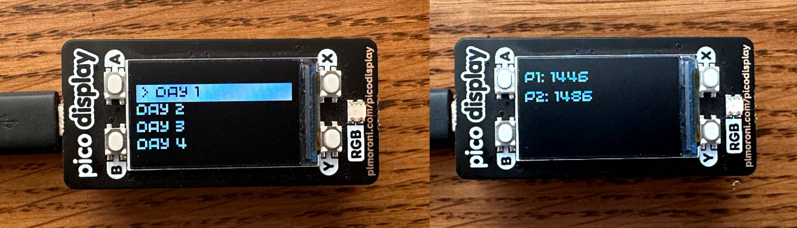

Over the past year or so, I have been interested in microcontrollers and finding ways I can look to [use them](../../2021/2021-10-20-building-a-2fa-totp-generator-using-a-raspberry-pi-pico-and-micropython/index.md) within personal projects.
Having just completed the [Advent of Code 2021](../2022-05-30-solving-the-advent-of-code-2021-calendar-using-c-in-under-half-a-second/index.md) calendar in C, I thought it would be interesting to see how many of these solutions I could get to run on the constrained hardware of a Raspberry Pi Pico.
In this article, I will discuss how I went about achieving this, presenting the solutions' answers on a [Pimoroni Display](https://shop.pimoroni.com/products/pico-display-pack?variant=32368664215635) via an interactive menu (with paging).

<!--more-->



## Proof of Concept

Along with the MicroPython support, which I have [documented my experiences](../../2021/2021-10-20-building-a-2fa-totp-generator-using-a-raspberry-pi-pico-and-micropython/index.md) with in the past, the Raspberry Pi Pico has an [official SDK](https://github.com/raspberrypi/pico-sdk) providing support to compile and target the RP2040 in C, C++, and Assembly.
I decided to use a pre-built [Docker image](https://github.com/xingrz/rpi-pico-builder) that included all the required dependencies to provide a deterministic environment to achieve this (regardless of host operating system).
With the build environment in place, I could now begin work on how I was going to compile each solution for execution on the microcontroller.
I initially used the SDK (in C) to compile several individual solutions (to the required UF2 format), printing the results via the serial interface.
This provided me with confidence that at least some of the solutions would work!

## Putting it all together

From here, I explored how I could interact with the Pimoroni Display within C.
It looked as though the [library](https://github.com/pimoroni/pimoroni-pico/tree/main/libraries/pico_display) was written in C++, and as such, I opted to write the delivery application, which handled the paged menu and displayed the solutions' answers in C++.
To link the library with this delivery application, I tweaked the CMake configuration.

After building out the menu functionality, I used C++'s ability to interoperate with C to begin including the solutions (and inputs).
I built a macro that removed some of the repetitive code required to execute and present each solution on the display.
Within the CMake configuration, I added the custom C compilation options (targeting C11 and optimisation flags) that I had used within the CLI variant.
Below is the CMake configuration used within the project, highlighting how the solutions and display library are linked into the deliverable:

```cmake
cmake_minimum_required(VERSION 3.12)

include(pico_sdk_import.cmake)

project(aoc2021)

set(c_flags -std=gnu11 -O2 -Wall)
add_compile_options("$<$<COMPILE_LANGUAGE:C>:${c_flags}>")
add_compile_definitions(AOC_PICO)

pico_sdk_init()

file(GLOB_RECURSE SOLUTIONS RELATIVE ${CMAKE_SOURCE_DIR} "../day*/solution.c" "../shared/dynarray.c")
add_executable(
  aoc2021
  aoc2021.cpp
  ${SOLUTIONS}
  display/pico_display.cpp
  display/pico_graphics.cpp
  display/st7789.cpp
  display/types.cpp
)

target_link_libraries(aoc2021 pico_stdlib hardware_spi hardware_pwm hardware_dma)
pico_add_extra_outputs(aoc2021)
```

With all this in place, I compiled the calendar's solutions into a single UF2 and flashed it onto the Raspberry Pi Pico for testing.
I was surprised to find that 12 out of the 25 original solutions worked with no modification!
This was a lot more than I was expecting, as I had optimised these solutions for speed and not memory usage, of which the microcontroller was far more constrained.
Below, you can see a video demonstrating how the paged menu system works, along with executing several solutions:



## Conclusion

I was pleasantly surprised to find out how many of the solutions worked with no changes.
I also enjoyed experimenting with compiling programs for the RP2040 using a combination of C and C++.
However, I do find it to be a more lengthy setup process than my experience developing for the ESP32 using the Arduino IDE.
Now that I have built out this deliverable, I would like to explore attempting to optimise more of the solutions and get them working.
