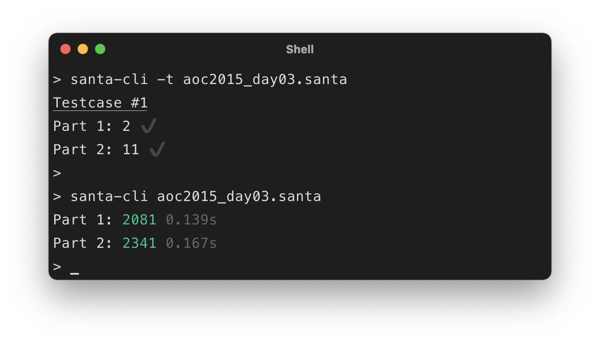
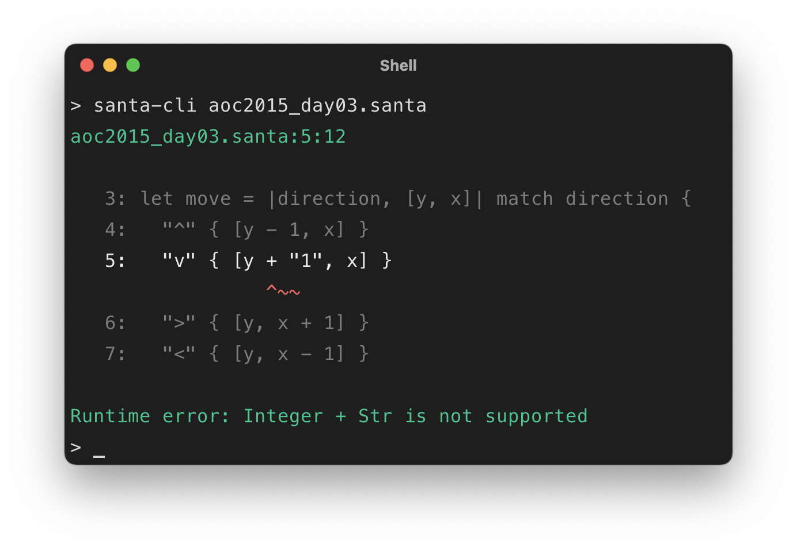
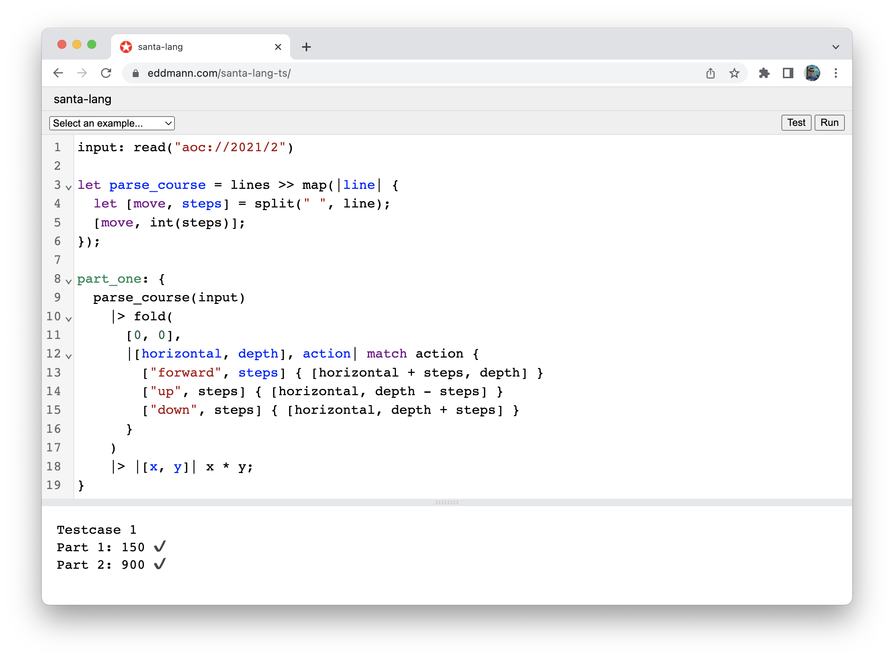

Over the past several years, I have been slowly working [my](https://github.com/eddmann/advent-of-code/tree/master/2015) [way](https://github.com/eddmann/advent-of-code/tree/master/2016/python) [through](https://github.com/eddmann/advent-of-code/tree/master/2017/rust) the previous Advent of Code calendars.
For each calendar, I opt to solve the puzzles in a new programming language to familiarise myself with other ways of understanding and working.
However, there comes a time in each calendar when I grow to dislike some aspect of the language.
So I had an idea... why not give this whole programming language design a go?
That way, if I grow to dislike the language, I only have myself to blame!

<!--more-->

[](https://github.com/eddmann/santa-lang-ts)

Welcome _santa-lang_, my [tree-walking interpreted](<https://en.wikipedia.org/wiki/Interpreter_(computing)>) programming language designed to help tackle Advent of Code puzzles.
In this article, I would like to discuss the high-level thought process and design considerations that went into building the initial language.

## The Design Specification

The first step I took was to clearly lay out the overall design goals of the language.
Having done a little research into how other languages had been formed and continued to grow, it seemed that the underlying core values and design principles shaped each new decision.
As such, I decided to compile a list of my desired direction and feature set for a language that would best help me solve Advent of Code puzzles.

### The Language

- Dynamically typed, C-like language with a rich suite of core types: integers, decimals, strings, lists, hash maps, and sets.
- [Persistent (Immutable) data structures](https://en.wikipedia.org/wiki/Persistent_data_structure), which follow the same value semantics as integers, decimals, and strings.
- Cheap function/closure definition, composition, and invocation - aided by the inclusion of [auto-currying](https://en.wikipedia.org/wiki/Currying).
- Everything is a function, with infix invocation being purely syntactic sugar, i.e., `1 + 2` is boiled down to `+(1, 2)`.
- Everything is an expression, with the last statement within a block being its return value (by default), i.e., `let x = if y > 5 { y } else { y - 1 }`.
- The ability to handle lazy sequences and infinite ranges.
- A rich suite of in-built functions targeting the core types and data structures, following [Clojure's philosophy](https://www.quora.com/Why-is-it-better-to-have-100-functions-operate-on-one-data-structure-than-10-functions-on-10-data-structures-on-Clojure).
- No mutation, opting for readability and correctness over outright speed.

### The AoC Runner

Whilst writing the list above, I soon realised that there was a differentiation between the core language requirements and the Advent of Code _runner_/_runtime_ in which it would be evaluated.
Thinking upon past experience whilst solving Advent of Code puzzles, and how a language runtime could aid in solution development, I devised the list below:

- The source file can be optionally structured to represent the two parts of an Advent of Code solution.
- Based on this source file structure, there is an in-built test runner which can be used to validate test input supplied with a puzzle.
- Easy means of downloading, parsing, and interacting with the puzzle input.
- The ability to run the written solutions within a CLI and Web-IDE based setting.
- Detailed error handling, with a clear understanding of where the issue is within the source file.

## The Initial Implementation

With my desired language and runtime goals laid out, I set off in developing the initial implementation.
Fortunately, there are [some](https://interpreterbook.com/) [amazing](https://monkeylang.org/) [resources](https://craftinginterpreters.com/) available to help get started building your own programming language.
With respect to my runtime requirements (CLI and Web), and with the feeling that this journey would no doubt be a huge learning experience in itself, I felt it best to opt for a host language I was comfortable in.
As such, I chose [TypeScript](https://github.com/eddmann/santa-lang-ts).

### Show me the code?!

One of the biggest takeaways from the initial development phase was the importance of spending time in the [language](https://github.com/eddmann/santa-lang-ts/tree/main/src/lang) you are designing and exercising its use within the domain you want to solve problems in.
In my case, this was Advent of Code puzzles.
Below is an example of this process, where I went about solving [day 1](https://adventofcode.com/2020/day/1) of the 2020 calendar in _santa-lang_.

```
input: read("aoc://2020/1")

part_one: {
  input
    |> ints
    |> combinations(2)
    |> find(|[a, b]| a + b == 2020)
    |> reduce(*);
}

part_two: {
  input
    |> ints
    |> combinations(3)
    |> find(|[a, b, c]| a + b + c == 2020)
    |> reduce(*);
}

test: {
  input: "1721\n979\n366\n299\n675\n1456"
  part_one: 514579
  part_two: 241861950
}
```

The source file has been structured to represent how an Advent of Code day puzzle is laid out.
The language formally includes the concept of _sections_, which in this case (aided by the _runner_) are used to define the `input`, `part_one`, `part_two`, and `test` blocks.
Both `part_*` sections are supplied with the resulting evaluation of the `input` section, within a global `input` variable.
The in-built `read` function is host runtime specific (CLI and Web) and provides a means to read the relevant input file (into a string) based on the use of the `aoc://` schema.
Tests added to help aid in the solution of the puzzle can be defined in `test` sections, with the expected answers being supplied for automatic test-runner validation.

Within the above example, you can see how we have exercised the language's function threading (`|>`) and partial application support, list destructuring, and use of rich built-in functions (`ints`, `combinations`).
The language itself pushes you towards a more functional mindset, declaring the puzzle solution as opposed to imperatively laying out each step.

Below are several other example solutions which exercise more of the built-in language and runtime constructs provided.

```
input: read("aoc://2021/1")

let parse_measurements = lines >> map(int);

part_one: {
  let measures = parse_measurements(input);

  zip(measures, measures[1..])
    |> count(|[a, b]| a < b);
}

part_two: {
  let measures = parse_measurements(input);

  let windows = zip(measures, measures[1..], measures[2..])
    |> map(sum);

  zip(windows, windows[1..])
    |> count(|[a, b]| a < b);
}

test: {
  input: "199\n200\n208\n210\n200\n207\n240\n269\n260\n263"
  part_one: 7
  part_two: 5
}
```

Within the above solution to [day 1](https://adventofcode.com/2021/day/1) of the 2021 calendar, you can see the use of function composition (`>>`), `let` bindings, named function definitions, and list slicing.

```
input: read("aoc://2015/1")

part_one: {
  input |> fold(0) |floor, direction| {
    if direction == "(" { floor + 1 } else { floor - 1 };
  }
}

part_two: {
  zip(1.., input) |> fold(0) |floor, [index, direction]| {
    let next = if direction == "(" { floor + 1 } else { floor - 1 };
    if next < 0 { break index } else { next };
  }
}

test: {
  input: "()())"
  part_one: -1
  part_two: 5
}
```

Within the above solution to [day 1](https://adventofcode.com/2015/day/1) of the 2015 calendar, you can see the use of infinite ranges, [trailing Lambdas](https://kotlinlang.org/docs/lambdas.html#passing-trailing-lambdas), `if` expressions, and short-circuiting a fold operation early (inspired by [Clojure's](https://clojuredocs.org/clojure.core/reduced) capability).

For more examples, check out the TypeScript implementation's [README](https://github.com/eddmann/santa-lang-ts#readme) and [examples](https://github.com/eddmann/santa-lang-ts/tree/main/examples) directory.
One example of note is the re-implementation of [map, filter, fold, and reduce](https://github.com/eddmann/santa-lang-ts/blob/main/examples/map-filter-fold-reduce.santa) within the language itself - effectively highlighting the use of pattern matching.

### The CLI Runtime

Once I had built the [core language](https://github.com/eddmann/santa-lang-ts/tree/main/src/lang) and [runner](https://github.com/eddmann/santa-lang-ts/tree/main/src/lang/src/runner), a lot of time was then focused on developing the [CLI](https://github.com/eddmann/santa-lang-ts/tree/main/src/cli) runtime.
This was to ensure that I had the correct level of abstraction for what would be required as a runtime (CLI, Web) and core language/runner responsibility.

The resulting CLI is compiled into a single JavaScript artefact using [esbuild](https://esbuild.github.io/), and then subsequently packaged into a [binary](https://github.com/eddmann/santa-lang-ts/blob/main/src/cli/pkg.json) distribution (using [pkg](https://github.com/vercel/pkg)) and a [Docker image](https://github.com/eddmann/santa-lang-ts/blob/main/src/cli/Dockerfile).
The inclusion of a Docker image provides me with the ability to easily run the [test suite](https://github.com/eddmann/advent-of-code/blob/master/.github/workflows/2018-santa-lang-test.yml) within my GitHub Action CI environment, in line with other calendar solutions.



With the optional `-t` flag, we are able to switch between exercising and validating the test input and the real input.
Additionally, input and output (per runtime) are abstracted away from the core language.
In the case of the [CLI](https://github.com/eddmann/santa-lang-ts/blob/main/src/cli/src/io.ts), I was able to optionally download (and locally cache) the user's puzzle input with the inclusion of a `SANTA_CLI_SESSION_TOKEN` environment variable.



One of my design goals was to ensure that it was easy to locate and determine errors found at runtime.
Aided by the error details the core language emits, I was able to present errors and the source location in a concise manner.

### The Web Runtime

With the CLI runtime built, I then moved on to developing the [Web](https://github.com/eddmann/santa-lang-ts/tree/main/src/web) runtime equivalent.

[](https://eddmann.com/santa-lang-ts/)

I opted to use [Next.js](https://nextjs.org/) (purely out of interest, as [CRA](https://reactjs.org/docs/create-a-new-react-app.html) would have sufficed) and [esbuild](https://esbuild.github.io/) to compile and package the resulting artefact.
Unlike the CLI, which only required source file location input, this version also needed a means for the user to enter a given solution.
For this, I employed [CodeMirror](https://codemirror.net/), which has a great library with React bindings.
Upon solution execution, to avoid blocking the user's main browser thread, the language runtime is evaluated within a dedicated [web worker](https://github.com/eddmann/santa-lang-ts/blob/main/src/web/worker.ts).

### The (Bonus) AWS Lambda Runtime

After developing the language and initial CLI and Web runtimes, I took a little time off to focus on my annual [allocating Secret Santas](../2022-11-01-allocating-secret-santas-using-an-aws-step-function-workflow-and-every-available-lambda-runtime/index.md) challenge.
This year, I decided to combine every supported Lambda runtime into a Step Function workflow (because... why not?!).
One such runtime was `provided.al2`, which provides a means of executing your own custom runtime.
With this project in mind, I thought - wouldn't it be cool to be able to run _santa-lang_ within Lambda?
As such, I went about building a [Lambda](https://github.com/eddmann/santa-lang-ts/tree/main/src/lambda) runtime that used a defined _section_ to handle the given request.


The runtime itself was packaged in a similar manner to the CLI binary distribution (using _pkg_), except it honoured the [Custom Runtime API](https://github.com/eddmann/santa-lang-ts/blob/main/src/lambda/src/index.ts) contract laid out for AWS Lambda.
This highlighted the language's versatility - not only for solving Advent of Code puzzles (by way of the _runner_), but also as a general-purpose language.

## Conclusion

Upon reflection, I am very happy with how this project has evolved!
I feel the choice to build the initial implementation in TypeScript was invaluable, as throughout development and endless refinement stages (which are still ongoing), it has been a frictionless experience.
With the inclusion of libraries such as [Immutable.js](https://immutable-js.com/), I have been able to delegate a lot of the ancillary _heavy lifting_ and focus on the core problem at hand.
The one caveat to this decision, however, is that choosing such a high-level host language comes at the cost of performance.
But as performance was not a key design goal of this project (favouring readability and correctness), I feel this trade-off is acceptable.

Another takeaway from this experience is how the building blocks that compose the final language and runtime can all be built and tested at each isolated level.
For example, the [lexer](https://github.com/eddmann/santa-lang-ts/tree/main/src/lang/src/lexer), [parser](https://github.com/eddmann/santa-lang-ts/tree/main/src/lang/src/parser), [evaluator](https://github.com/eddmann/santa-lang-ts/tree/main/src/lang/src/evaluator), and subsequent AoC [runner](https://github.com/eddmann/santa-lang-ts/tree/main/src/lang/src/runner) are all separate concerns, built on top of the base formed by previous responsibilities.
I found that [the book](https://interpreterbook.com/) laid this concept out very well, and I borrowed a lot of inspiration from it.

On top of this, I have been able to define the specification and intended language behaviour entirely through the included tests.
This provides me not only with confidence in my current implementation but also with a blueprint to implement the language again (i.e. in another host language 😉).

### What's Next...

December is fast approaching, and that can only mean one thing - another [Advent of Code calendar](https://adventofcode.com/2022) is about to commence!
This year, I wish to use _santa-lang_ as my primary language in solving as many of the calendar's puzzles as possible.
In the new year, I hope to reflect on this experience with a [future article](../../2023/2023-01-28-solving-the-advent-of-code-2022-calendar-using-my-own-programming-language-santa-lang/index.md) detailing how it went.

Until next year! 👋
