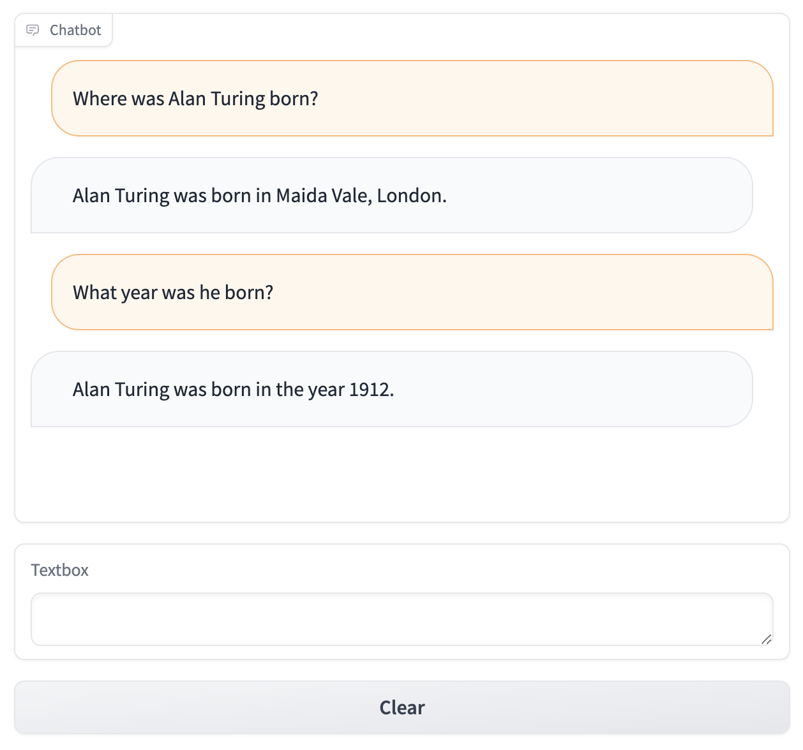

Large-language models (OpenAI/ChatGPT in particular) are all the rage at the moment.
Like many developers, I am interested in exploring what is possible with this new technology.
This post documents my experience exploring how to implement [Q&A Retrieval Augmented Generation](https://python.langchain.com/docs/use_cases/question_answering/) (RAG) using LangChain and the [Chroma](https://www.trychroma.com/) vector database.

<!--more-->

This post was originally written as a Jupyter Notebook, which can be [downloaded here](qa-retrieval-with-chroma.ipynb).

```python
!pip install langchain openai datasets chromadb
```

## Loading a Dataset into Chroma

We will initially load a dataset (Wikipedia article corpus) and chunk it into input that we can feed into the vector database.

```python
from datasets import load_dataset

data = load_dataset("wikipedia", "20220301.simple", split='train[:10]')
```

```python
from langchain.text_splitter import RecursiveCharacterTextSplitter

text_splitter = RecursiveCharacterTextSplitter(
    chunk_size=400,
    chunk_overlap=20,
)

text_splitter.split_text(data[6]['text'])[:3]
```

```
['Alan Mathison Turing OBE FRS (London, 23 June 1912 – Wilmslow, Cheshire, 7 June 1954) was an English mathematician and computer scientist. He was born in Maida Vale, London.\n\nEarly life and family \nAlan Turing was born in Maida Vale, London on 23 June 1912. His father was part of a family of merchants from Scotland. His mother, Ethel Sara, was the daughter of an engineer.',
 'Education \nTuring went to St. Michael\'s, a school at 20 Charles Road, St Leonards-on-sea, when he was five years old.\n"This is only a foretaste of what is to come, and only the shadow of what is going to be.” – Alan Turing.',
 'The Stoney family were once prominent landlords, here in North Tipperary. His mother Ethel Sara Stoney (1881–1976) was daughter of Edward Waller Stoney (Borrisokane, North Tipperary) and Sarah Crawford (Cartron Abbey, Co. Longford); Protestant Anglo-Irish gentry.']
```

We can now generate embeddings of each dataset chunk and store these within the Chroma vector database.

```python
from langchain.docstore.document import Document
from langchain.vectorstores import Chroma
from langchain.embeddings.openai import OpenAIEmbeddings

embeddings = OpenAIEmbeddings(model='text-embedding-ada-002')

documents = \
    [Document(page_content=chunk_text, metadata={"id": record['id'] + str(chunk_idx), "source": record['url']})
     for record in data
     for (chunk_idx, chunk_text) in enumerate(text_splitter.split_text(record['text']))]

store = Chroma.from_documents(documents, embeddings)
```

We can then search the vector database for the given articles that have the most relevance to the given query.

```python
query = "Where was Alan Turing born and what is an Enigma machine?"

store.similarity_search(query)
```

```
[Document(page_content='Alan Mathison Turing OBE FRS (London, 23 June 1912 – Wilmslow, Cheshire, 7 June 1954) was an English mathematician and computer scientist. He was born in Maida Vale, London.\n\nEarly life and family \nAlan Turing was born in Maida Vale, London on 23 June 1912. His father was part of a family of merchants from Scotland. His mother, Ethel Sara, was the daughter of an engineer.', metadata={'id': '130', 'source': 'https://simple.wikipedia.org/wiki/Alan%20Turing'}),
 Document(page_content='Educated in Dublin at Alexandra School and College; on October 1st 1907 she married Julius Mathison Turing, latter son of Reverend John Robert Turing and Fanny Boyd, in Dublin. Born on June 23rd 1912, Alan Turing would go on to be regarded as one of the greatest figures of the twentieth century.', metadata={'id': '133', 'source': 'https://simple.wikipedia.org/wiki/Alan%20Turing'}),
 Document(page_content='A brilliant mathematician and cryptographer Alan was to become the founder of modern-day computer science and artificial intelligence; designing a machine at Bletchley Park to break secret Enigma encrypted messages used by the Nazi German war machine to protect sensitive commercial, diplomatic and military communications during World War 2. Thus, Turing made the single biggest contribution to the', metadata={'id': '134', 'source': 'https://simple.wikipedia.org/wiki/Alan%20Turing'}),
 Document(page_content='Education \nTuring went to St. Michael\'s, a school at 20 Charles Road, St Leonards-on-sea, when he was five years old.\n"This is only a foretaste of what is to come, and only the shadow of what is going to be.” – Alan Turing.', metadata={'id': '131', 'source': 'https://simple.wikipedia.org/wiki/Alan%20Turing'})]
```

## Integrating the Data Source with an LLM

Now we can wire up the LLM to use the Chroma vector database within a `RetrievalQA` chain.

```python
from langchain.chat_models import ChatOpenAI

llm = ChatOpenAI(
    model_name='gpt-3.5-turbo',
    temperature=0
)
```

There are several different ways we can compile and ask the LLM the question.

### Stuff

> The stuff documents chain ("stuff" as in "to stuff" or "to fill") is the most straightforward of the document chains.
> It takes a list of documents, inserts them all into a prompt and passes that prompt to an LLM.

```python
from langchain.chains import RetrievalQA

qa = RetrievalQA.from_chain_type(
    llm=llm,
    chain_type="stuff",
    retriever=store.as_retriever()
)

qa.run(query)
```

> Alan Turing was born in Maida Vale, London.
> An Enigma machine was a cipher machine used by the Nazi German military during World War II to encrypt and decrypt secret messages. It was considered highly secure at the time and was used to protect sensitive communications.
> Turing played a crucial role in breaking the Enigma code, which greatly aided the Allied forces in their efforts during the war.

```python
from langchain.chains import RetrievalQAWithSourcesChain

qa_with_sources = RetrievalQAWithSourcesChain.from_chain_type(
    llm=llm,
    chain_type="stuff",
    retriever=store.as_retriever()
)

qa_with_sources(query)
```

```
{'question': 'Where was Alan Turing born and what is an Engima machine?',
 'answer': 'Alan Turing was born in Maida Vale, London. An Enigma machine was a device designed by Turing at Bletchley Park to break secret Enigma encrypted messages used by the Nazi German war machine during World War 2.\n',
 'sources': '\n- https://simple.wikipedia.org/wiki/Alan%20Turing'}
```

### Map-Reduce

> The map reduce documents chain first applies an LLM chain to each document individually (the Map step), treating the chain output as a new document.
> It then passes all the new documents to a separate combine documents chain to get a single output (the Reduce step).

```python
from langchain.chains.question_answering import load_qa_chain

qa = RetrievalQA(
    combine_documents_chain=load_qa_chain(llm, chain_type="map_reduce"),
    retriever=store.as_retriever()
)

qa.run(query)
```

> The given portion of the document does not provide any information about where Alan Turing was born or what an Enigma machine is.

Unfortunately, this type of chain does not appear to return the desired results.

## Building a Q&A Chatbot

We can also use the `ConversationalRetrievalChain` to build a chatbot that we can interact with to answer the desired questions.
This includes adding _memory_, which allows us to ask follow-up questions based on previous conversations.

```python
from langchain.chains import ConversationalRetrievalChain
from langchain.memory import ConversationBufferMemory

memory = ConversationBufferMemory(memory_key="chat_history", return_messages=True)

qa = ConversationalRetrievalChain.from_llm(llm, store.as_retriever(), memory=memory)

qa({"question": "Where was Alan Turing born?"})
qa({"question": "What year was he born?"})
```

```
{'question': 'What year was he born?',
 'chat_history': [HumanMessage(content='Where was Alan Turing born?', additional_kwargs={}, example=False),
  AIMessage(content='Alan Turing was born in Maida Vale, London.', additional_kwargs={}, example=False),
  HumanMessage(content='What year was he born?', additional_kwargs={}, example=False),
  AIMessage(content='Alan Turing was born in 1912.', additional_kwargs={}, example=False)],
 'answer': 'Alan Turing was born in 1912.'}
```

```python
qa = ConversationalRetrievalChain.from_llm(llm, store.as_retriever(), return_source_documents=True)

qa({"question": query, "chat_history": []})
```

```
{'question': 'Where was Alan Turing born and what is an Engima machine?',
 'chat_history': [],
 'answer': 'Alan Turing was born in Maida Vale, London. \n\nAn Enigma machine was a cipher machine used by the Nazi German military during World War II to encrypt and decrypt secret messages. It was considered highly secure at the time and was used to protect sensitive communications. Turing played a crucial role in breaking the Enigma code, which greatly aided the Allied forces in their efforts during the war.',
 'source_documents': [Document(page_content='Alan Mathison Turing OBE FRS (London, 23 June 1912 – Wilmslow, Cheshire, 7 June 1954) was an English mathematician and computer scientist. He was born in Maida Vale, London.\n\nEarly life and family \nAlan Turing was born in Maida Vale, London on 23 June 1912. His father was part of a family of merchants from Scotland. His mother, Ethel Sara, was the daughter of an engineer.', metadata={'id': '130', 'source': 'https://simple.wikipedia.org/wiki/Alan%20Turing'}),
  Document(page_content='Educated in Dublin at Alexandra School and College; on October 1st 1907 she married Julius Mathison Turing, latter son of Reverend John Robert Turing and Fanny Boyd, in Dublin. Born on June 23rd 1912, Alan Turing would go on to be regarded as one of the greatest figures of the twentieth century.', metadata={'id': '133', 'source': 'https://simple.wikipedia.org/wiki/Alan%20Turing'}),
  Document(page_content='A brilliant mathematician and cryptographer Alan was to become the founder of modern-day computer science and artificial intelligence; designing a machine at Bletchley Park to break secret Enigma encrypted messages used by the Nazi German war machine to protect sensitive commercial, diplomatic and military communications during World War 2. Thus, Turing made the single biggest contribution to the', metadata={'id': '134', 'source': 'https://simple.wikipedia.org/wiki/Alan%20Turing'}),
  Document(page_content='Education \nTuring went to St. Michael\'s, a school at 20 Charles Road, St Leonards-on-sea, when he was five years old.\n"This is only a foretaste of what is to come, and only the shadow of what is going to be.” – Alan Turing.', metadata={'id': '131', 'source': 'https://simple.wikipedia.org/wiki/Alan%20Turing'})]}
```

### Adding a UI

Thanks to [Gradio](https://www.gradio.app/), we can front this chain with a simple chat UI.

```python
!pip install gradio
```

```python
import gradio as gr

memory = ConversationBufferMemory(memory_key="chat_history", return_messages=True)
qa = ConversationalRetrievalChain.from_llm(llm, store.as_retriever(), memory=memory)

with gr.Blocks() as demo:
    chatbot = gr.Chatbot()
    msg = gr.Textbox()
    clear = gr.ClearButton([msg, chatbot])

    def respond(message, chat_history):
        result = qa({"question": message})
        chat_history.append((message, result['answer']))
        return "", chat_history

    msg.submit(respond, [msg, chatbot], [msg, chatbot])

demo.launch()
```


