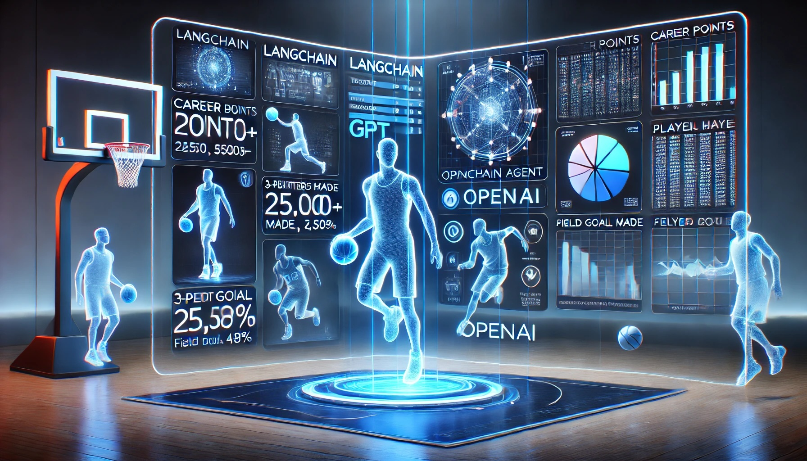

Large language models (OpenAI/ChatGPT in particular) are all the rage at the moment.
Like many developers, I am interested in exploring what is possible with this new technology.
This post documents the use of [LangChain](https://www.langchain.com/) [Agents](https://python.langchain.com/docs/modules/agents/)/[Tools](https://python.langchain.com/docs/modules/tools/) to aid in answering questions based on recent NBA events.

<!--more-->



This post was originally written as a Jupyter Notebook, which can be [downloaded here](nba-stats.ipynb).

```python
!pip install langchain openai bs4 requests
```

```python
from langchain.llms import OpenAI

llm = OpenAI(
    temperature=0,
    verbose=True,
    model_name="text-davinci-003"
)
```

## Without a Source

The LLM is trained up to a given point in time; it is not aware of recent events.

```python
llm("Was the 2023 NBA season MVP part of the team that won the NBA championship that year?")
```

> It is too early to tell.

It can also be completely wrong...

```python
llm("Was the 1998 NBA season MVP part of the team that won the NBA championship that year?")
```

> No, the 1998 NBA season MVP was Michael Jordan of the Chicago Bulls, but the NBA championship that year was won by the San Antonio Spurs.

```python
llm("Who won the 1998 NBA season MVP, what team were they on?, what team won the NBA championship that year?")
```

> The 1998 NBA season MVP was Michael Jordan of the Chicago Bulls. The Chicago Bulls also won the NBA championship that year.

## Adding a Source

> "You don't have to know everything. You just have to know where to find it."
> -- Albert Einstein

We can improve the model's answer by providing tools for it to use to look up recent events within a given domain.
This aids in _grounding_ the model and helps to ensure it does not hallucinate.

```python
from langchain.agents import AgentType, load_tools, initialize_agent, Tool
from bs4 import BeautifulSoup
import requests

def search_statmuse(query: str) -> str:
    response = requests.get(f'https://www.statmuse.com/nba/ask/{query}')
    soup = BeautifulSoup(response.content, "html.parser")
    return soup.find("h1", class_="nlg-answer").text

statmuse_tool = Tool(
    name = "Statmuse",
    func = search_statmuse,
    description = """
        NBA basketball search engine. Use this if the question is related to NBA basketball stats and trivia.
        For example: 'Who is the highest-scoring player in the 2023 season?'
        You must:
        - Always specify a year or timeframe with your search.
        - Only search for a single player, MVP, or team in a single search.
    """
)

tools = load_tools(["llm-math"], llm=llm) + [statmuse_tool]
agent = initialize_agent(tools, llm, agent=AgentType.ZERO_SHOT_REACT_DESCRIPTION, verbose=True)
```

```python
agent.run("Was the 2023 NBA season MVP part of the team that won the NBA championship that year?")
```

```
> Entering new AgentExecutor chain...

Thought: I need to find out who the MVP was and which team they were on
Action: Statmuse
Action Input: Who was the 2023 NBA season MVP?
Observation:
Joel Embiid won the MVP award in 2022-23.

Thought: I need to find out which team Joel Embiid was on
Action: Statmuse
Action Input: What team was Joel Embiid on in the 2023 season?
Observation:
Joel Embiid played for the 76ers in 2022-23.

Thought: I need to find out which team won the NBA championship in 2023
Action: Statmuse
Action Input: Who won the NBA championship in 2023?
Observation:
The Denver Nuggets won in the 2023 NBA Finals against the Miami Heat, 4 games to 1.

Thought: I now know the final answer
Final Answer: No, Joel Embiid was not part of the team that won the NBA championship in 2023.

> Finished chain.
```

> No, Joel Embiid was not part of the team that won the NBA championship in 2023.

That is more like it! how about the other question...

```python
agent.run("Was the 1998 NBA season MVP part of the team that won the NBA championship that year?")
```

```
> Entering new AgentExecutor chain...

Thought: I need to find out who the MVP was and which team won the championship
Action: Statmuse
Action Input: Who was the 1998 NBA season MVP?
Observation:
Michael Jordan won the MVP award in 1997-98.

Thought: I need to find out which team won the championship that year
Action: Statmuse
Action Input: Who won the 1998 NBA championship?
Observation:
The Chicago Bulls won in the 1998 NBA Finals against the Utah Jazz, 4 games to 2.

Thought: I now know the final answer
Final Answer: Yes, Michael Jordan was part of the team that won the 1998 NBA championship.

> Finished chain.
```

> Yes, Michael Jordan was part of the team that won the 1998 NBA championship.

Much better!

### Combining Tools

We can now combine the abilities to reason about a question, find the relevant information, and then compute a given answer.

```python
agent.run("How many combined points did the 2023 NBA season MVP, and the 2023 NBA finals MVP score for the entire 2023 season?")
```

```
> Entering new AgentExecutor chain...

Thought: I need to find out who the MVPs were and then add up their points
Action: Statmuse
Action Input: Who was the 2023 NBA season MVP?
Observation:
Joel Embiid won the MVP award in 2022-23.

Thought: Now I need to find out who the Finals MVP was
Action: Statmuse
Action Input: Who was the 2023 NBA Finals MVP?
Observation:
Nikola Jokic won the Finals MVP award once in the 2023 NBA Finals.

Thought: Now I need to find out how many points each of them scored in the 2023 season
Action: Statmuse
Action Input: How many points did Joel Embiid score in the 2023 season?
Observation:
Joel Embiid scored 2,183 points in 2022-23.

Thought: Now I need to find out how many points Nikola Jokic scored in the 2023 season
Action: Statmuse
Action Input: How many points did Nikola Jokic score in the 2023 season?
Observation:
Nikola Jokic dropped 1,690 points in 2022-23.

Thought: I now know the final answer
Final Answer: The combined points of the 2023 NBA season MVP and the 2023 NBA Finals MVP for the entire 2023 season was 3,873 points.

> Finished chain.
```

> The combined points of the 2023 NBA season MVP and the 2023 NBA Finals MVP for the entire 2023 season was 3,873 points.

Let's now add a tool to fetch information from Wikipedia.

```python
tools = load_tools(["wikipedia"], llm=llm) + [statmuse_tool]
agent = initialize_agent(tools, llm, agent=AgentType.ZERO_SHOT_REACT_DESCRIPTION, verbose=True)
agent.run("Where was the NBA finals MVP for the 2023 season born, and how many total points did he score for the entire season?")
```

```
> Entering new AgentExecutor chain...

Thought: I need to find out who the MVP was and then look up their birthplace and total points scored.
Action: Statmuse
Action Input: Who was the 2023 NBA Finals MVP?
Observation:
Nikola Jokic won the Finals MVP award once in the 2023 NBA Finals.

Thought: I need to find out where Nikola Jokic was born and how many points he scored in the 2023 season.
Action: Wikipedia
Action Input: Nikola Jokic
Observation: Page: Nikola Jokić
Summary: Nikola Jokić (Serbian Cyrillic: Никола Јокић, pronounced [nǐkola jôkitɕ] (listen); born February 19, 1995) is a Serbian professional basketball player, who is a center for the Denver Nuggets of the National Basketball Association (NBA). Nicknamed "The Joker," and hailed as one of the biggest draft steals in NBA history, he is regarded as one of the greatest players and centers of all time. A five-time NBA All-Star, he has been named to the All-NBA Team on five occasions (including three first-team selections), and won the NBA Most Valuable Player Award for the 2020–21 and 2021–22 seasons. He represents the Serbian national team with which he won a silver medal at the 2016 Summer Olympics.
Jokić was selected by the Nuggets in the second round of the 2014 NBA draft. He was voted to the NBA All-Rookie First Team in 2016. In the 2018–19 NBA season, while leading the Nuggets to the Western Conference Semifinals, he received his first All-Star and All-NBA First Team selections. The following season, he once again received All-Star and All-NBA honors, while leading his team to the Western Conference Finals. In the 2022–23 NBA season, he was awarded NBA Finals MVP after leading the Nuggets to their first-ever NBA championship. Jokić ranks among the top 10 on the all-time list of the NBA players with the most triple-doubles (regular season and playoffs), where he is the leading European player and center, and he holds the record for fastest triple-double (achieved in 14 minutes and 33 seconds).

Page: 2023 NBA playoffs
Summary: The 2023 NBA playoffs was the postseason tournament of the National Basketball Association's 2022–23 season. The playoffs began on April 15 and concluded on June 12 with the Denver Nuggets winning the 2023 NBA Finals.

Page: 2023 NBA Finals
Summary: The 2023 NBA Finals was the championship series of the National Basketball Association (NBA)'s 2022–23 season and conclusion to the season's playoffs. The best-of-seven playoffs was played between the Eastern Conference champion Miami Heat and the Western Conference champion Denver Nuggets. The series started on June 1, and concluded in a Denver victory on June 12.The Nuggets defeated the Heat in four of five games, winning their first championship in franchise history after 47 seasons in the NBA. Denver's Nikola Jokić was unanimously voted the NBA Finals Most Valuable Player (MVP), after averaging 30.2 points, 14.0 rebounds, 7.2 assists, and 1.4 blocks while shooting 58.3% from the field and 42.1% from the 3-point line. Jokić is the lowest-selected player to ever win Finals MVP, being the 41st pick of the 2014 NBA draft. This marked the first NBA Finals appearance for Denver. This was also the second Finals to feature a No. 8 seed, along with the 1999 NBA Finals.
Thought: I now know the final answer
Final Answer: Nikola Jokić was born in Sombor, Serbia on February 19, 1995 and he scored a total of 1,845 points in the 2023 season.

> Finished chain.
```

> Nikola Jokić was born in Sombor, Serbia on February 19, 1995 and he scored a total of 1,845 points in the 2023 season.

Although this is a very contrived example, it shows the power of how you can get the LLM to reason about a problem by breaking it up into smaller tasks, using provided tools.
It does not necessarily need to know the answer - just how to find the answer.
