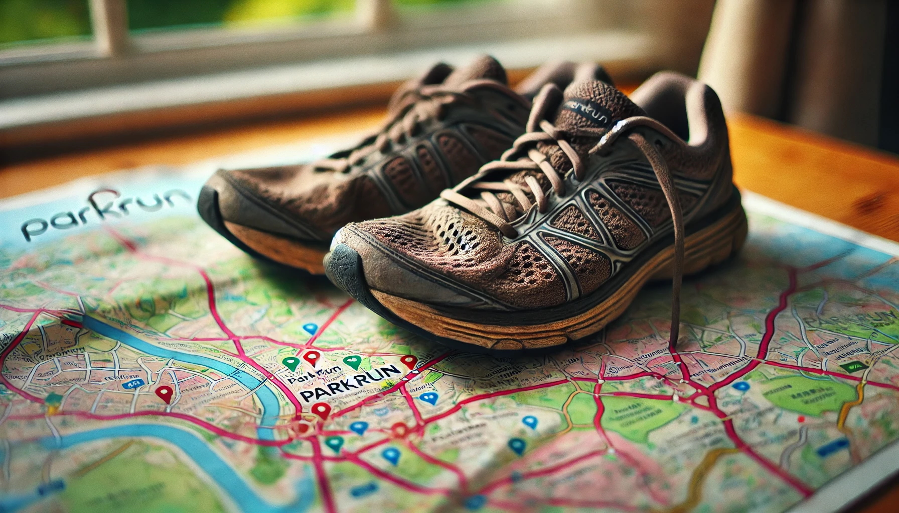

The Parkrun Alphabet is an [unofficial challenge](https://blog.parkrun.com/uk/2018/07/18/the-parkrun-alphabet/) that sees runners complete a Parkrun at locations starting with each letter of the English alphabet.
I am a big fan of Parkrun and wanted to work out how feasible it would be for me to complete the challenge based on the closest _tourist_ locations to my _local_ weekly run.
I also thought this would be a great opportunity to explore [pandas](https://pandas.pydata.org/) and work with [DataFrames](https://pandas.pydata.org/docs/reference/api/pandas.DataFrame.html).

<!--more-->



This post was originally written as a Jupyter Notebook, which can be [downloaded here](closest-parkrun-alphabet-challenge.ipynb).

## The Dataset

My first job was to build a dataset of all the current Parkrun events and their locations.
Fortunately, the official Parkrun website provides this dataset indirectly via OpenStreetMap [Features](https://wiki.openstreetmap.org/wiki/Features) in their interactive map.

```python
import requests
import json

events = json.loads(requests.get("https://images.parkrun.com/events.json").content)
```

For historical prosperity, I stored a local copy of this dataset.
As it is not an official dataset but rather an implementation detail of another feature, there is a high likelihood it could change.

```python
with open("closest-parkrun-alphabet-challenge.json", "w") as file:
    file.write(json.dumps(events, indent=4))
```

This dataset provides the necessary Parkrun event names and location coordinates (longitude and latitude).
Based on a supplied local Parkrun event, I should be able to determine the closest event per letter of the English alphabet to complete the challenge.

## Calculating Distances using the Haversine Formula

To calculate the distance between two different events, I will use the Haversine formula.
This formula calculates the shortest distance over the Earth's surface, giving an 'as-the-crow-flies' distance between two points.
Although this does not account for actual travel considerations (such as roads, traffic, etc.), it is a _good enough_ metric to solve the problem.
There are [many](https://nathanrooy.github.io/posts/2016-09-07/haversine-with-python/) [other](https://en.wikipedia.org/wiki/Haversine_formula) [resources](https://www.movable-type.co.uk/scripts/latlong.html) that explain how this formula works.
Instead of re-implementing it, I have decided to use an [existing library](https://pypi.org/project/haversine/).

```python
!pip install haversine
```

```python
[event_a, event_b, *_] = events["events"]["features"]

event_a["geometry"]["coordinates"]

# [-0.335791, 51.410992]
```

The library I am using appears to require the coordinates to be positioned in the opposite order (latitude, longitude) to what the dataset provides (longitude, latitude).
As such, I will apply a simple transformation over the dataset before using it in the distance calculation.

```python
from haversine import haversine

def flip(coords):
    x, y = coords
    return y, x

haversine(flip(event_a["geometry"]["coordinates"]), flip(event_b["geometry"]["coordinates"]), unit="mi")

# 4.952173093357963
```

## Putting it all together with Pandas

Now that we have the core building blocks in place, we can solve the problem using the pandas library.

```python
import pandas as pd

frame = pd.json_normalize(events["events"]["features"])
```

With the normalised dataset now imported into a DataFrame, I will apply some initial transformations to prepare the data for use.
The first of these is filtering out junior events, as I only want to consider adult events.

```python
ADULT_PARKRUN = 1
frame = frame[frame["properties.seriesid"] == ADULT_PARKRUN]
```

The event names appear to conform to lowercase English alphabet characters (even for international Parkrun events).
We can create a new column from this data to group events alphabetically by their first character.

```python
frame["letter"] = frame["properties.eventname"].str[0]
```

As discussed before, the final dataset transformation ensures that the coordinates are supplied to the Haversine formula in the expected order.

```python
frame["geometry.coordinates"] = frame["geometry.coordinates"].apply(flip)
```

We can now locate the local Parkrun event within the DataFrame.

```python
local_parkrun = frame.loc[frame["properties.EventShortName"] == "Wimbledon Common"].iloc[0]
```

```
id                                                          2
type                                                  Feature
geometry.type                                           Point
geometry.coordinates                   (51.442078, -0.232215)
properties.eventname                                wimbledon
properties.EventLongName             Wimbledon Common parkrun
properties.EventShortName                    Wimbledon Common
properties.LocalisedEventLongName                        None
properties.countrycode                                     97
properties.seriesid                                         1
properties.EventLocation                     Wimbledon Common
letter                                                      w
Name: 1, dtype: object
```

Finally, we determine the distance of each _tourist_ event from the local event.

```python
frame["distance"] = frame.apply(lambda parkrun: haversine(parkrun["geometry.coordinates"], local_parkrun["geometry.coordinates"], unit='mi'), axis=1)

challenge = frame.sort_values(['letter', 'distance'], ascending=True).groupby('letter').apply(lambda parkruns: parkruns.head(2))

challenge[['properties.EventShortName', 'distance']]
```

```
              properties.EventShortName    distance
letter
a      275                   Ally Pally   11.633086
       864                     Aldenham   14.678486
b      0                     Bushy Park    4.952173
       69                     Brockwell    5.505712
c      1317              Clapham Common    3.610917
       344                   Crane Park    6.023641
d      302                      Dulwich    6.590564
       888               Dartford Heath   18.186340
e      462               East Grinstead   23.870382
       2162           Edenbrook Country   29.585593
f      562                Fulham Palace    2.181071
       20                 Finsbury Park   10.390485
g      177                  Gunnersbury    4.729258
       343                    Gladstone    7.940967
h      1637                    Hanworth    7.156085
       65               Hampstead Heath    8.508784
i      1755            Ifield Mill Pond   23.123788
       1876       Itchen Valley Country   59.060942
j      1544                 Jersey Farm   23.143607
       900                       Jersey  177.952723
k      68                      Kingston    3.497859
       1625                     Kingdom   25.778223
l      176                        Lloyd    8.459577
       2272  Lordship Recreation Ground   12.234581
m      301                     Mile End   10.021387
       1292                 Mole Valley   14.049230
n      122                      Nonsuch    5.883647
       566              Northala Fields    9.252729
o      50                 Old Deer Park    3.569700
       524                     Osterley    6.028906
p      668                  Peckham Rye    7.443820
       234                       Pymmes   14.130422
q      481              Queen Elizabeth   46.581142
       309             Queen's, Belfast  320.843908
r      3                  Richmond Park    2.700374
       15               Roundshaw Downs    7.902912
s      2108                    Southall    7.536143
       199                South Norwood    8.075157
t      972               Tooting Common    3.729324
       2340       Thames Path, Woolwich   13.809657
u      390                  Upton Court   15.324948
       1644                    Uckfield   35.385475
v      1309               Victoria Dock   11.653173
       169                   Valentines   15.691955
w      1               Wimbledon Common    0.000000
       277              Wormwood Scrubs    5.419166
y      2297   Yarborough Leisure Centre  125.414614
       87                          York  176.070534
z      1905                  Zuiderpark  198.046322
       1779                 Ziegelwiese  523.953296
```

This approach provides an efficient way to determine the closest Parkrun events for completing the Alphabet Challenge using Python and pandas.
Happy running!
