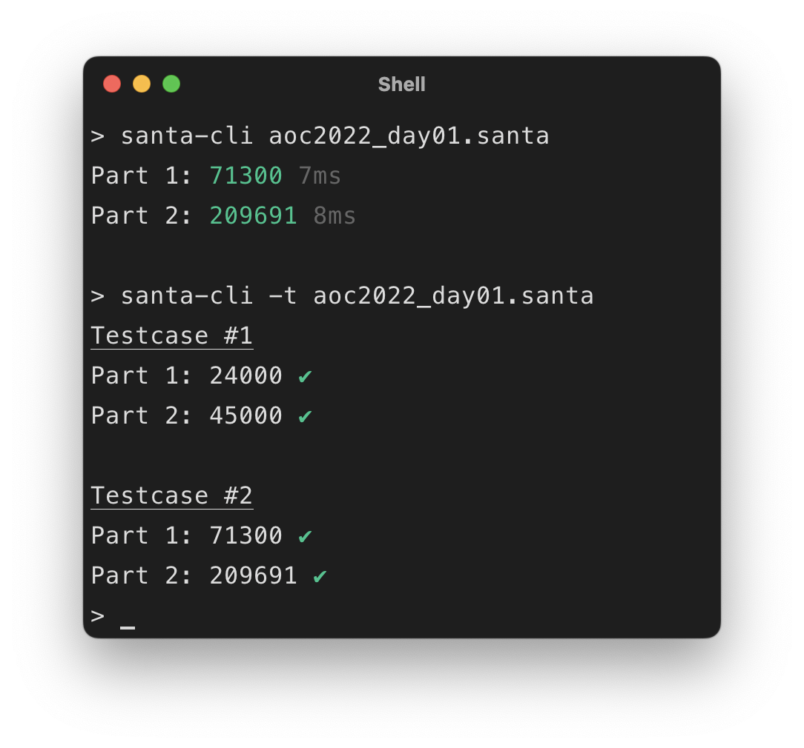
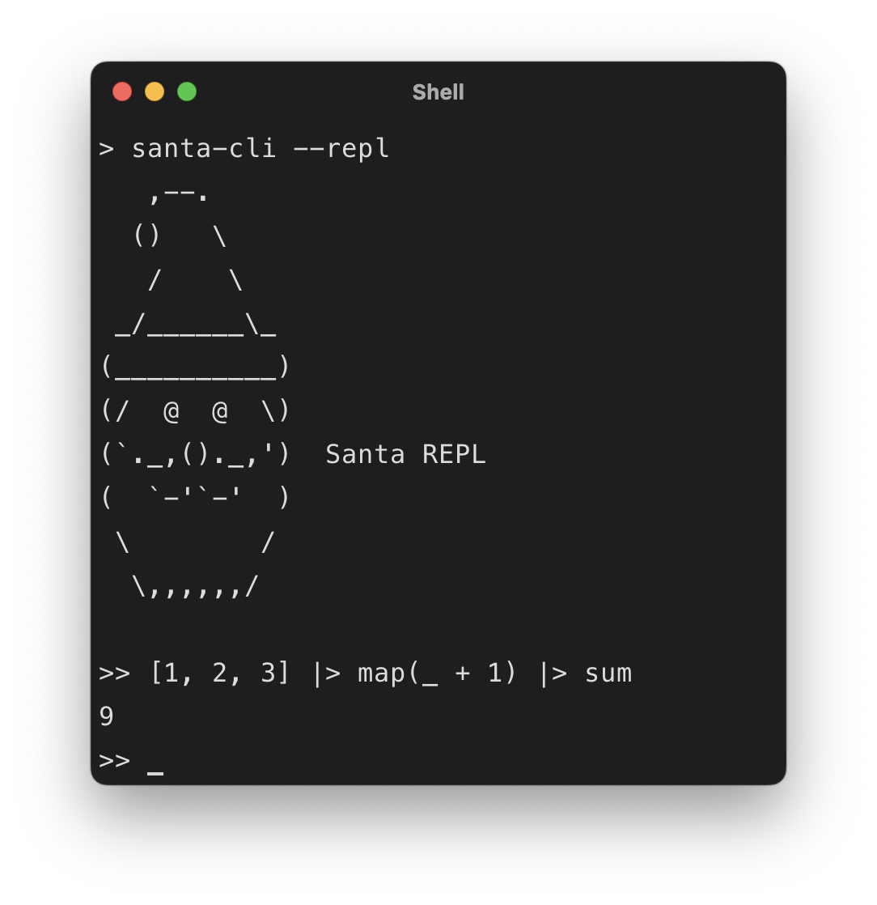
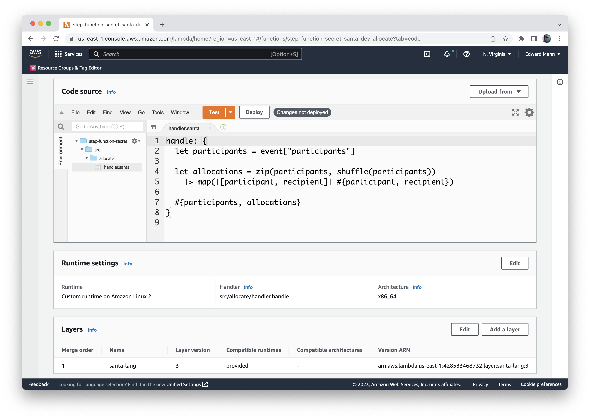
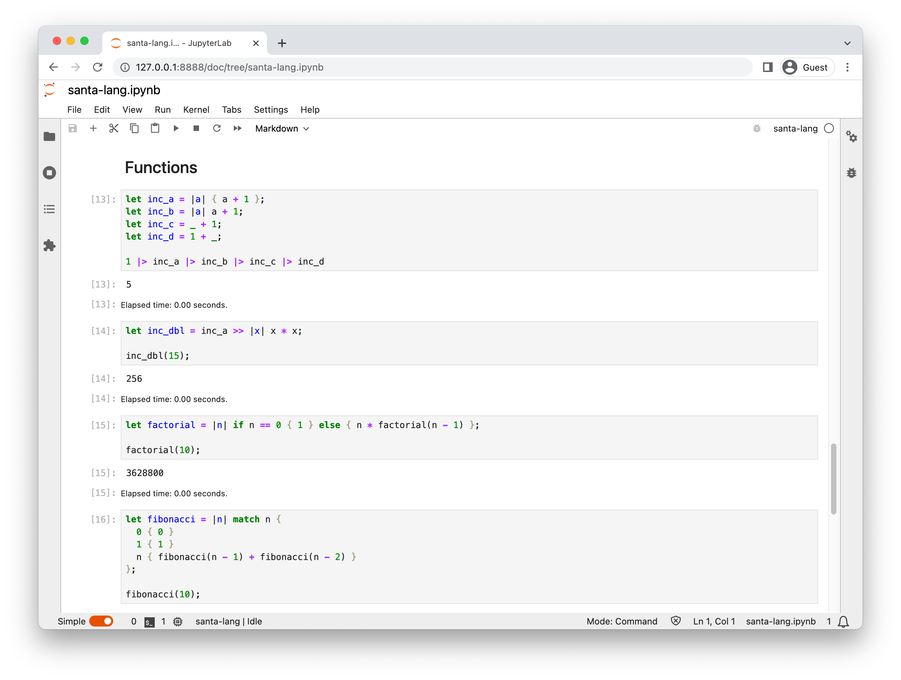

With the [core language library](../2023-08-05-rewriting-the-santa-lang-interpreter-in-rust-part-1-implementing-the-core/index.md) now written, I could go about building the desired (delivery) runtimes.
In this post within the [series](), I will delve into my experience integrating the core language library with these chosen runtimes, documenting some of the challenges that I faced along the way.

<!--more-->

The TypeScript implementation of the santa-lang interpreter included CLI, Web, and Lambda runtimes.
I decided to tackle these in this order of importance, as I required at least the CLI to begin testing the interpreter on real solutions.

## CLI

I intentionally decided to write the CLI with minimal package dependencies.
There are many useful [crates](https://github.com/clap-rs/clap) available to assist in CLI development, but I did not feel like I needed the additional features they provided at this time.
I did, however, use a [crate](https://github.com/kkawakam/rustyline) to provide the ability to start up an interactive shell via _readline_ support.
The runtime itself included I/O _external functions_ `puts` and `read`, which had feature parity with the TypeScript implementation.
This included POSIX support for reading files from disk, fetching contents from HTTP endpoints, and the AoC schema I had devised when first designing santa-lang.
I was able to provide test coverage for this delivery using the [assert_cmd](https://docs.rs/assert_cmd/latest/assert_cmd/) crate.
This provided me with confidence that I had correctly integrated the library with the delivery.

 

To aid in performance benchmarking, I added the ability to compile the runtime with [pprof](https://github.com/tikv/pprof-rs) code profiling (via a [`profile`](https://github.com/eddmann/santa-lang-rs/blob/870e364a9ae47c3648e358d89b42e491f9d59577/runtime/cli/Cargo.toml#L26) feature flag).
The chosen library also allowed me to produce [flame graphs](https://www.brendangregg.com/flamegraphs.html), which were used extensively throughout development to help pinpoint areas where performance could be improved.
Further discussion on performance will be documented in the [next post](../2023-08-07-rewriting-the-santa-lang-interpreter-in-rust-part-3-performance/index.md) within the [series]().

## Web (WASM)

The TypeScript interpreter being transpiled into JavaScript made it already well-suited for _Web platform_ usage.
This required very little additional effort on my part.
To provide use of this interpreter within the [Web-based code editor](https://eddmann.com/santa-lang-editor/) and Browsers/Node in general, I needed to leverage WebAssembly (WASM).
Having had [experience](../../2021/2021-07-06-building-a-rubik-cube-solver-using-rust-wasm-threejs-and-react/index.md) with this before, I was again surprised at how easy it was to achieve.
Not only was I able to trivially expose the language as a WASM library, but I could also provide the ability to include user-land JavaScript functions as external functions (similar to the TypeScript implementation), as shown below:

```ts
import { evaluate } from '@eddmann/santa-lang-wasm';

evaluate('[1, 2, 3] |> map(_ + 1) |> sum');

evaluate('puts("Hello, world")', { puts: console.log.bind(console) });
```

The runtime required me to enable the [`serde`](https://github.com/eddmann/santa-lang-rs/blob/d56cd6748111dc22f078a6eb554c80476342d033/lang/Cargo.toml#L18) feature support, which I had included within the core language library, to make it possible to represent compatible data structures between JavaScript and santa-lang.
Being enabled on a per-runtime basis ensured that any additional overheads would not impact other runtimes.
The Runner instance used the [`Time`](https://github.com/eddmann/santa-lang-rs/blob/870e364a9ae47c3648e358d89b42e491f9d59577/runtime/wasm/src/lib.rs#L16-L21) trait with a specific WASM implementation to determine the execution time of solutions.
Similar to the CLI, I was able to garner confidence in the desired behaviour by using a [testing](https://crates.io/crates/wasm-bindgen-test) crate, which allowed me to verify correctness of the compiled library within both Node and Chrome-browser environments.

With very [few changes](https://github.com/eddmann/santa-lang-editor/blob/b27aeddc19444003cb5d39704d934e733e05bb86/worker.ts), I was then able to update the [Web-based code editor](https://eddmann.com/santa-lang-editor/) to use this new interpreter.
On top of this, I had begun [documenting](https://eddmann.com/santa-lang/) the language specification and features it had to offer using [MkDocs](https://www.mkdocs.org/).
I decided to additionally add [executable examples](https://github.com/eddmann/santa-lang/blob/f55c6d085118bc9ae6a269e2f57ef415b57b96eb/runner/runner.js) using this library, which exercised the runtime in a different context.


## Lambda

I had initially developed the Lambda runtime in TypeScript for use within last year's [Secret Santa Allocation](../../2022/2022-11-01-allocating-secret-santas-using-an-aws-step-function-workflow-and-every-available-lambda-runtime/index.md) project.
I wanted to provide feature parity and implement such a runtime in Rust.
To achieve this, I borrowed ideas from the [Node version](https://github.com/eddmann/santa-lang-ts/blob/aa0a2a53d6dab80e844d4c87183a1f3936d1a7f5/src/lambda/src/index.ts), conforming to the [Lambda runtime API](https://docs.aws.amazon.com/lambda/latest/dg/runtimes-api.html) and expected request/response lifecycle.
I used the lightweight [ureq](https://crates.io/crates/ureq/0.9.0) crate to handle HTTP transport between the compiled _bootstrap_ and the Lambda runtime environment.
Due to Lambda's heavy reliance on JSON for transport, I again enabled the `serde` feature support (similar to the WASM runtime) that had been added to the core language library to handle converting santa-lang data structures to and from their JSON equivalents.
I was pleasantly surprised at how performant this runtime was in practice, with very little overhead and a small binary size.



## PHP Extension

One evening, I spotted an interesting [crate](https://github.com/davidcole1340/ext-php-rs), which provided an abstraction around creating PHP extensions within Rust.
As all I had been thinking about over the past several months was santa-lang, the first thing that came into my mind was: could I make a runtime for it?!
So, I set about creating a [simple extension](https://github.com/eddmann/santa-lang-rs/blob/870e364a9ae47c3648e358d89b42e491f9d59577/runtime/php-ext/src/lib.rs) that provided user-land PHP with the ability to evaluate santa-lang code, along with AoC solutions.

I had [limited](../../2014/2014-03-12-introduction-to-creating-a-basic-php-extension/index.md) [experience](../../2015/2015-08-03-php-extension-development-for-beginners-with-joe-watkins/index.md) in writing PHP extensions in the past and really enjoyed how this crate abstracted away any need for C macros and `zend_` magic.
It was interesting constructing PHP associative arrays (Zend Hash Tables) for each of the exposed PHP functions' return values.
This certainly isn't the most useful runtime, but it does document how easy it is to expose Rust-based code in a higher-level language without needing to resort to C.

```php
<?php

$solution = file_get_contents(__DIR__ . '/solution.santa');

santa_aoc_run($solution, cwd: __DIR__);

santa_aoc_test($solution);

santa_evaluate('1.. |> filter(_ % 2) |> take(3);');
```

Along with providing this PHP extension support, there is future scope to expose the interpreter within [Python](https://github.com/PyO3/pyo3).
This crate looks to expose a similar level of abstraction as the PHP one.

## Jupyter Kernel

Over the past several months, I have been introduced to the power of [Jupyter Notebook](https://jupyter.org/) and the fast REPL it provides.
This is in large part due to every AI/LLM YouTube video or post I see using it (due to the authors coming from Data Science backgrounds).
Similar to the PHP extension, my mind wandered into the possibility of creating a custom [Kernel](https://docs.jupyter.org/en/latest/projects/kernels.html) to expose the santa-lang language as an additional runtime.

Thanks to yet another well-thought-out [crate](https://crates.io/crates/jupyter), this task proved to be rather seamless.
There was one caveat, however, in that the crate used asynchronous execution to handle language server requests.
This caused issues with the `Rc<RefCell<Environment>>` type that is required to model script state during evaluation.
As santa-lang's core language is designed to be single-threaded, I was required to add _unsafe_ `Sendable` and `Sync` trait implementations to a wrapper [`SharedEnvironment`](https://github.com/eddmann/santa-lang-rs/blob/a36476d3d7adcc68980b56465c5c0ee891c831db/runtime/jupyter/src/main.rs#L14-L17) type to appease the compiler (a big no-no!).

This is certainly not production-ready, but as a proof of concept, it was fun to build.
It also make me interested to see how I could possibly use a notebook to help develop Advent of Code solutions in the future.



## What's Next?

Now that all the desired runtimes have been implemented, it is finally time to investigate performance considerations!
In the [next post](../2023-08-07-rewriting-the-santa-lang-interpreter-in-rust-part-3-performance/index.md) within the [series](), I will document how I went about benchmarking the two implementations, greatly improving performance, and highlighting interesting findings along the way.
