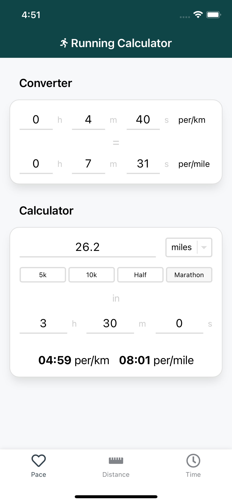
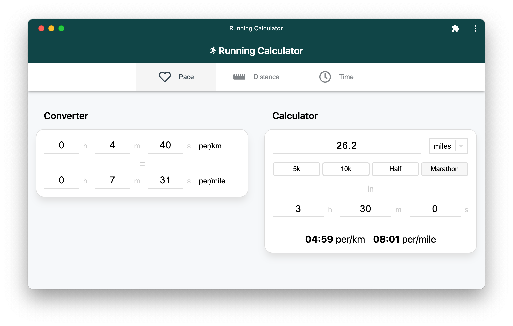
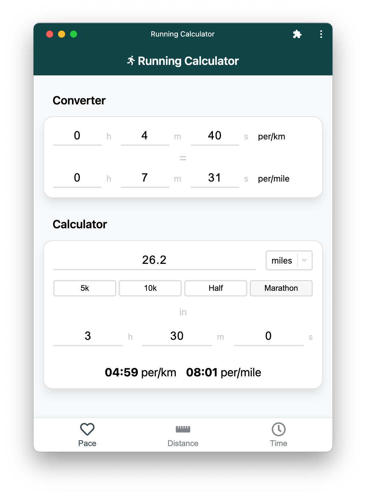

I have been an avid runner for many years now, but I still get confused by imperial and metric measurements.
On top of this, the number of times I seek out a random website to perform some form of pace/distance calculation is too often to count.
What I wanted was a desktop and mobile application that could perform pace, distance, and time calculations, along with imperial/metric conversions - _a swiss-army knife of running calculators_.
In this post, I would like to document my experience building a [Progressive Web Application](https://web.dev/articles/what-are-pwas) (PWA) that does just this, providing a native app-like experience across iOS, Android, and Desktop.

<!--more-->

Progressive Web Applications provide a means of leveraging the browser and web technologies to enable a _native app_-like mobile and desktop experience.
They use the conventional web stack that web developers are familiar with: HTML, JavaScript, and CSS.
This, in turn, allows you to deploy at the same frequency and ease as you would a conventional website, but without the headaches of app store submissions.

## The App

  

The resulting application has been built using React, TypeScript, CSS-in-JS ([styled-components](https://styled-components.com/)), and bundled with [Vite](https://vitejs.dev/).
I have leveraged the [Vite PWA plugin](https://vite-pwa-org.netlify.app/) to abstract away generating the required Service Worker, Web App Manifest, and icon assets to [meet PWA requirements](https://developer.mozilla.org/en-US/docs/Web/Progressive_web_apps/Tutorials/js13kGames/Installable_PWAs#requirements).
Under the hood, Google's [Workbox](https://developer.chrome.com/docs/workbox/) project is used to handle managing cached assets for offline use and updating the registered Service Worker.

When initially researching PWA development, you might naively assume it is just a case of adding a Web App Manifest and Service Worker to your project, serving the content over HTTPS, and you're done... not quite.
Below, I will discuss the different areas I needed to consider, which led to the final result shown above.

## App'ification

 

### Look and Feel

A large area of research and development was making the user experience _look and feel_ like a native application typically found on both mobile and desktop devices.
A lot of time was spent essentially _'de-webifying'_ the web application to align with user expectations of a native app experience.
This included disabling page zooming capabilities, user text selection, and document overflow scrolling.
These were all fortunately achievable using CSS, with a small dose of browser-specific prefixes (Safari...).
I did, however, have to resort to some JavaScript to disable touch body scroll when the soft keyboard appears on mobile for focused input fields.
Although this process required trial and error, the learnings garnered can be applied going forward to other app-like web experiences and PWAs I wish to develop.

### Mobile

When the iPhone was initially released, Steve Jobs touted an innovative new way to create web applications _"that look exactly and behave exactly like native apps"_ during the launch's [one more thing](https://www.youtube.com/watch?v=ZlE7dzoD6GA) section.
However, the momentum soon dwindled with the release of a native SDK several months later - and the subsequent popularity and revenue of the App Store have not made Apple regret that decision.
This has led to much of my PWA development experience feeling like a constant struggle to make things work on iOS... (and this is coming from an Apple fanboy).
iOS is still [way behind](https://firt.dev/notes/pwa-ios/) the fantastic web capability support present on Android.
For instance, it has only recently added [Web Push](https://developer.mozilla.org/en-US/docs/Web/API/Push_API) capabilities since iOS 16.4.

Below are several key pain points I encountered while developing this PWA on iOS.

#### Splash Screens

The number of splash screen assets required for full iOS device support is mind-blowing.
Not only do you need to supply numerous assets upfront, but iOS also requires custom Safari-specific meta-tag workarounds to register different splash screen variants.
This is in stark contrast to Android, where the system can use an existing icon provided by the Web App Manifest.

#### Orientation

iOS lacks support for the Web App Manifest [orientation](https://developer.mozilla.org/en-US/docs/Web/Manifest/orientation) property, which allows you to specify whether the PWA supports portrait and/or landscape modes.
Instead, you must cater for both orientations or display crude CSS-based 'Not supported in this orientation' messages to the user.

#### Installation Prompt

Most annoyingly, iOS lacks native [installation prompts](https://web.dev/learn/pwa/installation-prompt), whereas Android and Chrome desktop devices fully support them.
It does not support the `beforeinstallprompt` event, meaning that to install a PWA, users must manually visit Safari, open the bottom menu bar, and select 'Add to Home Screen' 🤦.
Third-party browsers (e.g. Chrome), although required to use the Safari web engine, do not support installing PWAs.
This severely hinders PWA adoption compared to the seamless experience iOS provides for App Store installations.
Android, on the other hand, offers a great user experience, leveraging screenshots found in the Web App Manifest to aid installation.
It even packages the application as a [Trusted Web Activity](https://developer.chrome.com/docs/android/trusted-web-activity/), treating the PWA as a standard Android application rather than a mere Safari _bookmark_.
You can see how the two experiences differ by watching the videos above.

### Desktop

 

In contrast to mobile development, making the app feel native on desktop required less attention.
Since PWAs are only supported in Google Chrome (and variants such as Microsoft Edge), the scope of browsers that needed catering was limited.
What is great about this approach is that there is no need to wrap your application in an [Electron](https://www.electronjs.org/)/[Tauri](https://tauri.app/) wrapper if the APIs supplied by Google Chrome meet your needs.



## Conclusion

I am very happy with the PWA I have built over the past week or so.
Although the application itself is simple, it has allowed me to explore many fundamental aspects of PWA development that need to considered when building web applications that should look and feel native.
iOS support, although lacking behind Android considerably, at least provides a native look and feel once it has been installed on to the device.
Going forward, I would like to explore how I can use projects such as [PWABuilder](https://www.pwabuilder.com/) to package the PWA for submission to the Google Play and Apple App Store, helping to address some of the discussed shortcomings.
