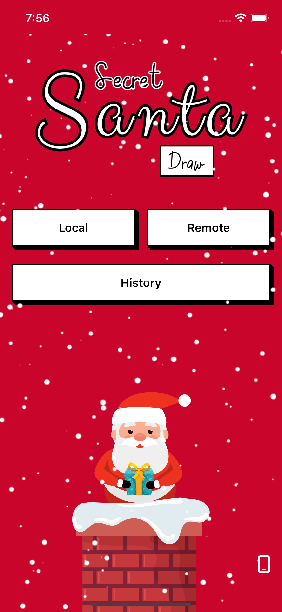
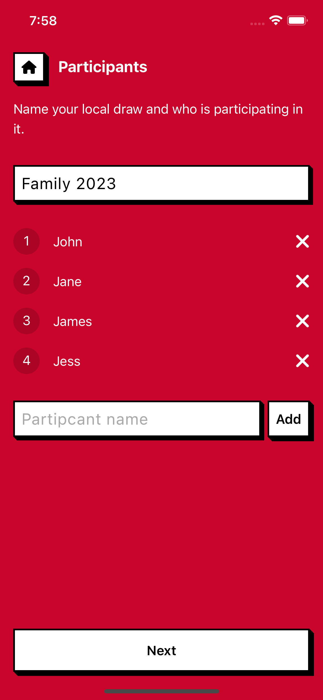
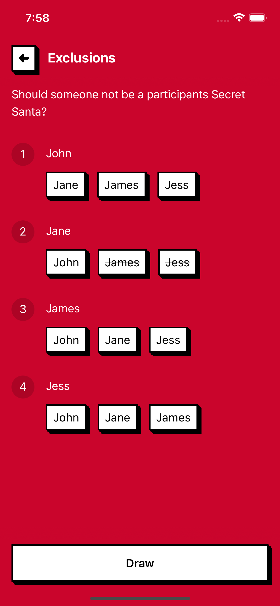
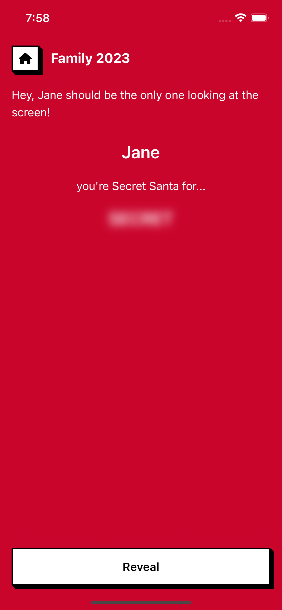
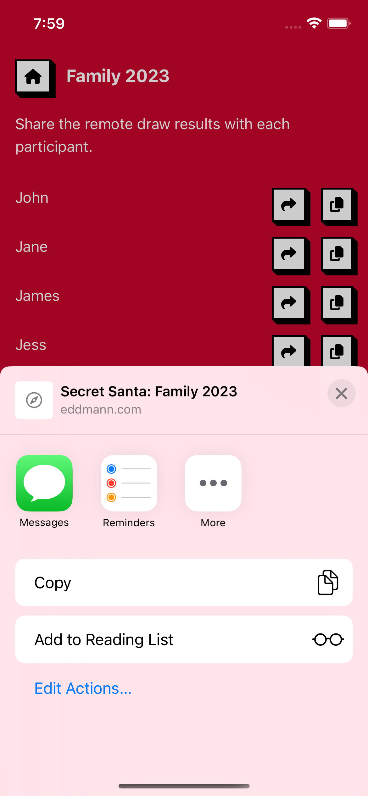
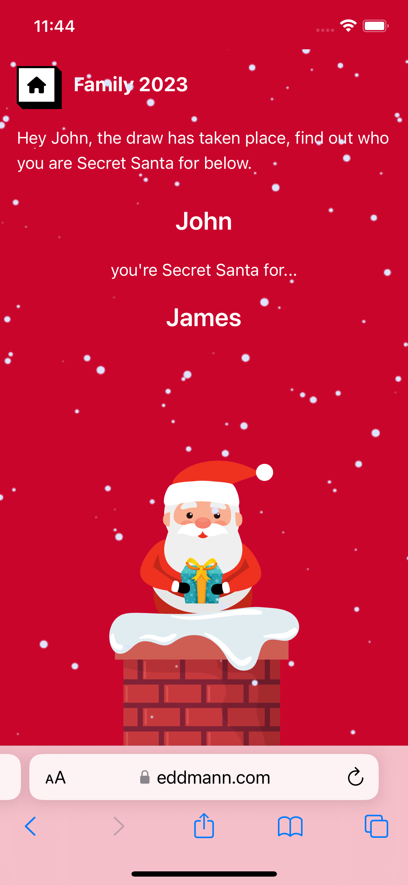

Over the [past](../../2020/2020-10-23-allocating-and-notifying-secret-santas-via-email-using-clojure/index.md) [several](../../2021/2021-11-03-building-a-secret-santa-allocator-and-sms-sender-using-a-raspberry-pi-pico-micropython-and-sim800l-module/index.md) [years](../../2022/2022-11-01-allocating-secret-santas-using-an-aws-step-function-workflow-and-every-available-lambda-runtime/index.md), I have taken the opportunity of allocating Secret Santas for members of my family as a means of exploring new technologies.
For the past several months, I have been interested in the concept of Progressive Web Applications (thanks in large part to [this series](https://frontendmasters.com/courses/pwas/)), and getting more hands-on experience with the ever-changing frontend landscape.
As such, I decided that this year I would build a small application that works across Desktop, iOS, and Android to perform Secret Santa draws in both a local and remote setting.
In this post, I would like to document how I went about building this application.

<!--more-->

## The App

  

Based on the [research and development](../2023-10-31-building-a-running-calculator-pwa-in-react-and-typescript/index.md) carried out last month to build the [Running Calculator](https://eddmann.com/running-calculator/), I had a good base (Vite, TypeScript, React, and styled-components) to start from.
The final build includes the ability to create Secret Santa draws in both a local and remote setting, using Redux to manage the application state.
I wanted the application to be standalone, whereby all its behaviour could be deployed as a [static artefact](https://github.com/eddmann/secret-santa-pwa/blob/main/.github/workflows/release.yml) on GitHub Pages.
I did not want to integrate it directly with an SMS provider like I have in past years, instead opting to use the [Web Share API](https://developer.mozilla.org/en-US/docs/Web/API/Web_Share_API) to craft a message with a unique URL to access each participant's draw result.
On top of this, I did not want a dependency on remote persistence (to store the draw results), so I had to devise a means of passing the draw results within this shared URL.

### Local draw

 

Local draws are carried out and presented on the same device.
Once the draw has been completed, each allocation is presented one after another with the device being passed around to each requested participant until everyone knows who they are Secret Santa for.
To ensure that participants do not accidentally see the next participant's allocation, I added a multi-step process to reveal the result.
Throughout development, I was able to sprinkle in several CSS animations to aid in the overall UX, one of which was fading in the recipient's name upon being revealed.

### Remote draw

  

Remote draws are carried out on a single device with the resulting allocations being shared with each participant via an encrypted URL (using the [Web Share API](https://developer.mozilla.org/en-US/docs/Web/API/Web_Share_API)).
When the encrypted URL is visited, the participant is presented with a similar screen to a local draw, where they can reveal who they are Secret Santa for.
Being encrypted (using the [Web Crypto API](https://developer.mozilla.org/en-US/docs/Web/API/Web_Crypto_API)), the user of the device who completed the draw (and was tasked with sharing the results) is unable to _snoop_ on each allocation.
As all state about the allocation is stored within the URL, there is no need for remote state persistence, and the application can remain a simple SPA deployed on [GitHub Actions](https://github.com/eddmann/secret-santa-pwa/blob/main/.github/workflows/release.yml) 🎉.

### Draw history

Each draw is persisted locally on the device using the [Web Storage API](https://developer.mozilla.org/en-US/docs/Web/API/Web_Storage_API).
This allows the user to retrieve the results again after the draw has taken place.
Going forward, it may be beneficial to review other means of persisting state on the web, e.g. [IndexedDB](https://developer.mozilla.org/en-US/docs/Web/API/IndexedDB_API).
Currently, the draw results stored within the Redux state are subscribed to and persisted upon each store change.
This is a little unperformant as we are required to encode and write JSON entities anytime the store changes, but this will suffice for the initial release.

### Snowfall



There is a small _easter egg_ on the application's home screen.
Using the [DeviceMotionEvent](https://developer.mozilla.org/en-US/docs/Web/API/DeviceMotionEvent), when you shake the device, the amount and speed of the snow falling increases.
On iOS, the user is required to give permission to the application to read this information.
As such, they are required to click the small bottom-right phone icon (if it appears) before shaking the device.

## Conclusion

Like previous years, I have enjoyed exploring another means of taking the problem of allocating Secret Santa and applying it to a project to learn new technologies.
This build has expanded my understanding of what is possible within a Progressive Web Application using many more Web APIs.
Over the last day or so, I have been looking at the possibility of packaging this PWA into a native iOS and Android application using [Capacitor](https://capacitorjs.com/).
I hope to find some time to release this onto the Google Play and App Store and document my experience in doing so in the future.
