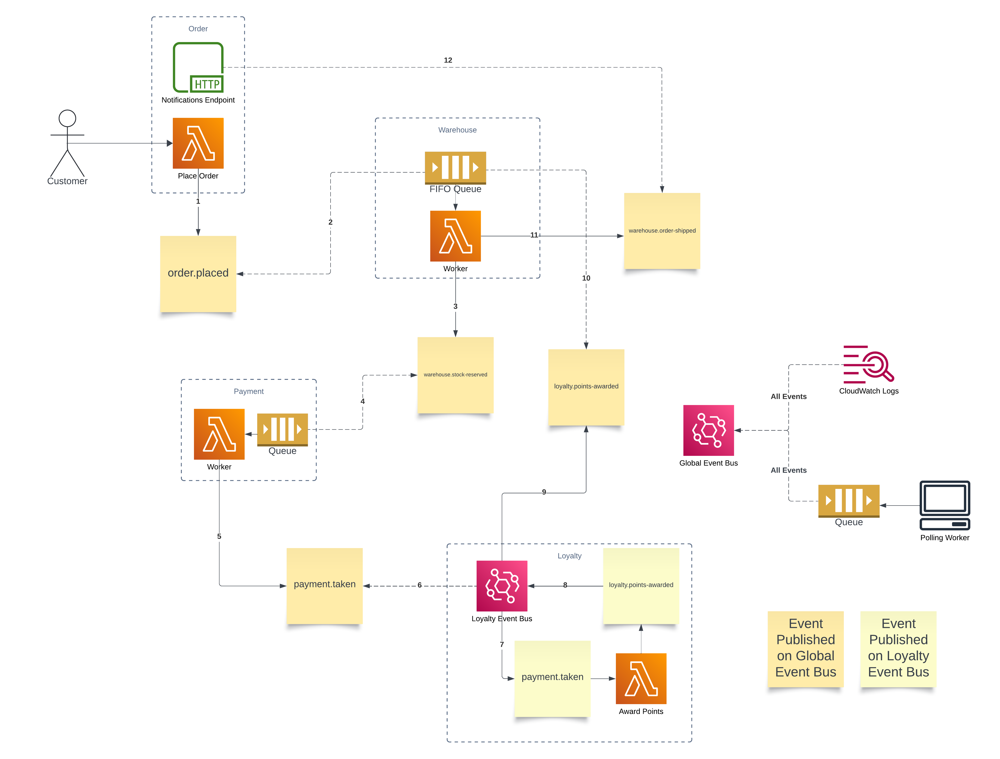

Event-driven architectures (EDA) are a powerful asynchronous communication pattern, making them an excellent way to model real-world business processes.
Recently, whilst reading [Monolith to Microservices](https://samnewman.io/books/monolith-to-microservices/) by Sam Newman, I came across a clear example of coordinating order fulfilment across multiple subdomains using a _choreographed_ workflow.
This inspired me to explore how such an example could be built using AWS - leveraging EventBridge, SQS, and Lambda to model a distributed, yet coordinated, order fulfilment process.

In this post we'll explore how events propagate across subdomains and bounded contexts, the trade-offs between choreography and orchestration, and practical implementation details around event delivery, idempotency, and observability.

If you're interested in exploring the full working example, including both CloudFormation and Terraform infrastructure-as-code implementations, you can find the complete project on [GitHub](https://github.com/eddmann/aws-eventbridge-choreographed-workflow).

## Coordinating Events: Choreography or Orchestration?

When designing workflows that span multiple services or bounded contexts, there are two main approaches to coordination: **choreography** and **orchestration**.
Each comes with its own strengths and trade-offs, and interestingly, many real-world business processes actually blend both patterns at different levels of granularity.

### Orchestration

In this approach, a central component (the "orchestrator") explicitly controls the workflow, telling each participant what to do, in what order, and when - much like a conductor leading an orchestra.

- _Pros_: Clear visibility into the process flow, easier to manage complex or conditional logic, and centralised error handling.
- _Cons_: Tighter coupling between services and the orchestrator, which can become a single point of failure or a bottleneck.
  Changes to the workflow often require changes to the orchestrator.

### Choreography

Here, each service listens for and reacts to events, knowing its own responsibilities.
There's no central authority; the "music" (events) guides the participants, and each service plays its part independently.

- _Pros_: Loose coupling between services, allowing each subdomain (like Order, Warehouse, Payment, Loyalty) to evolve, fail, or scale independently.
  This flexibility is a core strength of event-driven architectures.
- _Cons_: The overall process flow can be harder to visualise and reason about, and debugging cross-service flows may require more observability tooling.

It's worth noting that in practice, many business processes leverage both orchestration and choreography - sometimes using choreography for high-level process management, while individual steps or subdomains interact via orchestration.
This hybrid approach can offer the best of both worlds: centralised control where it's needed, and flexibility and independence elsewhere.

For this project, I wanted to embrace the flexibility and independence of choreography, letting each subdomain contribute to the business process without a central controller. B
ut it's important to recognise that both approaches have their place, and the right choice (or combination) depends on your system's needs.

## The Business Process: The "Happy Path" Walkthrough

Here's the typical order fulfilment flow I wanted to model:

1. **Order is placed** by the customer (via an HTTP endpoint).
2. **Stock is reserved** in the warehouse (via an SQS FIFO Lambda worker; deduplication at the queue level).
3. **Payment is taken** (via an SQS Lambda worker with idempotency logic).
4. **Loyalty points are awarded** (via an internal Loyalty Event Bus; direct Lambda integration with code-level deduplication).
5. **Order is shipped** (via SQS FIFO Lambda worker).
6. **Order notifications** are sent out (API endpoint is notified of the shipped order).



This process is modelled across the following _discovered_ subdomains:

- **Order** - handles incoming customer requests.
- **Warehouse** - manages stock and shipping operations.
- **Payment** - processes financial transactions.
- **Loyalty** - awards points for completed orders.

Each subdomain is responsible for reacting to relevant events and publishing new ones as the workflow progresses.
The key events in this process include:

- `order.placed`
- `warehouse.stock-reserved`
- `payment.taken`
- `loyalty.points-awarded`
- `warehouse.order-shipped`

Note: In practice, the boundaries between subdomains and bounded contexts are not always so clearly defined.

## Event Bus Design: Public, Private, and Cross-Bus Propagation

I wanted to explore using both a _global event bus_ for inter-domain communication and _private_ (subdomain) event buses for internal events.
Here's how I approached it:

- **Global Event Bus**: Used for events that cross between subdomains, such as order placement, stock reservation, and payment taken.
- **Private (Subdomain) Event Buses**: Used for events that are internal to a given subdomain, and possibly only of interest to bounded contexts (and in-turn services) within that subdomain.

### Propagating Events Across Buses

AWS EventBridge allows you to set up rules that forward events from one bus to another.
For example, once the Payment service emits a `payment.taken` event on the global bus, a rule forwards it to the Loyalty Event Bus, where the Loyalty service can react accordingly.
This approach gives us fine-grained control: we can decide exactly which global event bus events each subdomain is interested in (by configuring rules to forward only relevant events to the subdomain's private event bus), and we can also choose which subdomain-specific events should be relayed back onto the global event bus for broader consumption. This selective propagation helps keep event flows clear and prevents unnecessary noise between subdomains.

```yaml
GlobalToLoyaltyEventBusEventRule:
  Type: AWS::Events::Rule
  Properties:
    EventBusName: !GetAtt GlobalEventBus.Name
    EventPattern:
      source:
        - 'payment'
      detail-type:
        - 'payment.taken'
    Targets:
      - Id: 'LoyaltyEventBus'
        Arn: !GetAtt LoyaltyEventBus.Arn
        RoleArn: !GetAtt CrossEventBusRole.Arn
```

## Consumer Message Delivery Strategies

As I explored how best to deliver events to consumers, I experimented with two primary patterns: point-to-point queues using SQS and direct Lambda integration.

### 1. Using SQS as a Delivery Buffer

For services found in the Warehouse and Payment subdomains, I used Amazon SQS as a buffer between EventBridge and the worker Lambdas.
This approach proved effective in handling bursty workloads by decoupling the rate of event production from consumption.
It also provided built-in support for retries and dead-letter queues (DLQs), making error handling and recovery more straightforward.
Additionally, by using FIFO queues with content-based deduplication, I was able to ensure idempotency at the infrastructure level - an important consideration when dealing with exactly-once semantics in distributed systems.
This topic is discussed more [below](#handling-idempotency-handling-idempotency).

Despite these benefits, this setup does introduce a bit more operational complexity.
It requires managing additional infrastructure components such as queues, Lambda triggers, and appropriate IAM permissions.
However, in most cases, the trade-off is well worth it for the added reliability and observability.

```yaml
# Warehouse SQS FIFO queue and EventBridge target
WarehouseQueue:
  Type: AWS::SQS::Queue
  Properties:
    QueueName: 'Warehouse.fifo'
    FifoQueue: true
    ContentBasedDeduplication: true
```

### 2. Direct Lambda Invocation from EventBridge

The service found in the Loyalty sudomain uses direct integration between EventBridge and a Lambda function, without an intermediary queue.
This setup is straightforward to configure and offers low latency, making it well-suited to simple or low-throughput scenarios where the risk of overload is minimal.

That said, this pattern comes with some important trade-offs.
Without a buffer, it's more vulnerable to bursty traffic or scaling limitations - Lambda concurrency limits can be reached, and events may be dropped if not properly retried.
Additionally, if downstream processing fails, there's no built-in mechanism for retries or dead-letter handling.
While it can be appropriate for lightweight internal flows, this approach lacks the resilience and operational control typically needed for production workloads.

### Why I Prefer a Queue

I would tend to avoid relying on direct Lambda integration without a buffer.
Adding an SQS queue between EventBridge and consumers offers both robustness and resilience: it absorbs traffic spikes, smooths out the processing rate, and prevents downstream services from being overwhelmed.
Just as importantly, it provides built-in support for retries, delayed processing, and dead-letter queues - eliminating the need for custom failure handling logic.

## Event Formats: CloudEvents and the Double Envelope

To keep events standards-compliant and interoperable, I chose to format all domain events using the [CloudEvents](https://github.com/cloudevents/spec/blob/main/cloudevents/spec.md) [structured mode](https://github.com/cloudevents/spec/blob/main/cloudevents/spec.md#message).
These CloudEvents are then placed inside the `Detail` field when publishing to EventBridge ("double envelope").

Here's a snippet from the `order.js` Lambda:

```js
const event = {
  specversion: '1.0',
  id: randomUUID(),
  source: 'order',
  type: 'order.placed',
  data: {
    order: {
      id: randomUUID(),
      items: [{ sku: '123', price: 123 }],
    },
  },
  time: new Date().toISOString(),
  dataschema: '',
  correlationid: randomUUID(),
};

await client.send(
  new PutEventsCommand({
    Entries: [
      {
        EventBusName: process.env.GLOBAL_EVENT_BUS_ARN,
        Source: event.source,
        DetailType: event.type,
        Detail: JSON.stringify(event),
      },
    ],
  })
);
```

This approach lets you take advantage of EventBridge's native routing and filtering, using fields like `Source` and `DetailType`, while still embedding a full CloudEvent inside the `Detail` payload.
This means consumers can filter and subscribe based on either the top-level EventBridge metadata or specific fields within the CloudEvent structure (`detail.type`, `detail.source`, etc.).

While EventBridge is great for routing within AWS, it's fundamentally an infrastructure concern.
CloudEvents, on the other hand, is a vendor-neutral, portable event format.
Using it inside your payloads helps decouple your domain event schema from AWS-specific constructs.

## Handling Idempotency, Handling Idempotency

[Idempotency](https://serverlessland.com/event-driven-architecture/idempotency) is a critical concern in distributed systems, especially when using _at-least-once_ delivery semantics.
Without it, retry mechanisms - whether triggered by network failures, throttling, or transient errors - can lead to duplicate processing, resulting in incorrect state transitions or unintended side effects like duplicate charges or loyalty point inflation.

At the infrastructure level, features like SQS FIFO queues with content-based deduplication offer a convenient way to suppress duplicate messages.
This can be particularly effective when messages are deterministic and well-bounded in time.
It's a valuable tool, but not without trade-offs.

While infrastructure-based deduplication helps improve robustness, we should be cautious about relying on it exclusively to enforce critical business rules.
Handling duplicate processing is often a domain concern - something that defines how the business behaves in edge cases.
If this logic is handled only by the infrastructure, it becomes invisible to the application, untested by business logic tests, and easily overlooked as the system evolves.
This separation can introduce fragility, especially when refactoring, introducing new consumers, or switching delivery mechanisms.

This is a classic example of the "dumb pipe, smart endpoint" principle in [microservices](https://martinfowler.com/articles/microservices.html#SmartEndpointsAndDumbPipes): infrastructure should remain simple and reliable, while business rules - like idempotency - should be explicitly modelled in the domain code.

For that reason, I preferred to implement idempotency in code, using tools like [AWS Lambda Powertools](https://docs.powertools.aws.dev/lambda/typescript/latest/) and DynamoDB.
This makes the logic explicit, testable, and resilient - regardless of how events are delivered or what the infrastructure layer does.

Here's a simplified example from the `loyalty.js` worker:

```js
const {
  makeIdempotent,
  IdempotencyConfig,
} = require('@aws-lambda-powertools/idempotency');
const {
  DynamoDBPersistenceLayer,
} = require('@aws-lambda-powertools/idempotency/dynamodb');

const persistenceStore = new DynamoDBPersistenceLayer({
  tableName: process.env.IDEMPOTENCY_TABLE_NAME,
});
const config = new IdempotencyConfig({});

const handleEvent = makeIdempotent(
  async (_idempotencyId, event) => {
    // ... business logic ...
  },
  { persistenceStore, config }
);
```

In short, infrastructure can help, but idempotency is ultimately a business concern - and it belongs in the domain code where it's visible, maintainable, and under your control.

## Observability: SQS Polling Worker and CloudWatch Logs

To better understand and debug the flow of events across the system, I explored different ways to gain visibility into what was happening within the workflow.
Observability is especially important in event-driven architectures, where control flow is implicit and state changes are distributed across multiple services.

I set up two complementary mechanisms for capturing and inspecting events flowing through the global event bus.

The first is a polling-based observability worker, implemented as a simple Node.js process.
It continuously polls a dedicated SQS queue and prints incoming CloudEvents for real-time inspection.
This offers a quick way to see the live stream of events and monitor how different services interact across the workflow.
It can be run with a single command:

```sh
QUEUE=sqs_arn node ./observability-polling-worker/app.js
```

The second mechanism is an AWS CloudWatch Logs integration, where all events published to the global bus are forwarded to a dedicated log group.
This provides a persistent, searchable history of all system events - making it easy to trace workflows, correlate actions across subdomains, and identify issues retrospectively.

```yaml
GlobalObservabilityEventRule:
  Type: AWS::Events::Rule
  Properties:
    EventBusName: !GetAtt GlobalEventBus.Name
    EventPattern:
      account:
        - !Sub '${AWS::AccountId}'
    Targets:
      - Id: 'GlobalObservabilityLogGroup'
        Arn: !GetAtt GlobalObservabilityLogGroup.Arn
      - Id: 'GlobalObservabilityQueue'
        Arn: !GetAtt GlobalObservabilityQueue.Arn
```

Together, these two mechanisms gave me real-time insight and historical context.
They helped me understand how events propagated across the example architecture and made it much easier to debug, reason about system behaviour, and confirm that services were communicating as intended.

## Reflections and Future Work

Building this system was a genuinely rewarding learning experience.
What made it especially interesting was taking a conceptual example from Monolith to Microservices and translating it into a concrete, working implementation using AWS technologies.
It gave me a much deeper appreciation for how abstract patterns like event choreography, message routing, and domain separation play out in practice - especially when layered onto real infrastructure like EventBridge, SQS, and Lambda.

Along the way, I gained insight into the subtle decisions required around idempotency, observability, and event design.
Seeing events flow through the system in real time, and connecting those flows back to the original example, made the architecture feel far more tangible and approachable.

### What's Next?

There's a lot of scope for further exploration:

- Handling failure paths and recovery using [saga patterns](https://microservices.io/patterns/data/saga.html) and compensating actions.
- Dealing with [out-of-order](https://serverlessland.com/event-driven-architecture/ordering) processing, especially in cases where event sequencing matters.
  Since we're using an event bus and leaning into the "dumb pipes, smart endpoints" philosophy, we can't rely on infrastructure-level guarantees for message ordering.
  Instead, this needs to be handled explicitly within the domain logic - whether through causal ordering, time-based buffer windows, or event correlation mechanisms.
- Introducing an event catalogue and schema definitions to keep producers and consumers aligned.
- Exploring event versioning strategies and setting up cross-account or cross-region event propagation.
