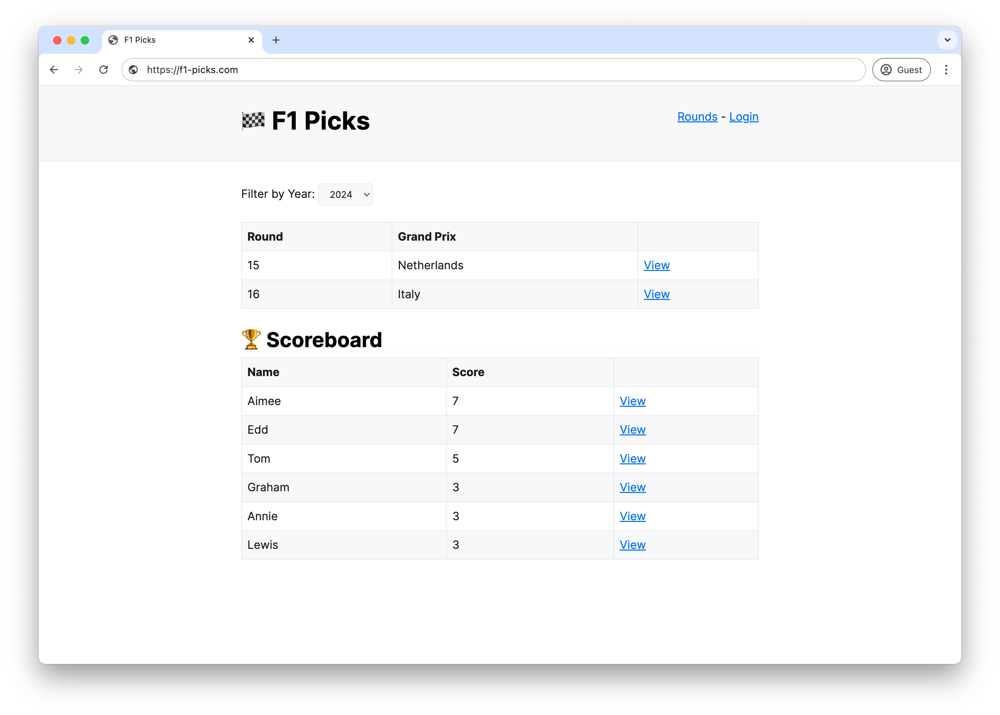
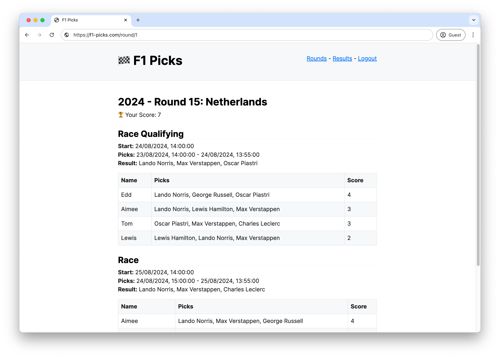

My family and I have been playing a game for the past couple of rounds of this Formula 1 (2024) season.
The game is to predict the top three drivers per race, where after each race picks are scored – 2 points for the correct driver and position, 1 point for the correct driver.
We have been sending these picks over WhatsApp and then tallying up the scores manually.
Before the Formula 1 season summer break ended, I wanted to see how quickly I could build something that allowed us to share and score these picks online.

 

The 🏁 complete build is available on [GitHub](https://github.com/eddmann/f1-picks).

## The Race

I timeboxed four hours on the Friday night before qualifying of the [Dutch Grand Prix](https://www.formula1.com/en/racing/2024/netherlands) to see how far I could get with the build.
With this time constraint, I decided to use [Laravel](https://laravel.com/) for rapid application development and a great deal of ChatGPT to help build out the application behaviour.
From the initial ChatGPT prompt that helped me get the basic structure of the application setup, I used a [small script](https://github.com/mufeedvh/code2prompt) which allowed me to feed in the current source code to the prompt to help iterate on the solution and add additional behaviour.
After a lot of back and forth with ChatGPT and a bunch of manual development, I was able to ship a working application just past the four-hour window.

After the four-hour window, I had:

- Local development environment working with Docker.
- Classless styling using [new.css](https://newcss.net/).
- Working user authentication via Google social login.
- Ability to record picks for a given round race (type), based on a specified pick window.
- Ability for select users (based on role) to record the race (type) results, upon which an asynchronous job is dispatched to update the relevant pick scores.
- Serverless deployment to Lambda, using [Bref](https://bref.sh/), [Serverless Lift](https://www.serverless.com/plugins/serverless-lift) (for handling SQS and CloudFront concerns) and [Neon](https://neon.tech/).
- Domain logic spread across many different layers 😬, but it works!

## The Podium

I really enjoyed having a timeboxed window to work within.
It simulated an extreme case of the MVP process that is used when shipping new products and features to market in a lean manner.
In doing this, it made me focus on what was truly required to provide the desired functionality at the end, instead of veering off into the minutiae of some decision or another.

Being able to not only build out the application functionality but also get it deployed so that it was usable by my family in time for the Dutch Grand Prix weekend was incredibly rewarding.
It highlights how proficient Laravel as a framework is at building applications such as this, and coupled with Bref and Serverless Lift abstractions they are an incredibly powerful combination.
Granted, the domain being modelled was not complex and was very CRUD-heavy - however, there was plenty of boilerplate and ancillary concerns that ChatGPT could take care of for me, which is a big win!

Going forward, I would like to explore the possibility of doing some more of these timeboxed challenges, perhaps taking the same idea and implementing it in another language and tech stack.

🏎️ 💨
