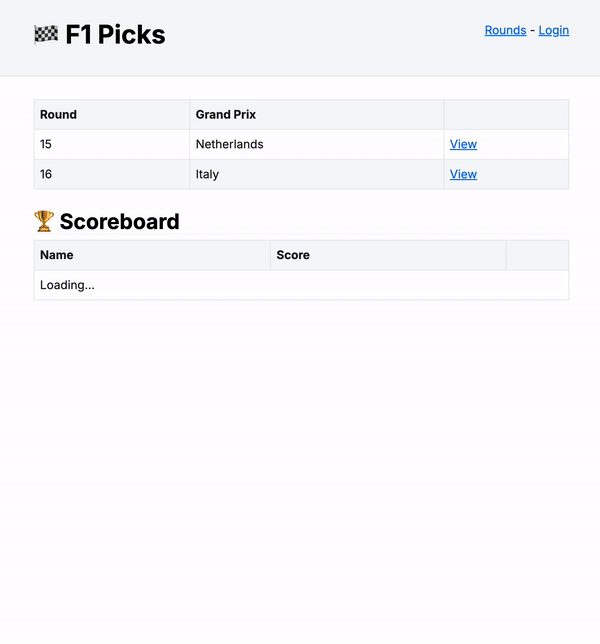

If you read my previous post, ["Building an F1 Picks Game in 4 Hours: It's Lights Out and Away We Go!"](../2024-08-30-building-an-f1-picks-game-in-4-hours/index.md), you'll know that my family and I have been enjoying a Formula 1 prediction game this season - submitting our top three picks for each race, scoring points, and keeping the family WhatsApp chat buzzing with friendly rivalry.
The MVP was built in a single evening using Laravel, with a healthy dose of ChatGPT and a dash of serverless magic to get it over the finish line.
It was a fun and frantic experience (and yes, the codebase shows it 😬).

But, as any developer will tell you, the urge to tinker is perennial.
With the advent of [NextJS 14](https://nextjs.org/blog/next-14), boasting shiny features like the App Router, React Server Components (RSC), Suspense, Response Streaming, and Server Actions, I found myself itching for an excuse to try it all out.
Throw in the [Lambda Web Adaptor](https://github.com/awslabs/aws-lambda-web-adapter) and the [AWS CDK](https://aws.amazon.com/cdk/), and I had a full grid of technologies just waiting to be unleashed.

So, I decided to reimplement F1 Picks from the ground up.
Let's dive into the build! 🚦



## What's Under the Hood?

Before getting stuck in, here's a quick rundown of the technologies I used:

- **NextJS 14**: Exploring App Router, React Server Components, Suspense, Response Streaming and Server Actions.
- **Prisma**: For persistence requirements.
- **NextAuth.js**: For Google OAuth login.
- **AWS Lambda + Lambda Web Adaptor**: For running NextJS on serverless infrastructure.
- **AWS CDK**: For infrastructure-as-code concerns.

For those keen to see the final result, you'll find everything on [GitHub](https://github.com/eddmann/f1-picks-nextjs).

**Disclaimer:** This was a glorious mix of untested domain, persistence, and presentation logic - ala 2000's PHP 😬.

## Lap 1: Setting Up NextJS 14

I started by scaffolding a new NextJS 14 project, opting straight away for the App Router and enabling all the latest features.
If you haven't tried React Server Components (RSC) yet, I thoroughly recommend it - just be prepared for a few "wait, where did my state go?" moments.

**Key takeaways:**

- **App Router**: Enables layouts, nested routes, and server-driven navigation.
- **RSC**: Lets you fetch data directly in your components (on the server), reducing client-side JavaScript and improving performance.
- **Suspense & Streaming**: Pages can be streamed as data loads, which is magic for perceived performance.

If you're curious about RSC and streaming, this [Frontend Masters course](https://frontendmasters.com/courses/intermediate-next-js/) was invaluable - well worth checking out.

## Lap 2: Adding Authentication with NextAuth.js

Having used Google OAuth in the Laravel version, I wanted to keep things familiar for my family (and for myself).
[NextAuth.js](https://next-auth.js.org/) made this refreshingly straightforward.

I found that integrating NextAuth.js with the App Router requires a dash of patience and a good grasp of the new server/client boundaries.
The docs are getting better, but expect to do a bit of trial and error.

## Lap 3: Persistence with Prisma

Swapping out Laravel's Eloquent for Prisma was relatively painless.
I defined my schema (users, rounds, picks, results) in `schema.prisma`, ran a quick `prisma migrate dev`, and was up and running.

Example of a simple `Round` model:

```prisma
model Round {
  year               Int
  round              Int
  name               String
  sprintQualifyingAt DateTime?
  sprintRaceAt       DateTime?
  raceQualifyingAt   DateTime
  raceAt             DateTime
  createdAt          DateTime  @default(now())
  updatedAt          DateTime  @updatedAt

  picks   Pick[]
  results Result[]

  @@id(name: "roundId", [year, round])
}
```

Prisma's TypeScript integration is excellent, and being able to use the type-safe generated client directly in my RSCs was very useful.

## Lap 4: Deploying NextJS to Lambda with Lambda Web Adaptor

This was the part I was most excited about.

Deploying Next.js 14 - especially with its new server features - isn't exactly trivial on AWS Lambda.
Thankfully, the [Lambda Web Adaptor](https://github.com/awslabs/aws-lambda-web-adapter) makes it possible by allowing Lambda to handle HTTP requests just like a traditional Node.js server.

I used the adapter to run my app in Lambda with full support for streaming responses, which are critical for React Server Components and Suspense in Next.js 14.
The key was packaging the app in `standalone` mode and using `response_stream` invoke mode for low-latency, streamed responses.

Here's the full Dockerfile I used:

```dockerfile
FROM public.ecr.aws/lambda/nodejs:20 AS builder
WORKDIR /build
COPY package*.json ./
COPY prisma ./
RUN --mount=type=cache,target=/root/.npm npm ci
COPY ./ ./
RUN rm prisma/seed.ts
RUN --mount=type=cache,target=/build/.next/cache npm run build

FROM public.ecr.aws/lambda/nodejs:20 AS runner
COPY --from=public.ecr.aws/awsguru/aws-lambda-adapter:0.8.4 /lambda-adapter /opt/extensions/lambda-adapter
ENV NODE_ENV=production
ENV HOSTNAME=0.0.0.0
ENV PORT=8080
ENV AWS_LWA_PORT=8080
ENV AWS_LWA_READINESS_CHECK_PATH="/api/health"
ENV AWS_LWA_INVOKE_MODE="response_stream"
ENV AWS_LWA_ENABLE_COMPRESSION=true

COPY --from=builder /build/next.config.mjs ./
COPY --from=builder /build/public ./public
COPY --from=builder /build/.next/static ./.next/static
COPY --from=builder /build/.next/standalone ./
COPY --from=builder /build/run.sh ./run.sh

RUN ln -s /tmp/cache ./.next/cache

ENTRYPOINT ["sh"]
CMD ["run.sh"]
```

These environment variables were of note:

- `AWS_LWA_INVOKE_MODE="response_stream"` for enabling streaming.
- `AWS_LWA_READINESS_CHECK_PATH="/api/health"` for effective health checks.
- `AWS_LWA_ENABLE_COMPRESSION=true` to improve response size and speed.

I based alot of this work on one of the Docker [example](https://github.com/awslabs/aws-lambda-web-adapter/tree/main/examples/nextjs/app) available in the Lambda Web Adapter repository.

## Pit Lane: What I Learned

This project was a fantastic excuse to get hands-on with the newest NextJS features and to experiment with deploying a full-featured app to AWS Lambda using tools like the Lambda Web Adaptor and AWS CDK.
Here are some reflections from the journey:

- **NextJS 14** is incredibly powerful, but the learning curve - especially around RSCs, Suspense, and the server/client split - can be steep. Expect to spend some time debugging hydration issues and wrangling types.
- **Serverless hosting** for NextJS is maturing rapidly. With the Lambda Web Adaptor and examples from the AWS community, you can get surprisingly far with a modest amount of effort.
- **Prisma** makes TypeScript database interactions a breeze - especially compared to some older ORMs I've wrangled with.
- **AWS CDK** was another shift. I've been very accustomed to Terraform's DSL, so moving to a general-purpose programming language took some adjustment. While I initially missed the declarative style, the flexibility and power of CDK's [Construct](https://docs.aws.amazon.com/cdk/v2/guide/constructs.html) abstractions really grew on me. Of course, with great power comes great responsibility - you have to be disciplined in how you structure and use that power.

Until the next rebuild, I'll see you in the pit lane. 🏁
