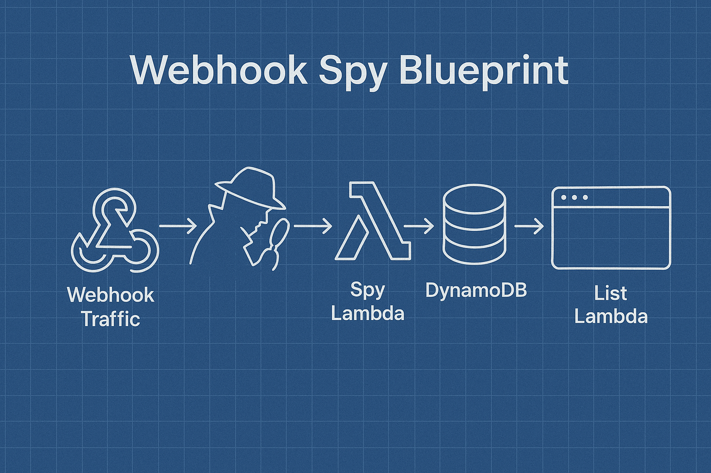

Have you ever wanted to peek behind the curtain and see exactly what requests your webhooks are sending, but didn't fancy wrestling with SaaS tools or spinning up a full-blown server? Well, I certainly did.
That's why I decided to build [Webhook Spy](https://github.com/eddmann/webhook-spy) – a delightfully minimal, serverless webhook request logger that you can deploy and own yourself!

Let's embark on this journey together and see how absurdly easy (and cheap!) it is to create your own webhook spy service on AWS.
Spoiler: I got it built and running in under an hour ⏱️.



## Why Webhook Spy?

As a developer, I frequently integrate with third-party services and build systems that rely on inter-service communication (like event-driven or service-oriented architectures), each sending webhook requests to my endpoints.
While there are plenty of [commercial](https://pipedream.com/requestbin) [request](https://webhook.site/) bin services out there, I found myself wanting:

- Complete control & data ownership (my requests, my rules).
- No faffing about with expiring bins or complex dashboards.
- A service that costs next to nothing (let's face it, most of these requests are just for staging).
- Something I could spin up (and tear down) in minutes.

And thus, Webhook Spy was born! It consists of just two AWS Lambda functions and a DynamoDB table.
One Lambda logs incoming requests to DynamoDB, while the other lists them in a pretty HTML page.
DynamoDB TTL takes care of the clean-up, so you don't have to lift a finger. 🎉

## How It Works

Let's walk through the architecture and see how it all fits together.

### 🧩 Components

1. **Spy Lambda** – Receives incoming webhook requests and stores them in DynamoDB.
2. **List Lambda** – Fetches and displays the logged requests for a given path.
3. **DynamoDB Table** – Persists the request data and automatically expires old entries.

Each request is grouped by the _path name_, making it easy - and frictionless - to segment traffic for different use-cases (think `/stripe`, `/github`, or `/my-webhook-endpoint`).
You own and deploy everything, so you know where your data lives.

## The Code: Simple, Effective, and Yours

I promised this would be minimal, so let's look at the core logic.
I'll share both Lambda functions and the essential Serverless Framework config.

### 1. Logging Requests: The Spy Lambda

This Lambda takes any incoming request, grabs all the relevant details, and drops them into DynamoDB.
It also sets an expiry timestamp, so DynamoDB can auto-delete old entries.
Here's the code:

```js
'use strict';

const { DynamoDBClient } = require('@aws-sdk/client-dynamodb');
const { DynamoDBDocumentClient, PutCommand } = require('@aws-sdk/lib-dynamodb');

const client = new DynamoDBClient();
const dynamo = DynamoDBDocumentClient.from(client);

const epoch = () => Math.floor(new Date().getTime() / 1000);

module.exports.handler = async event => {
  const expireInSeconds = process.env.REQUEST_EXPIRY_AFTER_DAYS * 24 * 60 * 60;

  await dynamo.send(
    new PutCommand({
      TableName: process.env.TABLE_NAME,
      Item: {
        PathName: event.rawPath,
        OccurredAt: epoch(),
        ExpiresAt: epoch() + expireInSeconds,
        Request: JSON.stringify(event),
      },
    })
  );

  return {
    statusCode: 200,
    body: '{}',
    headers: {
      'Content-Type': 'application/json',
    },
  };
};
```

**What's going on here?**

- We capture the full request event as JSON.
- Each entry is keyed by `PathName` (as the Primary Key) and `OccurredAt` (timestamp, as the Sort Key).
- TTL magic: `ExpiresAt` tells DynamoDB when to auto-delete the record.
- Returns a simple `200 OK` – webhooks will be delighted.

### 2. Viewing Requests: The List Lambda

Now for the fun part: seeing what arrived!
This Lambda queries DynamoDB for all requests to a certain path, then renders them in a friendly HTML page.

```js
'use strict';

const { DynamoDBClient } = require('@aws-sdk/client-dynamodb');
const {
  DynamoDBDocumentClient,
  QueryCommand,
} = require('@aws-sdk/lib-dynamodb');

const client = new DynamoDBClient();
const dynamo = DynamoDBDocumentClient.from(client);

module.exports.handler = async event => {
  const results = await dynamo.send(
    new QueryCommand({
      TableName: process.env.TABLE_NAME,
      KeyConditionExpression: 'PathName = :pathName',
      ExpressionAttributeValues: { ':pathName': event.rawPath },
      ScanIndexForward: false,
    })
  );

  return {
    statusCode: 200,
    headers: {
      'Content-Type': 'text/html',
    },
    body: `
      <html>
      <head>
        <link rel="stylesheet" href="https://cdn.jsdelivr.net/npm/open-fonts@1.1.1/fonts/inter.min.css">
        <link rel="stylesheet" href="https://cdn.jsdelivr.net/npm/@exampledev/new.css@1.1.2/new.min.css">
        <title>Webhook Spy</title>
      </head>
      <body>
        <header>
          <h1>Webhook Spy</h1>
          <div>Path: ${event.rawPath}</div>
        </header>
        ${results.Items.map(result => {
          const request = JSON.parse(result.Request);
          try {
            request.body = JSON.parse(request.body);
          } catch (e) {}

          return `
            <div>
              <time datetime="${result.OccurredAt}"></time>
              <pre>${JSON.stringify(
                {
                  method: request.requestContext.http.method,
                  path: request.requestContext.http.path,
                  query: request.rawQueryString,
                  protocol: request.requestContext.http.protocol,
                  sourceIp: request.requestContext.http.sourceIp,
                  headers: request.headers,
                  body: request.body,
                },
                null,
                2
              )}</pre>
            </div>
          `;
        }).join('\n')}
        <script>
          [...document.getElementsByTagName('time')].forEach((time) => {
            time.innerHTML = new Date(time.getAttribute('datetime') * 1e3).toLocaleString();
          });
        </script>
      </body>
      </html>
    `,
  };
};
```

**Highlights:**

- Relevant path-based results are sorted with the newest entries shown first.
- Each request is rendered in a readable format, with headers, query string, body, and more. If the request body contains JSON, we attempt to prettify it as well.
- Light CSS styling is applied for better readability.

### 3. The Serverless Framework Setup

You can deploy the whole service with the [Serverless Framework](https://www.serverless.com/).
Here's the `serverless.yml` that glues it all together:

```yaml
service: webhook-spy
frameworkVersion: '3'

custom:
  tableName: ${self:service}-${opt:stage}
  requestExpiryAfterDays: 1

provider:
  name: aws
  runtime: nodejs20.x
  iam:
    role:
      statements:
        - Effect: Allow
          Action:
            - dynamodb:Query
            - dynamodb:PutItem
          Resource:
            - 'Fn::GetAtt': [Table, Arn]
  environment:
    TABLE_NAME: ${self:custom.tableName}

functions:
  spy:
    handler: spy.handler
    url: true
    environment:
      REQUEST_EXPIRY_AFTER_DAYS: ${self:custom.requestExpiryAfterDays}
  list:
    handler: list.handler
    url: true

resources:
  Resources:
    Table:
      Type: AWS::DynamoDB::Table
      Properties:
        TableName: ${self:custom.tableName}
        AttributeDefinitions:
          - AttributeName: PathName
            AttributeType: S
          - AttributeName: OccurredAt
            AttributeType: N
        KeySchema:
          - AttributeName: PathName
            KeyType: HASH
          - AttributeName: OccurredAt
            KeyType: RANGE
        TimeToLiveSpecification:
          AttributeName: 'ExpiresAt'
          Enabled: true
        BillingMode: PAY_PER_REQUEST
```

**What I love about this:**

- **PAY_PER_REQUEST**: No idle costs, only charged for what you use.
- **Automatic cleanup**: DynamoDB handles deleting old requests. No cron jobs, scripts, or post-it notes required.
- **Minimal AWS resources**: Just a few services (Lambda, DynamoDB), all provisioned and decommissioned via this single configuration file.

## Deploying and Using Webhook Spy

Ready to give it a go? Here's the step-by-step:

1. Clone the [repository](https://github.com/eddmann/webhook-spy).
2. _(Optional)_ Edit `custom.requestExpiryAfterDays` in `serverless.yml` to set your preferred retention period.
3. Deploy with Serverless Framework: `npx serverless deploy --stage dev`
4. Pick a path name for your webhook group (e.g. `/stripe`).
5. Point your webhook sender to: `https://spy-lambda-function-url/{path-name}`
6. Visit the list endpoint to view requests: `https://list-lambda-function-url/{path-name}`

And that's it! No third-party dashboards, no hidden costs, no expiring endpoints (unless _you_ want them to expire).
Just pure, hands-on webhook spying goodness.

## Reflections, Lessons, and What's Next

I love little projects like this.
They scratch an itch, teach me something new, and (let's be honest) give me an excuse to play with AWS.
Lambda URLs are a perfect fit for this use case and reduce the required AWS resources needed for tiny utilities like this.

**What went well:**

- The whole thing fits comfortably in my head (and in a single blog post).
- DynamoDB TTL means zero maintenance. I can forget about it and it'll quietly clean itself up.
- The cost is almost unnoticeable, even with frequent webhook testing.

**Areas to improve (and possible future work):**

- Add response stubs (beyond just 200s), maybe configurable via query params.
- Authentication! Right now, this is open to anyone with the URL, which amounts to security through obscurity — not ideal.
- Better search features: filtering by date, method, etc. – could be handy for those "why did it POST at 2am?" moments.

## Over to You! 🚀

If you've ever needed a quick, private webhook bin for your staging or dev environment, I hope you'll find this as handy as I do.
Feel free to [fork the code](https://github.com/eddmann/webhook-spy) or adapt it for your own use cases.
