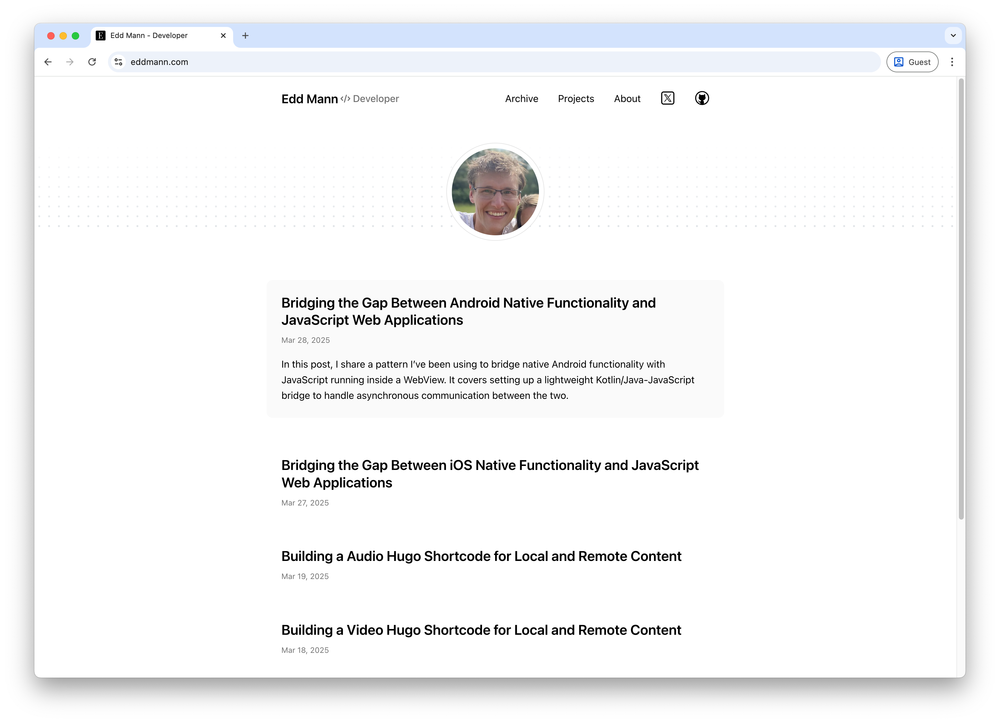

Alright, confession time: until recently, my CSS skills were stuck in a bit of a time warp - think `float: left;`, `clear: both;`, and the occasional `clearfix` hack.
It's wild how much the landscape has changed over the last decade 🤯.

This post is the story of how I rebuilt my blog from the ground up: no frameworks, no preprocessors - just hand-rolled CSS and semantic HTML.
Along the way, I rediscovered the power of modern CSS and gained a new appreciation for the tools we now have.
And yes, I did chase the elusive 100% [Lighthouse](https://developer.chrome.com/docs/lighthouse/overview) score, because having a clear, measurable goal helped guide the build.



## Why Start Over?

I'd been feeling the pull for a while.
My previous blog design worked well enough - but it felt increasingly outdated, both visually and under the hood.
I wanted something minimal and clean, with content front and centre.
More importantly, I wanted to learn how all the pieces fit together - no _cheating_ with pre-made themes this time!
That said, I did take inspiration from the [Hugo Paper theme](https://themes.gohugo.io/themes/hugo-paper/) and Tailwind's [typography prose utilities](https://tailwindcss.com/docs/typography-plugin) 🙏.
The final result is built entirely with vanilla CSS - no Sass, no Tailwind, just selectors and variables.
It was both challenging and rewarding.

## Structuring My CSS: BEM vs Utility-First

One of the first major decisions was how to approach class naming and structure.
In the past, I'd usually ended up with a messy soup of inconsistent class names.
This time around, I wanted something more maintainable.
There's an ongoing debate between [BEM](https://getbem.com/) (Block Element Modifier) and utility-first approaches (popularised by [Tailwind](https://tailwindcss.com/)).
After some research and trial-and-error, I took a hybrid route - largely inspired by Kevin Powell's recent [Frontend Masters course](https://frontendmasters.com/courses/pro-css/).

The naming convention I landed on was:

- **BEM:** Used for structural components – e.g. `blog-post__title`, `nav__link`.
- **Utility classes:** Prefixed with `u-`, like `u-underline`, `u-prose`, `u-visually-hidden`.
- **Layout classes:** Prefixed with `l-`, like `l-container`.
- **JavaScript hooks:** Prefixed with `js-`, for behaviour-specific selectors.

This combination gave me clarity and flexibility.
BEM handled the core architecture, while utilities let me avoid unnecessary specificity or repetition.

### Example: BEM + Utility in Practice

```html
<article class="blog-post u-prose">
  <h1 class="blog-post__title u-underline">Relearning CSS</h1>
  ...
</article>
```

Utility classes like `u-underline` let me introduce simple one-off styles without bloating the BEM classes.

## CSS Variables: The Secret Sauce

One of the most significant upgrades in my workflow came from fully embracing CSS custom properties.
They're incredibly useful - not just for global theming, but also for abstracting reusable values.

### Private Variables

For internal component variables, I adopted a convention of prefixing with an underscore to indicate their local scope.

```css
.social-icon {
  --_size: 1.5rem;
  width: var(--_size);
  height: var(--_size);
}
```

This made it easy to express the intent and meaning behind the value within this limited scope.

### Button Theming with Variables

I used variables to handle theming across different button states.
This approach let me create consistent but easily customisable variants.

```css
.button {
  --button-text-color: #000;
  --button-bg-color: #e0e0e0;

  color: var(--button-text-color);
  background-color: var(--button-bg-color);
}

.button--primary {
  --button-text-color: #fff;
  --button-bg-color: #007bff;
}

.button--secondary {
  --button-text-color: #fff;
  --button-bg-color: #6c757d;
}
```

```html
<button class="button button--primary">Primary Button</button>
<button class="button button--secondary">Secondary Button</button>
```

Adding new variants now just means defining a few new custom properties.

## rem vs em vs ch vs px: The Great Unit Debate

If you've ever fallen down the rabbit hole of CSS units, you know it's endless.
Here's what worked for me:

- **rem:** Used for most layout and font sizing - ensures consistency relative to the root.
- **em:** Ideal for buttons, badges, and tags - scales with local font size.
- **ch:** Useful for setting max widths on text blocks - `max-width: 74ch;` provides excellent readability.
- **px:** Reserved for borders or precise values where scaling isn't useful.

This combination gave me fine control while preserving scalability and accessibility.

## File Structure and CSS Layers

While CSS Layers (`@layer`) are a promising new tool for managing cascade order, I chose not to use them at this time.
Instead, I organised my files manually and imported them in a consistent order.
For now, this keeps things simple, but I plan to revisit layers in a future refactor to better manage override scopes.

```
01_reset.css
02_variables.css
03_base.css
04_component_*.css
05_utitles.css
```

## Semantic HTML: Not Easy, But Essential

One of my biggest takeaways? Getting semantic HTML right is _hard_.
I spent ages agonising over whether something should be an `<article>` or `<section>` 🤔.
Kevin even mentioned how tricky this is in his course discussed earlier.
However, the effort is well justified given the substantial benefits to both accessibility and search engine optimisation (SEO).
I took particular care in selecting the appropriate semantic elements for:

- `<article>` - Self-contained content like blog posts or news that can stand alone.
- `<section>` - Thematic grouping of related content within a page.
- `<nav>` - Primary navigation block linking to other parts of the site or page.
- `<header>` - Introductory content like titles or navigation for a page or section.
- `<footer>` - Concluding or supplemental content such as metadata or links.
- `<main>` - The main, unique content of the page, excluding headers or footers.
- `<aside>` - Tangential or complementary content, often shown in sidebars.

## Prioritising Readability

As a blog, the text is the most important element - so the design needed to support and enhance readability.
I spent time crafting a typography-first layout to prioritise comfort and clarity.

To start, I set a maximum line width of `74ch`, which offers a pleasant reading experience by limiting the number of characters per line.
This small detail plays a big role in reducing visual fatigue.
For responsive font sizing, I implemented a [major second scale](https://noahliebman.net/2024/01/the-math-and-css-of-responsive-type-scales/) (1.125) using CSS variables.
This created a harmonious scale of type sizes across headings and paragraphs:
Using `calc()` in combination with CSS variables proved incredibly useful for these font size calculations, as it enabled scalable, relative sizing without hardcoding values.

```css
:root {
  --font-size-root: 1rem;
  --font-scale-ratio: 1.125;
  --font-size-0: var(--font-size-root);
  --font-size-1: calc(var(--font-size-0) * var(--font-scale-ratio));
  --font-size-2: calc(var(--font-size-1) * var(--font-scale-ratio));
}
```

I also defined spacing in `0.25rem` increments using custom properties.
This established a consistent vertical rhythm across all elements:

```css
:root {
  --spacing-step: 0.25rem;
  --spacing-1: var(--spacing-step);
  --spacing-2: calc(var(--spacing-step) * 2);
}
```

Lastly, I created a utility class called `u-prose`, inspired by Tailwind's [typography prose utilities](https://tailwindcss.com/docs/typography-plugin), to style Markdown-generated content.
This helped bring polish and coherence to text blocks I had no direct control over.
I used expressive selectors like `* + *` to apply spacing and styling between elements contextually.

## Enhancing User Experience

I aimed for thoughtful, subtle enhancements rather than attention-grabbing effects.
Based on experience from a previous [Frontend Masters course](https://frontendmasters.com/courses/css-animations/), I realised the value of incorporating animation-based improvements to elevate the overall user experience.

Throughout a user's journey on the website, they'll encounter a number of small but meaningful touches.
Project cards smoothly zoom on hover, while post titles reveal animated underlines, providing an elegant visual cue.
Project cards gently appear as you scroll down the page, driven by `animation-timeline: view()`.
Similarly, a scroll-based progress bar animates at the top of each post using `animation-timeline: scroll()`.
The main navigation bar remains hidden until you scroll upward, helping you find it just when you're likely to need it.
Page transitions between the homepage and individual posts are enhanced using the [View Transitions API](https://developer.chrome.com/docs/web-platform/view-transitions/), making the browsing experience feel more fluid.
Within the desktop experience, the archive year label remains visible thanks to `position: sticky`, improving orientation while scrolling.



All animations are implemented with accessibility in mind, fully respecting the `prefers-reduced-motion` setting.
Additionally, hover-based effects only appear on devices that support them, thanks to the use of `@media (hover: hover)`.
This ensures that touch devices don't suffer from awkward or irrelevant hover behaviours, maintaining a clean and intuitive experience across all platforms.



## Theme Switching: Dark, Light, and Future-Proof

I wanted a dark mode toggle, but with flexibility to add more themes in the future (hello, Solarized!).
I used a `data-theme` on the `<html>` element, switched via a little JavaScript, and fell back to CSS's `prefers-color-scheme` for those who don't have a preference.

```js
document.documentElement.setAttribute('data-theme', 'dark');
```



## Accessibility: Not Just a Checkbox

Making the site accessible was not optional - it was a fundamental requirement.
I placed particular emphasis on ensuring strong colour contrast across the design, verifying all combinations using developer tools and Lighthouse to confirm they met accessibility standards.

Screen reader compatibility was another priority.
I took care to use appropriate ARIA attributes and semantic HTML elements to ensure assistive technologies could interpret the content effectively.
Every image was provided with descriptive alternative text, with the help of [AI Alt Text Generator](https://alttext.ai/), to ensure visual information was communicated clearly to users who rely on screen readers.

Keyboard navigation was also fully supported.
I ensured that all interactive elements could be accessed and operated via keyboard alone, which is essential for users who cannot use a mouse.

To supplement my manual efforts, I used ChatGPT to review the markup for any accessibility issues I might have overlooked - particularly those involving ARIA usage.
It proved especially helpful for spotting subtle problems and improving the overall structure.

## Moving to Hugo

Previously, I used Jekyll as my static site generator; however, during this rebuild I transitioned to [Hugo](https://gohugo.io/), which proved to be far more flexible and better aligned with my present-day workflow.

One of Hugo's standout features is its use of shortcodes, which made it easy to embed video, audio, and images throughout my posts.
I explored several of these in [previous](../2025-03-18-building-a-video-hugo-shortcode-for-local-and-remote-content/index.md) [posts](../2025-03-19-building-a-audio-hugo-shortcode-for-local-and-remote-content/index.md), and they've helped simplify content authoring significantly.

I also implemented a custom image render hook, which allows me to serve resized images using the `<picture>` element.
This setup delivers WebP images when supported, while gracefully falling back to JPEG or PNG formats - ensuring optimal performance across different devices and browsers.

To improve user experience further, I configured a link render hook so that external links automatically open in a new tab and include `rel="noopener noreferrer"`.
These links also display an icon to make it clear they will take the user off-site - a small detail, but one that adds clarity and builds trust.

Asset management has also become much more intuitive.
I now colocate images and supporting files alongside each post.
For example:

```
2024-01-15-solving-the-advent-of-code-2023-calendar-in-kotlin-and-swift
|_ index.md
|_ image.png
```

Lastly, Hugo's separation of content and presentation has been a game-changer.
With the help of render hooks and clean CSS, I've stripped almost all HTML from my Markdown posts.
Even complex layouts - like images displayed side by side - are handled entirely through CSS using selectors like `:has` and `grid`, rather than relying on inline markup.

```css
p:has(img),
p:has(picture),
p:has(video) {
  display: grid;
  grid-auto-flow: column;
  align-items: center;
  gap: var(--spacing-2);
}
```

## What I Learned

This rebuild was both challenging and incredibly rewarding.
I came away with a stronger grasp of modern CSS, semantic HTML, and the finer points of building a fast, accessible, content-focused site.

One of the biggest takeaways from this project was how much CSS has matured.
Features like custom properties, logical properties, and native nesting have made writing styles more intuitive and maintainable.
Combined with a thoughtful structure - using BEM alongside utility classes - I was able to create a flexible and consistent system that didn't rely on external frameworks.
Equally important was a renewed focus on semantic HTML.
Using the right elements for the right job not only improves accessibility and SEO but also makes the code easier to work with long-term.
Good structure supports everything else.

Accessibility was another area that stood out.
It's not a one-time task, but a continuous part of the design and development process.
Fortunately, modern tools like Lighthouse and DevTools - plus the occasional AI-assisted review - make it much more approachable.
I also found that small enhancements like animations can add meaningful polish when treated as progressive improvements rather than core functionality.
And on the technical side, working with Hugo was a real highlight.
It offered just the right level of abstraction while still giving me full control over content and presentation through shortcodes, render hooks, and asset pipelines.
