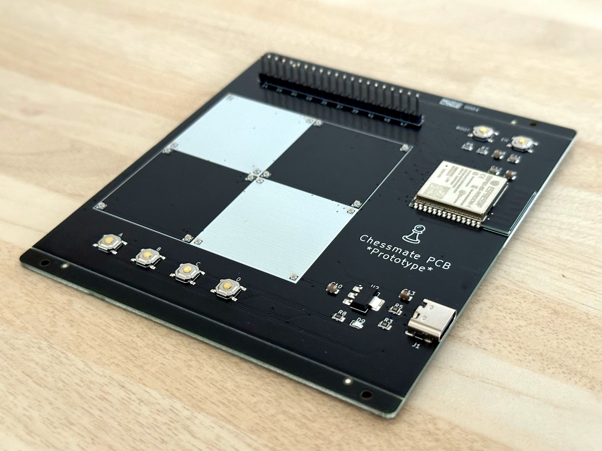
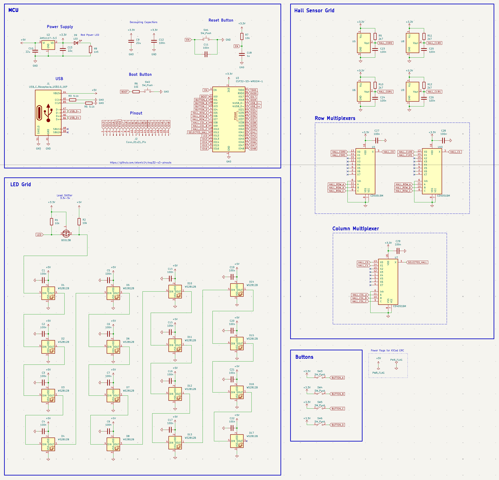
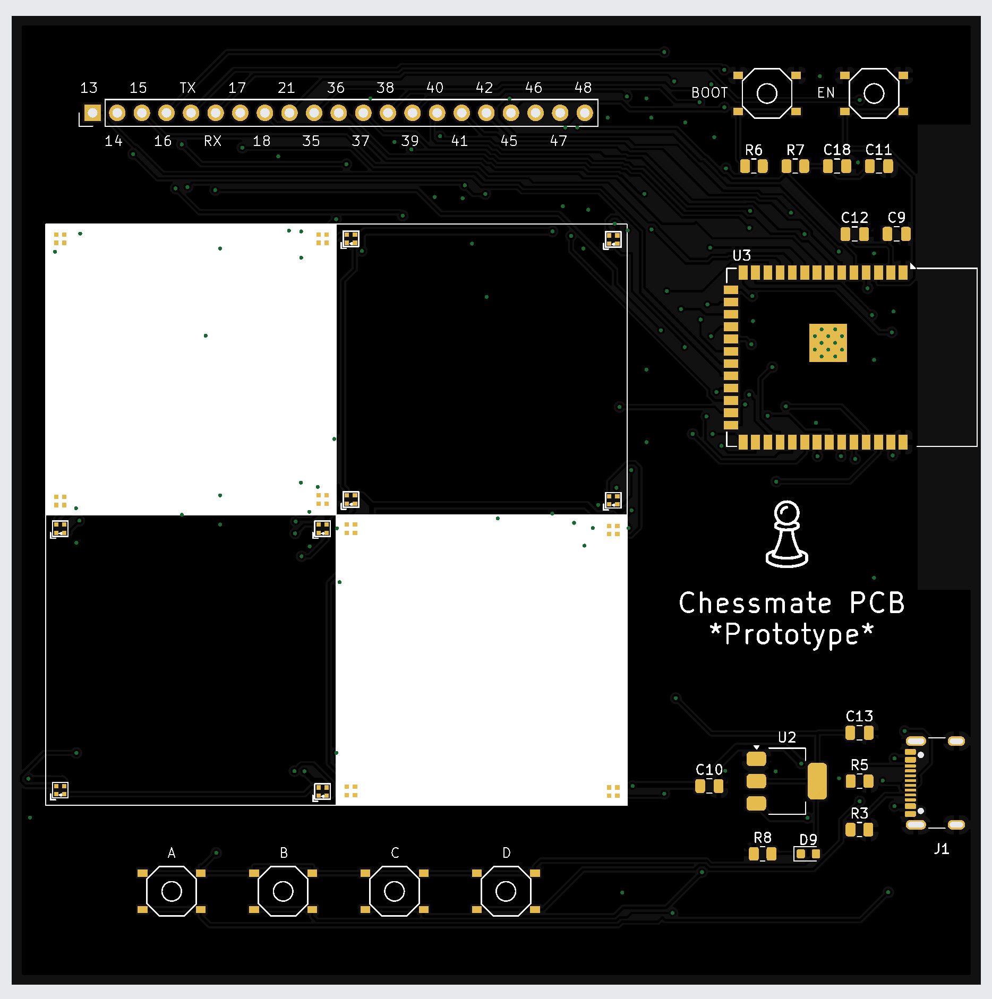
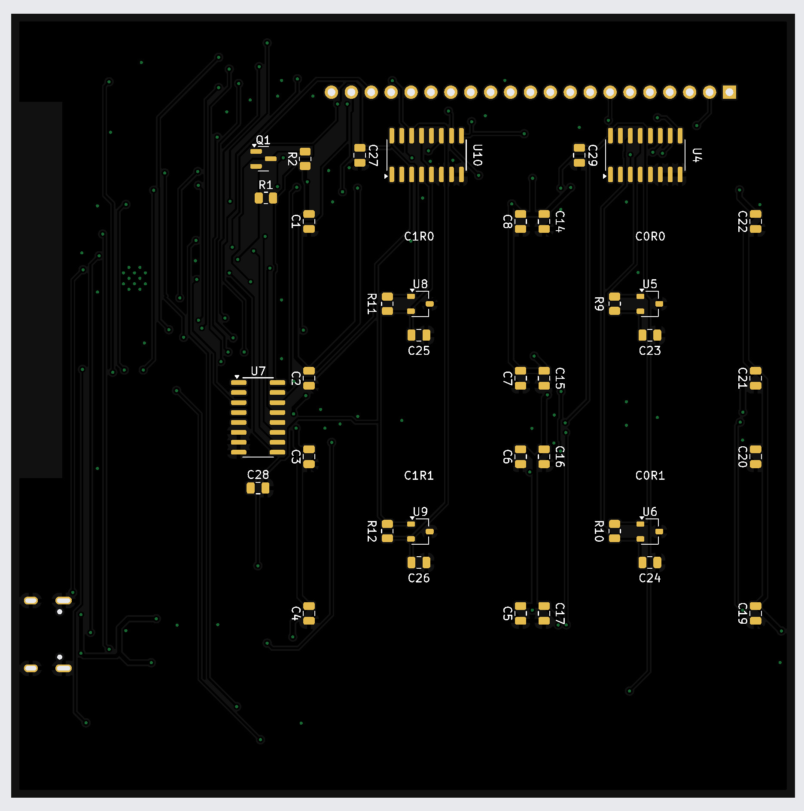
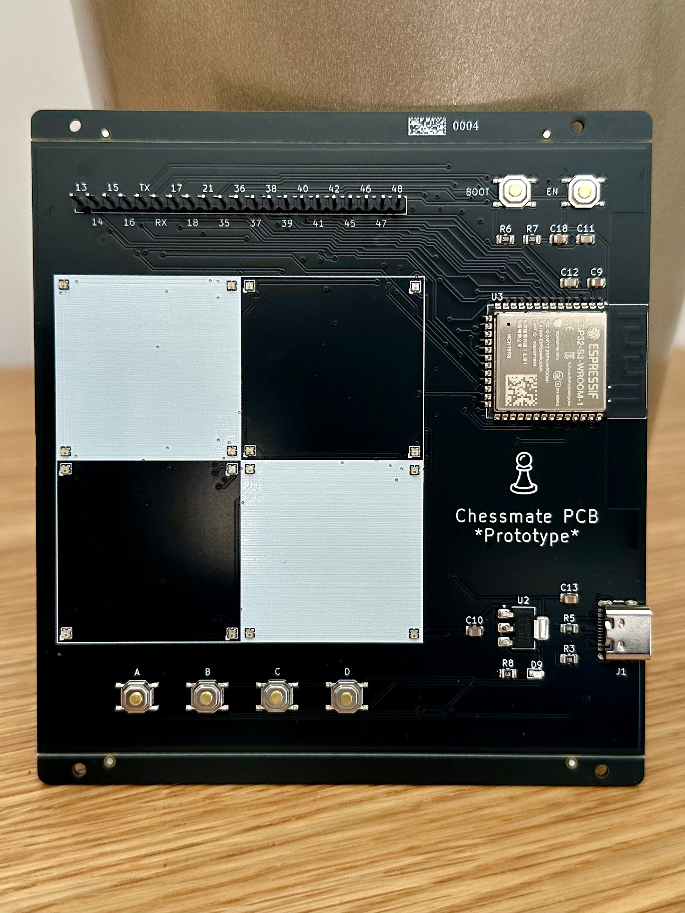
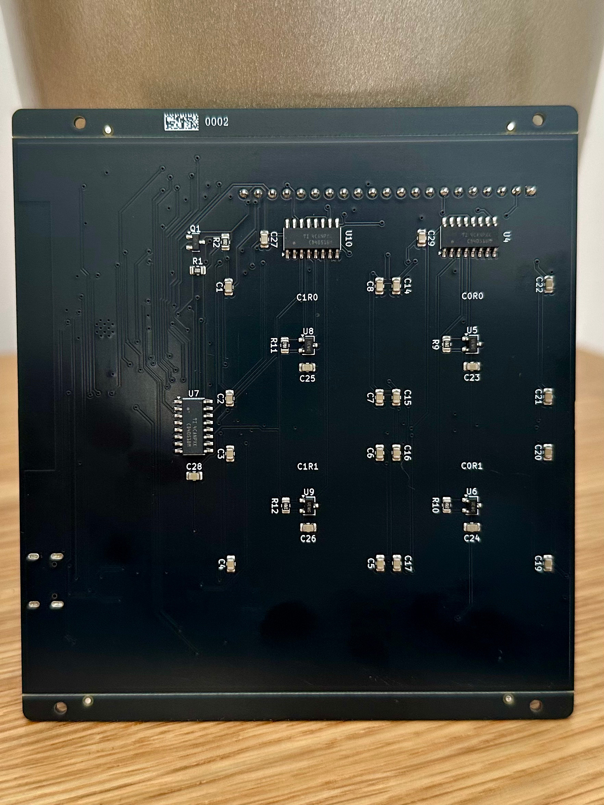

Over the past few months, I've found myself increasingly fascinated by the world of PCB (Printed Circuit Board) design.
There's something almost magical about taking a concept from your head, mapping it out in software, and finally holding a physical board in your hands.
To truly get hands-on and learn, I decided to embark on a project that would combine both my interest in chess and my curiosity for electronics: designing and building my own electronic chessboard.

In this post, I'll walk you through the motivations, design decisions, and lessons learnt as I took my first steps into PCB design - hopefully demystifying some of the process for those considering their own hardware adventure!

## Why an Electronic Chessboard?

I wanted a project that would not only push my technical boundaries but also yield something genuinely interactive and fun.
An electronic chessboard ticked all the boxes:

- **Local and remote play**: The idea is to play against local and remote (using the [Chessmate](https://chessmate.cloud/) API) bots, with the future goal of supporting remote human play.
- **User feedback**: I opted for per-square feedback using WS2812 (aka NeoPixel) RGB LEDs, providing clear visual cues for moves and game states.
- **Piece presence detection**: Instead of identifying individual pieces (which would have required costly RFID hardware), I decided to use hall sensors to simply detect whether a piece is present on a square.
  The MCU (ESP32-S3) would maintain the board state and inform the user of its internal model, so physical and digital states can stay synchronised.

## Planning the Prototype: Limiting Scope and Validating Ideas

Before rushing headlong into a full chessboard (which would require 64 sensors, 256 LEDs (4 per square), and a large, expensive PCB), I limited my first board to a manageable 100x100 mm prototype.
Interestingly, I discovered that with [JLCPCB](https://jlcpcb.com/), smaller PCBs weren't actually any cheaper, so I figured I might as well make full use of the available 100x100 mm space.

### Key Goals for the First Board

- **Test hall sensor through-PCB detection**: I needed to verify that the hall sensors could reliably detect magnetic pieces through the PCB material and determine their optimal positioning.
- **Validate WS2812 LED placement and brightness**: I wanted to ensure the LEDs would be bright enough for clear visibility in various lighting conditions without interfering with the hall sensors.
- **Confirm MCU (ESP32-S3) configuration and power management**: I needed to verify the ESP32-S3 could handle multiple tasks simultaneously - reading sensors, controlling LEDs, managing game logic, handling the display, and running local chess engines.
- **Explore button placement options**: I wanted to test different button positions for user interface elements like reset buttons, mode switches, and menu navigation.
- **Break out pins for display exploration**: I added a pin header exposing all unused MCU pins to experiment with display options for the full chessboard.
- **Prototype a multiplexer setup for hall sensors**: Since reading 64 hall sensors individually would require too many GPIO pins, I implemented a 2x2 matrix approach using rows and columns to scan sensors sequentially.
  This prototype validates the timing, noise handling, and overall reliability before scaling up.

I felt this would allow me to "fail fast" and learn on a small scale before scaling up to the full chessboard.

## Schematic Design: Divide and Conquer

I quickly realised that designing an electronics schematic is not dissimilar to writing modular code.
I could compartmentalise different subsystems (LEDs, sensors, MCU, power, buttons, etc.) and then integrate them into a cohesive whole during the final stages of the design.

Here are some key insights and tools I found invaluable:

- **KiCad's ERC (Electrical Rules Check)**: This feature saved me countless times, catching issues early before they became headaches on the PCB.
- **Choosing components early**: Since I planned to use JLCPCB for assembly (who source from [LCSC](https://lcsc.com/)), I made sure all my parts were available and, if possible, in their "basic" range to keep costs down.
- **JLCPCB KiCad plugin**: This [plugin](https://github.com/Bouni/kicad-jlcpcb-tools) lets you attach metadata (like part numbers) directly in KiCad, making the Bill of Materials (BOM) export seamless.
- **Learning about USB-C**: I discovered the required 5.1kΩ resistors to enable 5V power draw on USB-C connections - a small but crucial detail!
- **ESP32-S3**: I chose this MCU for its performance (ideal for local bot play!) and built-in native USB support, removing the need for a separate USB-UART chip.

Given the ESP32's limited GPIO pins, reading 64 hall sensors directly wasn't feasible.
The solution? A multiplexer setup - effectively a matrix of columns and rows, scanning each square in turn.
For this first board, I implemented a "2x2" version, just enough to validate the concept.

## PCB Layout: Where the Magic (and Mistakes) Happen

With the schematic complete, I moved onto PCB layout - easily the most daunting part for a first-timer.

### Lessons and Tips from the Layout Process

- **Component placement**: Place decoupling capacitors as close as possible to their destinations, and arrange components to make routing easier for the auto-router.
- **Double-check everything**: I nearly ordered the board with the wrong LED pin mapping, but my friend Richard caught it at the eleventh hour 🙏.
  Always review datasheets thoroughly - you're building a real device, not just something on a screen.
- **Power and ground design**: Use wider tracks for 5V and ground lines, and implement a ground plane wherever possible.
- **Keep-out zones**: For aesthetics and to prevent interference with hall sensors, I created keep-out areas beneath the chessboard squares.
- **Routing tools**: KiCad lacks a built-in auto-router, so I used [Freerouting](https://www.freerouting.app/) (an external tool) to help with track routing, though manual routing is something I want to explore further.
- **Design validation**: Run DRC (Design Rules Check) religiously to catch unconnected nets and visualise any copper island's.

## Ordering and Assembly: The Big Leap

After many revisions, much back and forth with the DRC, and invaluable help from Richard, I was finally ready to order.
I chose [JLCPCB](https://jlcpcb.com/) as my PCB manufacturer and assembly partner.
Thanks to the KiCad plugin I mentioned earlier, exporting the required files (Gerber files, BOM, and placement files) in the exact format they needed was straightforward.
Their online submission process was equally smooth.
The experience was reassuring from the start - they reached out via email to confirm LED polarity before assembly, which showed their attention to detail.
The timeline was impressive: I received five boards (three assembled) just nine days after placing my order!
I opted for a black PCB finish, which would give the final chessboard a classic, professional look.

## The Moment of Truth: Testing the Board

I'll admit, I checked the order status multiple times a day - oscillating between excitement and dread that I'd just bought five very expensive coasters.
When the boards arrived, I loaded up my test program, plugged everything in, and... it worked! 🎉

It was a fantastic feeling - on par with those "aha!" moments in programming.
Even as a prototype, this board validated so many ideas and design choices.
I could now confidently move forward to the full chessboard.



## Reflections and Next Steps

The process reminded me of the Beatles lyric, "I get by with a little help from my friends." Special thanks to [Richard](https://x.com/richardhawthorn) for his expert eyes and patience throughout this journey!

With the prototype successfully validated, I'm excited to explore the ESP32-S3's 8MB PSRAM capabilities (provided with the opted for module variant) for local bots and richer user interfaces.
The next phase will focus on display options that could significantly enhance the user experience.
From there, the main goal is to expand to a full chessboard, applying everything I've learnt to create a complete 8x8 board with all the bells and whistles.
Beyond that, there's always more to learn - manual routing and further optimisation are areas I'm eager to explore.

If you're considering your own PCB project, my biggest tip is to compartmentalise, validate each subsystem, and don't be afraid to ask for help.
The journey is incredibly rewarding, and the satisfaction of holding your first working board is truly special.

Stay tuned - hopefully, my next PCB post will cover the full chessboard, with even more lessons and (fingers crossed!) another successful outcome. ♟️
