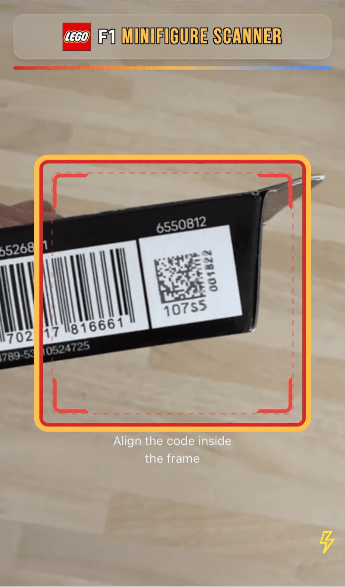

Sunday mornings are for coffee and tinkering ☕️. My nephews have been collecting the LEGO F1 minifigure blind boxes, and they're down to just a few missing figures.
At £3.50 per box, duplicates start to get pricey - and since they're blind boxes, buying the right one is pure luck.

While looking over the packaging, I noticed each box has a unique **Data Matrix code**.
After some digging, I came across [this Reddit thread](https://www.reddit.com/r/lego/comments/1kbntn8/full_list_of_lego_71049_f1_collectibles_blind_box/) that catalogues the codes for each minifigure.
Perfect! That meant it was possible to identify the figure without opening the box.

I realised this was a perfect, self-contained challenge to tackle while trying out GPT-5 in Cursor, and decided to build a quick web app (PWA).

View it live: [LEGO F1 Minifigure Scanner](https://eddmann.com/lego-f1-minifigure-scanner/) - Source: [GitHub repo](https://github.com/eddmann/lego-f1-minifigure-scanner)

 

## The Build

Using Cursor (with the GPT-5 model), I spun up a simple app in about 45 minutes. The idea was straightforward:

1. Scan the Data Matrix code on the LEGO box.
2. Match it against the catalogue of known codes.
3. Reveal which F1 minifigure is inside the box.

The scanner uses the device camera to capture the code, runs it through a decoding library, and looks up the ID in the data set.
The app then instantly tells you what's inside - no more guessing.



## Lessons Learned

There's been a lot of drama surrounding GPT-5's release, but working with it inside Cursor has been surprisingly smooth for small, fast builds like this.
Compared to my earlier experiments with the model since its release:

- **To-do list tool support** has improved noticeably. Upon initial release, it wasn't using it at all or was forgetting to update/mark off the to-do list.
- **Fewer code patch misses**: Cursor's code editing tooling seems better now at applying small, iterative changes using the GPT-5 model.
- **Less 'frozen' UI**: It looks like Cursor has improved the integration, providing better visual feedback that the agent is updating files. Previously, there were cases where it looked as though it had frozen.

I look forward to continuing my exploration of how tools such as Cursor and Claude Code fit into my daily developer workflow.
This shows that it's not only the model itself but also the integration layers - such as Cursor and ChatGPT - that play an important role in providing a useful overall experience.
Perhaps this is why people have been having such good results with Claude Code, as Anthropic develops both the model and the means to interact with it effectively.
