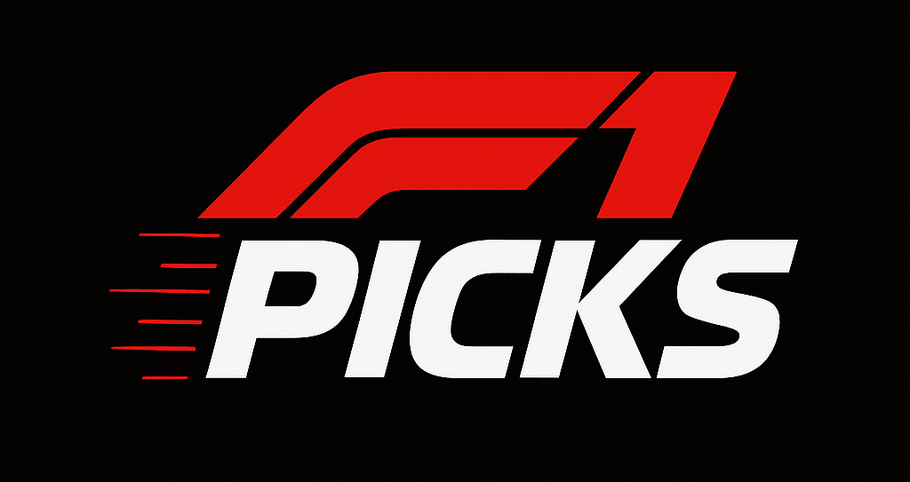
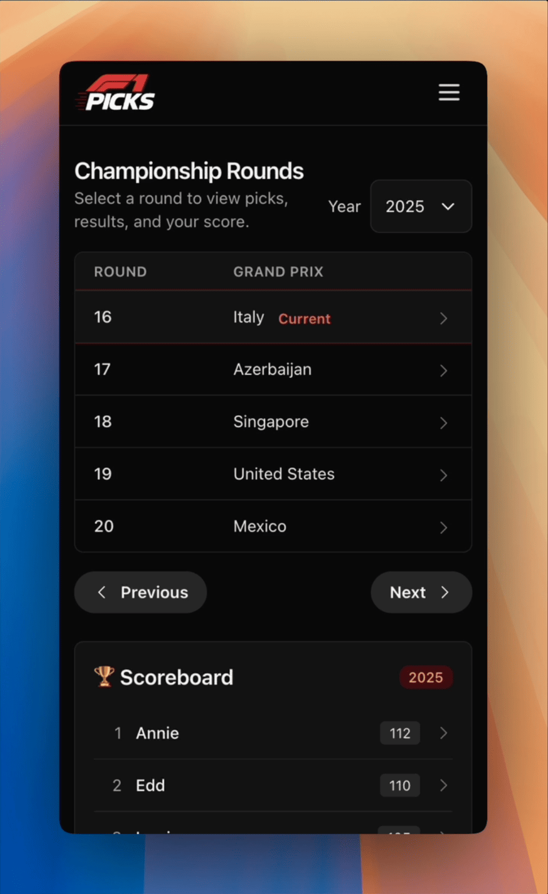
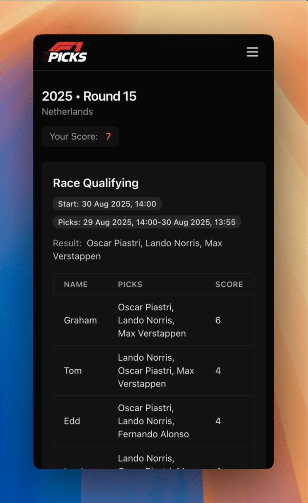
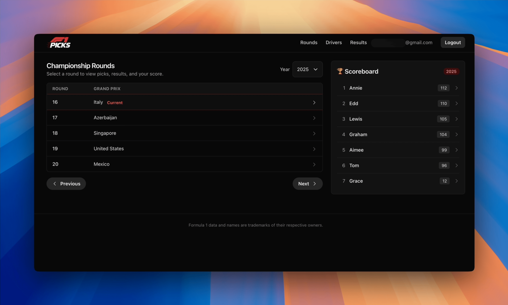

Last year, just before the 2024 Dutch Grand Prix, I put together a quick 4-hour sprint project: [F1 Picks](../../2024/2024-08-30-building-an-f1-picks-game-in-4-hours/index.md), a simple web-based game where my family could predict race outcomes.

It turned into a fun family tradition.
Despite some rough edges in the original build - both in aesthetics and workflow - we continued to play throughout that season and into the first half of this one.

However, since building the initial version last year, AI tooling has advanced significantly.
Agentic development tools - such as Cursor and Claude Code - along with the introduction of MCP and models like GPT-5, have completely eliminated the need for my previous manual [code2prompt](https://github.com/mufeedvh/code2prompt)/ChatGPT routine 🎉.
With the launch of [Laravel Boost](https://boost.laravel.com/), I was also keen to explore how well it could improve my development experience.

So, once again, I challenged myself: another **4-hour sprint before the [Dutch GP](https://www.formula1.com/en/racing/2025/netherlands) qualifying**. The goal?

- Spend some more time with Cursor and GPT-5.
- Give the site a F1 themed makeover.
- Improve the game's usability and add some requested features.
- Add meaningful test coverage to keep changes safe and predictable.

The 🏁 complete build is available on [GitHub](https://github.com/eddmann/f1-picks-2025).

## The Race

What a fun 4-hours that was! 🏎️ 💨



On the backend, I decided to upgrade the project to Laravel 12 and PHP 8.4 first.
This paved the way to integrate Laravel Boost with a set of [tailored project rules](https://github.com/eddmann/f1-picks-2025/blob/main/app/.ai/guidelines/project.blade.php), which Cursor actively uses to keep contributions consistent with the project's standards.

 

Testing also took a big step forward.
The suite now provides comprehensive coverage, documenting and verifying all the key behaviours of the system.
This not only strengthens stability but also ensures that any LLM-driven changes stay aligned with the intended behaviour.



Before starting this actual testing, I invested time in writing clear [guidelines](https://github.com/eddmann/f1-picks-2025/blob/main/app/.ai/guidelines/project.blade.php) to ensure the LLM followed my behavior-driven approach, structured around Arrange–Act–Assert.
Below is an excerpt from those guidelines:

```
### Testing Guidelines (Critically Important)

- Test behaviour, not implementation!
- Tests should verify expected behaviour, treating implementation as a black box.
- Test through the public API exclusively - internals should be invisible to tests.
- No 1:1 mapping between test files and implementation files.
- Tests must document expected business behaviour.
- Ensure the test name clearly describes the business behaviour we are testing for.
- Name tests by business behaviour (what), not method names (how).
- All tests must follow AAA (Arrange, Act, Assert) ...
```

On the styling side, I replaced `new.css` with Tailwind CSS, and got GPT-5 to build a fully responsive F1-inspired theme for both mobile and desktop.
To complete the look, I added a new F1 Picks logo, generated with ChatGPT.



Finally, a few feature updates help streamline the user experience.
The homepage now defaults to the current round's paginated listing, drivers can be marked as inactive or unavailable, results entry automatically selects the current round, and the sprint option only appears when it's actually a sprint weekend.



## The Podium

Working with this setup was a very positive experience overall.
Laravel Boost made a good first impression with its straightforward installation process and sensible built-in rules, while also respecting the custom rules I had already defined in my project.
That consistency was reassuring.

I was also pleased with how easily the LLM worked with the project's `Makefile`, including custom targets like `make shell/<command>` and `make test/<filter>`.
This made it feel comfortable to use in my existing workflow rather than something bolted on.

On the frontend side, GPT-5 handled Tailwind CSS very well.
It was able to apply an F1-inspired theme with only minor adjustments needed, and the output looked awesome across both desktop and mobile!
ChatGPT image generation has improved too, especially with transparent images, which has been handy since the move away form DALL-E 3.

Finally, the introduction of the release gate guidelines adds another layer of reliability.

```
## Release Gate (Critically Important)

MUST PASS before declaring a change complete: `make can-release` (fix failures and re-run until green).

### Failure Handling

- If tests fail: reproduce with `make test` or `make test/<filter>`, fix and re-run `make can-release`.
- If code style fails: run `make fmt`, and re-run `make can-release`.
```

By enforcing guardrails such as linting rules and regression checks, the LLM ensures that work isn't marked as complete until all validations pass.
This instills confidence that quality standards will always be maintained.

Taken together, these experiences reinforce my growing enthusiasm for GPT-5, especially in combination with Cursor integration.
I look forward to using these F1 Picks improvements over the rest of the 2025 season.
