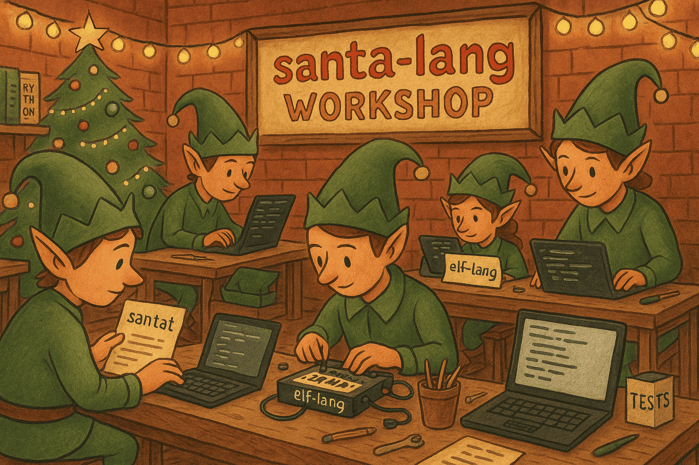
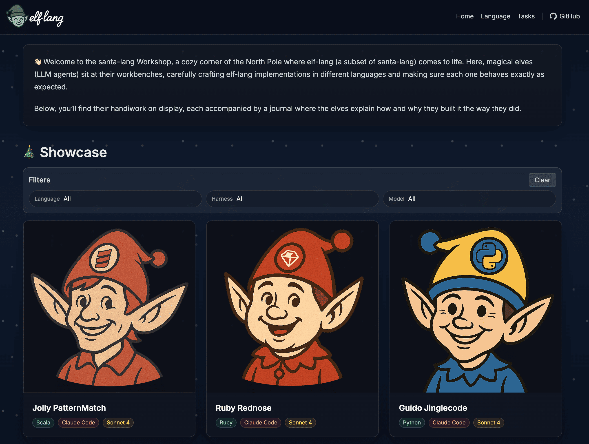

Over the past few weeks, I've been diving into the world of agentic LLM workflows, particularly how they can be applied to complex programming tasks.
One area that's fascinated me is whether we can get AI agents to implement programming languages from scratch - not just generate code, but actually build interpreters and compilers.

This led me to create the [santa-lang Workshop](https://eddmann.com/santa-lang-workshop/).

> A cozy corner of the North Pole where `elf-lang` (a subset of [`santa-lang`](https://eddmann.com/santa-lang/)) comes to life.
> Here, magical elves (LLM agents) sit at their workbenches, carefully crafting elf-lang implementations in different languages and making sure each one behaves exactly as intended.
> Just like Santa's workshop follows a shared plan, our elves follow a **shared set of `.santat` tests**, the official santa-lang wish list.
> Each implementation must pass these tests before it can be wrapped up and placed under the tree.

**Warning:** I think I may have taken the Christmas-themed programming language thing a bit too far 🤷‍♂️



## The Workshop

This started as a simple question: can we get LLM agents to automatically implement a programming language from scratch?
Not just generate some code, but actually build a complete interpreter or compiler that passes a comprehensive test suite.

The answer, it turns out, is yes - but it requires a very structured approach.
The [workshop](https://github.com/eddmann/santa-lang-workshop) provides a framework where agents can automatically implement `elf-lang` (a small, well‑defined subset of [`santa-lang`](https://eddmann.com/santa-lang/)) in a chosen language using a given harness (Claude Code, Codex, Cursor etc.) and model (Sonnet 4, GPT-5 etc.), verify correctness against a shared [PHPT‑style](https://www.phpinternalsbook.com/tests/phpt_file_structure.html) test suite, and iterate stage‑by‑stage so work can continue across agent sessions.

What really interested me was seeing how various harnesses and models would approach the same problem.
Would these alternative strategies lead to distinct architectural and implementation decisions?
The workshop setup lets me run these experiments systematically and compare the results.

### What is elf-lang?


`elf-lang` is a dynamic, functional, C-like language subset inspired by [`santa-lang`](https://eddmann.com/santa-lang/); which was designed for Advent of Code-style problems and language ergonomics I value.
It includes literals; immutable collections (lists, sets, dicts) with structural equality; first-class functions; partial application; function composition (`>>`); and a thread/pipeline operator (`|>`).

I chose this subset because it's complex enough to be interesting but small enough to be manageable for an AI agent.
The [full specification](https://eddmann.com/santa-lang-workshop/language/) is available on the workshop site if you'd like to dive deeper.
Below is a small taste of the language's aesthetics:

```
let factorial = |n| if n <= 1 { 1 } else { n * factorial(n - 1) };
let inc = +(1);

[1,2,3]
  |> map(inc >> factorial)
  |> filter(|x| x > 30)
  |> fold(0, +)
```

### How it works

The approach is surprisingly straightforward once you break it down.
You spin up a new implementation directory (using the provided `santa-bootstrap` tool) for your chosen language (Python, Go, Rust, etc.) and harness, then the agent (our elf) builds `elf-lang` incrementally through five stage‑gated phases: lexing → parsing → evaluation → collections → higher‑order/composition.
Each agent gets a festive elf name and unique avatar - because why not add a bit of personality to the process?

What makes this work is the strict, implementation‑agnostic CLI contract and PHPT‑style `.santat` tests that define exact behaviour and formatting.
The agent must adhere to strict validation criteria - it must pass specific tests at each stage before proceeding.
Throughout the process, the agent records progress and decision rationale in a per‑implementation `JOURNAL` (using the provided `santa-journal` tool), keeping updates current and making the why/how of language‑specific choices visible.

## The five-stage approach

I decided to break down the implementation into five distinct stages, each building on the last and accompanied by its own targeted test suite:

1. **Lexing**: Basic token recognition for literals, operators, symbols, keywords, and identifiers
2. **Parsing**: Building an AST for literals, lets, operations, collections, conditionals, lambdas, function calls, and composition/threading
3. **Basic evaluation**: Runtime implementation with `puts`, arithmetic, variables, and error handling
4. **Collections & indexing**: List/set/dict operations, string manipulation, and edge cases
5. **Higher-order & composition**: Recursion, `map`/`filter`/`fold`, and function arity rules

The key insight here is that all prior stages must pass before moving forward - no regressions allowed.
At each stage, the agent consults the language specification, stage-specific tests, and reviews recent journal entries to implement just enough functionality for the current scope.
Once a stage is green (including all prior stages), the agent records another journal entry detailing the current status and next steps.
It can then proceed to the next stage.

## The CLI contract

One of the most important aspects of this experiment is ensuring consistency across implementations.
Every implementation must provide an executable CLI that adheres to a strict contract (captured in the [TASKS.md](https://eddmann.com/santa-lang-workshop/tasks/) provided to the agent):

- Run program: `<bin> <file>`
- Print AST: `<bin> ast <file>`
- Print tokens: `<bin> tokens <file>`

## Testing approach

The testing strategy borrows heavily from PHP's [PHPT format](https://www.phpinternalsbook.com/tests/phpt_file_structure.html), which I've found to be incredibly effective for this kind of work.
Tests are `.santat` files with sections like `--FILE--`, `--EXPECT--`, `--EXPECT_AST--`, and `--EXPECT_TOKENS--`.
This PHPT-inspired approach makes the suite implementation-agnostic and purely CLI-driven.

What makes this format so powerful is that it validates behaviour over implementation details.
By using the CLI as the public interface, I can test that a Python implementation produces the same output as a Rust implementation, regardless of how they're structured internally.
The test runner doesn't care whether you're using recursive descent parsing or a Pratt parser - it only cares that `1 + 2` evaluates to `3` and that the AST looks correct.
This focus on observable behaviour rather than internal architecture is crucial when comparing implementations across different languages and AI approaches.

The `santa-test` runner executes your CLI in different modes and compares stdout to the expected content, showing precise diffs on failure.
It's surprisingly satisfying to watch an agent work through failing tests one by one.

**Note:** I initially hesitated to expose the tokens and AST, since these are typically considered implementation details.
However, I found that making them available was helpful for guiding the agent.
I may consider removing this requirement in the future.

## Docker isolation and CI

One thing I quickly realised is that managing dependencies across multiple programming languages can get messy fast.
I solved this by encapsultating everything in Docker containers - each implementation gets its own isolated environment with all the necessary tooling.

This approach has several benefits: it keeps the host system clean (no need to install Python, Go, Rust, and whatever else), ensures reproducible builds, and makes the CI setup much more reliable.
The GitHub Actions workflow runs the [full test suite](https://github.com/eddmann/santa-lang-workshop/blob/main/.github/workflows/test-implementations.yml) for every implementation on every push to `main`.

The [static site generation](https://github.com/eddmann/santa-lang-workshop/blob/main/.github/workflows/publish-website.yml) also runs as part of the CI pipeline, so the showcase website stays up-to-date automatically.
It's satisfying to see all those green checkmarks across different languages and implementations.

## The tooling ecosystem

To support this workflow, I developed four helper tools that streamline the entire process:

**santa-bootstrap**: Scaffolds a new implementation directory with all the boilerplate.
This is where you specify your target language, harness, model, and any special requirements.
Each implementation gets assigned a festive elf name (like "Guido Jinglecode" for Python or "Ruby Rednose" for Ruby) and generates a unique avatar image to represent the agent.

```bash
tools/bin/santa-bootstrap --lang <lang> --harness <harness> --model <model> --requirements "<notes>" --force
```

**santa-test**: Runs the PHPT‑style test suite against your implementation.

```bash
tools/bin/santa-test --bin <path-or-docker-uri> [--update] [--timeout <secs>] [--jobs <N>] <tests-or-directories>
```

**santa-journal**: Tracks progress and decisions throughout the implementation process.
This is crucial for maintaining continuity across agent sessions and ensuring that the agent resumes work exactly where they left off.

```bash
tools/bin/santa-journal [--dir <impl-dir>] <author|progress|entry|entries> [...]
```

**santa-site**: Generates a static website showcasing all the implementations.
It's nice to have a visual overview of what's been built - the generated site shows each implementation's progress through the stages and includes a code explorer to look through the implementation within the browser.

```bash
tools/bin/santa-site [--out-dir <path>] [--impl-dir <path>] [--base-path <url-path>]
```

## What I've learned

The santa-lang Workshop has been a fascinating exploration into agentic LLM workflows for programming language implementation.
By providing a structured, test-driven approach with clear stage gates and comprehensive tooling, I've been able to observe how different AI agents approach the same language specification across various programming languages.

This project has taught me several important lessons about AI-assisted development.
First, the importance of structure cannot be overstated - agents need clear boundaries, specific tests, and incremental goals to succeed.
Second, the journaling system has proven invaluable for maintaining continuity across sessions and understanding the decision-making process.
Third, having a shared test suite ensures consistency across implementations, which is crucial when working with multiple agents.

It's been particularly fascinating to observe how different harnesses interpret the tasks I set and decompose the problem; while simultaneously seeing how various programming languages, with their unique idioms, patterns, and trade-offs - approach the same implementation challenge.
Comparing, for example, Python's dynamic flexibility to Rust's emphasis on memory safety, or Go's simplicity to Haskell's functional purity, has given me a crash course in both agentic reasoning and language design philosophy - all through the lens of practical implementation.



To conclude, whether you're interested in programming language design, AI-assisted development, or simply curious about how elves might approach language implementation, the [santa-lang Workshop](https://eddmann.com/santa-lang-workshop/) offers a unique perspective on the intersection of artificial intelligence and software engineering.
I hope to expand on the workshop in the future, making it a growing collection of implementations that highlight the unique qualities of different programming languages and AI approaches.
