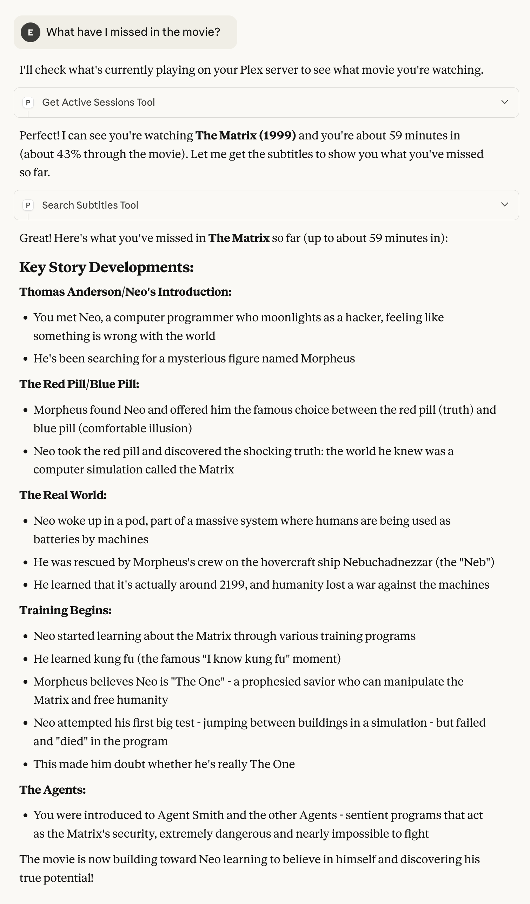
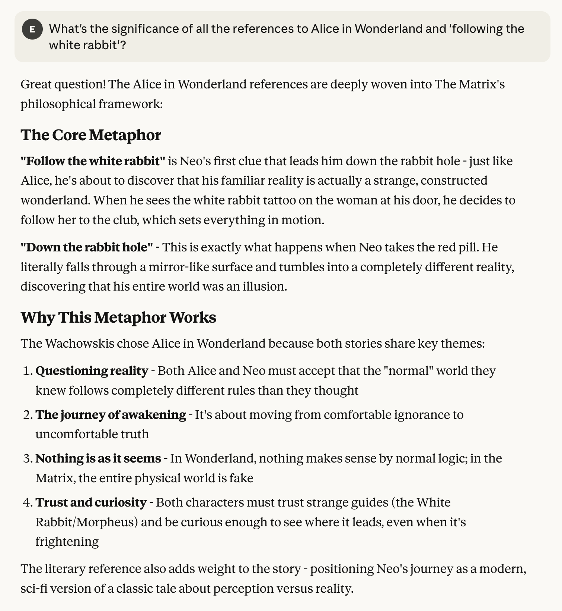
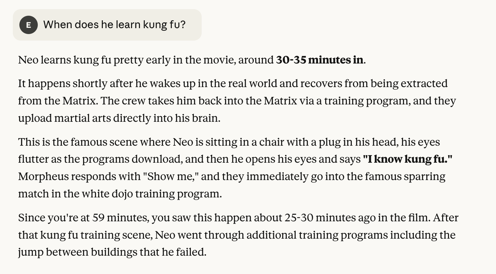
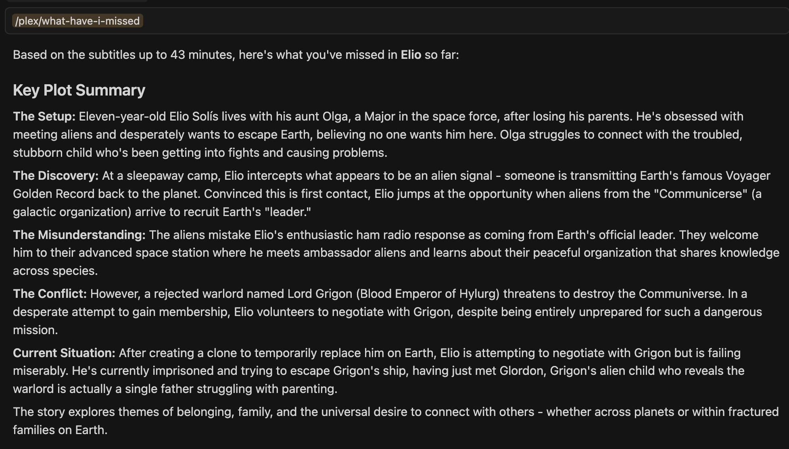

I've always enjoyed deep-diving into films - pausing to understand a plot twist, exploring character motivations, or discussing themes and cinematography.
But there's always been a disconnect: when I ask an AI assistant about a movie, it doesn't know _where_ I am in the film.
Without that context, it either risks spoiling future plot points or stays frustratingly vague to avoid giving anything away.

What if my AI assistant could see exactly what I'm watching on [Plex](https://www.plex.tv/) and understand my current playback position?
That's the question that led me to experiment with the [Model Context Protocol (MCP)](https://modelcontextprotocol.io/) and build a bridge between my Plex Media Server and AI assistants.

I'd been wanting to explore MCP and the [Laravel MCP](https://laravel.com/docs/12.x/mcp) package, and this gave me the perfect excuse to spend a couple of hours diving into them.
The result? A lightweight MCP server that provides real-time context about my viewing experience through subtitle analysis.

View the code: [plex-mcp on GitHub](https://github.com/eddmann/plex-mcp)

 

## The Problem: Watching Movies with AI

Have you ever joined a movie halfway through and wished someone could quickly catch you up?
Or wanted to explore a film's themes while watching, without worrying about spoilers?

Traditional AI interactions around movies have a fundamental limitation: they operate in a spoiler vacuum.
The assistant either assumes you've seen everything (and spoils future plot points) or assumes you've seen nothing (and provides only generic information).

What I wanted was simple:

- Recap movies to my current playback position when I join mid-way
- Ask questions about plot developments and characters without spoilers
- Explore themes and cinematic elements based on what's actually happened on screen
- Get contextual summaries that respect where I am in the story

## The Solution: MCP + Plex + OpenSubtitles

The Model Context Protocol provides a standardised way for AI assistants to access external context and tools.
By building an MCP server that monitors Plex playback and retrieves relevant subtitles, I could give AI assistants the exact context they need.

The architecture is refreshingly straightforward:

- Plex Media Server provides active session data (what's playing, current timestamp, user information)
- OpenSubtitles API supplies subtitle content for the film being watched
- MCP Server (built with Laravel 12 and Laravel MCP) bridges the two and exposes tools and prompts to AI assistants
- AI Assistant (Claude, etc.) uses this context to provide informed, spoiler-aware responses



## Building with Laravel MCP

Laravel MCP handles the protocol complexity, letting me focus on the actual functionality.
The server exposes two tools and one prompt.

### MCP Tool: Get Active Sessions

Monitors current playback on your Plex server:

- What content is playing and on which device
- Current playback position and progress
- User information and transcoding status (not required for this current use-case)

### MCP Tool: Search Subtitles

Retrieves subtitles from OpenSubtitles:

- Search by IMDb ID or title
- Filter by language
- Optionally limit to subtitles up to a specific timestamp (crucial for spoiler-free responses)

### MCP Prompt: What Have I Missed

This is where it gets interesting. The prompt:

1. Detects what you're currently watching on Plex
2. Retrieves subtitles up to your current playback position
3. Asks the AI to generate a chronological summary of key plot points
4. Ensures the response is context-aware and spoiler-free

The AI assistant uses these tools behind the scenes, combining Plex session data with time-limited subtitle context to understand exactly where you are in the film.



As part of this exploration, I decided to implement support for both MCP transport methods: stdio for local integration and streamable HTTP for web-based clients.

## Example Usage

With the server running and connected to an MCP client, the system really shines in several practical scenarios:

Catching up mid-movie:

```
User: What have I missed in the movie?
Assistant: [Uses Plex session + subtitles up to current timestamp]
```

Exploring themes without spoilers:

```
User: What's the significance of all the Alice in Wonderland references?
Assistant: [Uses subtitle context to provide spoiler-free analysis]
```

Understanding plot points:

```
User: When does Neo learn kung fu?
Assistant: [Searches subtitles to find the exact moment]
```

Monitoring sessions:

```
User: What am I currently watching?
Assistant: [Uses Get Active Sessions to show playback details]
```

## Lessons and Reflections

This project reinforced several insights about building with MCP:

**MCP is surprisingly approachable.** The protocol isn't nearly as complex as I initially thought, especially with frameworks like Laravel MCP handling the heavy lifting.
Within a few hours, I had a working server exposing tools and prompts.

**Prompts aren't universally supported yet.** I struggled to get the "What Have I Missed" prompt working with anything other than Cursor.
Claude Desktop, for instance, uses the underlying tools directly rather than invoking the prompt.
This meant the carefully crafted prompt template only worked in certain clients, which was a bit disappointing - though the tools themselves work everywhere.

**Context is king.** The difference between "tell me about The Matrix" and "tell me about The Matrix up to minute 42" is enormous.
By providing precise temporal context through subtitles, the AI can give genuinely helpful responses that respect the viewing experience.

**Subtitles are underrated.** I initially considered using scene descriptions or plot summaries, but subtitles proved ideal - they're accurate, timestamped, widely available, and contain the actual dialogue that drives the story.

## What's Next?

This is very much an experiment, but it's opened up interesting possibilities.
I'd like to explore integrating additional context sources, like [Fandom](https://www.fandom.com/) wiki entries, for deeper reflective insights into films.
I'm also considering adding audio description subtitles for content where available, as they often provide valuable visual context that dialogue alone doesn't capture.

If you're curious about MCP or want to experiment with media server integrations, the [code is on GitHub](https://github.com/eddmann/plex-mcp).
It's a fun afternoon project that combines several interesting technologies into a practical solution.

Now, if you'll excuse me, I have a movie to finish - and an AI assistant who finally understands where I am in it. 🍿
