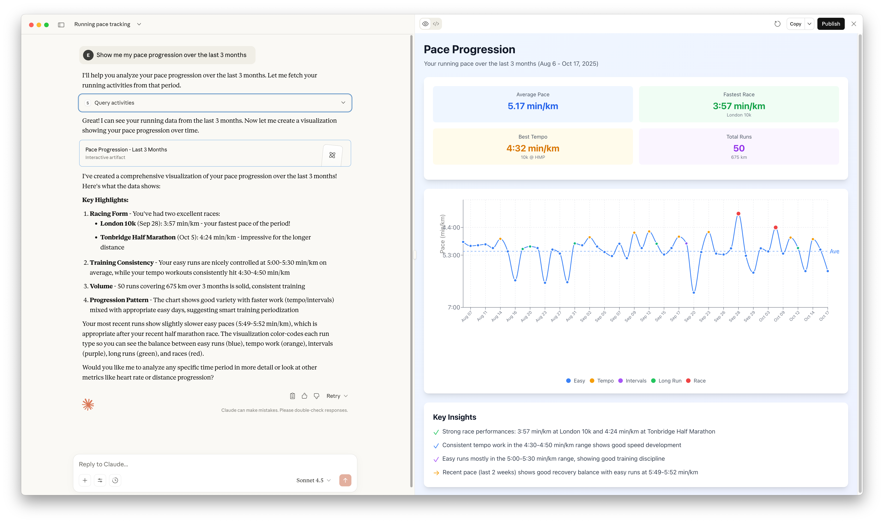
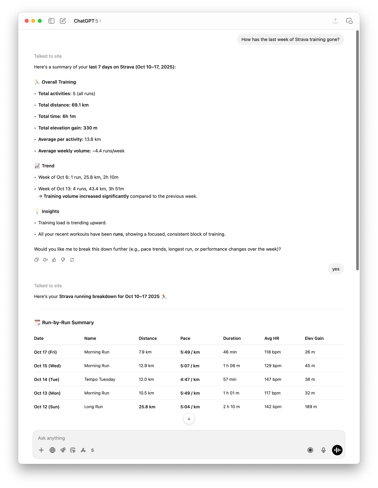

I'm a big fan of running, and I've been wanting to explore the Model Context Protocol (MCP) more deeply.
These two interests collided when I realised something: I wanted to have actual conversations with my workout data.

## What is MCP?

The [Model Context Protocol](https://modelcontextprotocol.io/) is an open standard that enables AI assistants to connect to external data sources and tools.
Think of it as a universal adapter between LLMs and your data - instead of copying and pasting workout statistics into ChatGPT, MCP lets the AI directly query your Strava activities, compare workouts, and analyse trends.
It's the difference between showing someone a photo of your training log versus giving them access to the actual data.

## Why Not Just Use Strava AI?

Strava has AI features, but they're limited in meaningful ways.

First, it's a **paid feature** locked behind Strava's subscription tier.
But more importantly, it doesn't provide actual _conversation_ - it just generates static summaries of your activities.
You get a paragraph of insights, but you can't ask follow-up questions, explore "what if" scenarios, or dive deeper into specific aspects of your training.

What I wanted was:

- True conversation: Ask "why did that run feel hard?" and get thoughtful analysis
- Flexible exploration: Generate custom graphs, compare arbitrary workouts, find patterns
- Combined analysis: Pull data from multiple sources (Strava + Garmin) and synthesise insights
- Code generation: Let Claude/ChatGPT write throwaway analysis scripts for one-off questions

This led me to build MCP servers for both [Strava](https://github.com/eddmann/strava-mcp) and [Garmin Connect](https://github.com/eddmann/garmin-connect-mcp).

## Why Both Strava and Garmin?

You might wonder why I built servers for both platforms rather than picking one.

Garmin Connect has incredibly rich data.
Beyond basic run metrics, it provides detailed physiological insights - training load, recovery time, VO2 max estimates, running power, and granular heart rate variability data.
If you're serious about training analysis, Garmin's data depth is hard to beat.

Strava, on the other hand, is where the running community lives.
It has better social features, segment leaderboards, and a more polished activity feed.
Most runners I know use Strava, even if they're recording on Garmin devices and syncing over.

By supporting both, I get the best of both worlds: Garmin's deep analytics and Strava's community features.
Plus, it gave me a chance to see how the same MCP tool design patterns worked across two different APIs with different strengths.



## The Exploration

I'd previously explored the [Laravel MCP](https://laravel.com/docs/12.x/mcp) package when building my [Plex MCP server](../2025-10-03-contextual-movie-conversations-building-a-plex-mcp-server/index.md), but I wanted to compare it with the Python stack.
This was the perfect opportunity to dive into [FastMCP](https://github.com/jlowin/fastmcp) and see how the Python ecosystem approaches MCP development.
I also gave [uv](https://github.com/astral-sh/uv) a go in the process - the new Python package manager that's been gaining traction for its speed and simplicity.

Both Strava and Garmin Connect have extensive APIs, and my initial instinct was to create a comprehensive 1:1 mapping of every endpoint.
But I quickly realised: **more tools doesn't mean better tools**.

What matters is providing the _right_ tools for the domain you're working in, and making each tool genuinely useful in that context.

## MCP Tool Design Patterns

One of the most interesting aspects of building these servers was discovering patterns for designing effective MCP tools.

### Combining related operations

In traditional software design, we follow the Single Responsibility Principle - each function should do one thing well.
But when designing tools for LLMs, I found that **tools can and should do multiple things** when those things are closely related.

Take my `query-activities` tool in the Strava MCP.
It has multiple parameters and options: date ranges, activity types, sorting, filtering - all of which could have been separate tools.
But by combining them into a single, well-documented tool, the LLM can understand "this is how I query activities" without having to choose between subtly different tool names like `get_activities`, `get_activities_by_type`, `list_activities`, `search_activities`, etc.

Another example is the `query-segments` tool in the Strava MCP, which handles three different query modes: fetching a specific segment by ID, listing your starred segments, or exploring segments within geographic bounds.
At first, this felt wrong - it violates SRP in a big way.
But in practice, the LLM uses it correctly because the tool clearly communicates: "This is how you work with segments. Here's what you want to do with it."

### Fewer tools, less context

This consolidation has a huge benefit: **less context bloat**.

When an LLM has to choose between dozens of narrowly-scoped tools, each with similar names and slight variations, it wastes valuable context window understanding the differences.
By providing fewer, more capable tools with clear documentation, the LLM can focus on the actual task rather than tool selection.

I spent a lot of time refining this balance - figuring out which operations naturally belonged together and how to describe them succinctly to the LLM.

### Domain-specific context and parameters

Rather than exposing raw API responses, I focused on providing **domain-specific context** that's actually useful for analysis.

For running data, that means:

- Pace and heart rate zones, not just raw numbers
- Training load and recovery metrics
- Performance trends over time
- Comparative analysis between similar workouts

The MCP tools transform the underlying API data into insights that are meaningful for having conversations about training.

### Providing rich temporal context

One surprising discovery: **LLMs will hallucinate temporal information if you don't provide it explicitly**.

Initially, I just returned timestamps for activities.
But when given a timestamp, the LLM would confidently calculate the day of week itself - and get it wrong half the time.

The fix was to provide multiple representations of temporal data:

- ISO timestamps (`2025-10-14T06:30:00Z`)
- Human-readable dates (`Monday, October 14, 2025`)
- Day of week explicitly stated

This redundancy feels verbose when you look at the raw JSON, but it dramatically improved the accuracy of date-based queries.
While LLMs with code generation capabilities _can_ calculate day of week from a timestamp, why rely on it when you can provide the information directly?
It's solving a problem you've already solved, and saves tokens on unnecessary computation.

### Server-side computation

Another pattern that emerged: **doing calculations on the server side** rather than forcing the LLM to process raw data.

I added tools like `compare-activities` that take two or more activity IDs and return a structured comparison:

- Pace differential with context (e.g., "second run was 15s/km faster")
- Heart rate efficiency (same pace at lower HR = improved fitness)
- Elevation-adjusted effort
- Weather impact (if available)

This serves two purposes:

1. Reduces context bloat: Instead of returning two massive activity objects for the LLM to compare, I return focused insights
2. Improves accuracy: Pace calculations, heart rate zone math, and elevation adjustments are error-prone for LLMs - better to handle them server-side

Similarly, in the Garmin MCP, when retrieving activity details, the server automatically calculates kilometre and mile splits if no lap data is present for a run.
This means the LLM always has consistent split data to work with, regardless of whether the runner manually lapped their watch.

The LLM becomes better at interpretation and conversation when you handle the computation server-side, even though it could technically generate code to perform these calculations.
Provide pre-computed insights for typical queries, and save the code generation for novel analysis.

### Resources and Prompts

Beyond tools, MCP supports **Resources** (persistent context that's always available) and **Prompts** (pre-built conversation templates).

#### Resources: Always-Available Context

Resources provide background context that the LLM can reference throughout a conversation without explicit tool calls.
This is particularly useful for information that's frequently needed but rarely changes.

Both MCPs provide athlete profile resources (stats, zones, gear/PRs), while the Garmin MCP additionally exposes training readiness and health metrics.

For example, my athlete profile includes my measurement preference (metric) and heart rate zones.
This means when discussing any run, the LLM automatically presents pace in min/km and distances in kilometres, and can interpret effort levels based on my specific HR zones - all without having to repeatedly ask "Do you prefer metric or imperial?" or "What are your heart rate zones?" in every conversation.

This background context keeps conversations focused on analysis rather than data gathering.

#### Prompts: Multi-Tool Orchestration

Prompts are conversation starters that know which tools to call and how to structure the analysis.
They're useful for complex queries that require multiple steps.

Strava MCP provides 5 prompts:

- `analyze-recent-training` - Comprehensive training analysis over a specified period
- `segment-performance` - Detailed segment performance analysis
- `activity-deep-dive` - Deep dive into a specific activity with all metrics
- `compare-recent-runs` - Compare recent runs to identify trends and improvements
- `training-summary` - Comprehensive training overview with recommendations

Garmin MCP provides 6 prompts:

- `analyze-recent-training` - Analyse training over a specified period
- `sleep-quality-report` - Sleep quality analysis with recommendations
- `training-readiness-check` - Check if ready to train hard today
- `activity-deep-dive` - Deep dive into a specific activity with all metrics
- `compare-recent-runs` - Compare recent runs to identify trends
- `health-summary` - Comprehensive health overview

For example, triggering the "training readiness check" prompt in the Garmin MCP:

1. Fetches today's health data (Body Battery, sleep score, HRV status)
2. Pulls recent training load and recovery time needed
3. Checks for any warning signs (high stress, poor sleep, lingering fatigue)
4. Synthesises this into a recommendation: "You're well-recovered and ready for a hard session" or "Consider an easy day - your Body Battery is at 32% and you only had 5 hours of sleep"

This saves you from having to manually guide the LLM through each step of the analysis.

## Deployment Options: stdio, Docker, and HTTP

One goal of this project was to explore different ways to deploy and use MCP servers.

### Local stdio

The simplest setup: MCP servers communicating via standard input/output.
This works great for single-user, local development with tools like Claude Desktop or Cursor.
It's fast, requires no exposed ports or firewall rules, and keeps everything contained on your machine.

For MCP clients like Claude Desktop or Cursor, you configure it in the client's config file:

```json
{
  "mcpServers": {
    "strava": {
      "command": "uv",
      "args": [
        "run",
        "--directory",
        "/path/to/strava-mcp",
        "strava-mcp",
        "--transport",
        "stdio"
      ]
    }
  }
}
```

### Docker containers

I wanted to make these MCP servers easily distributable for single-user scenarios without requiring people to install Python, manage virtual environments, or deal with dependencies.

By packaging the servers as Docker containers, you can configure them in the client's config file:

```json
{
  "mcpServers": {
    "strava": {
      "command": "docker",
      "args": [
        "run",
        "-i",
        "--rm",
        "-v",
        "/path/to/strava-mcp.env:/app/.env",
        "ghcr.io/eddmann/strava-mcp:latest",
        "--transport",
        "stdio"
      ]
    }
  }
}
```

The container handles everything - dependencies, runtime, authentication tokens - in an isolated environment.

### Remote HTTP with OAuth (Strava only)

The most interesting deployment option is the streamable HTTP transport with OAuth - though this is **only available for the Strava MCP**.

Here's why:

Strava uses OAuth 2.0 for authentication, which means I can build an application that users authorize without ever seeing their credentials.
This makes it possible to deploy a single MCP server that multiple users can securely connect to through their own authenticated sessions.
Each user gets their own data, properly isolated, all through the same service.
This works beautifully with ChatGPT's MCP integration.

I was able to deploy the Strava MCP to AWS Lambda using CDK, which makes it trivial to run as a serverless function with automatic scaling and minimal operational overhead.

Garmin Connect does have an official API, but you need to sign up for access.
For the Garmin MCP, I'm using the [`garminconnect`](https://github.com/cyberjunky/python-garminconnect) Python library, which requires username and password authentication - there's no OAuth flow.
This means the Garmin MCP is **local stdio only** - you run it on your own machine with your own credentials.
I can't safely deploy a multi-user Garmin MCP server without handling user passwords, which is a non-starter for obvious security reasons.



## The Power of Combined Tools

What really excites me about this setup is how Claude/ChatGPT can access my workout data and then generate throwaway code to perform one-off analysis.

### A concrete example

Here's a real interaction I had:

**Me:** "Show me my pace progression over the last 3 months"

Claude fetched my recent runs from the Strava MCP, then generated a complete React-based UI with an interactive pace progression chart using Recharts.

The generated code pulled 50 runs of data and created a fully styled dashboard with:

- Line chart showing pace over time, color-coded by run type (easy, tempo, intervals, race, long)
- Summary statistics panel (average pace, fastest race, best tempo, total distance)
- Interactive tooltips showing details for each run
- Reference line for average pace
- Insights panel highlighting key trends

Here's a snippet of the data structure it built:

```javascript
const data = [
  { date: 'Aug 06', pace: 4.87, type: 'Easy', name: 'Morning Run' },
  { date: 'Aug 14', pace: 4.77, type: 'Tempo', name: '7x 1K @ Tempo' },
  { date: 'Sep 28', pace: 3.95, type: 'Race', name: 'London 10k' },
  { date: 'Oct 05', pace: 4.4, type: 'Race', name: 'Tonbridge HM' },
  // ... 46 more runs
];
```

The visualisation showed a clear improvement trend - and highlighted that my pace variability dropped significantly in the last month, with consistent tempo work in the 4:30-4:50 min/km range.

The screenshot at the start of this post shows the complete dashboard - generated entirely from a single natural language query.
This is the kind of quick, disposable analysis that's perfect for exploration.

### The "aha moment" use case

One question I asked changed how I think about these tools:

**Me:** "Why did last Tuesday's run feel so hard?"

Claude used `query-activities` to find the Tuesday run, then `analyze-training` to understand my recent training load and context.

The answer: **You did a long run on Sunday**

I'd done a long run (25.8 km) on Sunday morning. Then just 36 hours later, I was doing a tempo workout on Tuesday. My legs were still recovering.

No single metric explained it, but the combination painted a clear picture: insufficient recovery, cumulative fatigue, and a genuinely hard workout.

This is where the MCP architecture shines - Claude orchestrated multiple tools, synthesised training context, and pieced together insights I would never have manually connected.

This combination of **data access + code generation + execution** creates something more powerful than either capability alone.
It's not just about having my data available - it's about having an intelligent system that can explore that data in creative ways I wouldn't have thought to program manually.

## Pagination and Context Limits

One technical challenge worth mentioning: cursor-based pagination.

When dealing with years of workout data, you can quickly hit LLM context window limits.
I implemented cursor-based pagination in both MCP servers to ensure we don't try to load thousands of activities at once.

Currently, each page returns a maximum of 25 activities to balance context usage with data completeness.
But I'm thinking about making this more intelligent going forward - perhaps dynamically adjusting based on the type of analysis being performed or automatically summarizing older data.

## What's Next

This has been a fascinating exploration of MCP, tool design, and the intersection of personal data with LLMs.

I'm looking forward to more deep dives into my running data - comparing training cycles, identifying patterns in my performance, and discovering insights I would never have found manually.

There's something genuinely exciting about having an AI assistant that can see your entire training history and help you make sense of it in natural language.

If you're interested in the code or want to try these MCP servers yourself:

- [Strava MCP on GitHub](https://github.com/eddmann/strava-mcp)
- [Garmin Connect MCP on GitHub](https://github.com/eddmann/garmin-connect-mcp)

Now, if you'll excuse me, I have some runs to analyse. 🏃‍♂️
