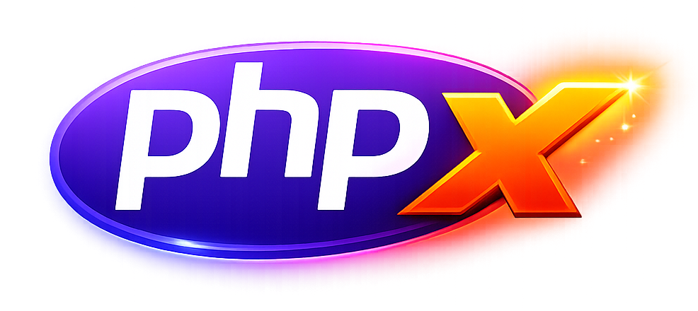

This is something new.
I've been wanting to start capturing the things I'm working on, thinking about, and learning - more raw than a polished blog post, but something I still wish to document.
There's a lot happening with agents and LLM tooling right now, and I feel like personally this stuff is changing so quickly that to have a reference back to my previous experience could be useful.
So here we are: weeknotes.

<!--more-->

## The Evolution: MCP → CLI → Skills

Over the past few months, I've been on a journey that started with building [MCP servers](../2025-10-17-running-mcps-everywhere-chatting-with-my-workouts/) for things like [Garmin Connect](https://github.com/eddmann/garmin-connect-mcp), [Strava](https://github.com/eddmann/strava-mcp), [Plex](https://github.com/eddmann/plex-mcp), and [WhatsApp](https://github.com/eddmann/whatsapp-mcp).
The goal was to let LLMs interact with my personal data - analyse my running, search my messages, understand my training patterns.

MCP is great for exposing capabilities as a public-facing API, something that can be shared and deployed remotely.
The APIs I designed for MCP aren't a direct translation of the underlying library - they're a curated set of tools designed for how an LLM would want to interact with the data.
But that curation has costs: context tokens for tool definitions, back-and-forth for each call.

For local use, I started questioning whether I needed all that infrastructure.
So I built CLIs instead - [garmin-connect-cli](https://github.com/eddmann/garmin-connect-cli), [strava-cli](https://github.com/eddmann/strava-cli), [whatsapp-cli](https://github.com/eddmann/whatsapp-cli) - following the Unix philosophy of small tools that can be piped and composed.
Again, a curated interface, but this time optimised for shell composition rather than LLM tool-calling.

Then I realised something: both approaches really just involve me maintaining _wrappers_ around rich Python libraries - and LLMs are _really good_ at writing code (they assisted in writing the code to build out the MCPs and CLIs themselves).
There's interesting work from [Anthropic](https://www.anthropic.com/engineering/code-execution-with-mcp) and [Cloudflare](https://blog.cloudflare.com/code-mode/) on "code mode" - the idea that LLMs are better at writing code to call APIs and libraries than at using tool-calling syntax directly.
So why maintain wrappers at all?

Enter [UV inline scripts](https://docs.astral.sh/uv/guides/scripts/#declaring-script-dependencies). Using the [PEP 723](https://peps.python.org/pep-0723/) standard for inline script metadata, you can write a Python script that declares its dependencies right in the file:

```python
# /// script
# requires-python = ">=3.11"
# dependencies = ["stravalib>=2.0"]
# ///
from stravalib import Client

client = Client(access_token=tokens["access_token"])
for activity in client.get_activities(limit=5):
    dist_km = float(activity.distance) / 1000
    print(f"{activity.start_date_local.date()}: {activity.name} - {dist_km:.1f}km")
```

Now, instead of maintaining a CLI or MCP server, I have Claude Code [skills](https://agentskills.io/) that know how to write ephemeral Python scripts.
The skill provides authentication scripts, common usage patterns, and pointers to the library documentation.
The LLM writes the actual code on the fly.
No maintained wrapper, just generated scripts that do exactly what I need.
It can even pull in other libraries (graphing ones for example) if the task warrants it.

## buns and phpx: Inline Scripts Everywhere

This past weekend I released two projects that extend this pattern to other ecosystems.


**[buns](https://github.com/eddmann/buns)** brings UV-style inline scripts to Bun and TypeScript.
You can write a script with inline npm dependencies:

```typescript
// buns
// bun = ">=1.0"
// packages = ["chalk@^5.0"]

import chalk from 'chalk';
console.log(chalk.green('Hello from buns!'));
```

No `package.json` needed. buns handles dependency isolation, automatic Bun version management, and - crucially - **sandboxing**.



**[phpx](https://github.com/eddmann/phpx)** does the same for PHP with Composer dependencies:

```php
// phpx
// php = ">=8.2"
// packages = ["nesbot/carbon:^3.0"]

echo \Carbon\Carbon::parse('next friday')->diffForHumans();
```

It also handles executable tools like `npx` and `uvx` do - you can run `phpx tool phpstan -- analyze src/` and it'll fetch and execute PHPStan in isolation without polluting your global environment.

Both projects include sandboxing using OS primitives - [seatbelt](https://www.chromium.org/developers/design-documents/sandbox/osx-sandboxing-design/) on macOS and [bubblewrap](https://github.com/containers/bubblewrap) on Linux.
This was inspired by looking at how Anthropic handles sandboxing in their [sandbox runtime](https://github.com/anthropic-experimental/sandbox-runtime).
My instinct has always been to containerise everything, but there's something elegant about using OS-level primitives directly.
It's the approach you see in Claude Code, Codex, and similar tools.

## Landing Pages and the Rising Bar

Something I've been exploring is single-page landing pages - just an `index.html` with Tailwind and JavaScript included.
[Simon Willison](https://simonwillison.net/) has talked about this approach: keeping everything in one file that's easy to load into context and iterate on.

What's been remarkable is using Claude's [frontend-design skill](https://github.com/anthropics/claude-code/blob/main/plugins/frontend-design/skills/frontend-design/SKILL.md).
The quality of designs it produces is genuinely impressive.
I've built landing pages for [VoiceScribe](https://github.com/eddmann/VoiceScribe), [ClipVault](https://github.com/eddmann/ClipVault), [ClaudeMeter](https://github.com/eddmann/ClaudeMeter), and the various CLIs.

  

Then there's **Step Wars** - a friendly step competition game I built to be used with a friend.
We compete in step challenges, and since he's into Star Wars, I thought it would be fun to lean into that theme (I'm sure there's a massive copyright claim in there somewhere - please don't sue me).
The Star Wars crawl intro, the iconic styling - I essentially one-shot prompted it and it just... worked.
Some refinement for mobile, but the CSS animations and transitions it generated were spot on.



This raises the bar for what's expected from open source projects.
Good documentation, a logo, a landing page - these used to be nice-to-haves.
Now they're table stakes.
Not just for humans browsing GitHub, but for agents that need to understand what a project does.
A good description, proper topics, clear README - all of this can be AI-assisted, but the expectation is now much higher.

## Cloudflare Workers and Ephemeral Software

I've been exploring [Cloudflare Workers](https://workers.cloudflare.com/) for spinning up quick SPAs.
Step Wars is hosted there, but another interesting example is **[bincal](https://github.com/eddmann/bincal)** - a bin collection calendar I built last week.

The problem: my council doesn't provide an iCal feed for bin collections, and I keep missing them.
The solution: a small app that scrapes the council website and generates calendar subscriptions with reminders.

From idea to deployed took about 20 minutes - idea, implementation, polish, deployment.
I built it for my council, then added a couple of others.
One of them needed Puppeteer for scraping, which was an interesting [Cloudflare feature](https://developers.cloudflare.com/browser-rendering/puppeteer/) to get to exercise.
Between that, [D1](https://developers.cloudflare.com/d1/) for SQLite, and [KV](https://developers.cloudflare.com/kv/) for caching - the ecosystem makes these small projects trivial to spin up.
Now family and friends can subscribe to the iCal feed and we all get reminders.


Part of why this was so fast is that I'm working "on-distribution" - React, TypeScript, common web patterns.
The model has seen tons of this in training data, so it just flows.

This is **temporary software** in a sense - ideally my council will provide this service one day and I can delete it.
But until then, it exists, it works, and it cost almost nothing to build. That's an odd new reality.

## Personal Software

There's a theme running through all of this: **personal software**.
Projects you'd want to build if you had more time, but never did because the effort didn't justify the benefit.

[VoiceScribe](https://github.com/eddmann/VoiceScribe) is a good example. Yes, there's [SuperWhisper](https://superwhisper.com/), [Wispr](https://wisprflow.ai/), and countless other transcription apps.
But I wanted to learn how [MLX](https://ml-explore.github.io/mlx/) works, how to run local LLMs on Apple Silicon, how to build Swift and macOS apps.
The transcription app was a vehicle for that learning.

Same with [PHPBoy](https://github.com/eddmann/phpboy) - a Game Boy Color emulator written in PHP.
Nobody _needs_ this.
But building it taught me about emulation, about pushing PHP to its limits, about different frontend approaches (CLI, WebAssembly, SDL2).

With agents assisting, I can turn ideas into working software and actually see if they're useful.
If they are, great - I release them and maybe others benefit.
If not, I learned something.
The calculus has shifted.

But it's not just about shipping projects.
A lot of what I'm doing is exploring how these agentic tools actually work.
There's a dial you can turn: how much autonomy do you give them? How much upfront context? How many guardrails and guidelines? How loose or tight do you keep the reins? I'm experimenting with this constantly - both in my paid work and in personal projects where I can push further and try wilder things.

## Ralph and Agentic Loops

If you've been on X recently, you've probably seen [Ralph](https://ghuntley.com/ralph/) everywhere.
Geoffrey Huntley's been writing extensively about agentic loops - the idea of repeatedly feeding prompts to an AI coding agent and letting it work through problems autonomously.

What struck me is that I was already doing something similar with my [santa-lang](https://github.com/eddmann/santa-lang) implementations work over Christmas.
I had a shell script that presented a task list to the model and let it work through tasks step by step, gated by tests, using the Git history as context around what had already been completed and why.
I didn't have it pick which task to do next - that's the bit I was missing.
But the core loop of presenting context, letting the model work, verifying with tests/linting, and continuing - that's the Ralph pattern.

The discourse around "guardrails" and "back pressure" in agentic systems is interesting because... this is just good software engineering?
[Fast feedback loops](https://ghuntley.com/pressure/), tests that actually verify correctness, linting that catches issues early.
These principles have always mattered; they just matter more now because agents iterate faster than humans and need quick signals about what's working.

I used to be against git commit hooks (husky and friends). But with agents, you _want_ those verification gates.
You want the agent to know immediately if its code doesn't compile or tests fail - and prevent it from going off the rails.

There's also the context window consideration.
Dex Horthy from [HumanLayer](https://humanlayer.dev/) coined the term "Dumb Zone" - the middle 40-60% of a large context window where model performance degrades significantly.
Information placed there gets lost or misinterpreted.
The "Smart Zone" is the top portion where attention is strongest.
His [No Vibes Allowed](https://www.youtube.com/watch?v=rmvDxxNubIg) talk at AI Engineer is worth watching on this.
This is partly due to quadratic attention - transformer attention scales O(n²) with sequence length, so as context grows, attention becomes increasingly diluted across tokens.
The solution? Don't put everything in one context. Use subagents with isolated windows, or aggressively clear and compact.
Claude Code does this now: clearing context between planning and implementation phases, keeping the working memory focused on what matters.
[Everything is a loop](https://ghuntley.com/loop/), but you need to manage what's in that loop.

## Changelog Discipline and One-Shot Learning

A small but satisfying improvement this week: proper changelogs.

My release notes were embarrassing - generic descriptions that were basically "this is what the app does" repeated for every version.
Not useful. So I adopted the [Keep a Changelog](https://keepachangelog.com/) format and built a skill to help compile releases.

What's interesting is the **one-shot learning** aspect. I got it working properly on one project - all the subtle details of extracting changes from commits, formatting them correctly, integrating with GitHub Actions for automated releases.
Then I applied that pattern to seven other projects. Not copy-paste - each project has different languages, release cycles, structures. But the same _approach_, adapted contextually.

This is a different approach from what I do with [santa-lang](https://github.com/eddmann/santa-lang) and larger projects, where I use [Release Drafter](https://github.com/release-drafter/release-drafter) to build up release drafts over time.
For these smaller personal projects, I don't need that overhead - Keep a Changelog is lighter and fits better.

This ties into the [Homebrew tap](https://github.com/eddmann/homebrew-tap) I set up recently.
Every release now automatically updates the tap - Casks for the GUI apps like VoiceScribe and ClipVault, Formulas for the CLI tools.
Proper change logs, proper releases, proper distribution.
The toil of managing this across multiple projects would have been prohibitive before.
Now it's almost automatic.

## Compiled Conversations: Event Sourcing with Shawn McCool

I finally got the chance to release a conversation I had with [Shawn McCool](https://shawnmc.cool/) at the end of last year - [episode 17 of Compiled Conversations](https://compiledconversations.com/17/).

What initially started as a discussion around event sourcing soon expanded into how the architecture had changed the way he thinks about building software at a fundamental level.
I admire how Shawn is able to articulate such complex concepts, and I feel his [Event Sourcery](https://www.youtube.com/c/EventSourcery) course is an invaluable resource to learn not only event sourcing but domain modelling as well.

An important part of our discussion was moving away from noun-centric thinking - framing aggregates as "lifecycles, not nouns".
His practical example of payment processing with 30-minute event lifecycles was a good illustration of how short-lived event streams simplify versioning and data retention.

## What I've Been Watching/Listening To

Some links that have been rattling around:

**Articles:**

- [Geoffrey Huntley on RALF](https://ghuntley.com/ralph/) - the technique, not a tool
- [Everything is a RALF Loop](https://ghuntley.com/loop/) - the mindset shift
- [Don't Waste Your Back Pressure](https://ghuntley.com/pressure/) - automated feedback for agents
- [Code Execution with MCP](https://www.anthropic.com/engineering/code-execution-with-mcp) - Anthropic on why LLMs are better at writing code than calling tools
- [Code Mode](https://blog.cloudflare.com/code-mode/) - Cloudflare's implementation of the same idea

**Videos:**

- [The Ralph Wiggum Loop from 1st Principles](https://www.youtube.com/watch?v=4Nna09dG_c0) - Geoffrey Huntley explaining context allocation and avoiding compaction
- [Ralph Wiggum (and why Claude Code's implementation isn't it)](https://www.youtube.com/watch?v=O2bBWDoxO4s) - Geoffrey Huntley and Dex Horthy fireside chat
- [Ralph Wiggum Showdown](https://www.youtube.com/watch?v=SB6cO97tfiY) - Dex and Geoff comparing implementations
- [We need to talk about Ralph](https://www.youtube.com/watch?v=Yr9O6KFwbW4) - what if we put Claude Code in a while loop?
- [Ship working code while you sleep](https://www.youtube.com/watch?v=_IK18goX4X8) - practical tutorial on the RALF technique
- [I Can't Believe Anthropic Messed Up The Ralph Wiggum](https://www.youtube.com/watch?v=XVAhQ-EcrWA) - common implementation mistakes
- [No Vibes Allowed: Solving Hard Problems in Complex Codebases](https://www.youtube.com/watch?v=rmvDxxNubIg) - Dex Horthy at AI Engineer on context engineering
- [Live with Dax Raad (creator of OpenCode)](https://www.youtube.com/watch?v=UaCKMBfgQw8) - Nuno Maduro's stream with Dax
- [Chat with AI Coding Wizard Dex Horthy](https://www.youtube.com/watch?v=NKu3T9FUjmU) - AI Hero live stream

**Podcasts:**

- [Ethers Club #58: Mario Zechner on Pi and AI Agents](https://www.buzzsprout.com/1988715/episodes/18532669) - conversation on coding agents
- [Raising An Agent #9](https://youtu.be/2wjnV6F2arc) - Quinn and Thorsten discuss Gemini 3 and Opus 4.5, the death of the assistant paradigm, and building agentic codebases
- [Inventing the Ralph Wiggum Loop](https://www.youtube.com/watch?v=C1YNGy6qusg) - Dev Interrupted podcast with Geoffrey Huntley

---

That's the first one. Let's see if this format sticks.
