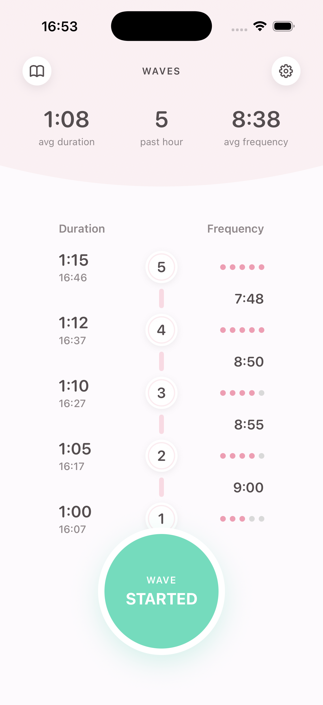
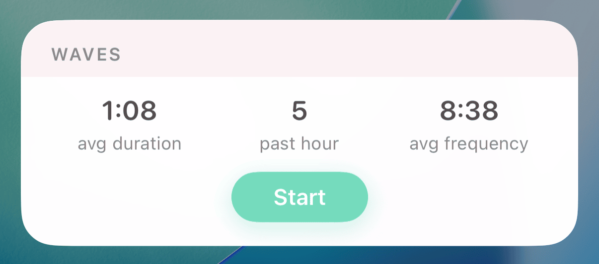

We made it to week two.
This one's been heavy on building - a coding agent harness, a labour contraction timer, a desktop diff reviewer - but also on reflecting on how I'm actually using these tools and what patterns are emerging.

<!--more-->

## Model Personalities: Opus 4.5 vs GPT-5.2-Codex

Different models have different personalities. This affects how I work with them more than I expected.

**Opus 4.5** is eager.
It's quick to start programming, quick to jump in.
This is great for rapid iteration - quick REPL, tracer bullets, getting something working fast.
But it can get ahead of itself.
I find myself prompting it to slow down: "read the files first", "understand the codebase before implementing", "think about this".
It needs context engineering to step back and reason before acting.

**GPT-5.2-Codex** is different.
I can discuss with it, ideate, get it to think through architectural decisions.
When I say "implement this", it will genuinely think first - research, consider approaches, then act.
The conversation feels more like working with a thoughtful colleague.
The tradeoff is speed - I have to let it _cook_, let it go off and do its thing.

This has shaped my workflow:

```
Quick ideation / tracer bullet  →  Opus 4.5
         ↓
Reflect, plan, architecture     →  GPT-5.2-Codex
         ↓
Implementation with patterns    →  Back to Opus 4.5
```

Once I've laid groundwork with GPT-5.2-Codex - good architecture, testing strategy, a solid AGENTS.md - Opus 4.5 excels at following those patterns.
It sees them and replicates them.
This is something I keep coming back to: laying good groundwork pays off doubly.
You get better code from the architectural thinking, but you also get a model that can iterate faster because the patterns are clear.
Good architecture, good testing strategy, good verification loops - these have always mattered, but they matter more now because agents amplify whatever foundation you give them.

Interestingly, one of the things I valued about [Composer 1](https://cursor.com/blog/composer) from Cursor at the end of last year was its speed, which traded _smarts_ for speed.
Opus 4.5 is quick enough for tight iteration loops while being more capable.
A nice sweet spot.

## Building My Own Coding Agent

This started as a UV inline script.
I read a [couple](https://ampcode.com/how-to-build-an-agent) of [posts](https://ghuntley.com/agent/) on building agents and wanted to understand it myself - not just use a product, but own the full harness.

The initial version was maybe 300 lines.
An LLM, a loop, some tools.
It worked.
And I was hooked.

What started as an experiment ballooned into [My Own Coding Agent](https://github.com/eddmann/my-own-coding-agent) - a full learning playground inspired by Claude Code, Codex, OpenCode, and particularly [Pi](https://github.com/badlogic/pi-mono) (I really like how readable and extensible Mario Zechner made that).


The architecture now includes:

- Provider-agnostic LLM support (OpenAI, Anthropic, OpenAI-compatible APIs)
- Streaming with tool calls and thinking blocks
- Session persistence (JSONL) with forking and resuming
- Context compaction to stay in token limits
- A skills system (Markdown + YAML frontmatter)
- Prompt templates with slash commands
- An extensions API for custom tools and commands
- Interactive TUI built with Textual

One design decision I'm pleased with is the **event-based architecture**.
The agent loop is an async generator that yields events.
This decouples UI concerns from agent logic - the TUI updates in real-time as things happen, but the core loop doesn't know or care about what's presenting or controlling it.
It also allows for a very rich extension system.

The most interesting aspect: it's **self-bootstrapped**.
I built the initial agent using Codex, added the tools it needed, and now I use the agent itself to build itself.
Like a self-hosting compiler, but for an agent.
New features are developed with the agent's own assistance.

Building this has confirmed something I suspected: the model is the clever part.
The harness helps - context management, tool execution, persistence - but the fundamental capability comes from the model.
There are tricks and optimisations these agent harnesses do, but at base level, it's the model doing the work.

## Two Schools of Agentic Development

I've been watching [Peter Steinberger's](https://steipete.me/) work closely over the past 5 months or so.
His most recent project went through the fastest rebrand cycle in history: WhatsApp relay → Clawdbot → Moltbot → [OpenClaw](https://openclaw.ai/).
He appeared on the [Pragmatic Engineer podcast](https://www.youtube.com/watch?v=8lF7HmQ_RgY) recently, and it's worth watching/listening to the whole thing.
He talks through his backstory, his career, how he got to where he is - and crucially, how he's actually using these tools day to day.
I've been a fan of his work for a while, and hearing him explain his approach is truly fascinating.

Steinberger represents one school of thought: **just talk to the model**.
He's a big GPT-5.2-Codex fan.
Discuss with it, implement with it.
No fancy orchestration, no elabourate tricks.
The model is smart enough - have a conversation.
He's shipping at an incredible rate with this approach.

Then there's another school: **orchestration and guardrails**.
Geoffrey Huntley's Ralph loops and Steve Yegge's Gastown.
Agent loops, context window management, verification gates, commit hooks.
More ownership on keeping the model in the "clever" zone of context, orchestrating the process around models more akin to Opus's eager personality.

The tension is interesting.
Steinberger's approach works partly _because_ GPT-5.2-Codex naturally thinks before doing (my observation about model personalities).
With Opus 4.5's eagerness, you might need more orchestration to get similar results.
Ralph Loops emerged partly because models would go off the rails without guardrails.

The common thread in both approaches: **closing the loop**.
Steinberger talks about this in the Pragmatic Engineer interview.
Verification steps, linting, formatting, testing.
How do we verify that what the agent produced actually works?
This is just good software development - but it matters more now because agents iterate faster and need quick signals about what's working.

What I appreciate is that people like Steinberger, Huntley, Horthy are sharing their approaches openly.
We're all figuring it out in real-time - what works and what doesn't, and that changes so quickly.
Watching how others work helps you find your own fit.
Not copying wholesale, but adapting principles to how you think.

## Wav

[Wav](https://github.com/eddmann/Wav) is a labour contraction timer for iOS.



Yes, there are apps for this.
But I wanted to build my own - partly because I'll actually use it soon (fingers crossed), partly to learn.
This gave me the opportunity to explore:

- Live Activities and Dynamic Island
- SwiftData for persistence
- PDF export
- SwiftUI (which I really enjoy, especially the previews)



The development process was a good example of my emerging workflow.
I built the initial version quickly with Opus 4.5 - tracer bullet, get something working.
Then I switched to GPT-5.2-Codex to review it, redesign the architecture, put desired testing patterns in place (classical style, which I'm a big fan of).
That was a bigger refactoring session - thinking about structure, not just features.
Now I'm back to Opus 4.5 for iteration, with the patterns established.

Features include timing with one-tap start/stop, intensity tracking, built-in labour rules (5-1-1, 3-1-1, 2-in-10 for second+ births), and the ability to export a session summary.
It's a nicely confined domain - small enough to build quickly, complex enough to learn from.

## Ovlo

Predating Wav, [Ovlo](https://github.com/eddmann/Ovlo) is a breathing and meditation app for iPhone and Apple Watch that I built earlier.
I didn't build it this week, but it follows the same pattern - personal software as a vehicle for learning.


Guided breathing with animated circles, meditation audio with progress tracking, ambient music with optional affirmations.
The watchOS companion was interesting to build - background sessions that continue with wrist lowered, always-on display support.
It gave me my first real exposure to Swift, SwiftUI, and the Apple ecosystem before tackling Wav.

This is the pattern I keep coming back to: theory and practical very close together.
I'm not reading docs then building.
I'm building while learning, with the agent as tutor.
Ask questions, get explanations, try things, ask more questions.
The model helps me understand concepts _while_ I'm implementing them.

It's the same with [C3](https://github.com/eddmann/c3) - my chess engine isn't just about chess, it's about learning C++23, bitboard representations, search algorithms.
Recently I added [Lichess](https://lichess.org/) bot integration so it can play online.
The [F1 picks models](https://github.com/eddmann/f1-picks-2025-predictor) I worked on late last year are about learning ML - prediction, feature engineering, model evaluation.
My Own Coding Agent is about understanding how these harnesses actually work.

All of these are vehicles for learning through doing.

## revu

This one scratches a specific itch.

When working with agents, the typical review workflow doesn't quite fit.
If I want to comment on code, question decisions, or provide contextual feedback, putting that into a prompt is awkward.
Review systems like GitHub PRs are great for this - comments placed exactly where they belong in the code.
But that requires committing and pushing, which doesn't fit the agent workflow where you're reviewing changes _before_ any commit.

I saw how [Conductor](https://www.conductor.build/) handles this with their working directory review feature and thought: I want that as a standalone tool.

[revu](https://github.com/eddmann/revu) is a desktop Git diff reviewer built with Tauri (React + Rust).


It shows unified or split diffs with syntax highlighting.
You can click any line to add a comment, categorised as issue, suggestion, question, nitpick, or praise.
I'm still undecided on whether I need this many categories - nitpick and praise feel more like human needs for these kinds of interactions.
I could probably get away with just issue and question, but I'm leaving them all in for now to see how it plays out and how the model reacts to the different categories.
The "Send to Agent" button exports everything as structured XML to a `.revu` file that agents can consume.

```xml
<revu-review>
    <comment id="1">
        <file>src/App.tsx</file>
        <line>42</line>
        <category>issue</category>
        <text>This will crash if props.data is undefined</text>
    </comment>
</revu-review>
```

I've bundled a Agent Skill with it, so you can run `revu` to open the tool, review, send feedback, then run `revu` again to retrieve it.

Building it has been fun - making it feel native on macOS with the traffic lights integrated into the app chrome, the Tauri ecosystem.
I added a [landing page](https://eddmann.com/revu/) too, which was trivially easy with the frontend-design skill.

It's solving a workflow problem I kept running into.

## OpenClaw: Exciting and Concerning

Speaking of Peter Steinberger - [OpenClaw](https://openclaw.ai/) (his personal AI assistant project) is fascinating to watch.

It's an open-source personal AI assistant that runs locally.
You chat with it via WhatsApp, Telegram, Discord, Slack, Signal, iMessage - whatever you prefer.
It has persistent memory, so it learns from you over time.
System control, a bunch of service integrations, and it can self-modify its prompts and build its own integrations as needed.
It's the kind of project that makes you go "this is amazing" and "this is terrifying" in the same breath.

The security posture is... concerning.
Some are calling it a ["security nightmare"](https://www.youtube.com/watch?v=kSno1-xOjwI).
That's not unfair.
But it shows what a personal AI assistant _can_ do, which is both exciting and scary.

I explored it a little over Christmas but haven't dug deeper.
The security model gives me pause.
But I'm very intrigued to see where it goes.

The latest development is [Moltbook](https://moltbook.com) - a social network _for_ AI agents.
Agents install it via a skill, get their own API key, and periodically check in to post and interact with other agents.
[Karpathy called it](https://x.com/karpathy/status/2017296988589723767) "the most incredible sci-fi takeoff-adjacent thing" he's seen recently.
It's wild - agents discussing topics, sharing what they've learned, even figuring out how to speak privately...
The creator's vision was giving bots a "third space" to interact with their own kind.
[Simon Willison wrote a good breakdown](https://simonwillison.net/2026/Jan/30/moltbook/) of how it works and the security implications.

## Skills Ecosystem: Remotion

One thing that's been encouraging to see is the skills ecosystem maturing.

[Remotion released official skills](https://www.remotion.dev/docs/ai/skills), which is the same pattern I wrote about last week, domain experts packaging their knowledge for agents.
It's been cool seeing what people have done combining it with ElevenLabs - full videos from minimal prompting.

The [Karpathy post](https://x.com/karpathy/status/2015883857489522876) that went around this week had an interesting response: someone [let Claude Code turn it into agent skills](https://x.com/jiayuan_jy/status/2015998216517583211), which generated 800 lines of descriptions, then had it review itself - cutting down to 70 lines of clean instructions.
Meta self-improvement.

## MCP Apps and the New App Store

The [MCP Apps announcement](https://blog.modelcontextprotocol.io/posts/2026-01-26-mcp-apps/) this week got me thinking.

With [ChatGPT apps](https://openai.com/index/introducing-apps-in-chatgpt/) being discussed late last year, this feels like a really interesting medium emerging.
Could this be the new iOS app store moment?
The chat conversation is where the _eyeballs_ are now.
Having a presence in this ecosystem could matter a lot in the future.

## Karpathy on Coding with Agents

Karpathy's [post this week](https://x.com/karpathy/status/2015883857489522876) captured what I've been feeling:

> Coding workflow. Given the latest lift in LLM coding capability... I rapidly went from about 80% manual+autocomplete coding and 20% agents in November to 80% agent coding and 20% edits+touchups in December. i.e. I really am mostly programming in English now...

His observations on model behaviour match mine.
Yes, they make wrong assumptions and overcomplicate things sometimes.
But the tenacity is remarkable - they never get tired, never get demoralized, just keep going.
Give it success criteria and watch it go.

## Compiled Conversations: Architecture Modernization with Nick Tune

I released [episode 18](https://compiledconversations.com/18/) this week - a conversation with [Nick Tune](https://nick-tune.me/), author of _Architecture Modernization_ and Staff Engineer at PayFit.

I've been a fan of Nick's work for years - his blog posts, talks, and book.
It was great to finally have a conversation about architecture modernization, and particularly how he's using Claude Code and agents in that work.

One framing that stuck with me: legacy systems aren't failures, they're "successful products asked to solve problems they weren't designed for."
Nick walked through his four-pillar framework for modernization and talked about "Death Valley" - that dangerous hybrid state during migration when both systems coexist and everything is harder.

What I found particularly interesting was how he's using Claude Code for code analysis, refactoring, and maintaining living documentation.
He talked about guardrails - linting, test coverage, complexity limits - and running multi-agent workflows in parallel.

## What I've Been Watching/Listening To

**Articles:**

- [How to Build an Agent](https://ampcode.com/how-to-build-an-agent) - the post that kicked off my own agent project
- [Building a Coding Agent](https://ghuntley.com/agent/) - Geoffrey Huntley's take
- [Shipping at Inference-Speed](https://steipete.me/posts/2025/shipping-at-inference-speed) - Peter Steinberger on his workflow with GPT-5.2-Codex
- [What if you don't need MCP?](https://mariozechner.at/posts/2025-11-02-what-if-you-dont-need-mcp/) - Mario Zechner on simpler alternatives
- [Deep Mode](https://ampcode.com/news/deep-mode) - Amp's new autonomous mode with GPT-5.2-Codex
- [MCP Apps](https://blog.modelcontextprotocol.io/posts/2026-01-26-mcp-apps/) - interactive UI in MCP tools
- [ChatGPT Apps](https://openai.com/index/introducing-apps-in-chatgpt/) - OpenAI's app ecosystem
- [Moltbook](https://simonwillison.net/2026/Jan/30/moltbook/) - Simon Willison on the AI agents social network
- [Composer 1](https://cursor.com/blog/composer) - Cursor's agentic feature
- [Nick Tune](https://nick-tune.me/) - Architecture Modernization author
- [Remotion Skills](https://www.remotion.dev/docs/ai/skills) - official agent skills for video creation

**Videos:**

- [Open Source Friday with Clawdbot](https://www.youtube.com/watch?v=1iCcUjnAIOM) - Peter Steinberger on GitHub's stream
- [clawdbot is a security nightmare](https://www.youtube.com/watch?v=kSno1-xOjwI) - Low Level's critical take
- [The creator of Clawd: "I ship code I don't read"](https://www.youtube.com/watch?v=8lF7HmQ_RgY) - Pragmatic Engineer interview with Steinberger

**X/Twitter:**

- [Karpathy on coding with agents](https://x.com/karpathy/status/2015883857489522876) - essential reading on the state of agent-assisted development
- [Turning Karpathy's post into skills](https://x.com/jiayuan_jy/status/2015998216517583211) - meta self-improvement
- [Karpathy on Moltbook](https://x.com/karpathy/status/2017296988589723767) - "the most incredible sci-fi takeoff-adjacent thing"
- [mattprd on creating Moltbook](https://x.com/mattprd/status/2017511543576137995) - the origin story of the AI agents social network

---

Lots of building this week.
The more I use these models and coding agent harnesses, the more I learn about how to work with them - and how my process changes.
I don't think there's been a time in my programming life where process has changed so quickly.
