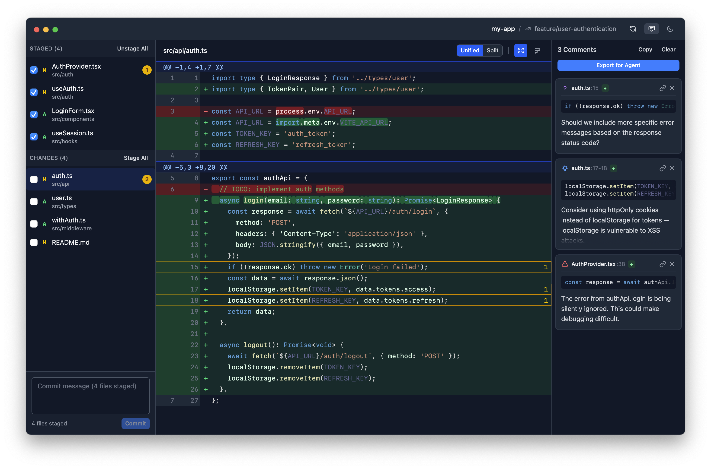

Week three.
It's been another busy week with work and spending any free time I do have with these LLMs, exploring many different things along the way.

<!--more-->

## Throwaway Tools and Closing the Loop

Something that's shifted fundamentally in how I debug: I build tools now.

Not permanent tools.
Throwaway CLIs, temporary dashboards, one-off commands - things that exist only to help me (or the agent) understand what's going on.
The cost of building these has dropped so dramatically that it's now cheaper to spin up a diagnostic tool than to manually inspect something.

This connects to what Peter Steinberger was talking about in the [Pragmatic Engineer interview](https://www.youtube.com/watch?v=8lF7HmQ_RgY): **closing the loop**.
How do you give an agent the ability to verify something that you'd normally check yourself?
Build it a tool.
A CLI that queries the state, a dashboard that visualises the data, a command that exercises the edge case.

There are two levels here.
Some tools stick around - a CLI for inspecting database state, a health check endpoint.
Those get committed.
But many are genuinely disposable: a quick script to verify a hypothesis about why a calculation is off, a dashboard to visualise data flow while tracking down a subtle bug.
You build it, use it, delete it.

The key insight is that these tools serve both you _and_ the agent.
You can see what's happening.
But more importantly, you can give the agent the ability to close its own feedback loop - to verify its work without asking you to check a screen or run a manual test.

This doesn't replace good test coverage - automated testing and regression suites are still essential.
But these temporary tools fill the role that writing tests for discovery used to.
Where in the past you'd write a quick test to explore a hypothesis, now you can build a rich CLI or dashboard instead.

## F1 Picks 2026

With the F1 season approaching - pre-season testing in Bahrain is just around the corner - I needed to get the [F1 Picks](https://github.com/eddmann/f1-picks-2026) website sorted.

For context: this is a _friendly_ prediction game I've been running with my family for a couple of years.
You pick drivers, there's a point system, there's a winner at the end.

What's interesting is the progression.
When I built the [2024 version](https://github.com/eddmann/f1-picks), it took about four hours.
At the time, I thought that was impressive - flinging code between ChatGPT and my IDE, lots of manual copy-paste between the model and the editor.
Very much a person in the middle.

The 2026 version? About an hour.
Full new system on Cloudflare with a D1 database, a completely reworked point system that I explored and validated with the family, comprehensive test coverage, solid architecture.
And this isn't vibe coding - I ran it through the same deliberate process I described [last week](../2026-01-31-weeknotes-model-personalities-building-my-own-agent-and-two-schools-of-agentic-development/): explore with Opus 4.5, solidify with Codex 5.2, then implement with patterns established.

 

My expectations of what I can ship in a short space of time have fundamentally changed.
Four hours felt fast two years ago.
Now an hour gets me something with more polish, more features, better testing, and better architecture.
I also finally released [Step Wars](https://github.com/eddmann/step-wars) this week - the Star Wars-themed step competition I mentioned previously.

## The Pragmatic Middle: Architecture and Testing

Both F1 Picks and Step Wars went through the same architectural decision process, and it's worth talking about because the approach lands in an interesting spot.

The agent and I discussed this extensively - hexagonal architecture, clean architecture, onion architecture.
Full domain models with symmetric ports (both driving and driven).
We decided against all of that.

Instead, we went **pragmatic**.
The core principle from all these approaches is the same: depend on abstractions, not implementations.
So the driven ports are there - all infrastructure concerns (database, external APIs) are abstracted behind interfaces that can be tested in isolation.
But there are no driving port adapters.
The delivery layer calls the use cases (really just _fat_ application services) directly, and there's no distinct domain model layer underneath - shared types are used as-is.

The testing strategy matters just as much.
I'm a big fan of the Chicago school - test behaviour at the public API boundary, not implementation details.
This is what [Ian Cooper talks about](https://www.youtube.com/watch?v=EZ05e7EMOLM) in his "TDD, Where Did It All Go Wrong" talk: test the behaviour from the outside, _double_ the collaborators, and you get tests that tell you _what_ broke, not just _that_ something broke.

The reason you test at different levels is about **localised, timely feedback**.
A broad end-to-end test tells you something is broken, but the problem could be anywhere in the stack - you've gained confidence but not locality.
A focused unit (of behaviour) test around a use case with external concerns _doubled_ out narrows the blast radius: when it fails, you know _where_ the problem is, and you know _fast_.
The more localised the test, the tighter the feedback loop.

What's rewarding is being able to discuss this _with_ the agent at a high level - "what architecture pattern fits here?", "how should we approach testing?", "should we use MSW for the client?" - and then have it implement those decisions consistently across both the client and the API.
Write it up in the documentation, get alignment, and the agent follows the patterns.
These models follow guidelines much more reliably now than even a few months ago.

## Demo Data and the Screenshots Problem

Working at this velocity creates a new problem: screenshots lag behind the code.

The friction of getting an application into a specific visual state - for README images, landing pages, App Store screenshots - adds up.
I noticed this particularly with [VoiceScribe](https://github.com/eddmann/VoiceScribe), where the screenshots had fallen embarrassingly behind the actual app 😬.

So I built **demo states** into my applications.
Every app now has the concept of demo data - a way to put the application into specific, useful states for screenshots, verification, or visual testing.

The challenge is balance.
Like logging, you don't want demo data concerns polluting your production code.
And there are performance considerations.
I spent time thinking about this in both JavaScript/React contexts ([revu](https://github.com/eddmann/revu), the review app) and iOS/Swift contexts (Ovlo, ClaudeMeter, VoiceScribe, ClipVault).
Using tree-shaking in the JavaScript context and `#if DEBUG` macros in Swift to ensure this logic isn't included in release builds.

For iOS, I explored using SwiftUI previews since they're built for this, but they don't give the exact same feel as a simulator.
So the demo states boot the actual application into a specific configuration that can be screenshotted from the simulator.

One detail I find satisfying: **aesthetically pleasing data**.
It's easy to be lazy about what example names look like, how many items to show, how much whitespace there is.
But these screenshots represent your project.
The data should feel real, use the space well, and showcase features.
It's like the old observation about LLMs always generating [clocks showing 10:10](https://medium.com/@SamMormando/why-ai-thinks-every-clock-says-10-10-a-simple-way-to-talk-about-bias-in-the-classroom-97b9122e7a77) - that's the most aesthetically balanced position.
Same principle.

## MyPodcast Rebrand

I picked [MyPodcast](https://mypodcast.cloud/) back up this week.
It turns articles, blog posts, and YouTube videos you save into a personal podcast feed - hear what you'd otherwise never get round to reading.

The UI had been bothering me.
The mascot idea felt _dated_, the design wasn't clean enough, and it didn't work well across screen sizes.

So I had the agent spin up **5 git worktrees**, each exploring a radically different design direction using the frontend-design skill with Opus 4.5.
Each one got its own HTTP server so I could preview them side by side.

The process:

1. Generate five diverse designs in parallel worktrees
2. Preview them all via HTTP servers at different ports
3. Pick the best direction, pull ideas from others
4. Collapse back to the main branch with the chosen design
5. Iterate from there

The migration to Tailwind was a clear win - these models are excellent with Tailwind because the training data is so rich.
The new design is more mobile-responsive, cleaner, and more professional.
I then applied the same styling to the [browser extension](https://mypodcast.cloud/browser-extension) too, so the whole experience feels cohesive.

It's not where I want it to be yet, but it's a better direction.
Forward progress.

## MyPodcast Goes Mobile

The browser extension for MyPodcast works well for capturing content.
When you save an article, it dumps the full rendered HTML - complete content regardless of SPAs, paywalls, or dynamic rendering.
No proxying or server-side rendering needed.

But I find most articles I want to save when I'm on my phone.
And the web-based save wasn't cutting it.

So I built a React Native app.
I chose React Native specifically because LLMs are exceptionally good with JavaScript, TypeScript, and React - the training data is dense enough that it just flows.

The key feature is a **share extension**.
From any mobile browser, you share a link with MyPodcast.
It opens in a WebView within the app, previews the article, and when you confirm, saves the full rendered HTML content - the same approach as the browser extension.
Same API endpoint, same backend processing.

This solves the content capture problem elegantly: the user's browser (or WebView) does the rendering, and I get the complete content regardless of how the page was built.
No need for server-side Puppeteer or Playwright.
The content the person saw is exactly what gets saved.

I'm testing it through an Expo development build and plan to release it next week.
Works on both iOS and Android, styled in the new rebrand.

## Coding Agent: Sessions as Trees

I continued work on [My Own Coding Agent](https://github.com/eddmann/my-own-coding-agent) this week, with a big focus on session management.

The initial approach was crude - destructive compaction, simple message lists.
What I landed on, inspired by how [Pi](https://github.com/badlogic/pi-mono) handles it, is an **append-only JSONL format** where sessions are represented as a **tree data structure**.

This means conversations are non-destructive.
You can start a conversation, go back to an earlier point, branch off in a new direction, come back to the original branch and continue.
The implementation is clean: you just need a pointer to the current node, and you can reconstruct any conversation path by traversing up to the root.
[Mario](https://mariozechner.at/) had been talking about sessions as tree structures, and it really is beautiful once you see it.

There's also a **fork** capability: take one path from root to the current node and create a completely new session file from it.
Fresh start, but with all the prior context preserved.

Compaction is non-destructive now too.
It appends a compacted summary rather than destroying history.
Everything append-only, which makes the whole system much more robust.

**Model switching** across sessions surfaced interesting nuances.
Each model carries metadata - response IDs, caching hints, implementation-specific details.
When switching from GPT-5.2-Codex to Opus 4.5 mid-session, I need to carry the right metadata for each model but strip what's irrelevant for the next.
The append-only format handles this by decorating messages with which model produced them.

I also added **Max/Pro Plan authentication** for Anthropic.
Interesting timing - I experienced firsthand the drama that hit [OpenCode](https://github.com/opencode-ai/opencode), Pi, and other agent harnesses when Anthropic started blocking API requests using this authentication method.
The spoofing is whack-a-mole (renaming tools to look like Claude Code, for example), but keeping it at the API provider abstraction level means the rest of the codebase doesn't care about these details.

By the end of the week I had **[Opus 4.6](https://www.anthropic.com/news/claude-opus-4-6)** support working - its adaptive thinking mode requiring a unified abstraction at the LLM provider level - and I'm working on **[GPT-5.3-Codex](https://openai.com/index/introducing-gpt-5-3-codex/)** support too.
Switching between Codex and Opus mid-session was a satisfying moment.

I also put together a demo of the agent building a simple LISP interpreter from scratch - reading the problem, implementing it in TypeScript with Bun, testing it, and presenting the results.

Seeing your own agent harness work through a problem end-to-end is deeply satisfying.

## Jeeves: A Personal AI Assistant

The conversation that really set my mind going this week was with [TJ Miller](https://tjmiller.me/).
I'll be releasing that podcast episode on [Compiled Conversations](https://compiledconversations.com/) in the coming weeks.
He's been building [Iris](https://iris.prismphp.com/) - a personal AI assistant with a sophisticated memory system - and his approach to memory is genuinely fascinating.

His work on [Truths](https://www.tjmiller.me/posts/iris-truths/) - separating identity-defining facts from episodic memories - and [multi-generational memory consolidation](https://www.tjmiller.me/posts/multi-generational-memory-consolidation/) gave me a lot to think about.
The [refinement update](https://www.tjmiller.me/posts/truths-refinement-update/) on contradiction detection and generation tracking is especially interesting.

That conversation, combined with listening to [Mario and Armin on Syntax.fm](https://syntax.fm/show/976/pi-the-ai-harness-that-powers-openclaw-w-armin-ronacher-and-mario-zechner) discussing Pi and [OpenClaw](https://openclaw.ai/), pushed me to build my own.

I'd been looking more closely at OpenClaw, and then I noticed [NanoClaw](https://github.com/gavrielc/nanoclaw) - a stripped-down, easy to understand alternative.
NanoClaw's philosophy resonated: small enough to understand, secure by container isolation, built for one user.

So I built **[Jeeves](https://github.com/eddmann/jeeves)** - my personal AI assistant, housed in a Docker container running on a Raspberry Pi.
It sits somewhere between NanoClaw's simplicity and OpenClaw's ambition.

Key design decisions:

- **Telegram only** - it's what I use
- **Anthropic only** - one provider, done well
- **Own agent harness** - not NanoClaw's SDK-based approach, so I control sessions, memory, and the full agent lifecycle
- **Code-first skills** - UV inline scripts, Bun scripts, phpx scripts. The skills _are_ code. No MCP, no tool-calling wrappers. The LLM writes code to solve problems.

The real unlock is **proactive skill creation**.
When Jeeves encounters a problem or discovers a capability I want, it builds its own skill - and uses it going forward.
And it can _update_ those skills after the fact.

I had a great example with Plex integration.
Jeeves built a UV inline script for interacting with my Plex server - authentication, library queries, playback history.
During the initial build, authentication wasn't working.
I could see Jeeves reasoning about the problem, going back to the skill, identifying the auth issue, updating the code, and retrying.
Self-correcting skill development.

This pattern of using libraries directly - the Plex Python library, [Playwright](https://playwright.dev/) for browser automation, [Octokit](https://github.com/octokit/octokit.js) for GitHub - feels more powerful than wrapping everything in CLIs.

For memory, the current approach is straightforward: the context window is the last 50 messages, and a set of core memory files (like `MEMORY.md` and `USER.md`) are always injected into the system prompt.
There are also daily memory files (`memory/YYYY-MM-DD.md`) for episodic notes.
The assistant is given guidance to update both core and daily memory when it sees fit - there's no forced sync point or trigger, it just maintains its own memory as the conversation flows.
Over the next few weeks I want to explore memory more deeply - TJ's work on Truths and multi-generational consolidation, along with the OpenClaw and NanoClaw approaches, have given me a lot of ideas.

## What I've Been Watching/Listening To

**Articles:**

- [Introducing Truths](https://www.tjmiller.me/posts/iris-truths/) - TJ Miller on separating universal facts from contextual memories
- [Truths: The Refinement Update](https://www.tjmiller.me/posts/truths-refinement-update/) - contradiction detection and generation tracking in Iris
- [Multi-Generational Memory Consolidation](https://www.tjmiller.me/posts/multi-generational-memory-consolidation/) - how Iris consolidates memories over time
- [Building Nova - The Foundation](https://www.tjmiller.me/posts/building-nova-foundation/) - the origins of TJ's AI companion project
- [Joy & Curiosity #72](https://registerspill.thorstenball.com/p/joy-and-curiosity-72) - Thorsten Ball on why some developers still don't see what AI can do
- [Joy & Curiosity #73](https://registerspill.thorstenball.com/p/joy-and-curiosity-73) - optimising code for agents rather than humans

**Podcasts:**

- [Raising An Agent #10](https://www.youtube.com/watch?v=4rx36wc9ugw) - Amp killing their VS Code sidebar extension, "deep mode" with GPT-5.2-Codex as a different way of working, and why different models need different modes not just drop-down selections
- [State of AI in 2026](https://lexfridman.com/ai-sota-2026) - Lex Fridman with Nathan Lambert and Sebastian Raschka on the state of play - no secret tech advantages, Anthropic's bet on code paying off, and DeepSeek sparking a whole Chinese open-weight ecosystem
- [Elon Musk on Dwarkesh Podcast](https://www.dwarkesh.com/p/elon-musk) - AI in space in 36 months, consciousness as a tiny candle in vast darkness, and robotics as the only path to genuine abundance
- [Pi: The AI Harness That Powers OpenClaw](https://syntax.fm/show/976/pi-the-ai-harness-that-powers-openclaw-w-armin-ronacher-and-mario-zechner) - Armin Ronacher and Mario Zechner on Syntax.fm discussing agent design, memory, and why "Bash is all you need"

---

The theme that keeps emerging: the tools are good enough now that the bottleneck is deciding _what_ to build, not _whether_ you can build it.
Architecture, testing, and thoughtful design matter more than ever - not less - because agents amplify whatever foundation you give them.

And of course by the end of the week Anthropic and OpenAI dropped their latest models, [Opus 4.6](https://www.anthropic.com/news/claude-opus-4-6) and [GPT-5.3-Codex](https://openai.com/index/introducing-gpt-5-3-codex/).
I look forward to getting a feel for their character over the coming weeks.
