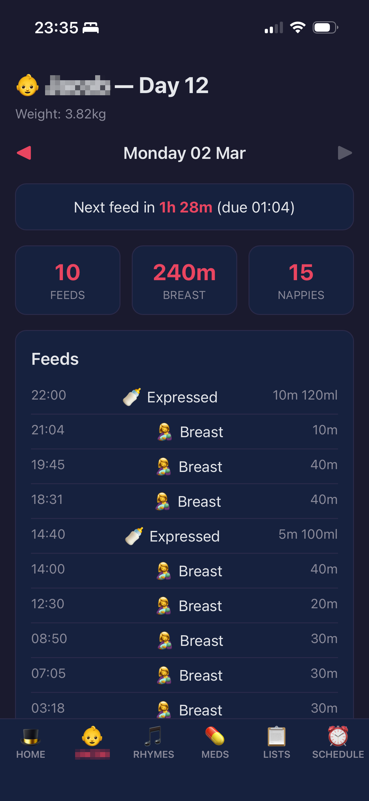
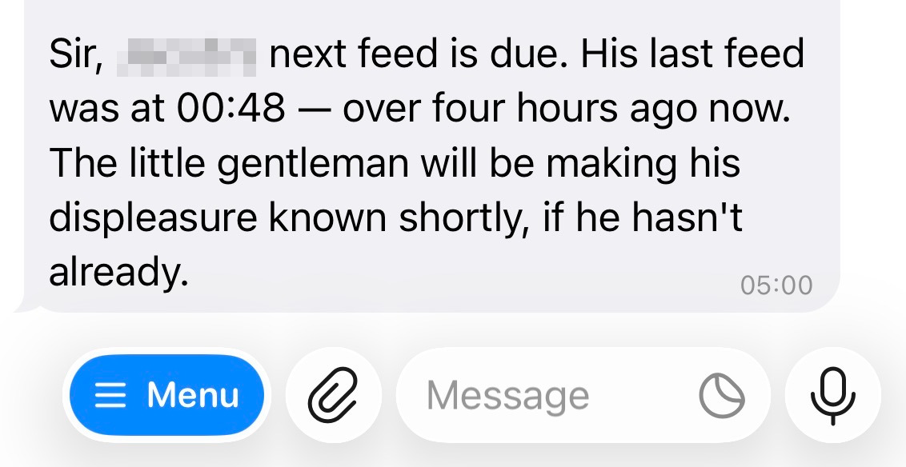
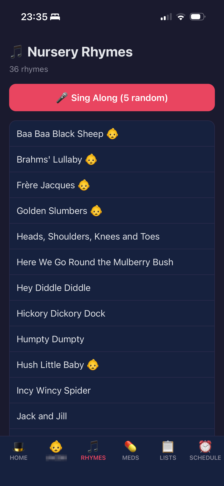
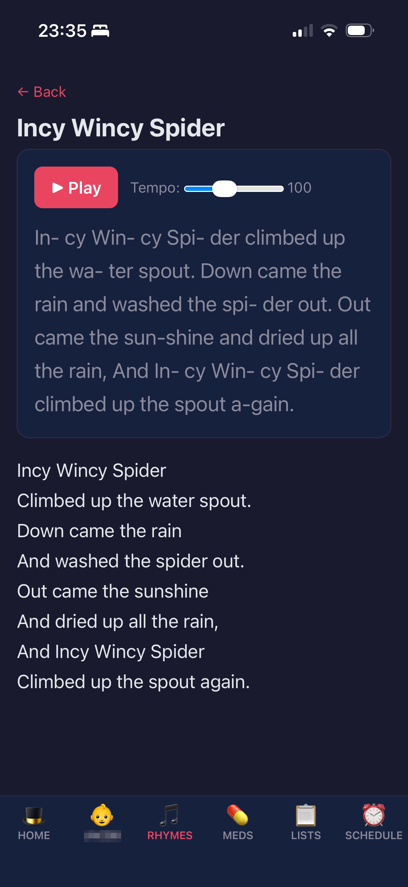
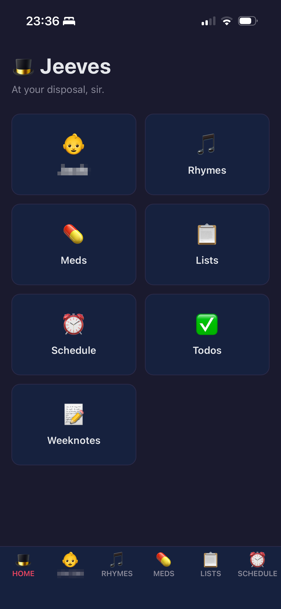
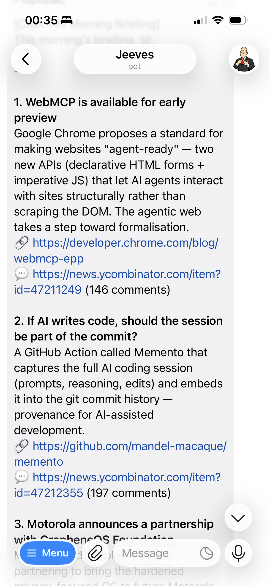

I've been AFK from the computer the last couple of weeks due to the birth of my new baby.
This weeknotes is different - less building at the computer, more living with what was already built.

<!--more-->

## Jeeves Earns Its Keep

In the [previous](../2026-02-08-weeknotes-throwaway-tools-sessions-as-trees-and-building-a-personal-ai-assistant/) [weeknotes](../2026-02-14-weeknotes-pwakit-hybrid-memory-and-executable-markdown/) I wrote about building [Jeeves](https://github.com/eddmann/jeeves) - a personal AI assistant on a Raspberry Pi, accessible via Telegram.
It was a technical learning project.
What I didn't expect was how quickly it'd go from something I was tinkering with to something I was genuinely depending on.

With a newborn, you're not typing.
Telegram voice messages became the primary interface - voice-first out of necessity.
I'd added OpenAI Whisper support a couple of weeks before and that proved critical.
Even just using the iPhone's built-in speech recognition works, because the models on the other end can interpret rough transcription.
Garbled, one-handed, half-asleep - doesn't matter, the LLM infers from context.

It started in hospital - I was asking Jeeves questions.
Medical stuff, parenting stuff, random knowledge at random times.
It's contextual, it knows what we've been talking about, and it actually starts suggesting follow-up questions.
Then once we got home my wife had postnatal medication with tapering schedules - explaining what to take when, working out how to taper, documenting the full schedule.
I described it all by voice and Jeeves built a tracker.
This wasn't a pre-built feature - it built the skill because we needed it.

From there I started logging everything about the baby.
Every feed, every nappy, every weigh-in - all by voice.
Early on I was using image recognition for monitoring certain bits and pieces too.
Jeeves finds insights in the data - feed frequency, weight trajectory, patterns I wouldn't spot from individual data points.

By the time the first midwife checkup visit came around, Jeeves had accumulated a list of things to ask based on all our conversations since the hospital.
Before each appointment it compiles what needs discussing and proactively suggests questions based on the tracking data.
After the appointment I voice-note the answers, they get logged, and follow-ups become tracking items or reminders.
You get maybe thirty minutes with a midwife - having structured questions means you make the most of it.
It fills the gap between clinical visits nicely.

Reminders and lists became part of the routine too - steriliser water changes, feed reminders, midwife visit checklists.
The reminders skill is built on top of the scheduler built into Jeeves - one-off and scheduled.
Not sophisticated, but exactly what's needed.

One moment that stuck with me - Jeeves quite politely told us we shouldn't both be waking up for feeds, we should be taking shifts.
It had enough context from the feeding schedule and nappy data to build a rotation plan based on when feeds and changes were happening.
Full context means actually informed suggestions, not generic parenting advice.

I mentioned wanting nursery rhymes at one point and Jeeves proactively built a skill with a MIDI player.
Didn't ask it to build a skill - just mentioned it in conversation, and it created one.

 

And this isn't just for me - my wife can see the tracking data, medication schedules, all of it through the pages skill.
Hands-free for both parents.

## Personal Software, Built by the Assistant

The thing I keep coming back to: it doesn't feel like building software.
You're having a conversation with your assistant and these personal software tools just appear.
Puzzle pieces that fit together.
"We need something for nursery rhymes" - and Jeeves builds it.
"I want to track the baby's feeds" - and a tracking system appears.
You're not thinking "I need to build a piece of software that does feed tracking."
It just happens.

Jeeves didn't just run pre-built skills - it built the nursery rhyme player, the tracker pages, the medication system itself.
I told it what I needed and it wrote the code.
This is the [code-first skills](../2026-02-08-weeknotes-throwaway-tools-sessions-as-trees-and-building-a-personal-ai-assistant/) philosophy from previous weeknotes actually working under pressure - **proactive skill creation**.

The primary interface with Jeeves is Telegram - that's where the conversation happens.
But sometimes text messages aren't the best way to present information.
I added a pages skill so Jeeves has a web page medium when it needs one - it drops a Python file into a directory and it's immediately live, served over [Tailscale](https://tailscale.com/) at `http://jeeves:8080`.
Baby tracking dashboards, medication schedules, the nursery rhymes - anything that's better as a visual than a wall of text in a chat.
No deploy step, no restart - just drop a file and it's there.
It's also a [PWA](../2026-02-14-weeknotes-pwakit-hybrid-memory-and-executable-markdown/) so you can bookmark it to your home screen and it feels like an app.

I love how fundamental skills build on each other.
The reminders skill is built on top of the scheduler system - one-off and scheduled reminders under the hood.
Then baby tracking uses the reminders skill for feed alerts.
I can say "go look at the reminder skill if you want to set reminders" and it composes on top.
Skills building on skills.

These are temporal tools - things we can use now and discard when we're done.
They're not polished products.
Good enough is good enough.
The medication tracker goes away when the taper is done.
The feed tracking changes as things settle.
You don't need anything fully polished.

## Staying Informed While AFK

Being away from the computer, time is precious.
I can't scroll Twitter, can't deep-dive into Hacker News.
Jeeves handles that.

Daily digests for Hacker News, Twitter/X - all the people I'm interested in.
Summarised, distilled, the important parts surfaced.
The more Jeeves knows about me, the better it can tailor what I care about, link it to what I'm working on.

Articles and links get sent to [MyPodcast](https://mypodcast.cloud/) and I listen to them on daily dog walks.
Time of the essence - I haven't got time to fully invest in reading articles right now, so summarise-and-listen is the workflow.

I've been capturing notes via the Zettelkasten memory too - AI-related technical stuff, newborn parenting insights, bits and pieces.
All by voice, Jeeves filing them and linking to existing knowledge.
The knowledge accumulates even when I'm away from a desk.

It's gone from scrolling to curation.
Jeeves distils what matters based on what it knows about me.

## What I've Been Learning From

Links, reads, watches, and listens from the week.

**Articles:**

- [Joy & Curiosity #75](https://registerspill.thorstenball.com/p/joy-and-curiosity-75) - Thorsten Ball on where software is heading in the age of AI agents
- [Joy & Curiosity #76](https://registerspill.thorstenball.com/p/joy-and-curiosity-76) - Thorsten Ball on why manually writing code still matters for learning, even with agents
- [Agentic Engineering Patterns](https://simonwillison.net/2026/Feb/23/agentic-engineering-patterns/) - Simon Willison collecting patterns for building software with coding agents

**Podcasts/Videos:**

- [How AI Agents Remember Things](https://www.youtube.com/watch?v=Seu7nksZ_4k) - AI agent memory systems
- [How AI Agents Search Their Memory](https://www.youtube.com/watch?v=SpReZZk_13w) - Memory search and retrieval in agents

---

Jeeves went from a technical project to something woven into daily life.
It's rough around the edges - there are things to fix, stuff that could be smoother.
But the value is real.
It tracked medications, logged feeds, prepared us for midwife appointments, suggested we take shifts, built a nursery rhyme player, and kept me connected to the world outside our house.
Not in a demo - in the actual, messy, sleep-deprived reality of week one with a new baby.

The code-first skills, proactive creation, voice-first interaction, composable pages - all ideas from previous weeknotes, now proven under real pressure.
That feels like the best validation any personal software philosophy could get.
