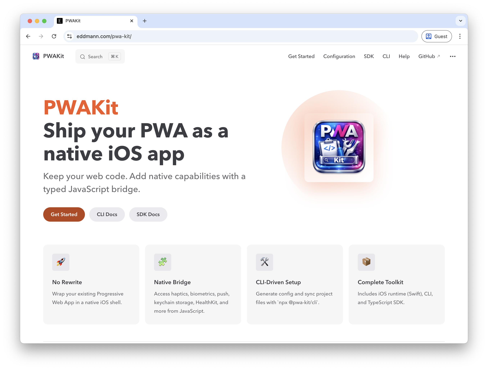
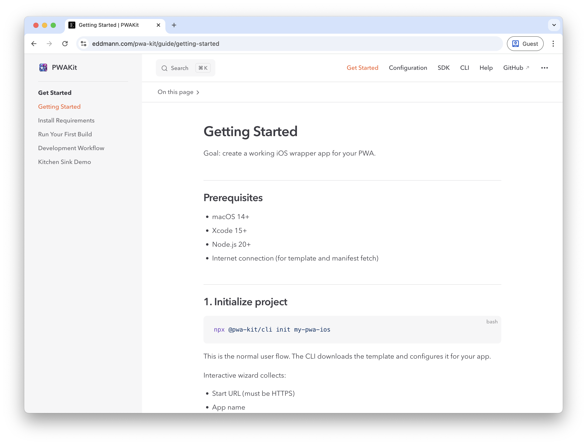
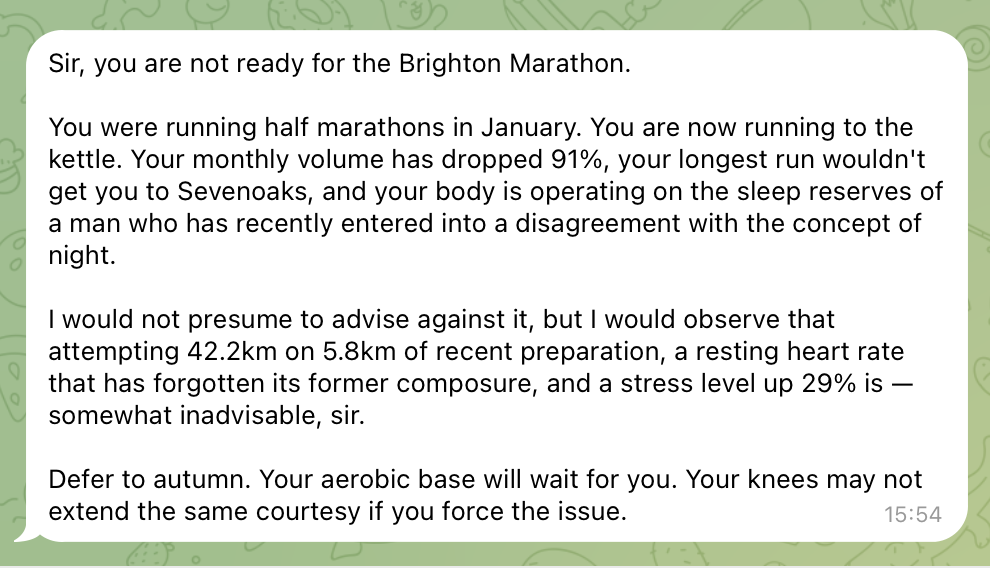

A bit of everything this week.
PWAKit docs, rethinking how agents get isolated workspaces, pruning overstuffed config files, and Jeeves diplomatically telling me I'm not marathon-ready.

<!--more-->

## PWAKit Documentation

This week I've managed to spend a little time building out some [docs for PWAKit](https://eddmann.com/pwa-kit/).

I took inspiration from [Peter Steinberger](https://steipete.com/) and the [OpenClaw docs](https://docs.openclaw.ai/), using AI-generated docs following a **progressive disclosure pattern** with source code as the source of truth.

 

It's a good initial start which can be fine-tuned going forward.
Another case of steering intent rather than writing. Describe the structure you want, point the agent at the source, and let it generate.

It also raises an interesting question about what documentation is even for now.
If someone can point their agent at a repo and it can explore, understand, and answer questions about it, do we still need traditional docs?
Much like comments in code, maybe documentation should be reserved for the things you can't discern from the source itself.

## From Prompt Engineering to Harness Engineering

Ryan Lopopolo published an interesting blog post last month, [Harness Engineering](https://openai.com/index/harness-engineering/). Five months, roughly a million lines of code, zero manually written.
Engineers design environments and specify intent, agents implement.

What caught my attention was the role shift.
The job is less about writing code and more about designing the environment the agent works within.

It crystallised something I'd been feeling: there's an evolution across AI engineering disciplines.
**Prompt engineering**, learning to write good prompts.
**Context engineering**, realising what you surround the prompt with matters more.
**Harness engineering**, the scaffolding, tooling, constraints, and feedback loops around the agent.

These aren't distinct eras though.
They're concentric circles, each subsuming the previous.
You still need good prompts and good context, but the harness is the outermost circle.
And it's all about closing that feedback loop.

## Copy-on-Write Clones for Agent Sandboxing

There's been a wave of GUI-based coding agent tools appearing, [T3 Code](https://t3.codes/), [Polyscope](https://getpolyscope.com/), [Conductor](https://www.conductor.build/), and others.
A common problem they all hit: how do you give multiple agents isolated workspaces?

Git worktrees are the usual answer.
But there's something nicer on macOS: **APFS copy-on-write clones**.

`clonefile()` gives you an instant, zero-disk copy of an entire directory.
Nothing actually gets copied; it just duplicates pointers.
New data only gets written when something changes.
You can use the `cp -c` command to leverage this from the shell.

Compared to worktrees, you get a genuinely isolated full project copy without the cleanup overhead.
Each agent gets its own workspace, works on its own branch, diffs merge back.
I've been writing some scripts to automate this and it's replaced worktrees in my workflow.

It's macOS-only (Linux needs Btrfs or XFS reflinks), but for native Mac tooling it's elegant.

## Peeling Back AGENTS.md

An [ETH Zurich/DeepMind paper](https://arxiv.org/abs/2602.11988) showed that comprehensive AGENTS.md files might actually hurt agent performance.
Too much context, too generic.
Small, targeted instructions beat kitchen-sink configs.

I've been guilty of this.
CLAUDE.md files, AGENTS.md files. I was going a bit too heavy.
Stuffing too much in and then forgetting about it.
Now I'm peeling it back, working out what actually helps versus what's just noise sitting in the system prompt every interaction.

The hard part: **evals are fuzzy**.
Agents are nondeterministic, drift happens slowly, and you don't notice.
You write these config files, forget they exist, and they shape everything silently.
This made me think about evals, and Anthropic's [skill evaluation](https://github.com/anthropics/claude-plugins-official/blob/main/plugins/skill-creator/skills/skill-creator/SKILL.md) approach is interesting, comparing output with and without a skill active to measure actual impact.
Helps catch regressions across model changes too.
Maybe something similar could be done with AGENTS.md files, evaluating whether each instruction actually improves output.

The answer isn't a bigger prompt file, it's better scaffolding.
Aligns neatly with the harness engineering thesis.

## Jeeves

[Jeeves](https://github.com/eddmann/jeeves) keeps ticking along.
New skills, new pages. The **weeknotes skill** is particularly meta, helping me draft these posts from voice notes.

The **Garmin integration** has been interesting.
Correlating health data with the baby's arrival; sleep, activity, all the physiological metrics shifting.
Best moment: Jeeves analysed my training data and gently broke the news I'm not marathon-ready for mid-April.
Diplomatically delivered, but brutal.

I've also been reading about **[Lossless Context Management](https://papers.voltropy.com/LCM)** as an alternative memory model.
Instead of lossy compaction, LCM builds a DAG of hierarchical summaries. Nothing lost, raw messages in SQLite, agents can drill into any summary.
Relevant to Jeeves's context bloat.
This is something I'm looking to explore in the near future.

## What I've Been Learning From

Links, reads, watches, and listens from the week.

**Articles:**

- [Clinejection](https://adnanthekhan.com/posts/clinejection/) - supply chain attack via prompt injection in a GitHub issue title, one AI tool bootstrapping another without consent
- [The AI Vampire](https://steve-yegge.medium.com/the-ai-vampire-eda6e4f07163) - Steve Yegge on burnout in the age of AI
- [Agent Safehouse](https://agent-safehouse.dev/) - kernel-level macOS sandboxing via a single shell script, zero access by default
- [Welcome to the Wasteland: A Thousand Gas Towns](https://steve-yegge.medium.com/welcome-to-the-wasteland-a-thousand-gas-towns-a5eb9bc8dc1f) - Steve Yegge on the coming wave of AI-generated software
- [NanoClaw Security Model](https://nanoclaw.dev/blog/nanoclaw-security-model/) - "Don't trust AI agents", sandboxing and permission models for agentic code
- [Software development costs less than minimum wage](https://ghuntley.com/real/) - Geoffrey Huntley on the collapsing cost of producing software
- [Writing code is cheap now](https://simonwillison.net/guides/agentic-engineering-patterns/code-is-cheap/) - Simon Willison on agentic engineering patterns when generating code costs almost nothing

**Podcasts/Videos:**

- [Marc Andreessen on Lenny's Newsletter](https://www.lennysnewsletter.com/p/marc-andreessen-the-real-ai-boom) - AI countering demographic collapse, E-shaped careers, still learn to code
- [Joy & Curiosity #77](https://registerspill.thorstenball.com/p/joy-and-curiosity-77) - Thorsten Ball on attention management with agents, software deflation, Don Knuth's open problem solved by Opus 4.6
- [Building Claude Code with Boris Cherny](https://newsletter.pragmaticengineer.com/p/building-claude-code-with-boris-cherny) - Pragmatic Engineer deep dive into how Claude Code was built
- [Pragmatic AI: Dreaming Bigger](https://share.transistor.fm/s/0d04649f) - Aaron Francis on thinking bigger with AI
- [Pragmatic AI: AI's Impact on Open Source Funding](https://share.transistor.fm/s/0d04649f) - Adam Wathan on how AI changes the open source funding model

---

A lot of this week comes back to the harness engineering idea: PWAKit docs, copy-on-write sandboxing, pruning AGENTS.md files.
Less writing code, more shaping the environment the agent works within.
And then Jeeves quietly letting me know the marathon isn't happening.
