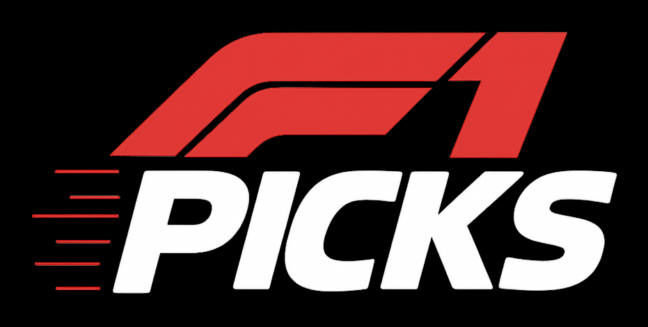

F1 is in full swing now and the [F1 Picks 2026](https://github.com/eddmann/f1-picks-2026) prediction game has become a testing ground for two different ways of working with agents.

<!--more-->

## F1 Picks: Data Analysis

Last year I went down the [ML route](https://github.com/eddmann/f1-picks-2025-predictor) - built a model by the end of the season, inspired by some [podcasts](https://compiledconversations.com/14/) I [did](https://compiledconversations.com/15/) and a genuine interest in ML.
Honest assessment: it was probably overfitted and didn't add much.

This year I've shifted to data exploration.
The 2026 regulation changes mean limited historical data anyway, and the game rules changed, so a fresh approach made sense.

The [analysis notebook](https://github.com/eddmann/f1-picks-2026/tree/main/analysis) use the [Hungarian algorithm](https://en.wikipedia.org/wiki/Hungarian_algorithm) for optimal driver allocation - use each driver exactly once across 22 races, classic assignment problem.
It pulls data from OpenF1 and FastF1, builds an expected points matrix, adjusts for current form, and solves the allocation.

The whole thing is built collaboratively with a coding agent.
I steer - use this algorithm, weight data this way, adjust for sprints - the agent implements.
It's also writing a [picks diary](https://github.com/eddmann/f1-picks-2026/blob/main/analysis/picks-diary-2026.md), documenting its reasoning and reviewing its own analysis each week.

## Gravel: Full Autonomy

I wanted to see what happens when you take yourself out of the loop entirely.
Same game, same data sources, but the agent makes every decision.

[Gravel](https://github.com/eddmann/f1-picks-2026/tree/main/agent) is a fully autonomous F1 picks agent.
Built with the [Claude Agent SDK](https://github.com/anthropics/claude-agent-sdk) - my first time building my own agent loop with it, which was interesting in itself.

The architecture is straightforward.
Gravel gets an MCP server for interacting with the F1 Picks website directly - full autonomy around making and reviewing picks.
It also has the ability to pull F1 data, look at practice and qualifying results, use notebooks for analysis, and search for news and betting odds via [Exa](https://exa.ai/).
The prompting nudges it towards structured analysis but doesn't prescribe methodology.

I run it twice per race weekend: once just before qualifying when all the free practice data is in, and once afterwards for reflection.
Sprint weekends adjust accordingly.

Both runs feed into a [diary](https://github.com/eddmann/f1-picks-2026/blob/main/agent/diary/diary-2026.md) - Gravel's persistent memory.
It records what decisions it made, why, what data it considered, and what it got right or wrong.
This gives it history and continuity across the season.

It's been a good contrast with the collaborative approach.
With the analysis notebook, I steer and the agent drives.
With Gravel, the agent does both.
Different feedback loops, different levels of control, same problem domain.

## Building with the Claude SDK

This was my first time using the Claude SDK directly rather than working through Claude Code or another harness.
A few things stood out.

Unlike rolling your own agent loop, the tools come from Claude Code itself - Bash, file operations, notebooks.
You bridge domain-specific capabilities via in-memory MCP servers, and the SDK wires everything into the agent loop.
You give it a system prompt with the constraints and context, and let it loop.

It also works with your Claude Max plan, which makes running it regularly viable without worrying about API costs.

The SDK sits underneath Claude Code, so understanding it gives you a better mental model of what's happening when you use the higher-level tools.

## What I've Been Watching/Listening To

**Podcasts/Videos:**

- [Taylor Otwell at Laracon EU](https://www.youtube.com/watch?v=cucIWpAenro&t=32587s) - self-healing Laravel app live on stage, the full autonomous loop

**Tools:**

- [Google Workspace CLI](https://github.com/googleworkspace/cli) - official CLI for Drive/Gmail/Calendar/Sheets in Rust with MCP server. Big companies seeing value in CLIs and skills

---

The season will tell which approach produces better picks - but honestly, the picks are almost secondary.
The interesting part is watching how an autonomous agent builds intuition over time through its diary, versus a human-steered agent that benefits from domain knowledge but is bottlenecked by attention.
