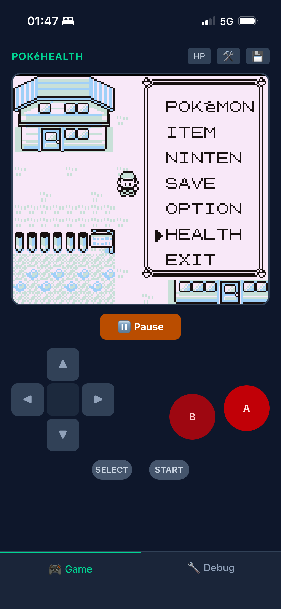
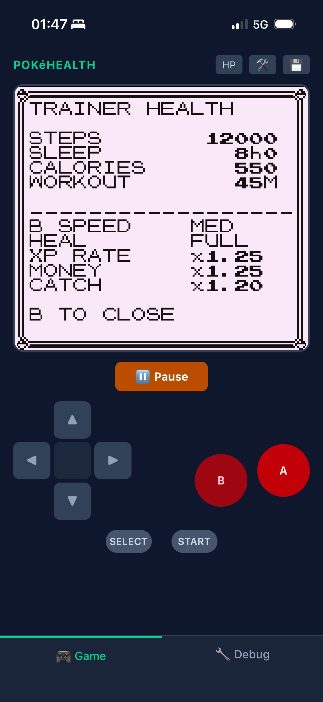
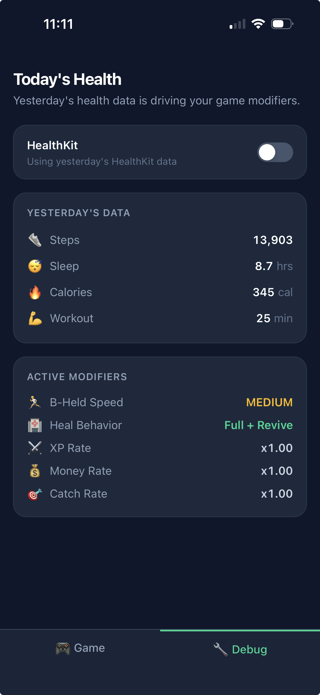
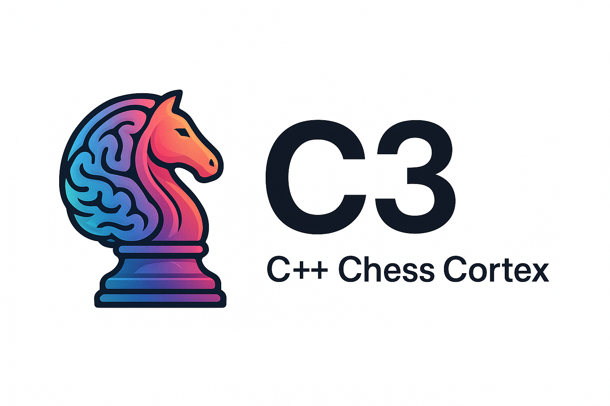

A mix of things this week.
Pokémon nostalgia, getting properly stuck into Pi as a coding agent, and letting an agent loose on my chess engine in the background.

<!--more-->

## PokéHealth

I've had a soft spot for the [Pokémon Red disassembly](https://github.com/pret/pokered) for years.
I wrote a bunch of posts about it back in the day: [compiling pokered with Docker](https://eddmann.com/posts/compiling-pokered-using-docker-and-adding-super-b-button-behaviour/), [unlocking Ishihara's team](https://eddmann.com/posts/unlocking-tsunekazu-ishiharas-team-in-pokered/), [changing the starter Pokémon](https://eddmann.com/posts/changing-the-starter-pokemon-within-pokered/), [adding running shoes](https://eddmann.com/posts/adding-running-shoes-aka-speeding-up-walking-in-pokered/).
The game is turning 30 now, which makes me feel my age.

[PokéHealth](https://github.com/eddmann/pokehealth) is the mash-up of that nostalgia with something I've been building more recently: [PWAKit](https://github.com/eddmann/pwa-kit).
The idea is that real-life health stats affect gameplay.
Steps determine your movement speed and encounter rate.
Sleep hours affect how much Pokémon Centers heal you.
Active calories scale your XP multiplier.
Workout minutes boost your money and catch rates.
Life health feeding into game health.

It's gamification in the truest sense. Your daily activity shapes how the game plays.
A bad day doesn't lock you out, it just makes things slower and harder.
A strong day and you're flying through on a bike with boosted XP.

The implementation runs Pokémon Red via the `binjgb` Game Boy emulator in WASM, with a React frontend built on Vite and Tailwind.
Health data comes through PWAKit's HealthKit bridge on iOS.
The JS side computes modifiers from your daily metrics and periodically writes them into the emulator's shared memory region. The ROM reads those bytes and applies the effects.

  

It's been a lot of fun to build, and a great excuse to properly exercise PWAKit with native feature integration.
Inspired in part by [Dimillian's PokeSwift](https://github.com/Dimillian/PokeSwift) work, which got me thinking about Pokémon projects again.

## Pi Extensions and the Agent Toolkit

I've been using [Pi](https://pi.dev/), Mario Zechner's [coding agent harness](https://github.com/badlogic/pi-mono), as a learning resource for a while, pulling it apart to understand how agentic loops work (which fed into [my own coding agent](https://github.com/eddmann/my-own-coding-agent)).
This week I started using it as my primary coding agent, building PokéHealth with it and exploring other ideas.

What I love about Pi is how unopinionated it is.
It gives you the foundational primitives: the agent loop, tool execution, session management, and nothing else.
No sub-agents, no MCP support, no bolt-on features.
You build the coding agent _you_ want on top of it.
And crucially, you prompt things into existence.

That's the interesting shift.
You want voice support? Prompt it into existence.
You want a process manager? Prompt it into existence.
It sounds reductive but it genuinely works. The extension points are clean enough that you can describe what you need and the agent builds it.

I've been adding several extensions.
[Voice support](https://github.com/eddmann/agent-toolkit/tree/main/pi-extensions/pi-voice) uses sherpa-onnx-node for local speech-to-text. Hold space, talk, release.
The [process manager](https://github.com/eddmann/agent-toolkit/tree/main/pi-extensions/process-manager) gives you a TUI panel for managing background processes, with the agent able to start, stop, and inspect them autonomously.

Another thing I've been wanting is deeper integration with [revu](https://eddmann.com/revu/), my review app.
At the moment the workflow is ad hoc, copying reference files across manually.
But with a Pi extension this could be injected directly into the TUI, making the review process part of the agent's context.
That's next on the list.

I've now released all of this as the [agent toolkit](https://github.com/eddmann/agent-toolkit), a collection of skills and Pi extensions that have been living on my machine for a while.
Getting it into version control makes it auditable and shareable.

One skill I'm particularly pleased with in the toolkit is the [Chrome CDP skill](https://github.com/eddmann/agent-toolkit/tree/main/skills/chrome-cdp).
This uses the [Chrome DevTools Protocol](https://chromedevtools.github.io/devtools-protocol/) directly rather than going through MCP.
The motivation was less bloat, and the ability to interact with my _actual_ browser sessions and tabs rather than always spinning up an isolated Chrome instance.
Again, this was built with help from a coding agent. I steered, it drove.

It's really about crafting your own personal developer tooling, shaped to the project at hand.
That feels like the direction things are heading. Not one-size-fits-all tools, but personal tooling you mould to fit.

## C3 Auto-Research

[C3](https://github.com/eddmann/c3) is my chess engine, written late last year inspired by a friend's engine, [Anodos](https://github.com/tomcant/anodos). C++23, bitboards, the usual suspects: negamax with alpha-beta pruning, null-move pruning, transposition tables, iterative deepening.
It's a project I've wanted to come back to, and this week I've been setting up an autonomous improvement loop for it.

The inspiration is [Karpathy's autoresearch](https://github.com/karpathy/autoresearch), the idea that you can point a coding agent at a measurable objective and let it iterate.
For a chess engine, that objective is ELO.
You have SPRT (Sequential Probability Ratio Test) to determine whether a change is a genuine improvement or noise.
You have opening suites and a frozen baseline to test against.
The feedback loop is tight and unambiguous: either the engine got stronger or it didn't.

I've set this up with Pi, using an extension to orchestrate the cycle. The agent proposes a change (late move reductions, king safety improvements, passed pawn evaluation), builds it, runs the SPRT suite against the baseline, and accepts or reverts based on the result.
One change per experiment, strict acceptance criteria.

This is happening in the background, burning through tokens while I focus on other things.
It's early days. Some experiments have shown promise, others have been rejected, but the setup itself is the interesting part.
The chess engine is a near-perfect domain for this kind of autonomous improvement because the evaluation function is objective and measurable.

It's also a good demonstration of why Pi's unopinionated nature matters.
I've been able to tailor the agent harness specifically for this project. The auto-research loop, the SPRT integration, the acceptance criteria, all shaped to the problem.
A more opinionated harness would fight you on this kind of customisation.
Pi just gets out of the way and lets you close the feedback loop however you need to.

---

PokéHealth has been pure fun, and a good excuse to put PWAKit through its paces with real native integration.
Pi has gone from something I was studying to something I'm actually building with day-to-day, and the agent toolkit finally being in version control feels overdue.
And C3 is ticking away in the background, the agent grinding through experiments while I do other things.
Curious to see where the ELO lands after a few more rounds.
