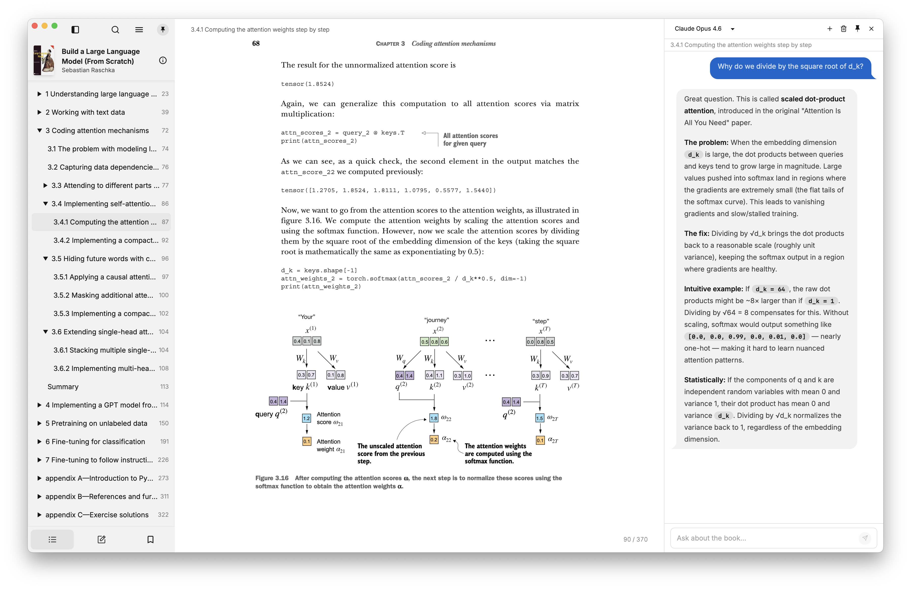

This week I've been going deeper on how LLMs actually work - not just using them, but trying to understand what's happening under the hood.
This has led me to build a reading companion app to assist in learning.

<!--more-->

## Going Deeper on LLMs

I don't want to just call APIs.
I want to try and understand what's actually happening behind them.

Off the back of my [conversation with Chris Brousseau](https://compiledconversations.com/19/) about linguistics and LLMs earlier this year, I've been wanting to go deeper into the field when time allowed.

There are two ways you can go deeper with a technology like this.
One is learning how to use the tool more effectively.
The other is understanding how it's built.
I've found over the years that having a foundational grasp of how a technology or system works helps you use it more effectively from the outside.
Much like having an understanding of C memory management and algorithms helps you use higher-level languages which handle GC and pre-decided sorting algorithms for you.
It gives you an appreciation for what's underneath.
That's what I want to get from learning the internals of how an LLM works.

I started by listening to [The Scaling Era: An Oral History of AI, 2019-2025](https://www.audible.co.uk/pd/The-Scaling-Era-Audiobook/B0FPMRTRDN), which provides a great high-level overview of the landscape and how we got to where we are.
It tackles both the more fundamental and philosophical perspectives of the technology.

Since listening to this (which I'd highly recommend) I've been working through [Build an LLM from Scratch](https://www.manning.com/books/build-a-large-language-model-from-scratch) chapter by chapter, building up an understanding of how all the pieces are put together.
I've always found that juggling between different media (reading, video, exercises) when learning something works well for me.
Karpathy's [micro-GPT](https://karpathy.github.io/2026/02/12/microgpt/) source alongside his [Neural Networks: Zero to Hero](https://www.youtube.com/playlist?list=PLAqhIrjkxbuWI23v9cThsA9GvCAUhRvKZ) playlist have been great for this.
Grant Sanderson's (3Blue1Brown) videos on [Neural Networks](https://www.youtube.com/playlist?list=PLZHQObOWTQDNU6R1_67000Dx_ZCJB-3pi) and [Attention in Transformers](https://www.youtube.com/watch?v=KJtZARuO3JY) too - his visual approach makes things land in a way that reading alone doesn't.

A fun meta twist to all of this is I'm using LLMs as a tutor to understand the very thing they are.
Learning LLMs by way of LLMs.

## Marginalia

I initially tried letting an LLM direct the learning itself, guiding the deep dive into the internals.
However, I found that it jumped around concepts a lot, with no thread or arc.
This made me appreciate the value of a structured learning path put together by someone who actually knows the field.
A well thought out syllabus with a story.
I've found that the LLM works best as a companion.
Asking questions, going deep on a tangent, clarifying dense sections.
But not as the outright guide.

That idea led to building [Marginalia](https://github.com/eddmann/marginalia), to help aid in reading technical books such as Build an LLM from Scratch, where I find I'm constantly wanting to stop and ask questions about the material.
It was inspired by Andrej Karpathy's [reader3](https://github.com/karpathy/reader3) - you select a passage, ask a question, and have an ongoing conversation about it without leaving the page.
This isn't just constrained to technical reading though - I feel it can be useful for anything you want to question or deep dive into, have a conversation about.

Marginalia combines a slimmed-down fork of [Readest](https://readest.com/) (an open-source ebook reader) with [Pi](https://github.com/badlogic/pi-mono) (an agent harness) into a single desktop app.
Read on the left, chat on the right.
The AI knows what book you're reading, what chapter you're in, and has the full chapter text as context.
I've been surprised how effective this simple idea is.
No copy and pasting between you and an LLM.

## Baby Tracker

I've been tracking feeds, nappies, and sleep through [Jeeves](https://github.com/eddmann/jeeves) via conversation (backed by a skill) since [the baby arrived](/posts/weeknotes-week-one-with-a-newborn-and-an-ai-butler/).
It worked well, but I wanted something with a dedicated UI that I could share with my wife and iterate on independently from the assistant.

So I decided to build a [Baby Tracker](https://github.com/eddmann/baby-tracker) PWA for logging it all.
I'm finding the Cloudflare stack incredibly useful for shipping these kinds of small tools and apps quickly.
And again, a common thread throughout this year to date is the continued value of personal software.
The _living software_ is being updated to fit our current use case (just added weight and height tracking) as we go.
This was of course possible before, but the cost of time and effort was a lot greater, which would have put this off.

## Jeeves

Up until now Jeeves could only respond with text - even when generating charts, reports, or files, it had to serve them as web pages (via the previously discussed pages skill) or links.
After a bit of back and forth on how to tackle this in a clean way, I landed on outbox attachment support so Jeeves can now send files directly alongside its responses.

It's a simple change which doesn't affect the architectural design of the system much, but it provides a means of being multi-modal in the output which is great.
From here I was able to add a skill to provide text-to-speech support via ElevenLabs, so Jeeves now has a voice.

This does bring up something I've been wrestling with a bit in this project - how much is "baked" into the assistant as a foundational core piece, and what is added via skills.
Due to the expansive nature of skills the lines can get blurred.

## Agent Toolkit Skills

Finally, I've added three new skills to the [agent toolkit](https://github.com/eddmann/agent-toolkit).
These are capabilities I've distilled down from working across projects over the past couple of weeks, so it made sense to extract them:

**[context7](https://github.com/eddmann/agent-toolkit/tree/main/skills/context7)** - fetches library documentation context.
[Context7](https://context7.com/) provide an MCP and skill themselves for this, backed by a CLI tool.
However, steering the agent to just use curl and the API directly, I'm finding it has the same value with less ceremony and overhead.

**[db](https://github.com/eddmann/agent-toolkit/tree/main/skills/db)** - I'd spotted several times I was copying and pasting queries and results back and forth with the LLM, and that's a warning sign for how can we close the feedback loop without my intervention.
So I created a skill and small Python CLI which abstracts out and handles database querying and modification, providing the LLM with the context of what database we're using (for SQL dialect support etc.) and some assistance around credential management.
Here be dragons though - make sure you give it least-privilege credentials.

**[project](https://github.com/eddmann/agent-toolkit/tree/main/skills/project)** - this skill came about from local project and workspace management, providing a means of moving away from git worktrees in favour of cheaper copy-on-write workspace creation.
It provides the LLM with tooling to browse, manage, and work with different workspaces which can be worked on in isolation by different agents.
It also provides a means of merging workspace work back into the project.
One pattern I've been using over the past couple of months is getting the LLM to reference and be steered by example structure and usage in other projects.
Few-shotting the LLM with examples of how you like testing, architecture, design etc. with concrete examples provides huge value.
Now I can just reference a project by name and the skill knows where the project is located and how to access it.

## What I've Been Learning From

**Articles:**

- [Everyone is building a software factory](https://blog.exe.dev/bones-of-the-software-factory)
- [Overcoming AI Anxiety](https://ryangjchandler.co.uk/posts/overcoming-ai-anxiety)
- [Event-Sourced Claude Code Workflows](https://nick-tune.me/blog/2026-03-04-event-sourced-claude-code-workflows/)
- [Some Things Just Take Time](https://lucumr.pocoo.org/2026/3/20/some-things-just-take-time/)
- [Which AI Model Is Best for Laravel?](https://laravel.com/blog/which-ai-model-is-best-for-laravel)

---

The common thread this week is learning.
Whether it's understanding how LLMs actually work rather than just calling their APIs, or building tools like Marginalia to make that learning more effective - there's value in going one level deeper than you need to.
