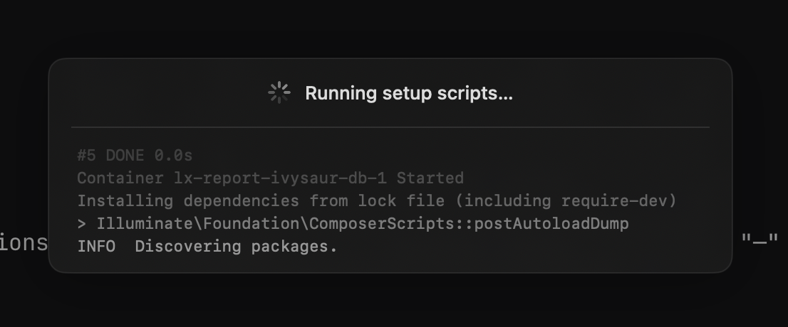

A few bits from this week.
More time on [Forge](https://github.com/eddmann/Forge) - deeper integrations with the coding agent harnesses it supports and the ability to spin up isolated workspace services.
Also some thoughts on how much I nitpick agent-produced code, and moving Jeeves over to GPT-5.4.

<!--more-->

## Forge

Building on [last week's initial agent terminal](/posts/weeknotes-forge-santa-agent-and-the-anthropic-subscription-block/#forge), I spent time this week improving the integration between the Mac terminal app and the coding agent harnesses it drives.

The [Claude Code leak](https://build.ms/2026/4/1/the-claude-code-leak/) was the nudge I needed to do a deep analysis across all the agents I support - [opencode](https://github.com/sst/opencode), [codex](https://github.com/openai/codex), [Pi](https://github.com/badlogic/pi-mono), and [Claude Code](https://github.com/anthropics/claude-code).
Claude Code was the one that was actually closed source, and the leak let me fill in the gaps.
Going through each of them comprehensively, I was able to provide much deeper integrations and hooks - using OSC terminal sequences, hooks within the system, and agent-specific integrations for each.

This means Forge can now pluck out things like notifications, when an agent is waiting for permission, when it's working on something, and when I need to attend to it - surfacing visuals for those states instead of me having to watch a terminal.
It also now exposes what instruction files (`AGENTS.md` / `CLAUDE.md`) are being used, what skills are available, what MCPs are wired up, and what plugins are active for each agent.
It's nice to be able to see at a glance what the current agent harness actually has available to it.



### forge.json

The other big addition this week was `forge.json`, for managing project workspace-specific configuration within Forge.

Up until now I'd exposed commands through Makefiles, `package.json`, `composer.json` - all the files you'd typically have for a project across different language stacks.
What I really wanted was to also expose Docker Compose and long-running processes, so that when you start up a workspace Forge finds the setup and teardown functionality.
Something like `make start` or `docker compose up` runs on workspace start, and the corresponding teardown runs on close.
Individual, isolated environments per workspace.

Isolated is the key word here.
For a lot of what I've been doing over the years I've been working on one thing at a time, but with agentic work you can have many things running in parallel - and I was definitely conflicting in shared cases.
Ports was the big one: independent Docker stacks running fine, but the ports on the machine for accessing local web services and databases were fixed and would collide.

So I added the ability in Forge to expose non-conflicting ports via environment variables.
In the JSON you declare the env vars you want along with a preferred port.
Forge tries to give you that port, and if it's taken iterates up to around a hundred times to find the next available one.
The chosen port is exposed as an environment variable your Docker setup can reference - with a sensible fallback to the static port if you're not running through Forge.
That lets these environments spin up and be used independently, which has been great.

```json
{
  "ports": {
    "APP_PORT": { "port": 8000, "detail": "Laravel dev server" },
    "DB_PORT": { "port": 5432, "detail": "PostgreSQL" },
    "REDIS_PORT": { "port": 6379, "detail": "Redis" }
  },
  "compose": {
    "file": "docker/docker-compose.yml"
  },
  "commands": {
    "psql": {
      "command": "docker compose -f docker/docker-compose.yml exec db psql -U postgres",
      "detail": "Open a Postgres shell against the local database"
    },
    "logs": {
      "command": "docker compose -f docker/docker-compose.yml logs -f app",
      "detail": "Tail application logs"
    }
  },
  "workspace": {
    "setup": "make start",
    "teardown": "make stop"
  }
}
```



## Nitpicking Agents

Something I've been wrestling with this week is how much to _nitpick_ on code produced by agentic coding.

For unopinionated or throwaway side projects you can be looser with things.
But when you've got a plan and an architecture in mind - down to the code level of how you like things presented - it's different.
It's very similar to reviewing humans' code _back in the day_: how much do you nitpick, how much do you steer and comment.

I've been using the initial build of the review bits and pieces in Forge for this, which has been helpful.
Still, it's interesting seeing how much back and forth I do to steer the agent and force it down a certain path.
Good examples for it to reference make the right outcome more likely, but it still sometimes veers off.

With an agent, they don't push back - you don't have to deal with the squishiness and human side of it.
You can be very nitpicky and very forceful.
But it's the same balancing act as working in a team setting: pick your battles on general architecture without nitpicking every single line.
I've felt this on work projects too - the lever I lean on is enforcing the architecture up-front, whether that's through deterministic tools like ESLint and Deptrac, or via the `AGENTS.md` the agent runs with.
The skills that made you work well in a team and orchestrate a team are really transferable to managing agents.

## Jeeves on GPT-5.4

Following on from [last week's note](/posts/weeknotes-forge-santa-agent-and-the-anthropic-subscription-block/#anthropic-third-party-block) on Anthropic blocking third-party tool access to Claude subscriptions, I've moved [Jeeves](https://github.com/eddmann/jeeves) over to GPT-5.4.

Surprisingly I was able to do it in one big sweep, and it proved to be quite a simple change.
I pointed the agent at how I'd integrated with the Codex endpoints within [My Own Coding Agent](https://github.com/eddmann/my-own-coding-agent) (Python), and said "do this in TypeScript, use this as a reference. No mistakes!" (okay I didn't include the last bit haha.)
It's very good at pattern matching and looking at resources to comprehend how to apply the same approach in a different language and stack.

I'm finding that GPT-5.4 really does take on the Jeeves identity and personality - I'm getting a lot more _Jeeves-y-ness_ out of it than I was even from Claude, which would often drift away from it.

## What I've Been Learning From

**Articles:**

- [The Claude Code Leak](https://build.ms/2026/4/1/the-claude-code-leak/) - a walkthrough of what surfaced in the leaked Claude Code source
- [Absurd In Production](https://lucumr.pocoo.org/2026/4/4/absurd-in-production/) - Armin Ronacher on durable execution on Postgres
- [Keeping a Postgres queue healthy](https://planetscale.com/blog/keeping-a-postgres-queue-healthy) - PlanetScale on running a queue workload on Postgres
- [Strategic Forgetting: A Cognitive Architecture for Long-term Memory](https://blog.nishantsoni.com/p/strategic-forgetting-a-cognitive) - Nishant Soni on long-term memory for agents

**Videos/Podcasts:**

- [Benedict Evans: OpenAI's Moat Problem & the Future of Software](https://www.youtube.com/watch?v=jH2ZIUKvazU) - Benedict Evans on OpenAI's moat and where software is heading
- [A love letter to Pi](https://www.youtube.com/watch?v=fdbXNWkpPMY) - Lucas Meijer on using Pi as his coding agent
- [Claude Mythos, Project Glasswing and AI cybersecurity risks](https://www.youtube.com/watch?v=Yae74guiqq8) - on Claude mythology and AI cybersecurity risks
- [State of Agentic Coding #5 with Armin and Ben](https://www.youtube.com/watch?v=qCpY4K9jtOg) - Armin Ronacher and Ben Vinegar on the state of agentic coding
