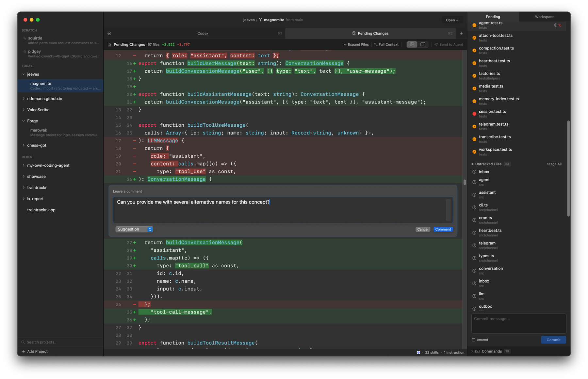

A few bits from this week.
A bit of fun code golf seeing how small an [agentic loop in PHP](/posts/code-golf-an-agentic-loop-in-php/) can be, and more work on [Forge](https://github.com/eddmann/Forge) with several improvements to the Git review pane.
Also been leaning into computer use and terminal recording tools to get agents to verify and demo their own work.

<!--more-->

## Code Golf: An Agentic Loop in PHP

I spent some time this week writing up [Code Golf: An Agentic Loop in PHP](/posts/code-golf-an-agentic-loop-in-php/).
There's been a lot of discussion recently about _agent frameworks_ - orchestration layers, SDKs, harnesses - and over lunch I got curious about how much of that is actually essential.
The post is a bit of fun code golf seeing how small a working _agentic loop_ can be, whilst still doing useful work.
The end result is a working agent with tool calling in under 1KB of PHP, using Ollama for local inference and a single shell tool.

The use of [qwen3.5:35b-a3b](https://ollama.com/library/qwen3.5:35b-a3b) impressed me a lot whilst working on this - it's piqued my interest to peel under Ollama and explore [mlx-lm](https://github.com/ml-explore/mlx-lm) and [llama.cpp](https://github.com/ggerganov/llama.cpp) / `llama-server` directly.
This article also did the rounds just after I worked on this and is worth a read: [Stop Using Ollama](https://sleepingrobots.com/dreams/stop-using-ollama/).

## Forge

Continuing on [Forge](https://github.com/eddmann/Forge) from [last week](/posts/weeknotes-forge-agent-integrations-nitpicking-and-jeeves-on-gpt/#forge), this week was about a few improvements to the Git review pane - syntax highlighting being the big one, with some usability and performance tweaks alongside.
I'm really happy with where the review side of Forge has got to.
It's now surpassing the experience I had with [revu](/posts/weeknotes-model-personalities-building-my-own-agent-and-two-schools-of-agentic-development/#revu), which is where this whole idea started.

Syntax highlighting is built on [tree-sitter](https://github.com/tree-sitter/swift-tree-sitter) via the `SwiftTreeSitter` binding, with a per-language grammar pulled in for each one supported (Swift, TypeScript, Python, etc.).
It does feel a bit heavyweight though.
Those 13 grammar packages are Forge's first SPM dependencies, and each compiled grammar gets bundled into the binary, which adds up.
File and hunk expanding / collapsing was also added this week alongside the highlighting, and the review pane feels much more usable now.

## Verifying and Demoing Agent Work

A couple of ideas sit underneath this one, both about getting the agent to do more of the work itself rather than handing it back to me unfinished.
The first is getting the agent to verify what it built before declaring done.
The second is getting it to demo that work back to me, so I can review it visually before merging.

For the verification side, I've been leaning into computer use - both [in Claude Code](https://code.claude.com/docs/en/computer-use) and [in Codex](https://developers.openai.com/codex/app/computer-use).
Rather than me having to manually exercise a feature once the agent says it's done, I can now get the agent to explore and verify the feature itself - sometimes a bit too much, in the case of Forge.

The demo side is video recordings - getting the agent to record what it built and provide that at the end of its work, so I can review the change visually before merging it back.
A nice way to see the work is actually done before I sign off on it.

In a similar vein, I've been having a play with [VHS](https://github.com/charmbracelet/vhs).
Scripted recordings of terminal / ASCII output, which I've been using to capture demos for terminal-driven work alongside what I'm doing with computer use for the GUI side.

The throughline across all of this is the same: get the agent to confirm its own work, then present that work in a nice form, with videos, to _sell_ it to me to actually merge, much like you would do in a _regular_ PR in a team setting.

## What I've Been Learning From

**Articles:**

- [The Center Has a Bias](https://lucumr.pocoo.org/2026/4/11/the-center-has-a-bias/) - Armin Ronacher on engaging directly with AI coding agents rather than abstract critique
- [Agents have their own computers with Sandboxes GA](https://blog.cloudflare.com/sandbox-ga/) - Cloudflare on GA-ing their Sandboxes product for agent execution

**Videos/Podcasts:**

- [Code Mode: Let the Code do the Talking](https://www.youtube.com/watch?v=8txf05vVVl4) - Sunil Pai, Cloudflare (AI Engineer)
- [The Future of MCP](https://www.youtube.com/watch?v=v3Fr2JR47KA) - David Soria Parra, Anthropic (AI Engineer)
- [Harness Engineering: How to Build Software When Humans Steer, Agents Execute](https://www.youtube.com/watch?v=am_oeAoUhew) - Ryan Lopopolo, OpenAI (AI Engineer)
- [Building pi in a World of Slop](https://www.youtube.com/watch?v=RjfbvDXpFls) - Mario Zechner (AI Engineer)
- [The Friction is Your Judgment](https://www.youtube.com/watch?v=_Zcw_sVF6hU) - Armin Ronacher and Cristina Poncela Cubeiro, Earendil (AI Engineer)
- [Claude Opus 4.7 - A New Frontier, in Performance and Drama](https://www.youtube.com/watch?v=QVJcdfkRpH8) - on the latest Opus release and surrounding drama
- [EXPOSED: The Dirty Little Secret of AI (On a 1979 PDP-11)](https://www.youtube.com/watch?v=OUE3FSIk46g) - Dave's Garage training a transformer with attention on a 1979 PDP-11, showing the architecture at its most basic
- [Jensen Huang - Will Nvidia's moat persist?](https://www.youtube.com/watch?v=Hrbq66XqtCo) - Jensen Huang on Nvidia's moat and AI compute
- [RoPE: Understanding Rotary Positional Embeddings in transformers](https://www.youtube.com/watch?v=jlGf2qieSk0) - explainer on RoPE
- [How one programmer's pet project changed how we think about software](https://www.youtube.com/watch?v=Y24vK_QDLFg) - the story of Clojure, from Rich Hickey's sabbatical pet-project to the backbone of major fintechs
- [Build a Large Language Model (From Scratch)](https://www.youtube.com/playlist?list=PLTKMiZHVd_2IIEsoJrWACkIxLRdfMlw11) - Sebastian Raschka playlist accompanying the book

**Tweets:**

- [David Boyne on giving himself permission to learn without guilt](https://x.com/boyney123/status/2042884743239250027)
- [Dillon Mulroy on Pi-inspired "Think" workflow](https://x.com/dillon_mulroy/status/2044527072442302473)
- [Nicolas Zu on designing a game within Codex](https://x.com/NicolasZu/status/2045494495546835416)
- [Victor M on a 290MB LLM running directly in browser](https://x.com/victormustar/status/2044711812021514458)
