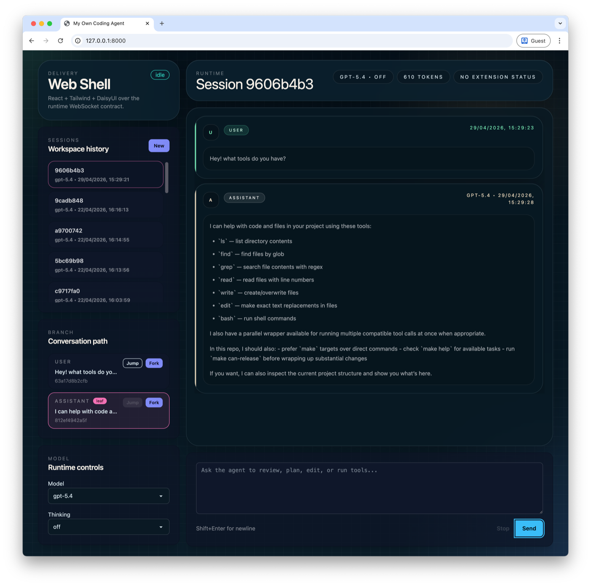
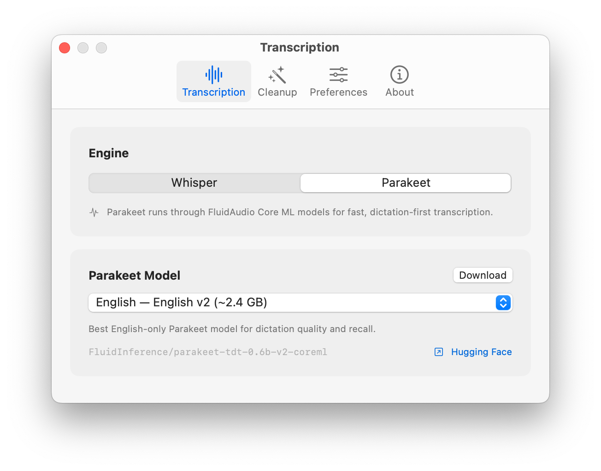
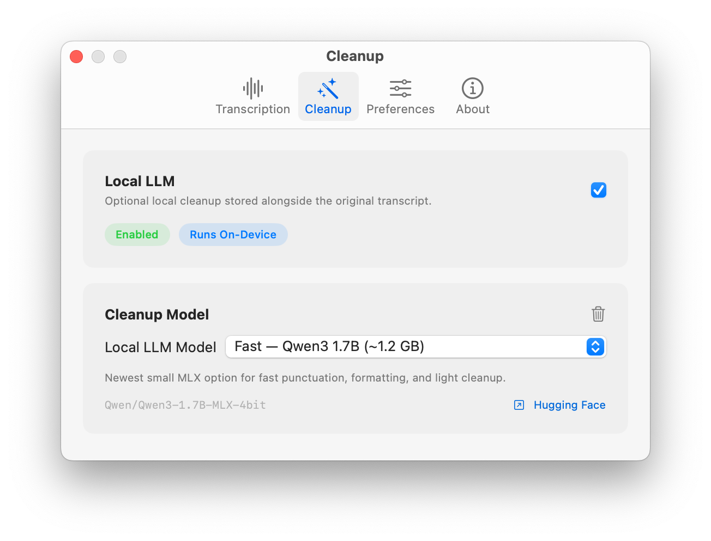

Didn't get much time to delve into side projects this week - but what I did get to was a re-architecture of [My Own Coding Agent](https://github.com/eddmann/my-own-coding-agent) around extensions, and pulling [VoiceScribe](https://github.com/eddmann/VoiceScribe) back to a local-only pipeline.

<!--more-->

## My Own Coding Agent

I had a chance this week to do a fairly comprehensive re-architecture and redesign of some of the core bits of [My Own Coding Agent](https://github.com/eddmann/my-own-coding-agent).
The inspiration again came from [Pi](https://github.com/badlogic/pi-mono) and its extensible nature - it keeps its core deliberately minimal and pushes things like sub-agents, plan mode, and MCP out into a TypeScript extension API, so the agent fits your workflow rather than dictating one.
That's a beautiful thing about Pi, and I wanted to incorporate that thinking at a fundamental level here.

I wasn't too far off already, but the boundaries needed cleaning up.
What I landed on was a neutral hook seam at the delivery boundary, which lets me provide [sub-agents](https://github.com/eddmann/my-own-coding-agent/blob/main/examples/extensions/subagents.md), [plan mode](https://github.com/eddmann/my-own-coding-agent/blob/main/examples/extensions/plan-mode.md), and [MCP adaption](https://github.com/eddmann/my-own-coding-agent/blob/main/examples/extensions/mcp-adapter.md) at an extension level without polluting the agent core.
The quick feedback loop of _flexing_ the extension API with several examples that pushed on different capabilities helped greatly with the overall design I landed on.

The other interesting part was the user-interface layer.
UI can be quite a _leaky_ concern - you can really get coupled to the specific surface you're rendering to.
I landed on optional extension UI bindings, with an _escape hatch_ for specific needs, providing clear prompt / confirm / dialog abstractions and a way to add widgets.
That gave me a clean abstraction around the concept of UI and widgets that any delivery layer could implement, which I demonstrated by adding a [web delivery shell](https://github.com/eddmann/my-own-coding-agent/blob/main/docs/web.md) using FastAPI and WebSockets (you can tell it's an OpenAI model design 😆), alongside the existing TUI and CLI.
Really cool to see the same agent runtime driving completely different surfaces.

Granted it doesn't handle _every_ UI-specific use-case as it's an abstraction, but for the 80% it does a great job.
That's also the reason an _escape hatch_ was included, to handle any gnarly UI-specific integration.

I've been doing this work with Codex, which I'm finding to be a really good partner in crime for this kind of long-form re-architecture work.
It works through compactions in a way that means I'm not constantly thinking about the context window size, which I still tend to do with Claude.
From _vibes_ alone, I'm also finding Codex more attuned to reaching for skills through normal conversation - whereas with Claude I tend to need to be explicit, either through slash invocation or very concrete requests.
I've been very impressed with refactoring alongside an agent - being able to have high-level conversations whilst delving into some of the minutiae is very useful.
For this re-architecture work I tried several different ideas in parallel across different ([Forge](https://github.com/eddmann/Forge)) workspaces, and the design I landed on as a result I'm very happy with.

## VoiceScribe

The other thing I had time for this week was [VoiceScribe](https://github.com/eddmann/VoiceScribe), my macOS dictation app.
Another rethinking and re-architecting, though not really a refactor in this case - I was actually dropping functionality.

When I built VoiceScribe end of last year I added the OpenAI transcription path alongside the local one, and the same for the LLM cleanup pass.
The thinking was I might need to fall back to the cloud for either of those.
Turns out I never used either, and they were just bolt-ons sitting in the codebase.
So I decided to drop them entirely and hone in on a local-only pipeline, since that's what I actually use.

The big driver was [Parakeet](https://huggingface.co/nvidia/parakeet-tdt-0.6b-v2), which I've been seeing good things about over X.
It tops the [Hugging Face Open ASR Leaderboard](https://huggingface.co/spaces/hf-audio/open_asr_leaderboard) at around 6% WER (beating Whisper-v3) at a fraction of the size, and via [FluidAudio](https://github.com/FluidInference/FluidAudio)'s Core ML build on the Apple Neural Engine it runs at roughly 110x real-time - around half a second to transcribe a minute of audio.
Whisper was already good, but Parakeet feels even better, and I'm really enjoying using it now.

I also refreshed the optional cleanup pass options, all running through MLX, with [Qwen3 1.7B](https://huggingface.co/Qwen/Qwen3-1.7B-MLX-4bit), [Llama 3.2 3B](https://huggingface.co/mlx-community/Llama-3.2-3B-Instruct-4bit), and [Qwen3 4B](https://huggingface.co/Qwen/Qwen3-4B-MLX-4bit) giving a good balance of speed and cleanup quality.

This redesign also gave me a chance to explore [The Composable Architecture (TCA)](https://github.com/pointfreeco/swift-composable-architecture) by Point-Free.
TCA is a Swift library inspired by Redux and Elm: a single `State` value type, an `Action` enum for every event, a `Reducer` that evolves state and returns side effects as values rather than performing them inline, and a `Store` driving the whole thing.
The flow is unidirectional (`State -> View -> Action -> Reducer -> State`), and very functional-style in feel.
The Redux comparison was the one that resonated with me coming from React: you describe state, side effects are values, and SwiftUI handles the diffing and re-render in the same way React's reconciliation does.
I really liked this way of thinking: update state, don't worry about the diff, follow the data flow in one direction.

## What I've Been Learning From

**Videos/Podcasts:**

- [State of the Claw](https://www.youtube.com/watch?v=zgNvts_2TUE) - Peter Steinberger's 5-month update on maintaining OpenClaw, the fastest growing open source project in history (AI Engineer)
- [Running LLMs on your iPhone: 40 tok/s Gemma 4 with MLX](https://www.youtube.com/watch?v=a2muGkT4WD4) - Adrien Grondin of Locally AI (AI Engineer)
- [Taste & Craft: A Conversation with Tuomas Artman](https://www.youtube.com/watch?v=wjk0ulMAkbc) - Linear's CTO and Gergely Orosz on shipping quality and the zero-bug policy at Linear (AI Engineer)
- [Full Walkthrough: Workflow for AI Coding](https://www.youtube.com/watch?v=-QFHIoCo-Ko) - Matt Pocock workshop on running coding agents with TDD and tracer-bullet vertical slices (AI Engineer)
- [I didn't like OpenClaw so I built a better version](https://www.youtube.com/watch?v=3Rc4MlMJMNU) - Chris Raroque on building a custom AI agent over iMessage
- [GPT 5.5 Arrives, DeepSeek V4 Drops, and the Compute War Intensifies](https://www.youtube.com/watch?v=jz0rNhfAKo8) - AI Explained on the joint releases and recursive self-improvement
- [Designing Data-intensive Applications with Martin Kleppmann](https://www.youtube.com/watch?v=SVOrURyOu_U) - Kleppmann on the second edition of DDIA, his career, and modern infrastructure tradeoffs (Pragmatic Engineer)
- [The Big LLM Architecture Comparison](https://www.youtube.com/watch?v=rNlULI-zGcw) - Sebastian Raschka comparing 2025 open-weight LLM architectures (DeepSeek V3, OLMo 2, Gemma 3, Mistral Small 3.1, Llama 4)
- [A Brief History of the LISP Programming Language (Part One)](https://www.youtube.com/watch?v=dxBIB17mz-M) and [(Part Two)](https://www.youtube.com/watch?v=nU8tYF1Uqbc) - Stumbling Towards Something Different on Lisp's history and modern implementations
- [The Rise & Fall of LISP](https://www.youtube.com/watch?v=GVyoCh2chEs) - Gavin Freeborn on the history of Lisp and why it lost popularity by the 2000s
