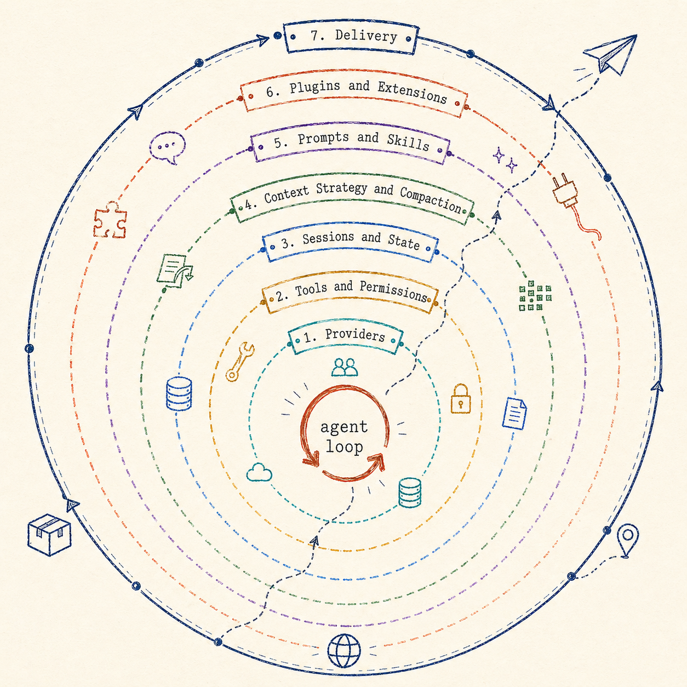
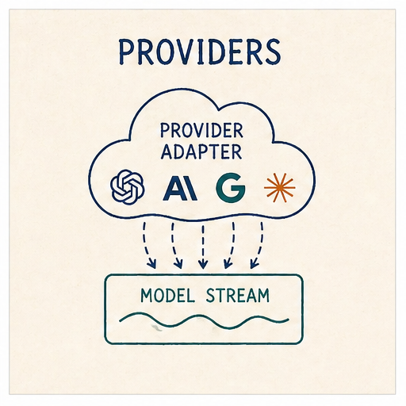
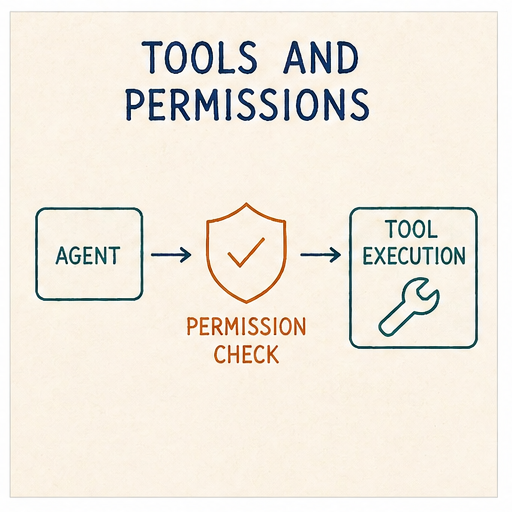
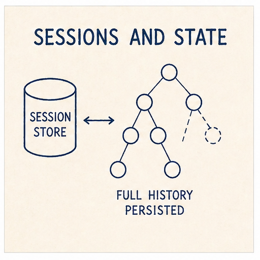
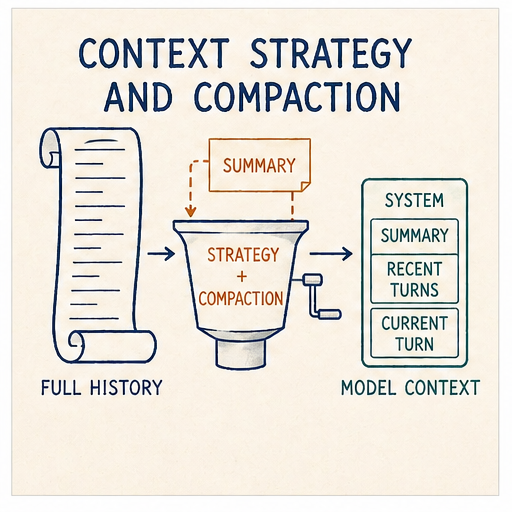
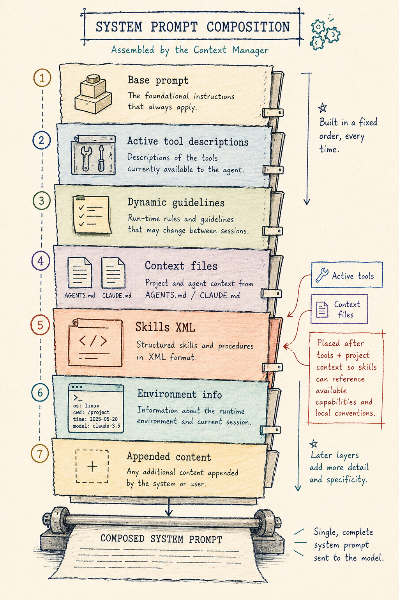
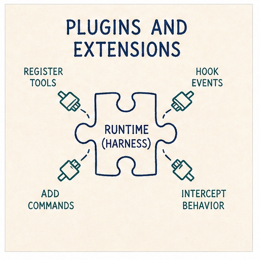
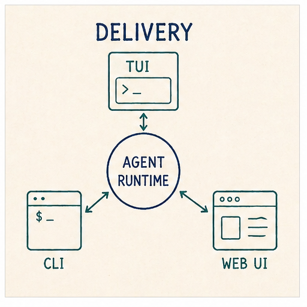

A few weeks back I wrote up a [lunchtime session](../2026-04-16-code-golf-an-agentic-loop-in-php/index.md) code-golfing a minimal _agentic loop_ with a single `sh` tool, which turned out to be surprisingly capable.
That post was about the floor of what an agent needs to be.
This one is about the ceiling, or at least my approximation of it at this point.

<!--more-->

Over the past several months I have been building [My Own Coding Agent](https://github.com/eddmann/my-own-coding-agent), a Python coding agent harness in the shape of [Claude Code](https://claude.com/product/claude-code), [Codex](https://openai.com/codex) and friends.
The usage of agents like these has proliferated over the last year, and I wanted a project that would let me peel back the layers and demystify them to myself, in much the same spirit as peeling it all back to just the loop last time.

The goal was never to build the best one.
Plenty fight for that title.
The goal was to understand one by writing one end-to-end: something I could read, tweak freely, and grow as I learned what each piece actually does.



> A short clip of the harness building a small Lisp interpreter from a problem spec: runs locally, multi-turn, with the rings discussed below all doing their job behind the scenes.

Along the way I read other harnesses: [Pi](https://pi.dev/) for its extensibility and readable code, and Codex, [OpenCode](https://opencode.ai/) and Claude Code (via the leaked source) for breadth in understanding how this problem is tackled by different people.

The loop itself is still the core.
What changes when a loop becomes a _harness_ is everything around it: providers, tools, sessions, context, prompts, plugins, delivery.



## The Loop

As a recap, the loop is just the small repeated exchange at the heart of every agent: send the model the conversation and its tools, run any tool calls it asks for, ask again.
The PHP version was those four moves in their plainest form: call the model, check for tool calls, execute them, loop.
The Python version is longer in lines but the shape is still those four moves.

Here is the body of the loop, with event emission and some bookkeeping stripped out for clarity:

```python
for turn in range(max_iterations):
    if cancel_event.is_set():
        break

    messages_for_llm = await self._hooks.prepare_context(self.session.messages)
    stream = self.provider.stream(
        messages_for_llm,
        tools=self.tools.get_schemas(),
        options=self._build_stream_options(cancel_event=cancel_event),
    )

    stream_state = _StreamConsumptionState()
    async for chunk in self._consume_stream(stream, stream_state):
        yield chunk

    assistant_msg = Message(
        role=Role.ASSISTANT,
        content=stream_state.response_content,
        tool_calls=stream_state.tool_calls,
        thinking=stream_state.thinking_content,
    )
    self.session.append(assistant_msg)

    if not stream_state.tool_calls:
        break

    async for chunk in self._execute_tool_calls(stream_state.tool_calls, ...):
        yield chunk
```

Same four moves as before: ship the messages, return the response, append the assistant turn, execute any tool calls the model asked for.
Loop until the model stops asking for tools or the `max_iterations` cap trips.
The bits that look different from the PHP version are additions to the core, not replacements for it: typed event streams, a context preparation hook, and cancellation management.
Everything else in this post is a _ring_ around the same loop.

## Providers

The first thing that breaks the simple PHP shape is wanting to use more than one provider.

The PHP loop is coupled to one endpoint (Ollama's `/api/chat`), which happens to speak the de-facto standard shape: OpenAI-compatible chat, used by [OpenRouter](https://openrouter.ai/), [Groq](https://groq.com/) and most local runtimes.
However, this is not an agreed-upon standard, more first-mover adoption than industry consensus. As the technologies and feature sets evolve, the assumptions stop holding the moment you point the same loop at [Anthropic](https://docs.anthropic.com/en/api/messages) or [OpenAI's Responses API](https://platform.openai.com/docs/api-reference/responses): different event schemas, different tool-call formats, extended thinking modes.

The first ring exists to hide all of that behind two small abstractions: a unified event stream, and a narrow provider protocol.



### Two small abstractions

Every provider adapter yields events in a shared shape:

```python
StreamEvent = (
    StartEvent
    | TextStartEvent | TextDeltaEvent | TextEndEvent
    | ThinkingStartEvent | ThinkingDeltaEvent | ThinkingEndEvent
    | ToolCallStartEvent | ToolCallDeltaEvent | ToolCallEndEvent
    | AssistantMetadataEvent
    | DoneEvent | ErrorEvent
)
```

This event-stream shape is also what lets the harness emit timely updates to the user as the model produces them (text tokens, thinking blocks, tool-call arguments forming character by character) rather than blocking until the full response is complete.
The agent loop has no idea whether the stream on the other side is an Anthropic SSE feed reassembling a `content_block_delta` into a tool call, or OpenAI streaming `tool_calls[0].function.arguments` as raw JSON that needs accumulating.
Those translations live inside each adapter.

The provider protocol the agent depends on is even narrower:

```python
class LLMProvider(Protocol):
    name: str
    model: str

    def set_model(self, model: str) -> None: ...
    def stream(self, messages, tools, options) -> AssistantMessageEventStream: ...
    def supports_thinking(self) -> bool: ...
    async def list_models(self) -> list[str]: ...
    async def close(self) -> None: ...
```

That is the whole surface the loop has to care about.
Adapters for Anthropic, OpenAI's Chat and Responses APIs, OpenAI Codex, and the OpenAI-compatible long tail all sit behind it.
Each one is a two-phase translation between the provider's wire shape and `StreamEvent`s, plus a per-provider remapping of reasoning-effort levels.
Codex is the most interesting of the four: it authenticates against the ChatGPT subscription via OAuth and routes through `chatgpt.com/backend-api/codex/responses` rather than `api.openai.com`, all hidden behind the same `provider.stream(...)` call.

For perspective, the other harnesses sit at different points on the provider spectrum.
Pi and OpenCode both have broader provider surfaces; Codex is firmly OpenAI-family centric; Claude Code is Anthropic-family.
Mine sits in the middle: adapters for the frontier labs (OpenAI and Anthropic) and an OpenAI-compatible adapter to handle a wide variety of other providers.

## Tools and Permissions

Tools are how the model acts on the world: the functions it can call to read a file, run a command, fetch a URL, anything that turns a conversation turn into actual work.

The PHP loop had one tool: `sh`.
That single shell hammer subsumes most of what specialised tools do, because the model already knows how to compose `ls`, `cat`, `grep`, `curl`, `python` and the rest of the environment.

This harness goes the other way.
It ships the seven tools that Claude Code popularised and most other harnesses have converged on (`read`, `write`, `edit`, `bash`, `grep`, `find`, `ls`), each shaped to its purpose:

- `read` returns file contents with line numbers, which makes subsequent `edit` calls trivially reference-able.
- `edit` refuses ambiguous matches; if `old_string` occurs more than once, the tool errors and asks for more context.
- `grep` and `find` return narrower output than a raw shell invocation.
- `ls`, `write` and `bash` cover the rest of what an agent needs to do on a developer's machine.

The `sh`-only agent still works.
Shaped tools just produce narrower failure modes for free, and let the model spend less of its context budget parsing arbitrary shell text.
The frontier models have also had extensive reinforcement learning on tools shaped roughly this way, so they reach for them efficiently.

### Tools as schemas

Each tool is a [Pydantic](https://github.com/pydantic/pydantic) model first and a callable second:

```python
class EditParams(BaseModel):
    path: str = Field(description="The file path to edit")
    old_string: str = Field(description="The exact string to find and replace")
    new_string: str = Field(description="The string to replace with")
    replace_all: bool = Field(default=False, description="Replace all occurrences")

class EditTool(BaseTool[EditParams]):
    name = "edit"
    description = "Edit a file by finding and replacing text..."
    parameters = EditParams

    async def execute(self, params: EditParams) -> str:
        ...
```

Pydantic does double duty: it generates the function schema sent to the model, and validates the arguments the model sends back before they ever reach `execute`.
The registry catches four kinds of failure (`unknown_tool`, `validation`, `tool_error`, `unexpected`) and retries once if the error looks transient.

### Permissions

Permissions decide whether a given tool call is allowed to run. They are the line between "the model wants to do this" and "the harness lets it".
Without them an agent does whatever it asks for, which is not a great security posture and increasingly less acceptable the further you take it.



Claude Code, Codex and OpenCode ship with first-class permission systems: approval prompts, allow/deny lists, scope-bound tool access.
Mine sits at the lighter end of that spectrum (like Pi), on the principle that the hook boundary is sharp enough to carry the weight for now.
The harness exposes an `AgentHooks` protocol: extension points at key moments in the loop, letting extensions intercept and shape behaviour without the runtime knowing they exist.
For permissions, the two relevant hooks are `authorize_tool_call` and `process_tool_result`: the first can block or allow a tool call before it runs, and the second can rewrite the tool result after it runs.
Examples of this are [`protected-paths`](https://github.com/eddmann/my-own-coding-agent/blob/main/examples/extensions/protected-paths.py), which rejects `write`/`edit` calls against configured paths, and [`commit-guard`](https://github.com/eddmann/my-own-coding-agent/blob/main/examples/extensions/commit-guard.py), which rejects `git commit` and `git push` invocations when the working tree is dirty.

Sandboxing is the layer below permissions: permissions decide whether a call runs; sandboxing decides what blast radius it has when it does.
Codex ships it on by default - Seatbelt on macOS, [bubblewrap](https://github.com/containers/bubblewrap) on Linux/WSL2, with `read-only`, `workspace-write` and `danger-full-access` modes.
Claude Code uses the same primitives but leaves it opt-in via `/sandbox`, with the runtime [open-sourced](https://github.com/anthropic-experimental/sandbox-runtime) as a standalone package.
OpenCode, Pi and mine lean lighter, being less prescriptive and leaving execution isolation to the user.

Extensions themselves get their own [ring](#plugins--extensions) later in this post.

## Sessions and State

A _session_ is the persistent record of a conversation: the messages exchanged, the model used, the tool calls made, anything the harness needs to pick the work back up later.

The PHP loop's only memory was an array.
On exit, the array naturally went away.
The next run started from nothing.
Fine for a five-minute experiment; not fine for a harness conversation I want to come back to tomorrow.

A flat list of messages on disk gets you resume-where-you-left-off, which covers a lot.
But the moment you start using the harness on real work, three more requirements show up:

- **Fork** at message 40 to try a different approach without losing the current branch.
- **Time-travel** back to message 20 and carry on as if a later turn never happened.
- **Compact** older messages once the window fills, without throwing them away.

Codex, Claude Code and OpenCode take broadly similar destructive approaches: ancestry is tracked on top of a primary record of turns, but compaction tends to rewrite in place and the original turns are not always preserved on disk.

So a flat list does not easily support any of these.
A tree does.

And this is what Pi does.
The session is an immutable tree representation of entries: every action appends, nothing gets rewritten in place, and the original history stays on disk regardless of what happens to the active branch.

I borrowed Pi's shape directly.



### Entries, not messages

Rather than treating a session as a flat list of messages, the harness models it as a list of richer _entries_.
Four kinds:

```python
class MessageEntry(SessionEntryBase):
    type: Literal["message"] = "message"
    message: Message

class ModelChangeEntry(SessionEntryBase):
    type: Literal["model_change"] = "model_change"
    provider: str
    model_id: str

class CompactionEntry(SessionEntryBase):
    type: Literal["compaction"] = "compaction"
    summary: str
    first_kept_entry_id: str | None

class SessionStateEntry(SessionEntryBase):
    type: Literal["session_state"] = "session_state"
    leaf_id: str | None
```

Each entry has an `id` and a `parent_id`, plus a timestamp from `SessionEntryBase`.
The whole session is a single [JSONL](https://jsonlines.org/) file with one metadata header followed by one entry per line.
The common write path is append-only.

### The tree

The session holds a `leaf_id` pointing at the current tip.
Walking `parent_id` from the leaf back to the root reconstructs the active branch:

```
msg#a (system)
└── msg#b (user)
    └── msg#c (assistant)
        └── mc#d (model_change → Opus)
            └── msg#e (user)
                ...
                └── msg#n  ← leaf
```

`fork()` writes a new session file with a `parentSession` reference and copies entries up to the fork point with fresh IDs, so the two sessions can diverge without colliding.
`set_leaf(entry_id)` appends a `SessionStateEntry` pointing at an older message; the active branch then walks back from there.
Nothing is deleted. The future you walked away from is still in the file.

`ModelChangeEntry` is what lets you swap model mid-session on the active provider: the persistence layer records the provider and model for the selection, and each assistant message also carries its own `provider` and `model`, so reading a session months later tells you exactly which model said which turn.

The tree records what was said and decided; it does not record the files the agent edited along the way.
_Checkpoints_ are the missing half: snapshots of the working directory captured alongside session entries, so that `set_leaf` and `fork` can restore code to match the point you walked back to.
Claude Code, Codex and OpenCode all tie file changes to conversation state, letting you rewind both together; Pi and mine lean lighter, leaving the working tree to the user's own version control.
A checkpoint mechanism is the most obvious next addition, and it does not need to live in the runtime - Pi already has a [pi-rewind](https://github.com/arpagon/pi-rewind) extension doing exactly this with git-backed snapshots, and the same extension surface is open here.

All told, this is one of the cleanest session-management designs I have come across, and the part of the harness I am most pleased with.

## Context Strategy and Compaction

The model's context window is finite.
Even with one-million-token windows now widely available, the amount actually consumed still matters: long contexts dilute attention and slow decoding, so the more the model takes in, the ['dumber'](https://www.youtube.com/watch?v=rmvDxxNubIg) (and slower) it gets, with quality degrading on every additional turn.
Every turn, the harness ships the entire active session branch (system prompt, every message, every tool result) to the provider.
Twenty turns into a debugging session with a few file reads and test outputs, the next turn carries most of that weight before the user has typed anything new.

A _context strategy_ is the set of decisions the harness makes about what stays in the prompt, what gets summarised, what gets dropped, and when.
_Compaction_ is the most visible piece of that strategy.

Codex and Claude Code both summarise and rebuild the prompt from the summary plus recent turns, each with their own hygiene around attachments, plans and skills.
OpenCode is the most explicit about pruning: tool-result pruning sits as a useful intermediate step before a full compaction is needed.
Pi sits closest to my design: keep originals on disk, append a structured summary, with branch summarisation as a second mechanism.
Providers themselves layer additional context management on top: prompt caching, server-side truncation.

### When it triggers

```python
def needs_compaction(self, messages: list[Message]) -> bool:
    if len(messages) <= self.keep_recent + 1:
        return False
    available = self.max_tokens - self.reserve_tokens
    return self.current_tokens(messages) > available * 0.8
```

Take the model's advertised context, subtract a reserve (held back for the response and any tool output), and treat 80% of what is left as the threshold.
The check runs at the start of each user turn, before the agent loop's first model call.
The `keep_recent + 1` floor means a short session never compacts.

The reserve is the unsung piece.
Without it, the loop fills the window up to the exact limit and then gets blown up by a single tool call returning 4,000 tokens of stderr.

### What the summary is

When compaction fires, older messages are handed to a summariser (a separate `summarization_provider` which can be the same model as the main one or a cheaper alternative) with a deliberately structured prompt:

```text
Summarize the following conversation concisely.
Output markdown with these headings in order:
1) Summary
2) Decisions
3) Files Read
4) Files Modified
5) Commands Run
6) Tools Used
7) Open TODOs
8) Risks/Concerns

Rules:
- Do NOT include system prompt text or policies.
- Keep bullets short and actionable.
```

Eight fixed headings.
The shape is load-bearing.
A free-form "summarise the above" prompt produces free-form output: sometimes useful, sometimes a paragraph that omits the exact thing the next turn needs.
Eight headings give the model a checklist and produce output I can grep mechanically if I ever want to.

The result becomes the body of the `CompactionEntry` from the previous ring, and from that point forward every turn starts with a synthesised `"[Previous conversation summary]\n..."` system message in place of the original older turns.

### Compaction lives in the tree

Compaction does not rewrite the conversation list.
It appends a `CompactionEntry` carrying the summary and a pointer to the first kept message, hands the leaf to that new entry, and leaves the old messages untouched on disk.

`_rebuild_messages()` notices the compaction on the active branch and stitches the result together on the fly: system messages still come through, then a synthesised system message carrying the summary, then the kept messages from `first_kept_entry_id` onwards.
The provider sees the short, summarised view.
The file still holds the long original.

A compaction is a narrowing of view, not a discarding of state.



### One more lever: prepare_context

`AgentHooks` also exposes a `prepare_context` hook that runs every turn just before messages ship to the provider.
An extension can use it to redact, inject a reminder, filter out a turn, or splice a different shape into the prompt entirely.
Compaction shapes context one way; `prepare_context` is the last-mile escape hatch for anything compaction does not cover.

Pi goes a step further with a dedicated compaction hook that fires when compaction is required, letting extensions decide what should be returned in its place rather than just shaping context after the fact.
Tool-result pruning, dropping or summarising old tool outputs before the window fills, is another natural addition, since the heaviest parts of the context (long file reads, command output) are also the most prunable.
Both are things I would like to add in the future.

## Prompts and Skills

The system prompt is the first message of every conversation, distinct from the user and assistant turns that follow it, and the one the harness gets to author directly.
It tells the model what role to play, what tools it has, and any standing instructions to keep in mind across the whole conversation.

The default base prompt is intentionally small, around 60 words declaring the model is a coding assistant with file and shell tools, plus five task categories: understanding and navigating codebases, writing and refactoring code, debugging and fixing issues, running commands and scripts, and answering technical questions.
Everything else layers on top of that base, only included when relevant: tool descriptions, tool-conditional guidelines (small tips that fire when certain combinations of tools are active, like _"prefer grep/find/ls over bash for file exploration"_), project context, the skills catalogue, environment info.

A _skill_ is a piece of focused, domain-specific knowledge the harness can hand to the model when the task matches.
Think of it as a one-page reference card: a name, a short description of what the skill is for, and a body of instructions or examples the model can read when it needs to.

Claude Code, Codex, OpenCode and Pi all converge on the same pattern: skills as Markdown `SKILL.md`-style files, and a catalogue of metadata (name, description, location) injected into the system prompt rather than the full bodies.
The body itself is loaded on demand, through a read-style instruction or a dedicated skill-loading tool, when its description matches the task at hand.
The `SKILL.md` shape is now an [open standard](https://agentskills.io/), originally Anthropic's.

I borrowed the pattern straight across.

### Skills

A skill is a directory with a `SKILL.md` file.
The frontmatter carries a `name`, a `description`, and an optional `disable_model_invocation` flag.
The body is plain Markdown: the actual instructions the model will read when it pulls the skill in.

```markdown
---
name: commit
description: Create git commits using Conventional Commits format
---

# Commit

Create a commit for the current changes using a Conventional Commits subject:

> `<type>(<scope>): <summary>`

- Use `feat` for new features, `fix` for bug fixes.
- Keep the summary imperative and under 72 characters.
- Only commit; do not push.
```

Skills are loaded from three locations in priority order: `~/.agent/skills/` (user), additional config-supplied paths, and `.agent/skills/` (project, highest priority).
Collisions resolve by priority and are recorded as diagnostics; bad frontmatter becomes a load error rather than being silently ignored.

The system prompt itself is composed from a fixed sequence: base prompt → active tool descriptions → dynamic guidelines → context files (`AGENTS.md` / `CLAUDE.md`) → skills XML → environment info → any appended content.
Skills sit late enough that the model already knows which tools it has and what the project's context is.



The skills XML is the catalogue, not the bodies:

```xml
<available_skills>
  <skill>
    <name>commit</name>
    <description>Create git commits using Conventional Commits format</description>
    <location>/Users/edd/.agent/skills/commit/SKILL.md</location>
  </skill>
</available_skills>
```

Three fields per skill: `name`, `description`, `location`.
Thirty skills cost you thirty description lines in the system prompt, not thirty bodies.
The model gets a catalogue and one instruction: _use the `read` tool to load a skill's file when the task matches its description_.

The catalogue is included in the system prompt only when the `read` tool is active. A catalogue that points at files the model cannot open is worse than no catalogue at all.

### Two paths to invoke

A skill becomes active by one of two paths.

The **implicit** path is the one that looks like magic.
The model sees a description in the catalogue that matches the task, calls `read` on the skill's `location`, and the body lands in the next tool-result.
Nothing else fires.
From the harness's perspective, the model just read a file, which happens to contain instructions.
Setting `disable_model_invocation: true` removes the skill from the catalogue entirely.

The **explicit** path is when the user invokes a skill themselves.
Typing `$commit the parser changes in this branch` triggers a preprocessor that catches the `$` prefix, reads the body from disk, and rewrites the user message before it is persisted to the session. The model never sees the `$` shorthand, only a fully expanded `<skill>` block followed by the user's actual instruction.

### Templates and AGENTS.md

Two siblings sit close enough to skills that they are worth naming.

_Prompt templates_ are the user-side sibling.
They live in `~/.agent/prompts/` or `.agent/prompts/` as Markdown files, invoked with a `/` prefix and shell-style argument substitution (`$1`, `$@`, `${@:2}`):

```
/review eddmann/some-pr 42
```

A template _replaces_ the user message entirely; a skill is _prepended_ to it.
Templates shape input; skills offer domain-specific knowledge.

_AGENTS.md_ and _CLAUDE.md_ are the always-on sibling.
The harness walks from cwd up to home collecting any it finds, nearest-wins per filename, and the contents drop into the system prompt.
This is how project-level instructions ride along on every turn without anyone having to remember to include them.

Three primitives, three answers to the same question.
A skill is context the model can _pull in_ on demand.
A template is context the user can _push in_ on demand.
`AGENTS.md` is context that is _always already there_.

## Plugins / Extensions

Skills shape what goes into the prompt; _extensions_ shape what the runtime does.
They are the read-write counterpart to skills: Python files the harness loads at startup that can register new tools, register slash commands, and intercept any of the hook points along the way (`resolve_input` before a user message is persisted, `prepare_context` before the LLM call, `authorize_tool_call` and `process_tool_result` around each tool, and `on_event` for lifecycle events like turn start/end, model change, compaction, and so on).

This extensibility lets you build features as extensions that other coding agent harnesses tend to bake directly into the runtime.

### How others approach this

Pi takes the most minimal stance: workflow features are pushed out of the runtime where possible.
No MCP support, no sub-agents, no plan mode. All of that is left to extensions or packages, on the principle that the runtime should stay neutral and the platform nature of the extension API carries the weight.

Codex and Claude Code sit at the productised end, with first-class delegation, MCP support, and plugin machinery baked in.
OpenCode splits it differently, with runtime/server plugins on one side and TUI plugins on the other, reflecting its split between server and client.

Mine sits in the Pi camp.
A neutral hook boundary, a small `ExtensionAPI` for registering things, and a handful of bundled extensions as worked examples rather than commitments.

### The extension API

Each extension is a Python file with a `setup(api)` function:

```python
def setup(api: ExtensionAPI):
    async def block_rm(event, ctx):
        if "rm -rf" in str(event.input):
            return ToolCallResult(block=True, reason="dangerous command")
    api.on("tool_call", block_rm)
    api.register_command("status", lambda args, ctx: "All systems operational")
```

Three verbs: `on(event, handler)` to subscribe to a lifecycle event, `register_tool(tool)` to add a new tool, and `register_command(name, handler)` to add a `/name` slash command.
Handlers receive a `ctx` object with sub-APIs for runtime state and control:

- `ctx.runtime`: query idle state, abort the current run, queue a user message, read the system prompt
- `ctx.session`: read messages or entries, fork at a point, move the leaf, start a new session
- `ctx.model`: get or set the active model and thinking level
- `ctx.tools`: list, narrow, or register tools
- `ctx.ui`: delivery-shell-bound UI helpers (only when a shell is attached)

Extensions live in `~/.agent/extensions/`, in the project, or anywhere config points at.



Three of the bundled examples are worth opening up: _sub-agents_, _plan mode_, and an _MCP adapter_.
All three are features other coding agent harnesses tend to bake into the runtime; here, following Pi's lead, they are built on top of the same extension API any third-party extension uses.

### Sub-agents

A _sub-agent_ is a child agent task delegated by the parent, typically with a narrower scope, a focused prompt, and a structured return path.
Harnesses differ on three axes: does the child inherit the parent's full context, a summarised version, or none of it; does it run a single turn and return or a full multi-turn loop; and does the result come back as free text or as a structured payload.

Codex gives sub-agents configurable nesting depth, canonical task names, an inter-agent message path, and final-answer delivery.
Claude Code lets the user choose inline context or forked execution into a sub-agent with a separate context and token budget.
Mine takes the simplest end of the spectrum: a fresh child session with no inherited context, a multi-turn loop, and a structured JSON result that can be queued back into the parent thread.

Crucially, a sub-agent is not a new class. It is a child `Agent` instance.
The bundled [`subagents`](https://github.com/eddmann/my-own-coding-agent/blob/main/examples/extensions/subagents.py) extension (one of the worked examples in the repo) declares a handful of profiles, each a dataclass with a tool set, thinking level, and an optional model override:

```python
PROFILES = {
    "researcher":  SubagentProfile(...,
                                   active_tools=("read", "grep", "find", "ls")),
    "reviewer":    SubagentProfile(...,
                                   active_tools=("read", "grep", "find", "ls"),
                                   thinking_level=ThinkingLevel.HIGH),
    "implementer": SubagentProfile(...,
                                   active_tools=("read", "grep", "find", "ls",
                                                 "edit", "write", "bash")),
}
```

A `/subagent researcher survey the auth middleware` command builds a new `Agent` with the parent's settings plus the profile's narrower dials, runs it against a short system prompt asking for a structured JSON response (`summary`, `details`, `findings`, `recommended_next_step`), stores the completed run, and lets `/subagent-apply` queue the result back into the parent's thread with `ctx.runtime.send_user_message(...)`.

Once applied, from the parent's perspective, nothing unusual has happened. It receives what looks like a user message carrying the sub-agent's findings.
From the harness's perspective, the central `Agent` class has been used recursively as a sub-task primitive.

This is the bit that pays off the whole ring.
Sub-agents are not a feature the harness had to build or cater for directly. They fell out of the hook boundary being neutral enough that the runtime class can be used as its own building block.

### Plan mode

[_Plan mode_](https://github.com/eddmann/my-own-coding-agent/blob/main/examples/extensions/plan-mode.py) is a session-scoped state that narrows the agent to read-only tools while it builds a structured plan, then queues that plan back into the main thread for execution.

The whole feature is built on three of the sub-APIs already seen: `ctx.tools.set_active(...)`, `ctx.model.set_thinking_level(...)`, and `ctx.runtime.send_user_message(...)`:

```python
def setup(api: ExtensionAPI):
    api.register_command("plan", _plan_command)

async def _plan_command(args, ctx):
    match args.split(maxsplit=1):
        case ["on"]:
            ctx.tools.set_active(["read", "grep", "find", "ls"])
            ctx.model.set_thinking_level("high")
            return "plan mode on"
        case ["apply"]:
            plan = _load_plan(ctx.session.id)
            ctx.tools.set_active(DEFAULT_TOOLS)
            await ctx.runtime.send_user_message(plan)
            return "plan applied"
        # ...request iterations build up the plan turn-by-turn
```

The plan itself is structured JSON the extension persists to `.agent/plans/<session-id>.json` between turns.
No magic, just the extension API doing what it advertises.

### MCP adapter

The [Model Context Protocol](https://modelcontextprotocol.io/) is the cross-vendor standard for exposing external tools to agents.
The obvious way to wire MCP in is to enumerate every server in the config and advertise the whole lot in the system prompt as first-class tools, which can mean several thousand tokens of tool descriptions before the user has typed anything.

The bundled MCP adapter takes a different route: it registers _one_ tool called `mcp` and makes the model use it to discover and call MCP tools on demand.
The setup is small:

```python
def setup(api: ExtensionAPI):
    api.register_tool(MCPProxyTool())          # the single proxy
    api.register_command("mcp", _mcp_command)  # /mcp connect, /mcp tools, etc
```

The proxy tool accepts a few shapes:

```text
mcp({ search: "echo" })                                 # find a tool
mcp({ describe: "echo_echo" })                          # inspect its schema
mcp({ tool: "echo_echo", args: "{\"text\":\"hi\"}" })   # call it
```

Servers defined in `.agent/mcp.json` are not connected until needed; metadata is cached so search and describe still work offline.
A `directTools` opt-in promotes individual cached tools into the main tool registry as first-class, re-introducing the prompt cost, but only for tools you actively want there all the time.

The interesting design point is not the proxy pattern itself; it is that the MCP adapter is an _extension_, not a runtime feature.
Nothing about the agent loop, the session format, or the provider seam knows MCP exists.
One file brings it in; dropping the file takes it back out.

### Skills extend the prompt. Extensions extend the loop.

Skills are bodies of text the model can read.
Extensions are behaviour the model's environment can execute.
Both are pluggable without changing the runtime: one works at the prompt level, the other at the loop level.

That symmetry is worth saying out loud, because many agent harnesses make those boundaries less explicit.

It also matters because of what each side can promise.
Prompts, skills and `AGENTS.md` go through the stochastic LLM. The model can read them and decide to ignore them on a bad day.
Extensions are deterministic code that runs in the harness itself: an extension that blocks `npm` invocations and tells the model to use `bun` instead does not depend on the model agreeing to do so.
This pair (prompts as soft guidance, extensions as hard guardrails) is the substance of what people are starting to call [harness engineering](https://openai.com/index/harness-engineering/).

## Delivery

By this point the runtime has everything it needs: provider seam, tools, sessions, context strategy, prompts, extensions.
What it does not have is a way for a user to actually talk to it.

A _delivery shell_ is what sits in front of the runtime and handles that conversation.
It owns the user-facing surface: parsing commands, rendering streamed text, forwarding tool calls, and giving extensions a way to drive UI when the shell can support it.

Most harnesses ship multiple delivery surfaces from the same runtime.
Pi takes the most modular approach: TUI, CLI, and RPC modes from the same library with a clear SDK boundary.
Codex separates delivery into a dedicated app-server protocol that any client can speak to.
OpenCode has the broadest surface: a server, a TUI, a standalone web app, and an Electron desktop wrapper.
Claude Code ships a closed-source TUI and a CLI.

Mine ships three: a TUI, a headless CLI, and a local web interface.

### One runtime, three faces

The three shells all sit on top of the same `Agent` and `ExtensionHost`.
The runtime is not parameterised by delivery. Delivery chooses which bits of itself to wire into the runtime.

- The **TUI** is the richest surface. Built on [Textual](https://textual.textualize.io/), it handles interactive chat, renders streamed text and thinking blocks incrementally, and exposes modals for model selection, session resume, and context inspection.
- The **headless CLI** is the thinnest. It takes a single prompt argument, runs the agent once, streams chunks to stdout, and exits. This is what scripts and CI jobs use.
- The **web shell** does what the TUI does but in a browser: a FastAPI app with a WebSocket session bound to one runtime stack.



### One UI abstraction, three backends

The interesting design point lives in the extension UI surface, again borrowed from Pi.
An extension that wants to ask the user a question, open a modal, or plant a persistent widget does not call Textual directly; it calls a handful of verbs on `ctx.ui`:

```python
await ctx.ui.confirm("Apply the current plan?")
await ctx.ui.select("Pick a subagent profile", ["researcher", "reviewer", "implementer"])
await ctx.ui.input("Task for the researcher subagent")
await ctx.ui.present(SubagentResultView(run))
ctx.ui.set_widget("footer", PlanModeFooter())
ctx.ui.set_status("Plan applied")
ctx.ui.notify("Subagent finished", "info")
```

Seven verbs, three control kinds (`input`, `select`, `button`), two widget slots (`footer`, `right_panel`).
That is the whole vocabulary.

Under the hood, `ctx.ui` is a thin wrapper over an `ExtensionUIBindings` object (a dataclass of optional callbacks) that the delivery shell populates at startup.
Each shell fills in the callbacks it can support and leaves the rest `None`.
The same extension code runs in all three environments because it only ever talks to `ctx.ui`.

To see why this matters, follow one call across the shells:

```python
confirmed = await ctx.ui.confirm("Apply the current plan?")
```

In the _TUI_, the `confirm` callback is bound to a Textual modal: the modal pops up, the user clicks yes or no, the coroutine resolves.

In the _headless CLI_, no UI bindings are attached and `ctx.ui` is `None`.
The extension takes its non-UI branch, either falling back to a sensible default or short-circuiting with an error.
The contract is explicit: `ctx.ui` can be `None`, and extensions handle it.

In the _web shell_, the callback is bound to a WebSocket bridge.
The `confirm("Apply the current plan?")` call serialises across the socket, the browser renders a prompt, and the response serialises back to resolve the coroutine.

Same extension code, three transports, zero shell-specific code.

## Closing the Loop

Looking at the harness as a whole, the rings around the loop are not a random list of features.
They are different answers to a single question: what goes into the model's turn, and what comes back out?

Providers ship the messages.
Tools and permissions shape what the model can do.
Sessions persist across time and branches.
Compaction sheds what the window cannot hold.
Skills, prompt templates and `AGENTS.md` offer three complementary ways to shape context before the model reads a turn.
Extensions get the last-mile rewrite, plus the ability to add new tools and commands without the runtime knowing.
Delivery is how the user reaches the loop, and how the loop reaches back.

A coding agent harness, read this way, is not "a loop that calls a model".
It is a context-management system with a loop at its centre, plus a delivery shell so a user can reach it.

Once you see it that way, Claude Code, Codex, Pi, OpenCode (and the rest) stop being distinct products.
They are the same rings, drawn differently.
