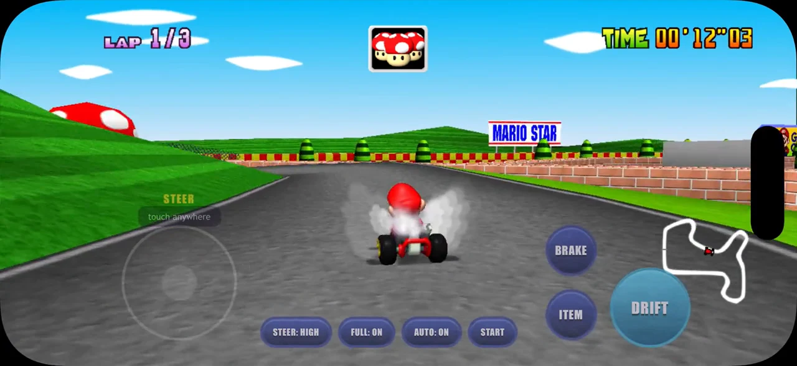
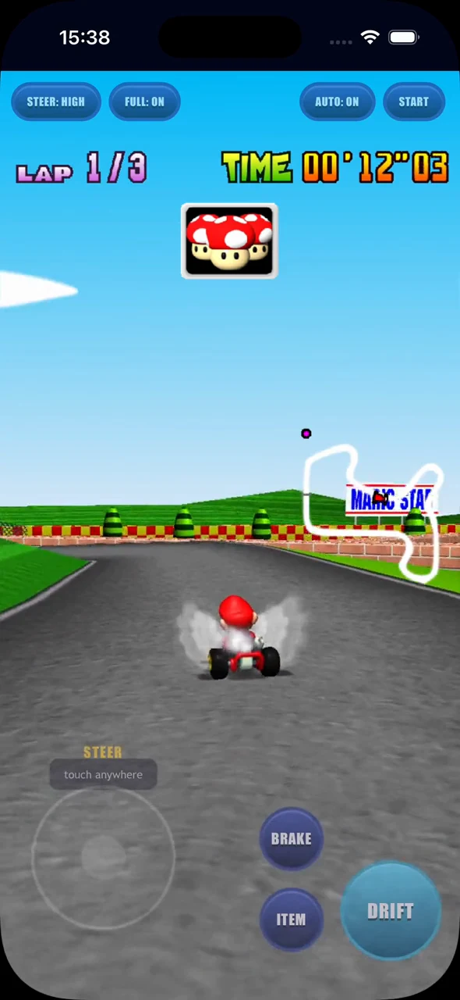
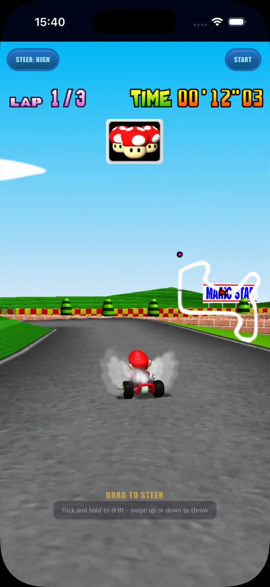

Mario Kart 64 was a big part of my childhood, and I've still got a soft spot for it.
When I spotted [SpaghettiKart](https://github.com/HarbourMasters/SpaghettiKart), it gave me a good excuse to revisit it.
The project unlocks replacement texture packs and custom tracks, with the game's source code available to work with.

Could I compile the source port to WebAssembly, wrap it in a PWA, and play it on mobile?

That became [Kart64](https://eddmann.com/kart64/).
It works on desktop too, with keyboard and gamepad controls, but the phone was the reason for the experiment.
There are conventional touch controls, full-screen racing in both orientations, and an optional portrait scheme inspired by [Mario Kart Tour](https://www.nintendo.com/en-gb/Games/Smart-device-games/Mario-Kart-Tour-1626402.html).



> Mario Raceway in landscape, using the smaller MK64 Reloaded phone karts128 pack.

## A source port gives me room to experiment

SpaghettiKart is a modern source port based on the Mario Kart 64 decompilation.
The game has been reconstructed as source code, with the port providing the platform support to run it on modern machines.
Kart64 compiles that code to WebAssembly with [Emscripten](https://emscripten.org/).
Having access to the rendering and input meant I could change how the game fits the screen and how the controls reach it, whilst keeping the original racing code underneath.

The build pulls a pinned SpaghettiKart revision and applies patches to it and libultraship, the library underneath the port.
Those patches adapt the platform pieces for Emscripten.
The browser page handles ROM intake, storage, the canvas and touch controls, with the game source staying in its upstream checkout.

Players supply their own supported US ROM, which Kart64 checks and extracts locally without uploading it.
The ROM is then removed from browser storage, leaving cached game data for later visits.
On iPhone, adding it to the Home Screen makes it easier to pick up and play, although the browser still manages the storage.
A service worker handles the cross-origin isolation needed by the threaded WebAssembly build on GitHub Pages, with a one-off reload on the first visit.

## The title screen was only the beginning

With the browser build running, I was keen to try [MK64 Reloaded](https://github.com/GhostlyDark/MK64-Reloaded), by GhostlyDark.
The replacement textures give the familiar tracks and characters a sharper finish, and I wanted to see that on the phone as well as desktop.

A pack could load and the title screen could look fine, but memory kept growing during a race.
With the larger assets, Safari could end up closing the tab.
I wanted to know whether a pack could survive a complete race, rather than just get through the loading screen.

The packed file size only tells part of that story.
The replacements arrive as compressed images, then the [PNG importer](https://github.com/HarbourMasters/SpaghettiKart/blob/aedcf9ada627f4f8e861f12d8b48f587de521e6b/src/port/resource/importers/BetterTextureFactory.cpp#L11) decodes them into four-channel pixel data.
For those pixels, the allocation is:

```text
width × height × 4 bytes
```

So a texture that compresses well can still need a substantial amount of memory once the game draws it.
And there are two caches to keep straight here.
The renderer has a bounded, 1,024-entry least-recently-used texture cache, which can evict textures.
Behind it, libultraship's [resource manager](https://github.com/Kenix3/libultraship/blob/f5c3843fe937320b64ff754fa6bf71b13ff5e7a1/src/ship/resource/ResourceManager.cpp#L100) retains the decoded resources used to create them.
Evicting a renderer texture doesn't also discard that decoded resource.

As the race encounters different kart angles, animation frames and wheel states, it brings more replacements into use.
The decoded pixels can stay cached after the particular frame has gone off screen.
The title screen has exercised very little of that path; a race keeps discovering more of the pack.

I had this checked against the implementation because my initial impression was simply that the assets stayed in memory once used.
There are explicit resource-unload paths, but ordinary rendering isn't routinely unloading those decoded resources after drawing them.
On the phone, reducing the size of each retained resource was something I could act on.

## Thousands of little Marios add up

The kart sprites stood out.
The game's logical sprite is 64 × 64, whilst that version of the Reloaded HD pack has 256 × 256 replacements across 9,513 kart frames.
Even a fraction of those coming into use can make a large difference.

For one RGBA frame, before other overhead:

| Sprite dimensions | Decoded pixel memory |
| --- | ---: |
| 256 × 256 | 256 KiB |
| 128 × 128 | 64 KiB |
| 96 × 96 | 36 KiB |
| 64 × 64 | 16 KiB |

Halving both dimensions quarters the pixel memory.
I could keep the replacements larger than the original sprites without paying the full 256 × 256 cost across all those frames.

I ended up with a small script for making lighter copies of a pack.
It reads the `.o2r` archive and writes a separate one, so I can scale the general textures, give the kart sprites their own scale, or drop the replacement karts and keep the game's original sprites.
Other folders can be excluded too, if they're particularly expensive.

For that Reloaded revision, one combination was halving the general texture dimensions and taking the kart frames from 256 × 256 to 96 × 96:

```sh
uv run --no-project --with pillow scripts/trim-pack.py \
  mk64-reloaded-v2026.04.03-sk-hd.o2r mk64-reloaded-phone.o2r \
  --scale 0.5 --kart-scale 0.375
```

The kart-specific scale overrides the general scale for those entries.
That lets me keep more detail in the course without using the same resolution for every kart animation frame.
At 96 × 96, the sprites are still one and a half times the game's original dimensions.

That cut brought the archive down to about 133 MB, or about 50 MB with the replacement kart sprites removed.
Those are compressed sizes, separate from the decoded footprint during a race.
The captures here use another cut with 128 × 128 kart sprites.
It's the same choice of where to spend the resolution budget, with another point between the original and full HD sprites.



I liked being able to keep more of the pack on desktop and choose a lighter version for the phone.
The script makes a personal-use copy; the original creator's terms still determine whether that copy can be shared.

## What happens when Mario Kart is portrait?

Full-screen landscape looks really clean on a phone.
Working with the source port let me go beyond the original 4:3 picture, with conventional touch pads providing a familiar way to play.
Portrait was the more interesting design question.
I wanted to see whether Mario Kart 64 could work upright, with the kind of one-thumb interaction Mario Kart Tour uses.

The conventional scheme has a steering pad and separate brake, item and drift buttons, with automatic acceleration.
That works in both orientations.
For portrait Tour mode, I wanted steering, drifting and items to come from the same gesture surface, leaving more of the display to the race.

 

> Approximately the same first-lap bend: conventional portrait controls on the left, Tour on the right.

Approaching a corner, I drag to steer, then flick and hold to start and maintain a drift.
Whilst I'm holding, the control layer supplies the steering wiggle that Mario Kart 64 expects to charge a mini-turbo.
Releasing the gesture fires the boost.
An upward or downward swipe sends an item forwards or behind.

I wanted to keep the mini-turbo mechanic, whilst making it manageable with one thumb.
The gesture layer supplies the controller inputs the game expects, so the original drift and boost behaviour stays underneath it.



> The portrait Tour view at recorded speed.
> CPU autopilot is driving in this clip; the gesture tests exercise the controls separately.

Tour is portrait-only.
Rotating to landscape brings back the conventional pads, and someone who prefers separate buttons can use them in portrait too.

Racing fills the screen and the HUD adapts to the wider or taller view, whilst the original menus, track introductions and results keep their 4:3 layout.
Phones default to full-screen driving; on desktop I can toggle it and use keyboard or gamepad input.
The race gets the extra space without needing every original menu redesigned.

## Giving the agent a game it could exercise

I've been [writing about getting agents to verify and demo their own work](/posts/weeknotes-agentic-loop-in-php-forge-git-review-and-demoing-agent-work/), and this project gave me a good reason to push on that.
A texture change needed time in a race.
A control change needed input that reached the game.
There was plenty to check after the code compiled.

I gave the coding agent browser access so it could run the build and see what it was doing.
I also gave it access to an iOS simulator and Safari, because the phone was the target.
Screenshots helped it tease apart visual problems, but I wanted it to exercise the game too.
So I had it build a small gameplay input harness.

Otherwise, I'd have to drive every lap and step through every menu before the agent could learn much about its change.
That would put me in the middle of a lot of repetitive work just to keep the conversation moving.
With a repeatable way to run the game, it could investigate more of those questions before coming back to me.

The committed harness uses Playwright with a mobile Chromium viewport, separate from the Safari simulator access I used during development.
It has two ways of exercising the game: complete races using the game's CPU driver, and direct input checks with that driving switched off.

### Let Mario Kart do the driving

For the race runs, the patch exposes an autopilot toggle that hands the player kart to Mario Kart's existing CPU driver.
The agent can get through a race, reach the results, continue and exercise another race without needing to invent a driver of its own.
The default harness runs two races, including the surrounding menus and transitions.

That keeps rendering and gameplay going well beyond the title screen, giving the game time to encounter more assets and carry them into the next race.
It also gives the agent a repeatable route through the UI, including the change from full-screen racing back to the original menus.



> CPU autopilot finishes Mario Raceway, then returns to the 4:3 results screen in the iOS Simulator.

### Turn autopilot off when testing the controls

Autopilot would hide the behaviour I wanted to check in the Tour scheme.
At the first bend, the harness explicitly disables it, performs a synthetic flick and hold on the pointer surface, then releases.
The assertion checks whether Mario Kart actually charged and released a mini-turbo, beyond the page accepting a drag.

An exported `Kart64_GetState` snapshot makes that observable.
It exposes the menu or race state, lap, time, rank, pause state, drift charge and boost.
The harness combines those values with canvas dimensions, HUD layout and the bounds of the controls.
The agent has both the screenshot and the state behind it to inspect.

The harness also pauses and resumes, switches control schemes, and rotates between portrait and landscape.
It checks that Tour gives way to conventional pads, the canvas and HUD resize, and the original 4:3 screens still have the right layout.
That lets the agent exercise the transitions as well as the individual screens.

### What the tests could tell me

For memory, the harness samples `HEAPU8.length`: the allocated capacity of the WebAssembly linear memory.
That doesn't report live allocations or the browser's total process and GPU memory.
The assertion allows up to 64 MiB of additional capacity across the tested races, so passing it doesn't mean absolutely no growth occurred.
Trying the chosen pack in Safari on the phone still matters, especially when changing the pack or the assets a race will encounter.

I still had to judge what the checks covered.
Two CPU-driven races and a gesture test tell me about those runs; they don't settle every question about the game on a particular phone.
But the agent could come back with something I'd actually be able to inspect: which inputs it tried, what state the game reached, and what the screen looked like.
That made the next conversation much more useful.

## Then I picked up the phone

Once the agent was confident in the build and its checks, I'd play it myself and give it critique.
That was especially important for the Tour-inspired controls.
The drift could charge, the boost could fire, and the buttons could fit within the viewport, whilst I still had an opinion about how steering, drifting and throwing an item felt together.
Those were things I wanted to judge with the phone in my hand.

Giving the agent a way to control and observe the game let it work through more of the implementation itself.
I could come back into the loop to play and critique the result.
I could spend more time deciding how I wanted Mario Kart to feel on the phone, and less time driving the same test laps.

You can [try Kart64 here](https://eddmann.com/kart64/), using your own ROM.
Add it to your iPhone's Home Screen, choose the controls that suit you, and see how an old favourite feels upright.
